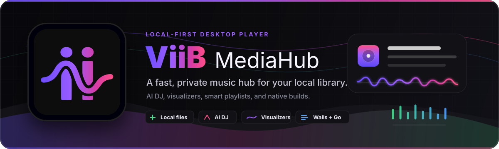
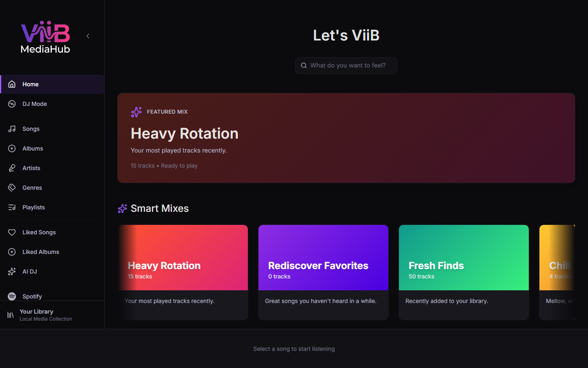

<p align="center">
  
</p>

<p align="center">
  <strong>A modern, local-first media player — React 19 frontend · Go backend · Native desktop via Wails</strong>
</p>

<p align="center">
  <a href="#quick-start">Quick Start</a> ·
  <a href="#features">Features</a> ·
  <a href="#build-targets">Build Targets</a> ·
  <a href="docs/index.md">Documentation</a> ·
  <a href="#api-reference">API Reference</a> ·
  <a href="#technology-stack">Tech Stack</a>
</p>

<p align="center">
  
</p>
---

## Overview

ViiB MediaHub is a self-hosted, offline-first music player that scans your local library and serves a rich web UI. It ships in two flavors:

| Mode | Description | Output |
|------|-------------|--------|
| **Wails (native)** | Native desktop window via WebView — no browser needed | `.app`, `.exe`, binary |
| **Web browser** | Local HTTP server; opens in your default browser | Single executable |

Both modes share the same Go backend (SQLite library, scan engine, Spotify integration) and React frontend.

---

## Platforms

| Platform | Architecture | Wails (native) | Web browser |
|----------|-------------|:--------------:|:-----------:|
| Windows | x86-64 (amd64) | ✅ | ✅ |
| Windows | ARM64 | ✅ | ✅ |
| macOS | Apple Silicon (arm64) | ✅ | ✅ |
| macOS | Intel (amd64) | ✅ | ✅ |
| macOS | Universal (fat binary) | ✅ | — |
| Linux | x86-64 (amd64) | ✅ | ✅ |
| Linux | ARM64 | ✅ | ✅ |

## Features

### 🎵 Audio Playback
- **Multi-format support** — MP3, FLAC, M4A, AAC, OGG, OPUS, WAV, WMA
- **Gapless playback** — seamless transitions between tracks
- **Crossfade** — configurable fade duration
- **Queue management** — add, reorder, and drag-and-drop queue items
- **Play Next / Add to Queue** — right-click any song, album, or playlist to insert after the current track or append to the end

### 🎚️ Audio Enhancement
- **10-band equalizer** — parametric EQ from 32 Hz to 16 kHz
- **22 built-in EQ presets** — Rock, Jazz, Classical, Electronic, Vocal Boost, and more
- **Auto-EQ** — automatic preset selection based on genre tags
- **21 real-time visualizers** — 60 FPS audio-reactive animations:
  - *Classic (6):* Waveform, Spectrum, Circular Spectrum, Glow Wave, Aurora, Spectrum Bars
  - *Next-Gen (15):* Flame Spectrum, Stardust Halo, Aurora Ribbon, Electric Arc, Grass Oscilloscope, Crystal Shards, Watercolor Bloom, Ice Fracture, Firefly Field, Vinyl Spin, Beat Orbs, Tunnel Waveform, Glass Shards, Wind Field, Milkdrop
  - Cycle modes with a keyboard shortcut or click the visualizer in the Now Playing view

### 🤖 AI DJ & Smart Playlists
- **Natural-language playlist generation** — describe what you want:
  - *"Upbeat jazz from the 90s"*, *"Chill instrumental for studying"*, *"More like Radiohead"*
- **Multi-provider LLM support:**

  | Provider | Local | API Key |
  |----------|:-----:|:-------:|
  | Ollama | ✅ | — |
  | Google Gemini | — | ✅ |
  | OpenAI (GPT-4o) | — | ✅ |
  | Anthropic (Claude) | — | ✅ |
  | X.AI (Grok) | — | ✅ |

- **Four-tier matching** — artist lookup → local genre → mood keywords (85+ terms) → AI fallback
- **Metadata enrichment** — AI-powered genre, mood, energy, tempo, BPM, and original year detection

### 🎛️ DJ Mode
- **Two-deck mixing** — dual waveform display with pitch/tempo control
- **BPM detection** — automatic beat-per-minute analysis
- **Key detection** — harmonic key analysis for mixing compatibility
- **Sampler** — trigger short audio samples during a mix
- **MIDI controller support** — map hardware controllers via Web MIDI API
- **Cue points** — set and jump to cue markers in tracks

### 📚 Library Management
- **Multi-folder scanning** — add unlimited music folders
- **Ultra-fast incremental scan** — sub-second updates using filesystem journals:
  - Windows: USN (Update Sequence Number) journal
  - macOS: FSEvents
  - Linux: mtime + ctime with directory signatures
- **Automatic deletion detection** — removed files cleaned from the library automatically
- **Revisioned synchronization** — cursor-based snapshots and replayable deltas avoid repeated full-library refreshes
- **Indexed local search** — server-side prefix search across tracks, albums, artists, genres, paths, and playlists
- **Library Operations** — diagnostics, safe repair, validated backup, staged offline restore, and continuous monitoring
- **Smart Mixes** — auto-generated playlists: Heavy Rotation, Rediscover Favorites, Fresh Finds, genre mixes
- **Custom playlists** — create, rename, reorder, and manage playlists
- **Background enrichment** — automatic Spotify metadata fetching for albums and artists

### 🎧 Spotify Integration
- **OAuth authentication** — connect your Spotify Premium account
- **Browse** — view saved albums, playlists, and recently played
- **Direct streaming** — stream tracks at configurable quality (High / Medium / Low) with HTTP range support for seeking
- **Downloads** — save tracks/albums/playlists as OGG Vorbis with full metadata
  - Organized as `{Artist}/{Album}/{TrackNum}-{Artist}-{Title}.ogg`
  - Configurable concurrency (1–10 workers)
  - Real-time progress via Server-Sent Events
  - Auto-rescan after download completes

### 📊 Stats & History
- **Listening stats dashboard** — total time, total plays, top artists/albums/genres
- **Recently played** — last 10 tracks with relative timestamps on the Home page
- **Play history** — every play recorded to SQLite for analytics

### ❤️ Liked Songs & Albums
- Like individual songs or full albums via the heart icon
- Dedicated "Liked Songs" and "Liked Albums" pages in the sidebar
- Sortable by recently liked, name, or artist

### ⏱️ Sleep Timer
- Stop playback after a preset or custom time (15–120 min), after N songs, or at end of the current track
- Optional volume fade over the last 30 seconds

### 🎨 User Experience
- **Keyboard shortcuts** — full keyboard control (see [Keyboard Shortcuts](#keyboard-shortcuts))
- **System tray** — minimize to tray; keep running in the background
- **Toast notifications** — non-intrusive feedback for actions and errors
- **Loading skeletons** — shimmer animations during content loads
- **Virtual scrolling** — smooth performance with 100,000+ song libraries
- **Responsive layout** — collapsible sidebar, adaptive player controls
- **Dark theme** — purpose-built dark UI with the brand color palette

---

## Quick Start

### Prerequisites

| Requirement | Minimum | Notes |
|-------------|---------|-------|
| Node.js | 20 LTS | |
| Go | 1.25.12+ | Security-patched baseline |
| GCC / Clang | — | Required for CGO (SQLite) |
| Wails CLI | v2 latest | Wails builds only |

**Install GCC:**
- **Windows (amd64):** [MSYS2](https://www.msys2.org/) → `pacman -S mingw-w64-x86_64-gcc`
- **Windows (arm64):** [llvm-mingw](https://github.com/mstorsjo/llvm-mingw/releases) or MSYS2 clangarm64
- **macOS:** `xcode-select --install`
- **Linux:** `sudo apt install gcc libgtk-3-dev libwebkit2gtk-4.0-dev`

**Install Wails:**
```bash
go install github.com/wailsapp/wails/v2/cmd/wails@latest
```

### Development Mode

```powershell
# Windows — Wails (recommended, hot reload)
.\scripts\dev-wails.ps1

# Windows — Browser mode
.\scripts\dev.ps1
```

```bash
# macOS / Linux — manual
# Terminal 1:
cd backend && go run ./cmd/viib -port 8080 -no-browser
# Terminal 2:
npm run dev
```

---

## Build Targets

### Wails (native desktop)

| Target | Script |
|--------|--------|
| Windows x86-64 | `.\scripts\build-wails.ps1` |
| Windows ARM64 | `.\scripts\build-wails-windows-arm64.ps1` |
| macOS (arm64 / amd64 / universal) | `./scripts/build-wails-macos.sh [--arch arm64\|amd64\|universal]` |
| Linux (amd64 / arm64) | `./scripts/build-wails-linux.sh [--arch amd64\|arm64]` |

**Common flags:**
```
-Debug / --debug              Enable dev tools and verbose logging
-Clean / --clean              Remove previous build artifacts first
-SkipFrontend / --skip-frontend   Skip npm build (reuse existing dist/)
```

**Examples:**
```powershell
# Windows x86-64 release
.\scripts\build-wails.ps1

# macOS Apple Silicon
./scripts/build-wails-macos.sh --arch arm64

# macOS Universal fat binary
./scripts/build-wails-macos.sh --arch universal

# Linux arm64 (cross-compile from x86-64 host)
./scripts/build-wails-linux.sh --arch arm64
```

### Web browser build

| Target | Script |
|--------|--------|
| Windows x86-64 | `.\scripts\build.ps1` |
| Windows ARM64 | `.\scripts\build-web-windows-arm64.ps1` |
| macOS (arm64 / amd64) | `./scripts/build-web-macos.sh [--arch arm64\|amd64]` |
| Linux (amd64 / arm64) | `./scripts/build-web-linux.sh [--arch amd64\|arm64]` |

Output is a single self-contained binary. On launch it starts a local HTTP server and opens your default browser.

### Run the executable

```powershell
# Windows
.\build\ViiB-MediaHub.exe

# macOS / Linux
./build/ViiB-MediaHub
```

**Command-line flags:**
```
-port <n>        Port to run on (0 = auto-select)
-no-browser      Don't open browser automatically
-no-tray         Disable system tray icon
-data <path>     Custom data directory
-debug           Enable verbose debug logging
```

---

## Architecture

```
ViiB-MediaHub/
├── docs/
│   ├── index.md                      # User documentation index
│   ├── library-operations.md         # Diagnostics, backup, restore, monitoring
│   └── openapi-v2.yaml               # Versioned local API contract
├── scripts/
│   ├── build.ps1                      # Web build — Windows amd64
│   ├── build-wails.ps1                # Wails — Windows amd64
│   ├── build-wails-windows-arm64.ps1  # Wails — Windows arm64
│   ├── build-wails-macos.sh           # Wails — macOS (amd64/arm64/universal)
│   ├── build-wails-linux.sh           # Wails — Linux (amd64/arm64)
│   ├── build-web-macos.sh             # Web — macOS
│   ├── build-web-linux.sh             # Web — Linux
│   ├── build-web-windows-arm64.ps1    # Web — Windows arm64
│   ├── dev.ps1                        # Browser dev mode (Windows)
│   └── dev-wails.ps1                  # Wails dev mode (Windows)
├── components/          # React UI components
│   ├── context-menus/   # Right-click menus
│   ├── dj/              # DJ mode components
│   ├── now-playing/     # Full-screen player
│   ├── Skeleton.tsx     # Loading skeletons
│   ├── Toast.tsx        # Toast notifications
│   └── EmptyState.tsx   # Empty state displays
├── pages/               # Route pages
├── services/            # API client, backend service, Spotify service
├── slices/              # Zustand state (player, library, spotify, ui, dj)
├── hooks/               # Custom React hooks
├── lib/                 # Audio engine, smart mix, BPM/key detection
├── workers/             # Web workers for background processing
└── backend/
    ├── cmd/
    │   ├── viib/         # Web browser build entry point
    │   └── wails/        # Native desktop entry point
    │       ├── icons_windows.go   # Windows ICO embed (build tag)
    │       ├── icons_darwin.go    # macOS PNG embed (build tag)
    │       ├── icons_linux.go     # Linux PNG embed (build tag)
    │       └── build/
    │           ├── appicon.png
    │           ├── windows/icon.ico
    │           ├── darwin/Info.plist
    │           └── linux/ViiB-MediaHub.desktop
    └── internal/
        ├── api/          # REST API + SSE handlers
        ├── audio/        # Metadata extraction
        ├── crypto/       # AES-256-GCM encryption for settings
        ├── db/           # SQLite schema, queries, WAL mode
        ├── llm/          # Unified multi-provider AI client
        ├── logger/       # Shared file-based logging
        ├── scanner/      # Library scanning + fast startup
        │   ├── journal_platform_windows.go  # USN journal
        │   ├── journal_platform_darwin.go   # FSEvents
        │   └── journal_platform_linux.go    # mtime + ctime
        ├── server/       # Chi router + middleware
        ├── spotify/      # librespot session + downloader
        └── validation/   # Input validation
```

---

## Keyboard Shortcuts

| Key | Action |
|-----|--------|
| `Space` | Play / Pause |
| `↑` / `↓` | Volume +5% / −5% |
| `Shift + ←` | Previous track |
| `Shift + →` | Next track |
| `M` | Toggle mute |
| `Q` | Toggle queue panel |
| `E` | Toggle equalizer |
| `N` | Toggle Now Playing view |
| `Escape` | Close active panel or dialog |

---

## API Reference

### Library

| Method | Endpoint | Description |
|--------|----------|-------------|
| `GET` | `/api/songs` | List all songs |
| `DELETE` | `/api/songs` | Clear library |
| `POST` | `/api/songs/{id}/play` | Record play |
| `POST` | `/api/songs/{id}/like` | Toggle like |
| `GET` | `/api/songs/liked` | Liked song IDs |
| `GET` | `/api/playlists` | List playlists |
| `POST` | `/api/playlists` | Create playlist |
| `PUT` | `/api/playlists/{id}` | Update playlist |
| `DELETE` | `/api/playlists/{id}` | Delete playlist |
| `GET` | `/api/folders` | List scan folders |
| `POST` | `/api/folders` | Add scan folder |
| `DELETE` | `/api/folders/{id}` | Remove folder |
| `POST` | `/api/scan` | Start library scan |
| `GET` | `/api/scan/status` | Scan status |
| `GET` | `/api/library/events` | SSE stream (scan progress, library updates) |

### Scalable local API (`/api/v2`)

The additive v2 surface provides revisioned synchronization, indexed search, local diagnostics, durable jobs, and recovery operations. Responses include `X-Request-ID`; jobs and Library Operations use structured error envelopes. The complete machine-readable contract is [docs/openapi-v2.yaml](docs/openapi-v2.yaml).

| Area | Endpoints | Description |
|------|-----------|-------------|
| Library sync | `/library/snapshot`, `/library/changes`, `/library/revision`, `/library/events`, `/library/stats` | Cursor pages, replayable revisions, and SSE revision notifications |
| Search | `/search` | Indexed prefix search of the local library |
| Performance | `/performance/`, `/performance/scanner-failures` | Local SQLite/scanner diagnostics and quarantine visibility |
| Jobs | `/jobs/`, `/jobs/events`, `/jobs/{id}`, `/jobs/{id}/cancel`, `/jobs/{id}/retry` | Persistent scan and aggregate-refresh jobs with progress and cancellation |
| Operations | `/operations/diagnostics`, `/operations/repair`, `/operations/backups`, `/operations/restore/*`, `/operations/watcher*` | Diagnostics, safe database repair, validated backups, staged offline restore, and continuous monitoring |

Source-file tag write-back is intentionally unavailable. Metadata editing changes the ViiB database only; restore activation is performed offline with `viib-restore` after the application exits.

### Media

| Method | Endpoint | Description |
|--------|----------|-------------|
| `GET` | `/api/audio/{id}` | Stream audio (supports HTTP Range) |
| `GET` | `/api/cover/{id}` | Album cover image |
| `POST` | `/api/browse` | Browse filesystem folders |

### Albums & Artists

| Method | Endpoint | Description |
|--------|----------|-------------|
| `POST` | `/api/albums/{key}/like` | Toggle album like |
| `GET` | `/api/albums/liked` | Liked album keys |
| `GET` | `/api/albums/metadata` | All cached album metadata |
| `GET` | `/api/albums/metadata/unchecked` | Albums not yet enriched |
| `POST` | `/api/albums/metadata` | Save album metadata |
| `GET` | `/api/artists/metadata` | All cached artist metadata |
| `POST` | `/api/artists/metadata` | Save artist metadata |

### Spotify

| Method | Endpoint | Description |
|--------|----------|-------------|
| `GET/POST` | `/api/spotify/credentials` | OAuth credentials |
| `GET` | `/api/spotify/me` | User profile |
| `GET` | `/api/spotify/search` | Spotify search proxy |
| `GET/POST` | `/api/spotify/proxy` | Generic Spotify API proxy |
| `POST` | `/api/spotify/download/track` | Queue track download |
| `POST` | `/api/spotify/download/album` | Queue album download |
| `POST` | `/api/spotify/download/playlist` | Queue playlist download |
| `POST` | `/api/spotify/download/url` | Download from Spotify URL |
| `GET` | `/api/spotify/downloads` | List downloads |
| `GET` | `/api/spotify/downloads/{id}` | Download status |
| `DELETE` | `/api/spotify/downloads/{id}` | Delete download |
| `POST` | `/api/spotify/downloads/{id}/retry` | Retry failed download |
| `DELETE` | `/api/spotify/downloads/completed` | Clear completed |
| `GET` | `/api/spotify/stream/{id}` | Stream Spotify track (`?quality=high\|medium\|low`) |
| `GET` | `/api/spotify/downloads/events` | SSE download progress |

### AI DJ & Enrichment

| Method | Endpoint | Description |
|--------|----------|-------------|
| `POST` | `/api/smart-playlist` | Generate playlist from natural language |
| `POST` | `/api/enrich/genres` | Batch genre enrichment |
| `GET` | `/api/enrich/genres/stream` | SSE genre enrichment progress |
| `GET` | `/api/enrich/all/stream` | SSE full metadata enrichment |
| `GET` | `/api/enrich/mood/stream` | SSE mood / energy / tempo enrichment |
| `GET` | `/api/enrich/original-years/stream` | SSE original year detection |

### Settings

| Method | Endpoint | Description |
|--------|----------|-------------|
| `GET` | `/api/settings/{key}` | Get setting |
| `POST` | `/api/settings/{key}` | Set setting |

---

## AI DJ Configuration

### LLM Settings Keys

| Key | Description | Example |
|-----|-------------|---------|
| `llm_provider` | Provider name | `gemini`, `openai`, `anthropic`, `ollama`, `xai` |
| `llm_model` | Model name | `gemini-2.0-flash`, `gpt-4o-mini`, `llama3.2:8b` |
| `llm_api_key` | API key (AES-256-GCM encrypted at rest) | — |
| `llm_base_url` | Custom endpoint | `http://localhost:11434` |

### Ollama (local, no API key)
```bash
ollama pull llama3.2:8b
# In Settings: Provider = Ollama, Base URL = http://localhost:11434
```

---

## Technology Stack

### Frontend
- **React 19** + **TypeScript** + **Vite 6**
- **Zustand** — state management with persistent slices
- **Tailwind CSS** — utility-first dark theme
- **react-router-dom v7** — client-side routing
- **react-virtuoso** — virtualized lists for large libraries
- **Web Audio API** — EQ, visualizer, crossfade, BPM detection
- **Web MIDI API** — DJ controller support
- **IndexedDB** (via `idb`) — browser-mode fallback storage

### Backend
- **Go 1.25.12+** — compiled, efficient backend
- **Wails v2** — native WebView window (Windows WebView2 · macOS WebKit · Linux WebKitGTK)
- **Chi v5** — lightweight HTTP router
- **SQLite** (via `go-sqlite3`) — embedded database, WAL mode
- **go.senan.xyz/taglib** — primary audio metadata extraction
- **dhowden/tag** — fallback metadata extraction
- **librespot-go** — Spotify streaming client
- **getlantern/systray** — cross-platform system tray (Windows, macOS, Linux)

---

## Data Storage

Default location: `{OS user config dir}/ViiB-MediaHub/`
- **Windows:** `%APPDATA%\ViiB-MediaHub\`
- **macOS:** `~/Library/Application Support/ViiB-MediaHub/`
- **Linux:** `~/.config/ViiB-MediaHub/`

```
ViiB-MediaHub/
├── library.db           # SQLite — songs, playlists, settings
├── covers/              # Cached album artwork
├── spotify_downloads/   # Downloaded Spotify tracks
├── viib.log             # Application log
└── crash.log            # Crash recovery log
```

Sensitive settings (API keys, Spotify tokens) are AES-256-GCM encrypted using a machine-derived key before being written to SQLite.

---

## Browser Support

Best in Chromium-based browsers (Chrome, Edge, Brave) for full Web Audio API support. Firefox and Safari have limited visualizer and EQ functionality in browser mode; Wails builds use the OS-native WebView and are unaffected.

---

## License

MIT

## Contributing

Contributions are welcome. Please open an issue or pull request.

---

<p align="center">Built with ❤️ for music lovers who want full control over their library.</p>
