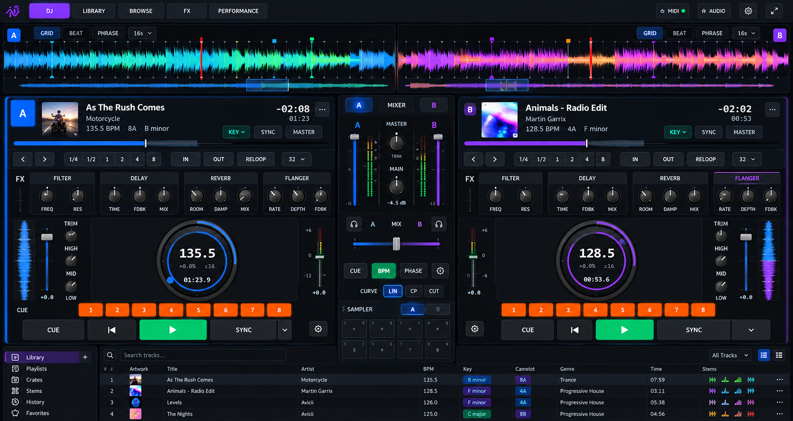

# DJv2 UI Refactor Engineering Plan

**Repository:** `ajbergh/ViiB-MediaHub`  
**Target:** `main` branch DJv2 UI  
**Primary entry point:** `pages/DJModeV2.tsx`  
**Status:** In progress on branch `refactor/djv2-ui-workstation`. See [Implementation status](#implementation-status).  
**Last reviewed:** 2026-09-25 against `main` @ `92d08ce` and the live UI at `http://localhost:3000/dj` (1920×1080, Playwright)  
**Scope:** UI composition, layout, responsive behavior, visual hierarchy, waveform presentation, and regression coverage. Audio-engine behavior should remain functionally unchanged unless explicitly called out.

## Design reference

The implementation target for this refactor is the approved DJv2 UI mock-up. Two copies are committed:

| File | Size | Use |
|---|---|---|
| `assets/djv2-ui-target.png` | 1720×914, full resolution | **Canonical reference.** Use for measurement, color sampling, and visual-regression comparison. |
| `docs/assets/djv2-ui-target.jpg` | 400×213 preview | Inline preview for this document only. Too small for measurement or screenshot comparison. |



Use the mock-up as the visual target for hierarchy, density, palette, component styling, and deck/mixer balance. It is not a literal pixel-coordinate specification. Structural acceptance criteria in this document take precedence when adapting the design to supported resolutions.

**Adapting the mock-up to the authored canvas:**

- The mock-up's aspect ratio is ~1.88:1. The authored canvas is 1856×1090 (~1.70:1). Scaled to the 1856px canvas width (×1.079), the mock-up is only ~986px tall, leaving ~104px of vertical space the mock-up doesn't allocate (see Section 3B).
- The mock-up has no application sidebar. The authored canvas already assumes the collapsed app sidebar (1920 − 64 = 1856px), so no geometry change is needed for it.
- The mock-up contains several controls that have no current implementation (for example GRID/BEAT/PHRASE, sync MASTER, sampler banks, and the Crates/History/Favorites library sections). Section 3A lists each one and whether it maps to an existing component, needs a product decision, or is out of scope.

---

## Implementation status

All refactor work lands on the single branch `refactor/djv2-ui-workstation`. This section is updated with each commit.

| Phase | Status | Notes |
|---|---|---|
| 0 — Decisions | ✅ Done | Recorded below. |
| 1 — Layout foundation | ✅ Done | `DJPerformanceWorkspace`, `DJDeckPanel` (one component for A/B), `DJMixerPanel`; 3-column grid; mixer 340px; `DJModeV2.tsx` is orchestration only (1026 → ~430 lines). |
| 2 — Split waveforms | ✅ Done | `DJSplitWaveform` with per-deck lanes (Canvas `DJCanvasWaveformDeck`, WebGL `DJWebGLWaveformDeck`), per-lane toolbar and zoom, Canvas 2D overviews below the main lane. WebGL contexts: 3 → 2. Old stacked `DJDualWaveform` / `DJWebGLWaveform` removed. |
| 3 — Header density | ✅ Done | Fixed-height header; one-row toolbar (beat jump, loops + IN/OUT/RELOOP, compact stems); `DJDeckInspector` holds energy, key, BPM, cue and grid tools. |
| 4 — FX integration | ✅ Done | `DJDeckFXRack` per deck; X-Y pad and Beat FX are mixer tabs; FX mode never hides the waveform. |
| 5 — Visual polish | ✅ Done | Tokens retuned to §10A.2; one palette module feeds Canvas and WebGL. Jog wheel and tempo fader restyled to §10A.10–11. All rendered leaf components use DJ tokens, and the global legacy typography floor is removed. Remaining literals are deliberate (see the 2026-09-25 log entry). |
| 6 — Regression hardening | ✅ Done | `dj-overlay-audit.mjs` (geometry, overlap, containment, renderer) and a rewritten `djv2-audit.mjs` (accessibility + visual baselines) both pass. |

### Phase 0 decisions (2026-09-25)

These resolve the **Decision** rows in Section 3A. They were made during implementation and are open to review.

| Topic | Decision | Reason |
|---|---|---|
| Top-bar modes | **DJ · LIBRARY · BROWSE · FX · SCOPE.** DJ = `perf`; LIBRARY toggles the drawer; BROWSE = `browse` (drawer open, and closing it returns to DJ); FX = `fx` (brings the mixer's FX Pad tab forward); SCOPE swaps the waveform band for the scope. PERFORMANCE is dropped. | The mock-up's DJ and PERFORMANCE are indistinguishable. SCOPE keeps the existing diagnostic view reachable. |
| Library | **Option (b):** 44px affordance plus overlay drawer. | Preserves lazy mounting, the existing focus/Escape behavior, and the audited no-displacement guarantee. A docked peek (option a) remains a follow-up. |
| Canvas budget | 48 top bar / 172 waveform / 826 deck grid / 44 library. | Section 3B with option (b). |
| Deck-body extra columns | Mini-waveform strip and inner level meter **omitted**. | Channel meters already live in the mixer; the jog uses the space. |
| Waveform zoom | **Per deck.** Ctrl+wheel zooms the lane under the pointer. | Matches the mock-up. |
| GRID / BEAT / PHRASE | **Deferred.** Lane toolbar shows GRAD / LEVEL / SOLID and zoom. | No existing behavior to map to. |
| Header actions | KEY / SLIP / AG (existing `DJDeckStatusBar`) plus an inspector button. SYNC stays in the transport only; MASTER omitted. | No sync-leader concept exists (Section 17). |
| Position bar | Added (`DeckProgress`); the header's horizontal VU is removed. | Mock-up parity; meters remain in the mixer. |
| Transport | CUE / PLAY / SYNC. The mock-up's `\|◀`, `▾` and ⚙ are omitted. | The current Cue button already returns to the cue point. |
| Mixer header | `A · MIXER · B` selects the active deck (keyboard shortcut target). | Gives the tabs a real function. |
| Mixer bottom | Tabs: Sampler · FX Pad · Beat FX. | The X-Y pad and Beat FX do not fit together in 340px. |
| EQ strip FILT | **Kept.** | Existing performance control; removing it is a behavior change. |
| Master TRIM, sampler banks, Crates/History/Favorites | Not built. | Out of scope (Section 17). |
| Default layout | `perf`. Persisted `fx` is migrated once (store version 3). | Waveform visible on first load. |

### Progress log

- **2026-09-25 — Stem audio performance pass (uncommitted, awaiting review).** Times are per 128-frame render quantum (2.9 ms budget at 44.1 kHz), measured in the main realm with the real WASM core. `vm` contexts inflate code that calls `Math` heavily, because every global lookup goes through interceptors.

  | Path | Before | After |
  |---|---|---|
  | Dry playback | 0.028 ms | 0.009 ms |
  | Key lock | 0.35 ms avg, p99 ~0.75 ms | 0.20 ms avg, p99 ~0.5 ms |
  | Scratch | 0.025 ms | 0.010 ms |

  - **Streaming key lock.** One priming seek, then only the frames each quantum consumes. Before, every quantum re-read and re-analysed a 5,292-frame × 8-channel window. Loop wraps are fed as an unwrapped stream, so they no longer re-prime.
  - **Alignment.** Transients now land within 1 sample of the dry clock near unity tempo, and within about 0.5 ms at 0.92× and 1.06×. Before, they were 0.1–2.2 ms late with jitter. Regression tests cover this; mutation-checked, they fail with a one-quantum lag.
  - **Hot-path cleanup in the worklet.**
    - A block-lookup cache replaces the per-sample scan over up to about 20 retained blocks.
    - Dry and scratch reads are inlined.
    - WASM memory views are cached, and wet output is read in place.
    - No per-quantum allocations remain.
    - Decayed scratch gain and speed are snapped to zero to avoid denormals.
  - **Main thread.**
    - Prefetch returns early when the read-ahead is already full, instead of starting an async loop about 10 times a second.
    - `DJStemControls` keeps its state objects while nothing shown has changed, so 500 ms polling no longer re-renders.
    - `DJDeckOverview` skips its 80 ms redraw when nothing visible has moved, so a paused deck costs nothing.

- **2026-09-25 — Key lock and scratch in stem mode; stem library status (uncommitted, awaiting review).** This entry changes audio-engine behaviour, as the Scope line allows when called out.
  - **Stem status in the library.** `/api/songs` now includes `stemStatus`, as the v2 snapshot already did. Stem registry changes now advance the library revision, so open sessions update without a reload. Previously every track showed no stems after a rescan.
  - **"Illegal invocation" on stem load.** `StemDeckSource` called the global `fetch` detached from `window`. Fixed with a regression test.
  - **Key lock in stem mode.** Uses `signalsmith-stretch` 1.3.2 (MIT, WASM), pinned exactly.
    - One 8-channel instance runs inside `stemTransport.worklet.js`, so the four buses stay phase-coherent.
    - It re-reads the transport's buffered frames ahead of the playhead each render quantum, so steady playback has no added latency.
    - After a seek, cue or play it runs dry for about 60 ms, then crossfades back in. It is bypassed at 0% tempo.
    - `lib/stemStretchModule.ts` captures the package's processor class in the worklet scope. It is a separate, lazily loaded 114 kB chunk.
    - Cost: p99 0.7 ms per 128-frame quantum with `splitComputation`. Without it, the p99 was 3.3 ms, over the 2.9 ms budget.
  - **Scratch in stem mode.** Uses the vinyl-scratch protocol (grab, move, hold, coast, release) inside the stem worklet, so stem mutes still apply while scratching.
    - The worklet keeps 10 s of history behind the playhead.
    - A seek inside frames the worklet still holds no longer flushes and refetches, so releasing the jog resumes immediately.
    - `DJAudioEngine` routes scratch by mode. Switching back to full mode now reloads the decoded full-track scratch audio; previously it was lost until the track was reloaded.
  - **Existing stem playback bugs fixed on the way.**
    - Prefetch stopped once the buffer was full and resumed only after an underrun, giving a dropout every few seconds. It now tops up from the position reports.
    - `isLoaded()` followed the silent fallback `<audio>` element, so a play right after a seek could be ignored.
    - `setKeyLock` never reached the full-track `<audio>` element, so full mode always preserved pitch whatever the toggle said.
  - **Verified live (Playwright, real stem package).**
    - At +8% tempo, the pitch ratio is 1.000 with key lock on and 1.080 with it off.
    - 0 underruns over 11 s of key-locked playback.
    - A backward scratch is audible, and release resumes without a refetch.
  - **Tests.**
    - The worklet tests run the real WASM core: pitch held at +12% tempo, bus phase coherence, dry-after-seek, scratch in both directions, coast settle, and history eviction.
    - Mutation-checked: disabling the wet mix fails the key-lock tests.
    - Engine routing tests added. 233 frontend tests pass, plus the Go API, db and stems suites.

- **2026-09-25 — Sampler fit in all layouts; smaller jog, larger performance controls (uncommitted, awaiting review).**
  - **Sampler clipping (reported in review).** `DJSamplerPads` still chose its pad size from the layout mode: compact 48px pads in `perf`, tall 80px pads plus a mode/volume row in `browse`/`fx`. With samples assigned in FX or BROWSE, the second pad row was cut off by 42px.
  - **Sampler fix.** The mixer now renders `<DJSamplerPads fill />`: two equal rows that fill the tools panel, with each pad's controls overlaid on the pad. Verified with six assigned pads in DJ and FX layouts: no overflow.
  - **Decision: jog cap 400 → 300px (−25%, `--dj-jog-max`).** At 400px the jog dominated the deck more than in the mock-up, while primary performance controls were below the §12 44px target. The freed height is reinvested:

    | Control | Before | After |
    |---|---|---|
    | Hot cues | 40px | 48px |
    | Transport | 46px | 52px |
    | FX knobs | 36px | 44px (rack 104 → 120px) |
    | EQ knobs | 40px | 48px (EQ column 72 → 84px) |

    The deck toolbar is unchanged because it has no spare width. Deck vertical budget: header 116, toolbar 44, FX 120, footer 140, body ~394 with a 300px jog.
  - **Follow-up (review: "lots of empty space around the jog").**
    - **Measured:** the jog column is 558×384px. The jog is height-bound (≈370px max), so growing it cannot fill the ~110px side flanks; the mock-up has the same empty flanks.
    - **Jog cap 300 → 340px** (renders 320px).
    - **Toolbar row 44 → 52px:** all toolbar controls (beat jump, loop sizes, IN/OUT/RELOOP, stems) are now 40px tall, and loop-size buttons have a 32px minimum width. The toolbar uses 716 of 744px.
    - **Not done:** wider loop buttons (36px) would need ~780px.
    - **Final deck budget:** header 116, toolbar 52, FX 120, footer 140, body ~378.

- **2026-09-25 — Mixer tools panel fit (uncommitted, awaiting review).**
  - **Problem (reported in review).** The Sampler / FX Pad / Beat FX panel was only 179px tall after the channel faders were lengthened, so the FX Pad (needs ~200px) and Beat FX (~184px) were clipped.
  - **Rebalanced mixer budget** (authored px, 814 total):

    | Section | Before | After |
    |---|---|---|
    | Header | 44 | 44 |
    | Channels | 266 | 246 |
    | Headphone cue mix | 139 | 113 |
    | Crossfader | 96 | 84 |
    | Sync + curve | 87 | 81 |
    | Tools panel | 179 | 244 (196 body) |

  - **How:**
    - removed the redundant "Cue Mix" label (the control already reads HEADPHONES);
    - tightened mixer section padding;
    - crossfader hit area 48 → 40px;
    - channel fader/meter 200/150 → 180/135px;
    - X-Y pad 140 → 130px;
    - Beat FX centred.
  - **Measured fit.** At 1920×1080 and 1470×825, all three tools fit with no clipping: Sampler 74px spare, FX Pad 6px, Beat FX 12px.
  - `dj-overlay-audit.mjs` now cycles all three mixer tools at every geometry and fails if any tool's content leaves its panel.

- **2026-09-25 — Parity pass verified (uncommitted, awaiting review).**
  - With the servers back, the mixer's longer faders were checked visually; they fit.
  - A fresh overflow check found the deck header's info row 5px taller than its fixed box: 87 vs 82px, from the time/elapsed/KEY-SLIP-AG column. The column's gaps were tightened.
  - `dj-overlay-audit.mjs` now also fails on **vertical** overflow of fixed-height rows. Previously it checked only horizontal overflow, which is why this slipped through. The check covers header info, toolbar, FX rack, footer, tempo column, and the mixer head/channels/sections.
  - Results: `dj-overlay-audit.mjs` passes on WebGL and Canvas; `djv2-audit.mjs` passes at all four geometries. This closes the verification gap noted in the previous entry, which landed as `266b3c8`.

- **2026-09-25 — Alignment review and mock-up parity pass (uncommitted, awaiting review).**
  - **Alignment (Playwright, authored px).**
    - Deck sections now share one 12px content inset (`--dj-deck-inset`). They were 15/11/13px.
    - The deck identity edge is a pseudo-element instead of a border, so A and B offsets match exactly.
    - The deck header had grown to 114px against its 104px budget. It is now a fixed 116px.
    - Remaining intentional offset: the hot-cue row is inset 72px from the transport by the Cue/Loop readouts.
  - **Parity changes against `assets/djv2-ui-target.png`:**
    - Selected secondary controls use a subdued deck/violet tint with a bright edge, so they no longer compete with Play; the top-bar mode stays solid violet.
    - Waveform lanes are framed panels with a gutter centred on 50%; overview slimmed to 18px.
    - The Canvas lane draws numbered hot-cue flags.
    - FX modules are separate cards with labels under the knobs; knobs have unambiguous accessible names.
    - The jog ring track is neutral, with only the progress arc in deck colour.
    - The position bar is 8px with a white playhead tick.
    - The crossfader is a thin A→B gradient track with a slim silver cap.
    - Decks have a faint deck-tinted outline; mixer channel faders and meters are 40px longer.
  - **Crossfader pointer mapping fixed.** This was pre-existing: the handle was drawn centred at `p × width`, while the pointer mapped over an inset track using an unscaled 56px constant. The handle overhung both ends and drifted from the pointer at non-1.0 canvas scales.
  - **Overlay audit updated** to assert the framed split: equal lanes, mirrored outer insets, gutter centred on the 50% line, mixer centreline on that axis.
  - **Remaining parity gaps, by decision (Phase 0):**
    - no GRID/BEAT/PHRASE, sync MASTER, master TRIM or sampler banks;
    - transport has no `|◀`, `▾` or ⚙;
    - the library stays a 44px affordance plus drawer;
    - the jog is larger than in the mock-up because the deck body has more height.
  - **Verification incomplete.** The final fader-height change was not visually verified, and the full audits were not re-run. The backend began returning HTTP 429 (rate limiting after many Playwright runs), then the dev server on :3000 and the backend on :8080 stopped responding. Typecheck and all 220 unit tests pass.

- **2026-09-25 — Phases 5–6 completed (uncommitted, awaiting review).**
  - **Leaf tokenization.** 29 leaf components now use `var(--dj-*)` tokens instead of neutral-grey and deck/semantic hex. This covers the channel strip, EQ and FX knobs, crossfader, headphone mix, sampler, FX pad, Beat FX, status bar, library browser, inspector widgets and dialogs. `${color}NN` alpha concatenation became `color-mix()`, so it works with tokens.
  - **Legacy floor removed.** The global typography/colour floor in `index.css` is gone. The 9–11px utility classes it enlarged are now explicit `text-[12px]`, so rendered sizes are unchanged.
  - **Deliberate literals remain** for:
    - persisted cue and pad colours (user data) and `<input type="color">`;
    - canvas-drawn meters and the scope, whose conventional green→yellow→red must stay literal for `fillStyle`;
    - non-neutral one-off hues.
  - **Jog wheel.** A neutral rim replaces the metallic one. The progress ring is deck-coloured, with a position marker on the ring. BPM, then pitch/range, then time are all token-driven.
  - **Tempo fader.** Narrow dark track, silver cap, deck-coloured deviation fill.
  - **Tempo column bug fixed.** The slider reserved 40px for ~80px of readouts, so its BPM readout sat under the nudge buttons. This was pre-existing on `main`.
  - **Accessibility fixes found by the new audit:**
    - The headphone VOL slider had no accessible name.
    - The CUE↔MST headphone blend was mouse-only; it is now a keyboard-operable `role="slider"`.
    - The channel CUE toggles lacked `aria-pressed`.
    - KEY/SLIP/AG, FX module toggles, mixer header, channel CUE and master-cue chip were raised to the 32px secondary target.
    - Loop-size buttons got a 28px minimum width (WCAG 2.2 minimum is 24px).
  - **`scripts/djv2-audit.mjs` rewritten.** It targets `DJ_AUDIT_URL` (default `http://localhost:3000/dj`) at the four supported geometries and captures visual baselines to `output/playwright/djv2-audit/`. It fails on unnamed controls, stateful toggles without ARIA state, primary transport under 44px, or page overflow. Controls under 32px are listed in `metrics.json` without failing; the remaining ones are the compact waveform-lane toolbar (26px, matching the mock-up) and native range inputs.
  - **`dj-overlay-audit.mjs` gained a containment check.** Controls must stay inside their layout region, and the tempo column is checked for sibling overlap.
  - `DJBeatJump.tsx` and `DJLoopSection.tsx` are no longer rendered (superseded by `DJDeckToolbar`) but are still exported. Remove them in a follow-up if nothing external depends on them.
- **2026-09-25 — Phases 1–4 and structural parts of 5–6** (committed as `3bdf745`).
  - Verified with Playwright: `scripts/dj-overlay-audit.mjs` passes 3/3 runs on the default path and on `DJ_AUDIT_DISABLE_WEBGL=1`. It now also asserts the 50/50 split, mixer centerline, A/B part symmetry, no control overlaps, no hidden toolbar overflow, inspector bounds/Escape/focus return, mode changes not moving geometry, and 2 WebGL lanes vs. Canvas fallback.
  - The audit was already failing on `main` (it looked for a "Library /" button); the new affordance restores that name.
  - `npx tsc --noEmit` clean. Unit tests pass, including the DOM tests once the declared `jsdom` devDependency is installed (it was missing from local `node_modules`).
  - `check:raw-colors`: no regressions; `DJModeV2.tsx` 66 → 0 and `DJTopBar.tsx` 29 → 0 literals. The only failures are pre-existing local `.worktrees/` copies.
  - Correction to Section 3A: `DJJogWheel` already renders BPM in its center.

---

## 1. Objective

Refactor DJv2 so the performance surface reads as a modern professional DJ workstation rather than a vertically stacked collection of independent widgets.

The visual target is a symmetric two-deck layout with:

- Deck A occupying the left side.
- Deck B occupying the right side.
- A fixed, visually centered mixer between them.
- The top waveform area split **50/50 horizontally**:
  - Deck A waveform in the left half.
  - Deck B waveform in the right half.
- Matching hierarchy and spacing between Deck A and Deck B.
- A library overlay that does not reflow or resize the deck workspace.
- A predictable geometry at supported desktop resolutions.
- No overlapping labels, controls, edit panels, or transport elements.

This plan deliberately preserves existing DJ state, audio-engine APIs, stems support, cue editing, BPM/key analysis, MIDI, recording, and virtualized library behavior.

---

## 2. Current implementation review

### 2.1 Overall shell

`pages/DJModeV2.tsx` is the orchestration surface. It currently:

- Mounts `DJTopBar`, then positions the AUDIO and MIDI buttons absolutely over the top bar from `DJModeV2.tsx` (they are not part of `DJTopBar`).
- Switches the upper area among `timeline`, `scope`, and `racks` using local `viewMode` state. **The initial value is `'racks'`**, and it is not persisted, so the scrolling waveform is not visible when the page first loads.
- Couples that `viewMode` to a second, persisted `djLayoutMode` (`perf` | `browse` | `fx`). `DJTopBar` renders the two as separate button groups: SCOPE/TIMELINE/RACKS and PERF/BROWSE/FX. Selecting RACKS forces `fx`, and selecting FX forces RACKS.
- Renders `DJDualWaveform` or `DJWebGLWaveform` for timeline mode, plus a WebGL/2D toggle positioned absolutely in the top-left of the waveform region.
- In timeline and scope modes, also renders the page-wide `DJFXSection` beneath the upper region, unless the layout mode is `fx`.
- Renders Deck A, a fixed-width center mixer (`--dj-mixer-w: 422px`), and Deck B in one flex row (`[data-dj-workspace]`).
- Uses a fixed 1856×1090 authored canvas and scales the entire workstation to the viewport.
- Renders `DJLibraryDrawer` as a 44px bottom affordance plus an absolute overlay drawer (`bottom: 44px`) rather than a flex participant.

That architecture is viable and should be retained. The major problem is not the top-level state model; it is the composition and density of the visual regions.

### 2.2 Why the current layout becomes crowded

The current deck header is doing too much. Within the same vertical block it can include:

- track title/artist,
- horizontal VU,
- key,
- deck status (`DJDeckStatusBar`: KEY lock, SLIP, AG auto-gain),
- BPM,
- remaining and elapsed time,
- loop controls,
- beat jump,
- stems (FULL / STEMS / VOCAL / DRUMS / BASS / MUSIC / MIX),
- beat-grid editing,
- energy insights (which renders a full-width "Track not analysed yet" notice even with no track loaded),
- key verification,
- BPM editor,
- cue editor,
- and an overview waveform in racks mode.

This produces a tall, variable-content header that competes with the jog, EQ, mixer, and footer for the fixed design-canvas height.

The CSS also applies several global DJ-specific overrides after the component-level classes. Those overrides improve readability but make layout ownership harder to reason about because dimensions are split between JSX utility classes and late CSS selectors.

Concrete examples in `index.css`:

- `--dj-waveform-h` is declared as `194px` for `[data-dj-canvas][data-dj-mode="perf"|"browse"]` and then silently overridden to `160px` by a later rule. The effective value is 160px.
- `.dj-deck-info` is given `height: 104px`, then `height: 110px` a few lines later.
- Typography is resized by class-name selectors: `.dj-deck-info .text-[14px] { font-size: 20px }`, and `[data-dj-canvas] :is(.text-[9px], .text-[10px], .text-[11px]) { font-size: 12px }`. The utility class in the JSX therefore does not describe the rendered size.
- Deck B's header order is flipped by `.dj-deck:last-child .dj-deck-info > div:first-child { order: 2; }` on top of already reversed JSX.

### 2.3 Current waveform model

Both waveform implementations are vertically stacked:

- `DJDualWaveform.tsx` renders a shared overview and then Deck A main waveform over Deck B main waveform.
- `DJWebGLWaveform.tsx` does the same using **three** WebGL canvases, and therefore three WebGL contexts: a shared overview, Deck A main, and Deck B main. If WebGL is unavailable it lazily falls back to the Canvas implementation.

The shared overview is already split internally: Deck A draws in its left half and Deck B in its right half. `handleOverviewClick` picks the deck from the click's x-position relative to the midpoint.

Interactions already implemented on the main waveforms, which must survive the refactor:

- drag-to-scratch via `useWaveformScratch(deck, visibleSeconds, …)`;
- double-click to seek;
- Ctrl+wheel zoom (`visibleSeconds`, clamped to 2–60s, default 10s, shared by both decks);
- color modes GRAD / LEVEL / SOLID (`rgb` / `3band` / `single`), shared by both decks;
- cue markers, loop shading, beat grid, and playhead drawing.

This is the largest structural mismatch with the requested design. The desired model is **left/right deck ownership**, not upper/lower deck ownership.

A per-deck overview component already exists: `DJDeckOverview.tsx`, a Canvas 2D whole-track overview with cues and playhead that reads `useStore.getState()` inside its own draw loop. It is currently shown in each deck header only in `racks` mode, and is the natural starting point for the per-deck overview strips.

### 2.4 Existing strengths to preserve

The current code already has several strong foundations:

- self-subscribing mixer components to reduce unnecessary renders;
- store-to-engine synchronization outside the page render path;
- a virtualized DJ library;
- an overlay drawer that does not move the deck geometry;
- WebGL and Canvas waveform implementations with fallback;
- regression scripts for layout, virtualization, fullscreen, and playback continuity;
- explicit deck A/B identity colors;
- keyboard, MIDI, stems, cue, key, BPM, and analysis features already separated into reusable components.

The refactor should capitalize on those rather than replace them.

### 2.5 Live UI baseline (2026-09-25)

Measured with Playwright at 1920×1080 on `http://localhost:3000/dj`, with no tracks loaded. Values are normalized to authored-canvas pixels; the scale was 0.991.

| Region | Authored geometry (default `racks` / `fx`) |
|---|---|
| Top bar | y 0, h 44 |
| Upper region (FX racks) | y 44, h 244 (`--dj-fx-h`) |
| Workspace (`[data-dj-workspace]`) | y 288, h 758, no internal scroll |
| Deck A / Mixer / Deck B | 717 / 422 / 717 wide |
| Deck track-info block (`.dj-deck-info`) | h 110 |
| Library affordance | y 1046, h 44 |

In `timeline` + `perf`, the upper region becomes a 160px waveform and the page-wide FX strip is stacked beneath it (about 190px), leaving the decks shorter still.

Defects visible in the live UI that this plan must fix:

- **Deck B toolbar overlap.** On Deck B, the BASS / MUSIC / MIX stem buttons render over the beat-jump `‹ 4 ›` control at the right edge of the controls row. The row relies on `overflow-x: auto` with hidden scrollbars, so content collides or scrolls invisibly instead of reflowing.
- **No waveform on first load.** The default view is `racks`.
- **Always-present analysis rows.** The energy-insights notice ("Track not analysed yet…") takes a full-width row in each deck even with no track loaded.
- **Two coupled mode groups.** SCOPE/TIMELINE/RACKS and PERF/BROWSE/FX are separate groups whose options force each other, which makes the current mode hard to read.
- **Mirrored-by-reversal Deck B header.** Title and badge sit on the right and time on the left. The mock-up does not do this (see Section 6.1).

`scripts/djv2-audit.mjs` is also stale. It targets `http://localhost:5173/dj-v2`, which now redirects to `/dj`, and audits 1366×768, 1280×720, 1024×768, and 768×1024, all of which fall below the 1440px width gate. `scripts/dj-overlay-audit.mjs` (default `DJ_AUDIT_URL=http://localhost:3000/dj`) is the maintained audit. It covers canvas scaling at 1470×825 through 3840×2160, library virtualization, fullscreen geometry, playback continuity, and the sub-1440 gate.

---

## 3. Target information architecture

The target page should have five vertically ordered regions:

```text
┌──────────────────────────────────────────────────────────────────────────┐
│ Top bar: mark | mode buttons            | REC* | MIDI● | AUDIO | ⚙ | FS  │
├───────────────────────────────────┬──────────────────────────────────────┤
│ Deck A waveform lane (50%)        │ Deck B waveform lane (50%)           │
│ A badge + lane toolbar            │ lane toolbar + B badge               │
│ main scrolling waveform           │ main scrolling waveform              │
│ overview strip (below main)       │ overview strip (below main)          │
├───────────────────────┬───────────┴───────────┬──────────────────────────┤
│ Deck A                │ Mixer                 │ Deck B                   │
│ track header + pos bar│ A | MIXER | B header  │ track header + pos bar   │
│ loop / beat-jump row  │ channel A/B + master  │ loop / beat-jump row     │
│ FX row                │ headphone cue mix     │ FX row                   │
│ tempo | EQ | jog | lvl│ crossfader            │ lvl | jog | EQ | tempo   │
│ hot cues              │ sync mode / curve     │ hot cues                 │
│ transport             │ sampler               │ transport                │
├───────────────────────┴───────────────────────┴──────────────────────────┤
│ Library: docked peek or affordance (see Section 3B); overlay when opened │
└──────────────────────────────────────────────────────────────────────────┘
* REC is absent from the mock-up but recording is a preserved feature.
```

The key design rule is that the left and right halves must remain symmetrical. Deck-specific controls should not cause one side to grow independently.

### 3A. Mock-up to implementation mapping

The mock-up is a visual target, not a feature spec. Each element below is classified as:

- **Existing**: restyle or relocate the named component.
- **Decision**: behavior is ambiguous or new, and needs a product call before implementation.
- **Out of scope**: needs data-model or engine work excluded by Section 17.

Decisions should be recorded in this document before the phase that needs them starts.

| Region | Mock-up element | Current implementation | Class |
|---|---|---|---|
| Top bar | DJ / LIBRARY / BROWSE / FX / PERFORMANCE | SCOPE/TIMELINE/RACKS + PERF/BROWSE/FX (`DJTopBar`) | **Decision.** Proposed: DJ = performance workspace, LIBRARY = open library drawer, BROWSE = `browse`, FX = expanded FX, PERFORMANCE = hide editing affordances. SCOPE moves to a secondary menu. |
| Top bar | MIDI ● / AUDIO | MIDI ON/OFF and AUDIO buttons, positioned absolutely from `DJModeV2.tsx` | Existing. Move into `DJTopBar`'s utility group. |
| Top bar | ⚙ settings | None on the DJ page | **Decision.** Candidate home for the WebGL/2D toggle, shortcuts overlay, and crossfader curve. |
| Top bar | (no REC, no track metadata) | Centered REC plus A/B track metadata | Keep REC in the utility group. Drop the centered track metadata, which the deck headers duplicate. |
| Waveform | Per-lane GRID / BEAT / PHRASE | None. Toolbar has GRAD / LEVEL / SOLID color modes | **Decision.** GRID could toggle the beat-grid overlay. BEAT and PHRASE imply beat and phrase-marker display; phrase data depends on structure analysis. Keep GRAD/LEVEL/SOLID reachable. |
| Waveform | Per-lane `16s ▾` zoom | Shared `visibleSeconds`, 2–60s, default 10s | Existing. **Decision:** per-deck zoom (as in the mock-up) or linked zoom. |
| Waveform | Overview below main, with viewport box | Shared split overview above main; `DJDeckOverview` per deck | Existing (reuse `DJDeckOverview`). |
| Deck header | Artwork | `track.coverUrl` (already used in `DJTopBar`) | Existing. |
| Deck header | `135.5 BPM  8A  B minor` secondary line | `DeckBpmBadge`, `deck.key`, `CamelotChip` | Existing. |
| Deck header | `KEY ▾` / `SYNC` / `MASTER` | KEY lock in `DJDeckStatusBar`; SYNC in `DJTransportButtons` | KEY: existing (the ▾ affordance needs a decision). SYNC: duplicate of the transport button. **MASTER (sync leader): no store concept exists. Out of scope, omit or defer.** |
| Deck header | SLIP / AG | Not shown | Move to the `⋯` overflow menu. |
| Deck header | Track position bar | None (horizontal VU occupies that area today) | **Decision.** Position bar vs. keeping the per-deck horizontal VU. |
| Deck toolbar | `‹ ›`, `1/4 … 8`, `IN OUT RELOOP`, `32 ▾` | `DJBeatJump`, `DJLoopSection` | Existing. |
| Deck toolbar | (no stems control) | `DJStemControls` | Keep a compact stems control. Section 6.2 takes precedence over the mock-up. |
| FX | FILTER (FREQ RES), DELAY (TIME FDBK MIX), REVERB (ROOM DAMP MIX), FLANGER (RATE DEPTH FDBK) | `DJFXSection` → `FXUnit`, with identical parameters | Existing. |
| FX | (no X-Y pad, no Beat FX) | `DJFXPad`, `DJBeatFXPanel` in the FX section center | Keep in expanded FX mode (Section 7). |
| Deck body | Vertical mini-waveform strip on the outer edge | None | **Decision.** New visual element; low priority. |
| Deck body | Outer tempo fader `+0.0` | `DJTempoSliderSelfSub` + `DJNudgeButtons` | Existing. Nudge buttons are not drawn in the mock-up but must stay reachable. |
| Deck body | TRIM / HIGH / MID / LOW | `DJDeckEQStrip` (TRIM / HIGH / MID / LOW / **FILT**) | Existing. **Decision:** the mock-up drops the one-knob FILT (`setDeckFilter`), which is distinct from the FX-rack Filter. |
| Deck body | Inner meter + fader (`+6 / 0 / −12`, `+0.0`) beside the jog | None in the deck. Channel volume and meters live in the mixer | **Decision.** Likely a gain/level display; avoid duplicating the mixer's channel fader. |
| Jog | Center BPM, pitch %, `±16`, elapsed time | `DJJogWheel` already shows BPM, pitch %, range and time | Existing. |
| Footer | 8 orange hot-cue pads | `DJHotCuePad singleRow` | Existing. |
| Footer | CUE / `\|◀` / PLAY / SYNC / `▾` / ⚙ | `DJTransportButtons`: Cue (`\|◀` icon), Play, Sync. Cue-point and loop-status readouts on the flanks | **Decision.** The mock-up shows both CUE and `\|◀`; `▾` and ⚙ are undefined. Keep the cue-point and loop readouts, possibly inside the jog or header. |
| Mixer | `A \| MIXER \| B` header tabs | None | **Decision.** Possibly an active-deck selector (`toggleActiveDeck`). |
| Mixer | Channel A/B faders + meters | `DJChannelStrip` (includes a per-channel headphone CUE button) | Existing. |
| Mixer | MASTER TRIM + MAIN `-4.5 dB` | Master stereo meter + `DJMasterKnob` (MAIN) | MAIN: existing. **Master TRIM: no current control. Decision.** |
| Mixer | 🎧 A — MIX — B 🎧 | Per-channel CUE buttons + `DJHeadphoneMix` (CUE↔MST blend, MST cue, headphone VOL) | Existing. Map the 🎧 icons to the per-channel cue toggles. Headphone VOL and MST cue must stay reachable. |
| Mixer | Crossfader, blue→violet track | `DJCrossfaderSelfSub` | Existing. |
| Mixer | CUE / BPM / PHASE / ⚙ | Sync mode OFF / BPM / PHASE + Q (quantize) | Existing. "CUE" in the mock-up is read as OFF. Quantize must stay visible, as ⚙ or Q. |
| Mixer | CURVE LIN / CP / CUT | Crossfader curve selector | Existing. The mock-up keeps this permanently visible (see Section 9). |
| Mixer | SAMPLER with A/B tabs, 8 pads (2×4) | `DJSamplerPads`, 8 pads (2×4), single bank | Pads: existing. **A/B banks: out of scope (sampler engine).** |
| Library | Rail: Library / Playlists / Crates / Stems / History / Favorites | `DJLibraryBrowserV2` rail: All Tracks / Playlists / Genres | Library and Playlists: existing. **Crates / History / Favorites: out of scope (library data model).** Stems: **Decision** (could filter by `stemStatus`). |
| Library | Columns # / Artwork / Title / Artist / BPM / Key / Camelot / Genre / Time / Stems | Present; some are optional via `columnVisibility` | Existing. |
| Library | Docked table visible under the decks | 44px affordance + overlay drawer | **Decision.** See Section 3B. |

### 3B. Vertical budget

The mock-up regions below were measured on `assets/djv2-ui-target.png` and scaled ×1.079 to the 1856px canvas width. The measurements are approximate (±4px).

| Region | Mock-up px | Authored px (≈) | Current authored px |
|---|---|---|---|
| Top bar | 48 | 52 | 44 |
| Waveform band (lane toolbar ~30, main ~90, overview ~18) | 148 | 160 | 160 (timeline) / 0 (racks) |
| Deck track header incl. position bar | 110 | 118 | 110 |
| Loop / beat-jump toolbar | 36 | 39 | ~56 |
| Deck FX row | 94 | 101 | (page-wide FX: 244 in racks, ~190 in timeline) |
| Jog / tempo / EQ body | 182 | 196 | remaining space |
| Hot-cue row | 30 | 32 | ~44 |
| Transport row | 44 | 47 | 80 |
| Deck region total | 540 | 583 | 758 |
| Library (docked, ≥4 rows visible) | ≥162 | ≥175 | 44 (affordance) |
| **Total** | 914 | **~986** | 1090 |

Implications:

1. The mock-up leaves ~104 authored px unallocated. The preferred allocation is to give it to the deck body so the jog wheels grow, not to add more controls.
2. The mock-up shows a **docked library panel**, not a 44px affordance. Choose one before Phase 1:
   - **(a) Recommended.** Fixed-height docked library peek (~176px, 4 rows plus a search row) that is always part of the canvas budget, with full browse opening as the existing overlay. Deck geometry never changes, so the no-displacement rule in Section 11 still holds.
   - **(b)** Keep the 44px affordance and give the ~130px difference to the decks.
3. In the mock-up, the mixer column extends ~40px below the decks, and the sampler overlaps the library band. Treat this as a mock-up artifact. The library band should be one full-width rectangle below all three columns.

---

## 4. Proposed component architecture

### 4.1 Extract a layout shell

Create:

`components/dj/v2/DJPerformanceWorkspace.tsx`

Responsibilities:

- render the upper waveform region;
- render the main 3-column deck/mixer/deck region;
- own only layout composition, not audio logic;
- receive renderable deck/mixer children or narrow props.

Suggested structure:

```tsx
<DJPerformanceWorkspace
  waveform={<DJSplitWaveform ... />}
  deckA={<DJDeckPanel deck="A" ... />}
  mixer={<DJMixerPanel ... />}
  deckB={<DJDeckPanel deck="B" ... />}
/>
```

This moves the large visual tree out of `DJModeV2.tsx` and leaves that file as page orchestration and callback wiring.

### 4.2 Extract one mirrored deck panel

Create:

`components/dj/v2/DJDeckPanel.tsx`

Instead of maintaining two large near-duplicate JSX sections in `DJModeV2.tsx`, render the same component for A and B.

Responsibilities:

- deck identity strip;
- compact track metadata header;
- deck performance toolbar;
- jog/tempo/EQ area;
- hot cues;
- transport/footer;
- drop target behavior.

Deck-specific alignment should be controlled by a `side`/deck prop, not duplicated markup.

This is important because the current UI drift between A and B is partly a maintenance problem: small fixes can land on one side and not the other.

### 4.3 Extract a dedicated mixer panel

Create:

`components/dj/v2/DJMixerPanel.tsx`

Compose existing:

- `DJChannelStrip`
- `DJMasterKnob`
- `DJStereoVUMeter`
- `DJCrossfaderSelfSub`
- `DJHeadphoneMix`
- `DJSamplerPads`

Keep the existing self-subscribing leaf components. The refactor should primarily reorganize them.

---

## 5. Waveform refactor: 50/50 horizontal split

This should be the first implementation milestone because it changes the visual frame for the entire page.

### 5.1 New public component

Create:

`components/dj/v2/DJSplitWaveform.tsx`

This should expose the same high-level behavior currently supplied by `DJDualWaveform` / `DJWebGLWaveform`, but compose two deck lanes side by side.

Target DOM:

```text
DJSplitWaveform
└── grid grid-cols-2
    ├── Deck A waveform lane   [data-dj-waveform-deck="A"]
    │   ├── A badge + lane toolbar (view toggles, zoom)
    │   ├── A scrolling waveform
    │   └── A overview
    └── Deck B waveform lane   [data-dj-waveform-deck="B"]
        ├── lane toolbar + B badge (mirrored alignment)
        ├── B scrolling waveform
        └── B overview
```

This follows the mock-up: each lane owns its toolbar (Section 10A.5), and the overview sits **below** the main waveform. `DJSplitWaveform` may still hold shared defaults, such as linked zoom if that is the decision in Section 3A, but it does not render a toolbar spanning both lanes.

There should be one clear vertical divider at the 50% boundary.

The WebGL/2D renderer toggle, currently positioned absolutely in the waveform's top-left corner from `DJModeV2.tsx`, needs a new home that does not collide with the Deck A badge. The top-bar settings menu is a candidate (Section 3A).

### 5.2 Canvas fallback

Refactor `DJDualWaveform.tsx` into reusable deck-oriented primitives rather than continuing the stacked layout.

Recommended split:

- `DJCanvasWaveformDeck.tsx` — one deck's overview + scrolling waveform.
- `DJSplitWaveform.tsx` — places A and B in a 2-column grid and holds any state shared between lanes (for example linked zoom); each lane renders its own toolbar.

Move reusable drawing helpers into:

`components/dj/v2/waveform/canvasWaveformRenderer.ts`

The current drawing code for main waveform, overview, cues, loop shading, beat grid, playhead, and colors should be retained, as should the scratch, double-click-seek, and Ctrl+wheel-zoom interactions listed in Section 2.3.

### 5.3 WebGL path

Refactor `DJWebGLWaveform.tsx` similarly.

Recommended:

- `DJWebGLWaveformDeck.tsx` owns one deck renderer/canvas.
- `DJSplitWebGLWaveform.tsx` owns shared zoom/color mode and renders two equal columns.
- Preserve the existing fallback chain.

The current WebGL code already has separate renderer instances for Deck A and Deck B. The structural change is therefore mostly DOM layout and overview ownership, not renderer replacement.

**WebGL context budget.** Today there are three contexts: shared overview, A main, and B main. Naively splitting the overview adds a fourth. Browsers cap live WebGL contexts per page and evict the oldest when the cap is exceeded, and other DJ surfaces may also hold contexts. Preferred approach: render the per-deck overviews with Canvas 2D (`DJDeckOverview`, which is already cheap and cached), keeping WebGL to the two main lanes. The alternative is to draw overview and main into one WebGL canvas per deck using two viewports.

### 5.4 Overview behavior

Each deck should get its own overview strip. Do not keep one full-width shared overview.

This simplifies interaction:

- clicks in Deck A overview always seek Deck A;
- clicks in Deck B overview always seek Deck B;
- no midpoint deck detection is needed;
- deck identity is visually obvious.

### 5.5 Waveform sizing

At the authored 1856px canvas width:

- waveform region width: 1856px;
- Deck A lane: 928px;
- Deck B lane: 928px;
- 1px center divider can be accounted for via CSS grid gap/border.

Recommended authored height for performance mode: ~160–190px. The mock-up measures ~160px at canvas scale, and the current effective `--dj-waveform-h` is 160px (Section 2.2).

Each lane should contain, top to bottom:

- ~28–30px lane toolbar (deck badge, view toggles, zoom);
- the main waveform, filling the remaining height;
- 4px spacing/divider;
- 18–24px overview.

Avoid two stacked main waveforms inside one lane.

---

## 6. Deck header redesign

The deck header should become predictable and fixed-height.

### 6.1 Row 1: track identity

Height target: ~96–104px authored, including 10–12px padding, plus a ~10–14px track-position bar beneath it. The mock-up measures ~118px for the whole header at canvas scale. The artwork (~82px) sets the row height.

Layout, taken from the mock-up. It is identical for both decks:

- deck badge (top-aligned);
- artwork;
- a text block of three lines:
  - title (primary);
  - artist (secondary);
  - `BPM · Camelot · musical key` on one secondary line;
- a right cluster:
  - remaining time (primary) over elapsed time (secondary);
  - `⋯` overflow button;
  - compact action buttons below it (KEY lock, and SYNC if retained; see Section 3A).

**Deck B uses the same left-to-right order as Deck A**, with badge and artwork on the left and time on the right. It is distinguished by its violet accent, not by a reversed layout. This replaces the current reversed JSX and the `.dj-deck:last-child … { order: 2 }` override, and it lets one `DJDeckPanel` render both headers without side-specific DOM.

Use a consistent grid rather than a free-growing flex row.

Suggested grid:

```css
grid-template-columns:
  auto            /* deck badge */
  auto            /* artwork */
  minmax(0, 1fr)  /* title / artist / BPM·key line */
  auto;           /* time + overflow + header actions */
```

The per-deck horizontal VU currently in the header is not in the mock-up. Channel meters already live in the mixer. Remove it, or replace it with the position bar (Section 3A).

### 6.2 Row 2: performance controls

Height target: 36–44px. The mock-up measures ~39px, with 30–32px buttons.

Keep only controls that are needed continuously:

- beat jump (`‹ ›` plus jump-size select);
- loop sizes, IN / OUT / RELOOP;
- stems, as one compact control such as a segmented FULL/STEMS button plus a popover for per-stem mutes. The seven stem buttons do not fit on this row; that is the current Deck B overlap.

Key lock is shown as a header action (Row 1). Slip and auto-gain move to the header `⋯` overflow.

The row must fit without horizontal scrolling at the authored width. Remove the `overflow-x: auto` and hidden-scrollbar pattern, which currently hides overflowing controls and lets them collide.

Move editing/analysis tools out of the permanent header.

### 6.3 Move editor-heavy tools into a popover / inspector

The following should not permanently consume deck height:

- `DJEnergyInsights`
- `DJKeyVerificationKeyboard`
- `DJBpmEditor`
- `DJAnalysisCueEditor`
- `DJBeatGridEdit`

Create:

`DJDeckInspector.tsx`

Open it from a compact “Analysis/Edit” button in the deck header.

Possible implementation:

- anchored popover inside each deck;
- tabs: Analysis | Key | BPM | Cues | Grid;
- max-height with internal scroll;
- z-index above decks but below global modal dialogs.

`DJBeatGridEdit` already uses this pattern: a `<details class="dj-grid-editor">` popover with `max-height: min(55vh, 480px)`. The inspector should generalize it rather than add a second mechanism. Because the canvas is CSS-scaled, `vh`-based max-heights do not track the authored canvas; size inspector limits in authored px instead.

Status that is currently rendered inline, such as "Track not analysed yet" or unverified grid or key, should become a small badge or dot on the inspector button, not a full-width row.

This is the most important fix for vertical density after the waveform change.

---

## 7. FX layout

The generated mock-up works visually because effects are compact and deck-local.

The existing `DJFXSection` can remain, but it should be changed from a page-wide block to two deck FX racks when in the default performance view.

`DJFXSection` already lays out a per-deck split: Deck A units, then the X-Y `DJFXPad` (plus `DJBeatFXPanel` when expanded) in the center, then Deck B units. The inner `FXUnit` component and its parameter set (FREQ/RES, TIME/FDBK/MIX, ROOM/DAMP/MIX, RATE/DPTH/FDBK) already match the mock-up, so `DJDeckFXRack` should reuse `FXUnit` directly. The X-Y pad and Beat FX have no place in the compact per-deck rack. They belong to the expanded FX state below.

Recommended new component:

`DJDeckFXRack.tsx`

Render one instance for A and one for B directly beneath each deck header.

Each rack should show the core effects in a compact horizontal row:

- Filter
- Delay
- Reverb
- Flanger

Secondary/Beat FX can live behind an expand control.

This avoids the present situation where `viewMode === 'racks'` consumes the entire upper page region and forces the waveform out of view.

### Proposed view semantics

Simplify the view model:

- **Performance**: split waveforms + compact per-deck FX + full decks.
- **Browse**: same performance geometry with library overlay opened.
- **FX**: optionally expand the compact FX area, but do not replace the waveform.
- **Scope**: optional alternate diagnostic view.

The waveform should remain visible in the normal DJ workflow, and **Performance must be the initial state on page load**. Today `viewMode` initializes to `'racks'`.

These four states replace both current button groups (SCOPE/TIMELINE/RACKS and PERF/BROWSE/FX) with a single mode control, mapped to the mock-up's top-bar labels (Section 3A). The persisted `djLayoutMode` store value can keep its `perf` | `browse` | `fx` values, with `viewMode` derived from it rather than stored separately. It is persisted through `djMixer` in `store.ts`, and its slice default is `'fx'`. Change the default to `'perf'`, and migrate any persisted `fx` value so returning users don't land in a waveform-less layout.

---

## 8. Main deck body

The jog section should use an explicit column grid rather than nested flexible width guesses.

Current implementation, Deck A: an 80px tempo column (`DJNudgeButtons` above `DJTempoSliderSelfSub`), then a 72px `DJDeckEQStrip` (TRIM / HIGH / MID / LOW / FILT), then the jog. Deck B is already physically mirrored.

The mock-up adds columns on both sides of that core. Deck A, outer edge to inner edge:

```text
[mini-waveform] | tempo | EQ | jog | [level]
```

Deck B mirrors it physically:

```text
[level] | jog | EQ | tempo | [mini-waveform]
```

Physical mirroring is the professional-console convention and matches the mock-up. It is also what the code does today, so keep it. Unlike the header (Section 6.1), mirroring here does not complicate overflow, because every column is fixed-width except the jog. The bracketed columns are pending the decisions in Section 3A. Build the grid so they can be added or removed without changing the jog sizing.

Suggested CSS, with the optional columns omitted:

```css
.dj-deck-performance {
  display: grid;
  grid-template-columns: 64px 72px minmax(0, 1fr);
  min-height: 0;
}
```

For Deck B:

```css
.dj-deck-performance[data-deck="B"] {
  grid-template-columns: minmax(0, 1fr) 72px 64px;
}
```

A 64px tempo column is narrower than today's 80px, so the nudge buttons need a compact treatment, for example a stacked pair or placement beneath the fader. Do not drop them. They are not drawn in the mock-up but are a keyboard- and MIDI-backed performance control.

Do not allow the jog wheel component to define the row height. The containing region defines height; jog fills the available square.

The mock-up's jog center shows BPM as the primary readout, then pitch % and range, then elapsed time. `DJJogWheel` already renders this hierarchy; only its styling needs to move to tokens (Section 10A.10). The header's BPM moves to the secondary metadata line (Section 6.1).

---

## 9. Mixer redesign

The mixer should remain fixed-width but become visually less dominant.

Current authored width: 422px (`[data-dj-canvas] { --dj-mixer-w: 422px }`).

Target: 300–340px at the 1856px design canvas. The mock-up's mixer measures ~250px of 1720, about 270px at canvas scale, so 340px is a conservative first step. Go below 300px only after the channel strips, sync row, and sampler are confirmed to fit without overlap.

Rationale:

- With split waveforms and symmetric decks, more horizontal space should go to the decks.
- The current mixer width amplifies the cramped feeling.

Suggested authored grid:

```text
Deck A  | Mixer | Deck B
758px   | 340px | 758px
```

for a 1856px canvas.

The mixer can keep:

- channel A/B faders and meters;
- master meter/volume;
- per-channel headphone cue toggles, headphone CUE↔MST blend, MST cue, and headphone volume (`DJHeadphoneMix`);
- sync mode (OFF / BPM / PHASE) and quantize;
- crossfader;
- crossfader curve (LIN / CP / CUT);
- compact sampler.

Order, top to bottom, matching the mock-up:

1. `A | MIXER | B` header (pending decision, Section 3A);
2. channel strips and master;
3. headphone cue row;
4. crossfader;
5. sync-mode row;
6. curve row;
7. sampler.

This moves the headphone row **above** the crossfader. Today it sits below the crossfader.

Crossfader curve: the mock-up keeps LIN / CP / CUT as a permanent single row, so keep it visible by default. Move it into a settings popover only if the Section 3B budget cannot fit it. If it is moved, the active curve must still be indicated on the mixer surface.

---

## 10. CSS ownership cleanup

The current UI mixes Tailwind utility sizes with late global overrides in `index.css`.

During this refactor, introduce explicit DJ layout classes and reduce selector-based overrides.

Recommended classes:

- `.dj-workstation`
- `.dj-waveform-split`
- `.dj-waveform-lane`
- `.dj-main-grid`
- `.dj-deck`
- `.dj-deck-header`
- `.dj-deck-toolbar`
- `.dj-deck-performance`
- `.dj-deck-footer`
- `.dj-mixer`

Keep design tokens in `:root`, but put structural dimensions in one section.

Example:

```css
[data-dj-canvas] {
  --dj-canvas-w: 1856px;
  --dj-canvas-h: 1090px;
  --dj-topbar-h: 48px;
  --dj-mixer-w: 340px;
  --dj-waveform-h: 172px;
  --dj-track-header-h: 112px; /* incl. position bar (Section 6.1) */
  --dj-toolbar-h: 40px;
  --dj-fx-rack-h: 100px;
  --dj-footer-h: 92px;        /* hot cues ~36 + transport ~48 + gaps */
  --dj-library-h: 176px;      /* docked peek, option (a) in Section 3B; 44px for option (b) */
}

.dj-main-grid {
  display: grid;
  grid-template-columns:
    minmax(0, 1fr)
    var(--dj-mixer-w)
    minmax(0, 1fr);
  min-height: 0;
  overflow: hidden;
}
```

With these values the vertical budget closes as follows:

- 1090 − 48 − 172 − 176 = 694px deck region;
- 694 − 112 − 40 − 100 − 92 = ~350px for the jog/tempo/EQ body, before internal gaps.

That is well above the mock-up's ~196px, so the jog can grow. With option (b), the body gains another 132px. Treat these values as a starting point and confirm them with Section 3B.

Today the structural DJ values are split across three places in `index.css`: the `:root` token block, the `[data-dj-canvas]` / `[data-dj-mode]` blocks, and a late override block near the end of the file. Consolidate them into the single structural section above, and delete the superseded rules listed in Section 2.2.

Avoid broad selectors such as `.dj-deck-info + div` for critical layout behavior.

---

## 10A. Visual Design Specification

This section converts the approved mock-up into implementation-level visual rules. The goal is not to copy every rendered pixel; the goal is to reproduce the same visual hierarchy, color language, density, and professional DJ-console feel using reusable tokens and stateful components.

### 10A.1 Overall visual language

The target is a **dark cinematic / premium DJ workstation** rather than a flat admin dashboard.

Key characteristics visible in the mock-up:

- near-black application canvas;
- subtly lighter deck, mixer, waveform, and library surfaces;
- thin cool-gray borders instead of heavy card outlines;
- restrained radii, generally 4–7px;
- shallow inset/highlight treatment on buttons and panels;
- high-contrast white primary text;
- muted blue-gray secondary text;
- strong Deck A blue and Deck B violet identity colors;
- saturated state colors reserved for actions and live status;
- dense but ordered control spacing;
- minimal decorative gradients except where they communicate deck identity, waveform energy, or active state.

Avoid:
- large soft cards;
- oversized rounded corners;
- glassmorphism blur;
- large drop shadows;
- pastel surfaces;
- multiple unrelated accent colors competing inside the same control group.

### 10A.2 Core color tokens

The following tokens should be introduced or mapped onto the existing DJ token system. Values are derived from the approved mock-up and may be tuned slightly for contrast after implementation screenshots are compared against the reference.

```css
[data-dj-canvas] {
  /* Canvas and surfaces */
  --dj-bg: #090b0e;
  --dj-bg-elevated: #0e1116;
  --dj-surface-1: #10141a;
  --dj-surface-2: #161a22;
  --dj-surface-3: #22272e;
  --dj-border: #2b313a;
  --dj-border-subtle: #1c222b;

  /* Typography */
  --dj-text: #f3f6fb;
  --dj-text-secondary: #aab4c2;
  --dj-text-muted: #6f7b89;
  --dj-text-disabled: #4f5966;

  /* Deck identity */
  --dj-deck-a: #0868f8;
  --dj-deck-a-bright: #2088f8;
  --dj-deck-a-dim: #084098;

  --dj-deck-b: #8030f8;
  --dj-deck-b-bright: #8838f8;
  --dj-deck-b-dim: #53316b;

  /* Semantic/live states */
  --dj-play: #00c868;
  --dj-play-hover: #00d873;
  --dj-hotcue: #f85800;
  --dj-hotcue-hover: #ff6a12;
  --dj-key-active: #00b978;
  --dj-warning: #f0a000;
  --dj-danger: #ff3b45;

  /* Navigation / global accent */
  --dj-primary: #7b2cf5;
  --dj-primary-hover: #8b3cff;
}
```

Deck identity colors are not generic decoration. They should consistently identify which side owns a control, waveform, meter, jog ring, selected tab, or active indicator.

These values were spot-checked against `assets/djv2-ui-target.png`:

- Play: `#02c86b`
- Hot cue: `#fd5b01`
- Crossfader ends: `#0b6af4` / `#8a35ef`
- Active nav: `#8538fc`
- Playhead: `#f7070c`
- Canvas: `#050912` to `#0e1116`

All are consistent with the tokens above.

**Mapping onto the existing token set.** `index.css` already defines these tokens in `:root`. Rename or retune them rather than adding parallel names, because some components read them at runtime; for example `DJDeckOverview` reads `--dj-deck-a`, `--dj-deck-b`, `--dj-warning`, and `--dj-text-primary` via `getComputedStyle`.

| Proposed | Existing token (current value) | Action |
|---|---|---|
| `--dj-bg` | `--dj-bg` (`#0d0d0d`) | Retune |
| `--dj-bg-elevated`, `--dj-surface-1..3` | `--dj-surface-0..3` (`#121212` to `#222222`) | Retune; decide whether `surface-0` becomes `bg-elevated` |
| `--dj-border`, `--dj-border-subtle` | `--dj-border` (`#2a2a2a`, overridden to `#343b46` in-canvas), `--dj-border-light`, `--dj-border-hover` | Retune; add `-subtle` |
| `--dj-text` | `--dj-text-primary` (`rgba(255,255,255,.92)`) | **Keep the existing name** and retune its value |
| `--dj-text-secondary / -muted / -disabled` | Same names (rgba) | Retune to solid values |
| `--dj-deck-a / -b` | Same names (`#3b82f6` / `#8b5cf6`) | Retune |
| `--dj-deck-a-dim / -b-dim` | Same names, but **translucent** (`rgba(…, .20)`) | Semantic change: the proposed values are solid. Audit usages, or add new names such as `--dj-deck-a-deep`. |
| `--dj-deck-*-bright` | none (`--dj-deck-*-glow` exists) | Add |
| `--dj-play`, `--dj-key-active` | `--dj-active` (`#22c55e`) | Add; point `--dj-active` at `--dj-play` |
| `--dj-hotcue`, `--dj-primary` | none | Add |
| `--dj-warning / -danger` | Same names | Retune |

**Raw-color gate.** `npm run check` runs `check:raw-colors`, which fails when any `.tsx` file has more hex literals than its entry in `scripts/raw-color-baseline.json`. **New files start with a baseline of 0.** Moving today's `bg-[#161616]`-style JSX from `DJModeV2.tsx` into `DJDeckPanel.tsx` or `DJMixerPanel.tsx` therefore fails CI unless those literals are converted to tokens during the move. When they are converted, lower the `DJModeV2.tsx` baseline accordingly.

`check:palette` similarly reports Tailwind palette classes (`text-neutral-500`, `bg-blue-500/15`, …). In non-strict mode it only warns. The waveform palette module (`.ts`) is not covered by the raw-color gate, which is one more reason to keep renderer colors there (Section 10A.20).

### 10A.3 Surface hierarchy

Use four visually distinct elevation levels:

1. **Application canvas** — `--dj-bg`
2. **Primary panels** — decks, mixer, library, waveform shell using `--dj-bg-elevated`
3. **Nested control groups** — FX modules, track header control rows, sampler using `--dj-surface-1` / `--dj-surface-2`
4. **Interactive controls** — buttons, select fields, segmented controls using `--dj-surface-3`

Panel separation should come primarily from border and luminance contrast, not shadow.

Recommended panel treatment:

```css
.dj-panel {
  background: var(--dj-bg-elevated);
  border: 1px solid var(--dj-border-subtle);
  border-radius: 6px;
}

.dj-control-group {
  background: var(--dj-surface-1);
  border: 1px solid var(--dj-border);
  border-radius: 5px;
}
```

### 10A.4 Top navigation

The mock-up establishes a compact global navigation strip.

Requirements:

- approximately 46–50px authored height;
- app mark at far left;
- mode buttons grouped immediately after the mark;
- utility controls aligned right;
- active mode uses the global violet accent rather than Deck A/B color;
- inactive buttons are dark with subtle borders;
- MIDI connected state may use a small green status dot;
- no full-height bright border around the entire header.

Mode button states:

- inactive: dark neutral surface;
- hover: one luminance step lighter;
- active: violet fill or violet-accented gradient with white text;
- focus-visible: 2px high-contrast focus ring that does not alter geometry.

### 10A.5 Waveforms

The waveform region is the strongest source of color in the upper workspace.

**Geometry**

- Deck A owns exactly the left 50%.
- Deck B owns exactly the right 50%.
- Each deck has one main scrolling waveform and one compact overview below it.
- A thin neutral divider marks the center boundary.
- Controls such as GRID / BEAT / PHRASE / zoom live within the corresponding deck lane, not across both decks. GRID / BEAT / PHRASE have no current implementation (Section 3A). The existing GRAD / LEVEL / SOLID color modes and zoom must remain reachable from the lane toolbar.

**Deck A waveform palette**

Use a cool spectral progression dominated by:
- blue;
- cyan;
- teal;
- green;
- occasional yellow cue/energy highlights.

**Deck B waveform palette**

Use a warm/violet spectral progression dominated by:
- violet;
- magenta;
- pink;
- orange highlights.

The waveform should remain legible against near-black without using opaque rectangular fills behind every sample.

These deck-tinted spectral palettes differ from the current GRAD mode, which maps frequency bands to the same red/orange/green/cyan/blue colors on both decks (`FREQ_COLORS` in `DJDualWaveform.tsx`, with equivalent shader constants in WebGL). Implement them as a deck-aware variant of GRAD, making it the default so that frequency information is preserved, and keep LEVEL and SOLID available. Both renderers must take the palette from the shared palette module (Section 10A.20).

Playhead:
- bright red or high-contrast red-orange;
- 2–3px authored width;
- extends through the primary waveform lane;
- cue/beat markers remain visually secondary.

Overview:
- lower contrast than the primary waveform;
- selection/viewport region gets a deck-colored translucent outline/fill;
- overview height approximately 20–24px.

### 10A.6 Deck frames and identity

Each deck uses a narrow identity accent rather than flooding the whole panel with color.

Deck A:
- blue left edge/accent line;
- blue deck badge;
- blue jog ring;
- blue tempo/fader highlights;
- blue selected/active deck states.

Deck B:
- violet right edge/accent line;
- violet deck badge;
- violet jog ring;
- violet tempo/fader highlights;
- violet selected/active deck states.

Recommended deck treatment:

```css
.dj-deck[data-deck="A"] {
  border-left: 3px solid var(--dj-deck-a);
}

.dj-deck[data-deck="B"] {
  border-right: 3px solid var(--dj-deck-b);
}
```

Do not put a bright blue/purple border around every sub-panel. Accent color should communicate ownership and active state, not become background chrome.

### 10A.7 Track identity header

The mock-up uses a dense two-line metadata hierarchy:

Primary:
- title, semibold/bold, white;
- time remaining, monospaced or tabular numerals, white.

Secondary:
- artist, muted;
- BPM, Camelot/key, musical key, muted-to-medium contrast;
- elapsed/total time smaller than remaining time.

Artwork:
- approximately 80–84px square at canvas scale (~76px in the mock-up);
- spans the title, artist, and metadata lines;
- 4px radius;
- no heavy shadow;
- preserve cover aspect ratio;
- a neutral placeholder with a music glyph when `coverUrl` is absent.

Deck badge:
- approximately 56–60px square (~54px in the mock-up), so smaller than the artwork;
- strong deck color;
- white A/B label;
- top-aligned with the artwork.

Overflow actions should use a compact ellipsis button rather than adding permanent labels.

### 10A.8 Buttons and segmented controls

Buttons should feel like hardware-console controls translated to a desktop UI.

Base:
- height 30–34px for compact secondary controls;
- 38–44px for primary transport controls;
- radius 4–6px;
- 1px border;
- dark neutral fill;
- small vertical highlight or inset edge is acceptable;
- no pill-shaped controls except where semantically useful.

States:
- hover: surface lightens;
- pressed/selected: accent fill or accent border;
- disabled: reduced text contrast, no glow;
- focus-visible: explicit ring;
- toggles use `aria-pressed`.

Deck-colored selection:
- blue for A-owned controls;
- violet for B-owned controls.

Global selection:
- violet primary accent.

Semantic actions:
- Play = green;
- Hot Cue pads = orange;
- Key/analysis confirmed state = green;
- Record/critical destructive action = red.

### 10A.9 Transport and hot cues

The bottom of each deck should visually resemble the mock-up:

- eight hot-cue pads in one horizontal row;
- cue pads use saturated orange with white numerals;
- cue-pad spacing approximately 4–6px;
- transport row immediately below;
- Play is the strongest control and uses green;
- Cue / previous / Sync remain dark neutral unless active;
- settings and overflow controls remain visually secondary.

Primary transport target height: 42–46px.

Avoid using deck blue/violet as the Play color. The green Play state is intentionally cross-deck and semantic.

### 10A.10 Jog wheels

The jog wheels should become a visual anchor, but not exceed the deck's available height.

Target styling:

- dark platter body;
- concentric neutral rings;
- Deck A blue illuminated outer/progress ring;
- Deck B violet illuminated outer/progress ring;
- large centered BPM;
- smaller pitch percentage / beat-length line;
- elapsed/current time as a third hierarchy level;
- small deck-color position marker on the ring;
- subtle inner shadow for depth;
- no photorealistic metal texture.

The jog renderer/component should take deck color from tokens, not hard-code separate bespoke styling.

### 10A.11 Tempo, EQ, gain and meters

Faders:
- narrow dark track;
- light gray/silver handle;
- active fill uses deck identity color where appropriate;
- scale labels are subdued.

EQ/gain knobs:
- dark rotary body;
- thin silver/gray outer ring;
- white indicator line;
- deck accent may be used only for active/focused state.

Meters:
- preserve conventional green → yellow → orange/red level progression;
- background meter slots should remain near-black;
- labels use tabular numerals where practical.

### 10A.12 FX modules

Each deck-local FX row should match the mock-up's compact modular hardware aesthetic.

Core modules:
- Filter;
- Delay;
- Reverb;
- Flanger.

Each module:
- shared dark surface;
- small uppercase label;
- 2–3 rotary knobs;
- parameter labels beneath knobs;
- 1px separation between modules;
- selected/engaged effect may use a deck-colored top border or label accent.

Do not render every FX module as an independent floating card with large margins.

### 10A.13 Mixer styling

The mixer is a neutral center anchor between two colored decks.

Rules:

- primarily neutral dark surfaces;
- A channel labeling/highlights in blue;
- B channel labeling/highlights in violet;
- master controls remain neutral;
- meters supply their own semantic color;
- crossfader track visually transitions from A blue to B violet;
- cue-mix row uses A/MIX/B labeling and headphone icons;
- selected center mode/tab is clear but not brighter than Play;
- sampler pads are compact and visually subordinate to deck transport.

The mixer should never visually compete with the two jog wheels for dominance.

### 10A.14 Library

The mock-up's library is a dense professional media table, not a consumer card browser.

Target:

- very dark table background;
- left navigation rail;
- compact search bar;
- 30–34px row height;
- small artwork thumbnails;
- sortable column headers;
- subtle alternating/hover row state;
- selected row uses restrained deck/global accent treatment;
- BPM, key, Camelot, time aligned for scanning;
- stems represented by small colored availability indicators;
- library surface must overlay/open without moving deck geometry.

The mock-up's rail (Library / Playlists / Crates / Stems / History / Favorites) is broader than today's (All Tracks / Playlists / Genres). Crates, History, and Favorites need library data-model work and are out of scope (Section 17). Keep Genres unless it is explicitly dropped. The docked-vs-affordance decision is in Section 3B.

### 10A.15 Typography

Use the application's existing sans-serif stack unless a bundled UI font already exists. Do not introduce a new external runtime font dependency solely for this refactor.

Recommended hierarchy at authored size:

- top navigation: 12–13px / 600;
- track title: 18–20px / 700;
- artist: 12–13px / 500;
- remaining time: 18–20px / 700, tabular numerals;
- deck metadata: 12–13px / 500;
- control labels: 10–12px / 600;
- FX parameter labels: 9–10px / 600;
- mixer labels: 10–12px / 600;
- library rows: 11–12px / 400–500.

Use:
```css
font-variant-numeric: tabular-nums;
```
for BPM, time, meter scales, tempo values, and other rapidly changing numeric readouts.

### 10A.16 Spacing and density

Use a 4px base spacing unit for DJv2.

Recommended authored spacing:
- 4px: internal micro-gap;
- 6–8px: control-to-control;
- 8px: panel padding in dense regions;
- 10–12px: track identity padding;
- 12px: major component group separation.

Do not use generic application spacing such as 20–24px inside performance controls unless required for touch/accessibility.

### 10A.17 Borders, shadows and glow

Borders:
- 1px neutral borders for most components;
- 2–3px deck accent only on major identity edges/active controls.

Shadows:
- shallow inset or 1–2px depth cues only;
- avoid large blurred floating-card shadows.

Glow:
- reserve for small active indicators, jog rings, and focus/selected state;
- avoid persistent neon glow around whole panels.

### 10A.18 Interaction animation

Keep motion short and functional:

- hover/press transitions: 80–120ms;
- drawer/popover: 120–180ms;
- no spring/bounce animation on primary DJ controls;
- meters, playheads and waveform animation follow real-time engine state;
- respect `prefers-reduced-motion`.

### 10A.19 Visual acceptance criteria

A visual-regression pass should compare implementation screenshots to `assets/djv2-ui-target.png`, the full-resolution reference. The `docs/assets` JPEG is too small for this. Because the mock-up's aspect ratio differs from the canvas (see Design reference), the comparison is a side-by-side review against the criteria below, not a pixel diff.

The implementation should be considered visually converged when:

- canvas remains near-black, with clearly tiered dark surfaces;
- Deck A reads blue and Deck B reads violet without oversaturating entire panels;
- the top waveform region is visually split at exactly the mixer centerline;
- the waveform is the dominant color field above the decks;
- Play controls are green and hot cues orange on both decks;
- track headers, FX racks, jogs, mixer and library have the same relative hierarchy as the reference;
- controls look compact and hardware-inspired rather than generic web cards;
- mixer remains neutral and narrower than either deck;
- both decks are visually symmetric;
- the library remains dense and table-oriented;
- no legacy styling override introduces incompatible radii, spacing, background colors, or typography.

### 10A.20 Implementation guidance

Prefer implementing these rules through shared variables and primitives rather than one-off utility-class overrides.

Recommended additions:

- `DJButton` variants: neutral, global-primary, deck, play, hotcue, danger;
- `DJPanel` / shared panel utility;
- `DJKnob` token-driven deck accent;
- `DJFader` token-driven accent;
- `DJDeckThemeProvider` or simple CSS data-attribute inheritance if needed;
- waveform palette constants shared by Canvas and WebGL renderers.

The visual token layer should live close to the existing DJ tokens in `index.css`. Renderer-specific waveform colors should reference a shared TypeScript palette module when CSS variables cannot be consumed efficiently from the render loop.

Today, waveform colors are duplicated in three places:

- `DJDualWaveform.tsx`: `FREQ_COLORS`, `BAND_COLORS`, `DECK_COLORS`, plus inline fill styles;
- `webgl/DJWebGLRenderer.ts`: deck, playhead, and cue colors as RGB float triples;
- `webgl/DJWaveformShaders.ts`: band colors and **background colors baked into GLSL constants** (`BG_COLOR` `#121212` for the main waveform and `#1a1a1a` for the overview).

The palette module should feed all three. The shader background must become a uniform, or transparent, so that retuning `--dj-bg` does not leave a mismatched rectangle behind the waveform.

---

## 11. Responsive and resolution behavior

Keep the existing fixed authored canvas and proportional scaling approach for now. It is already regression-tested and provides predictable geometry.

Supported target geometries:

- 1470×825 minimum audit size;
- 1920×1080;
- 2560×1440;
- 3840×2160.

The width gate below the supported threshold can remain.

### Acceptance criteria

At every supported geometry:

- no body overflow;
- no internal main-workspace scrollbars;
- no overlap between deck header controls;
- no overlap between transport and hot cues;
- no waveform clipping;
- Deck A waveform consumes exactly the left half of the waveform region;
- Deck B waveform consumes exactly the right half;
- mixer centerline matches waveform 50/50 divider;
- opening the library causes zero deck/mixer displacement;
- popovers remain inside viewport/canvas bounds;
- the waveform is visible on first load with default persisted state;
- no deck toolbar relies on hidden horizontal scrolling. `scrollWidth == clientWidth` for each toolbar row, which directly catches the current Deck B stem/beat-jump overlap.

---

## 12. Accessibility

Preserve or improve the current focus-visible behavior.

Requirements:

- 44px primary performance controls where practical;
- at least 32px secondary controls;
- all icon-only controls require `aria-label`;
- `aria-pressed` for toggles;
- keyboard focus cannot be hidden behind library or inspector overlays;
- Escape closes the topmost transient surface first;
- reduced motion remains respected.

The library's existing focus-return behavior should be preserved.

---

## 13. Performance constraints

The refactor must not regress real-time audio/UI performance.

Preserve these patterns:

- leaf-level Zustand subscriptions;
- direct `useStore.getState()` reads inside waveform RAF loops;
- no position subscription in `DJModeV2`;
- WebGL/Canvas fallback;
- virtualized library;
- lazy mounting of library contents;
- existing engine synchronization hook.

### New constraints

- `DJDeckPanel` should subscribe only to low-frequency header state.
- waveform lanes should not re-render on audio position ticks.
- opening a deck inspector must not remount the jog or waveform.
- keep animation loops isolated from React rendering.

---

## 14. Suggested implementation sequence

### Phase 0 — Decisions

Resolve the **Decision** rows in Section 3A that affect geometry before Phase 1 starts:

- top-bar mode mapping;
- library dock vs. affordance (Section 3B);
- the optional deck-body columns;
- per-deck vs. linked waveform zoom.

Record each outcome in this document. The remaining decisions can wait for the phase that needs them.

### Phase 1 — Layout foundation

1. Create `DJPerformanceWorkspace.tsx`.
2. Create `DJDeckPanel.tsx`.
3. Create `DJMixerPanel.tsx`.
4. Move duplicated Deck A/B JSX out of `DJModeV2.tsx`.
5. Convert the main workspace from flex to 3-column CSS grid.
6. Reduce mixer authored width to ~340px.
7. Convert raw hex literals to tokens as JSX moves into new files. New `.tsx` files have a raw-color baseline of 0 (Section 10A.2).
8. Keep behavior identical.

**Definition of done:** existing UI functions the same, component ownership is clean, A/B share one implementation, and `npm run check` passes.

### Phase 2 — Split waveforms

1. Introduce `DJSplitWaveform.tsx`.
2. Create one-deck Canvas waveform primitive.
3. Create one-deck WebGL waveform primitive.
4. Give A and B independent overview strips below their main waveforms. Prefer Canvas 2D (`DJDeckOverview`) to keep the WebGL context count at two (Section 5.3).
5. Move color/zoom controls into per-lane toolbars (Section 5.1), and relocate the WebGL/2D toggle.
6. Ensure 50/50 horizontal geometry.
7. Preserve scratch, double-click seek, and Ctrl+wheel zoom on both lanes.
8. Make the performance/timeline view the default on load (Section 7).
9. Update timeline tests.

**Definition of done:** Deck A waveform is only in the left 50%; Deck B is only in the right 50%, in both WebGL and Canvas paths.

### Phase 3 — Header density reduction

1. Implement fixed-height track header.
2. Implement compact performance toolbar.
3. Create `DJDeckInspector.tsx`.
4. Move energy/key/BPM/cue/grid editing into inspector.
5. Remove variable-height analysis widgets from deck flow.

**Definition of done:** loaded and unloaded deck headers have identical structural height.

### Phase 4 — FX integration

1. Create `DJDeckFXRack.tsx`.
2. Place a compact FX rack in each deck.
3. Keep waveform visible in performance mode.
4. Rework the current racks/FX view into an expanded state instead of a mutually exclusive waveform replacement.

**Definition of done:** normal DJ performance view contains waveform + FX + deck controls simultaneously without overflow.

### Phase 5 — Visual polish

Implement against the committed reference image and Section 10A, not against ad-hoc component defaults.

1. Introduce/migrate the shared DJ color tokens.
2. Normalize typography and tabular numeric readouts.
3. Normalize button heights, borders, radii, hover, active and focus states.
4. Apply consistent Deck A blue / Deck B violet ownership styling.
5. Apply green Play and orange Hot Cue semantic styling.
6. Align waveform palettes, jog rings, tempo/fader accents, and mixer channel identity.
7. Normalize dark-surface elevation across decks, mixer, FX and library.
8. Remove obsolete/conflicting global CSS overrides.
9. Tighten mixer layout and crossfader settings.
10. Capture screenshots against `assets/djv2-ui-target.png` at supported resolutions.

### Phase 6 — Regression hardening

1. Update `scripts/dj-overlay-audit.mjs`.
2. Update `scripts/djv2-audit.mjs`, or retire it in favor of the overlay audit. It currently targets `localhost:5173/dj-v2` and viewports below the 1440px gate (Section 2.5).
3. Add waveform 50/50 assertions.
4. Add A/B symmetry assertions.
5. Add overlap detection for critical controls.
6. Run WebGL and Canvas fallback audits.
7. Capture visual baselines at all supported resolutions.

---

## 15. Testing changes

### 15.1 Add explicit waveform geometry assertions

In the Playwright audit, collect:

- full waveform region rect;
- Deck A waveform lane rect;
- Deck B waveform lane rect.

Assert:

```text
A.x == waveform.x
A.width ≈ waveform.width / 2
B.x ≈ waveform.x + waveform.width / 2
B.width ≈ waveform.width / 2
A.height == B.height
```

Use a tolerance of 1 CSS pixel after scale normalization.

### 15.2 Add structural data attributes

Recommended:

- `data-dj-waveform-split`
- `data-dj-waveform-deck="A"`
- `data-dj-waveform-deck="B"`
- `data-dj-deck="A"`
- `data-dj-deck="B"`
- `data-dj-mixer`
- `data-dj-deck-inspector`

These will make regression tests resilient to styling changes. `data-dj-canvas`, `data-dj-mode`, and `data-dj-workspace` already exist and are used by `dj-overlay-audit.mjs`. Keep them. The overlay audit currently finds decks via `:scope > .dj-deck, :scope > .dj-mixer`, so switch it to the new attributes in the same PR that changes the class structure.

### 15.3 Overlap detection

For critical UI elements, compute DOMRects and assert they do not intersect unexpectedly.

Targets:

- deck title vs BPM/time;
- deck toolbar controls vs each other (stems vs beat jump/loop on both decks);
- deck toolbar vs editor button;
- hot cues vs transport;
- mixer sync row vs crossfader;
- waveform toolbar vs deck lanes.

---

## 16. Files expected to change

Primary:

- `pages/DJModeV2.tsx`
- `index.css`
- `components/dj/v2/DJDualWaveform.tsx`
- `components/dj/v2/webgl/DJWebGLWaveform.tsx`
- `components/dj/v2/DJFXSection.tsx`
- `components/dj/v2/DJTopBar.tsx`
- `components/dj/v2/webgl/DJWebGLRenderer.ts` (palette constants)
- `components/dj/v2/webgl/DJWaveformShaders.ts` (baked-in colors and background)
- `components/dj/v2/DJDeckOverview.tsx` (reuse as the per-deck overview strip)
- `components/dj/v2/DJJogWheel.tsx` (BPM readout, token-driven ring)
- `components/dj/v2/DJStemControls.tsx` (compact form)
- `components/dj/v2/DJLibraryDrawer.tsx` (dock/peek, if option (a) in Section 3B)
- `slices/djMixerSlice.ts` (default `djLayoutMode`, migration of persisted value)
- `scripts/raw-color-baseline.json` (lower counts as literals are tokenized)
- `scripts/dj-overlay-audit.mjs`
- `scripts/djv2-audit.mjs`

New files likely:

- `components/dj/v2/DJPerformanceWorkspace.tsx`
- `components/dj/v2/DJDeckPanel.tsx`
- `components/dj/v2/DJMixerPanel.tsx`
- `components/dj/v2/DJSplitWaveform.tsx`
- `components/dj/v2/DJDeckInspector.tsx`
- `components/dj/v2/DJDeckFXRack.tsx`
- `components/dj/v2/waveform/DJCanvasWaveformDeck.tsx`
- `components/dj/v2/webgl/DJWebGLWaveformDeck.tsx`

Potentially reusable drawing utilities:

- `components/dj/v2/waveform/canvasWaveformRenderer.ts`

---

## 17. Non-goals

This refactor should not initially change:

- audio graph design;
- beat-sync algorithms;
- BPM/key detection algorithms;
- stem generation or stem file format;
- persistent database schema;
- MIDI mapping model;
- sampler audio engine;
- library data model;
- routing/output device logic;
- new features that appear only in the mock-up: the sync-leader MASTER button, sampler A/B banks, and the Crates / History / Favorites library sections (Section 3A).

Those can be addressed separately without coupling them to the UI restructuring.

---

## 18. Risks and mitigations

### Risk: waveform split duplicates render work

Mitigation: the code already renders two separate deck waveform canvases. The refactor changes their placement, not the number of main renderers. The overview goes from one shared canvas to two. Render those with Canvas 2D so the WebGL context count stays at two, down from today's three (Section 5.3).

### Risk: moving JSX into new files trips the raw-color gate

Mitigation: tokenize hex literals during extraction, not afterward, and lower `DJModeV2.tsx`'s entry in `scripts/raw-color-baseline.json` in the same PR (Section 10A.2).

### Risk: persisted layout state lands users in the old mode

Mitigation: `djMixer.djLayoutMode` is persisted and defaults to `'fx'`. Change the default and migrate persisted values when the view model is simplified (Section 7).

### Risk: mock-up controls are implemented without defined behavior

Mitigation: Section 3A classifies every mock-up element. Controls marked **Decision** or **Out of scope** are not built until the decision is recorded in this document.

### Risk: deck extraction causes excessive Zustand subscriptions

Mitigation: follow the existing self-subscribing leaf pattern. Keep position out of parent components.

### Risk: inspector popovers cover performance controls

Mitigation: anchor inspector to the header, constrain height, and close on Escape/outside interaction. Add Playwright bounds tests.

### Risk: fixed-canvas scaling hides layout flaws

Mitigation: continue normalized-geometry assertions at multiple resolutions and add explicit overlap tests.

### Risk: WebGL and Canvas implementations diverge visually

Mitigation: make `DJSplitWaveform` own shared layout/toolbar semantics and keep render-specific code below it.

---

## 19. Recommended first PR

**Title:** `refactor(dj): establish symmetric workspace and split A/B waveforms`

Scope only:

- extract workspace/deck/mixer shells;
- convert main deck area to 3-column grid;
- implement horizontal 50/50 waveform split for Canvas and WebGL;
- default to the timeline view on load, so that the split is actually visible;
- preserve all other existing controls and behavior;
- tokenize raw colors in any moved JSX, so that `npm run check` passes;
- update Playwright geometry assertions;
- no analysis-editor relocation yet;
- no large visual redesign beyond the structural split.

This provides a stable foundation for subsequent UI-density and polish PRs without combining too many behavioral changes in one review.

---

## 20. Final design principle

Every permanent element on the performance surface should answer one of two questions:

1. **Do I need this while actively mixing?**
2. **Does it need to be visible for both decks at the same time?**

If the answer to the first is no, move it into an inspector/popover. If the answer to the second is yes, give Deck A and Deck B the same geometry.

That rule will eliminate most of the overlap and density problems visible in the current DJv2 interface.
