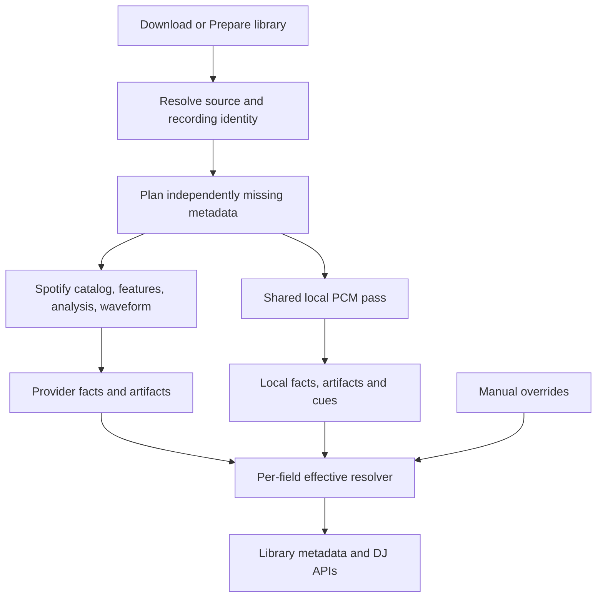

# Spotify metadata, waveforms, and local fallback implementation plan

**Status:** Implementation active on `feature/spotify-metadata-foundation`; closeout evidence is recorded through Milestone 212 (milestones are not phase completion). All nine phases remain tracked; full acceptance is not yet achieved. The broad acceptance tally remains 2/12 checked and 10/12 partial.

**Created:** 2026-10-04

**Objective:** Persist all available track-related Spotify information, expose its provenance, and supply local replacements for each audio-derived field when the provider cannot supply a usable value. Keep local DJ preparation working independently of Spotify.

**Research baseline:** [Verified waveform research](archive/research/SPOTIFY_WAVEFORM_RESEARCH.md), [BPM/key import](SPOTIFY_BPM_KEY_IMPORT.md), and [Web Player validation](SPOTIFY_WEBPLAYER_VALIDATION.md).

## 1. Required behavior and scope

1. Downloads capture catalog metadata and available audio features before completion and reconcile them into durable library storage after final file identity is known.
2. Existing tracks reuse a current Spotify recording link, or search using the existing title/artist/duration matcher. Strong download/manual identities retain precedence over automatic matches.
3. Fetch catalog, scalar audio features, detailed audio analysis, and three-band waveforms independently. A 404 or missing field in one response must not disable the other capabilities.
4. Persist every returned domain field from these supported resources, including fields that do not yet have a library column. Store typed projections for searching and bounded sanitized snapshots for additional fields.
5. For every Spotify-supported calculated audio field, validate the source-bound Spotify value first and calculate a semantically equivalent local estimate only when provider retrieval fails or its field is absent, invalid, or unusable. Apply this field by field; preserve current manual locks and never replace a valid Spotify field merely because a different field or resource is absent. Spotify catalog duration and decoded local-file duration are distinct facts: the latter measures the actual loaded file and remains necessary for playback and cue boundaries, so it is not a duplicate calculation of catalog duration.
6. Retain local and Spotify observations as separate provenance-bearing values, except for the user's single-waveform invariant: one current three-band waveform per track. A valid source-bound Spotify waveform is the representation and suppresses redundant local band calculation/retention; local bands are the fallback when no usable provider waveform exists.
7. Continue local energy, standards-based loudness, structure, and automatic DJ cue generation when those outputs are missing or stale. Complete Spotify BPM/key does not make DJ preparation complete.
8. Operate offline using current-source local measurements and any permitted retained provider observations. No credentials, no match, missing fields, provider failures, and cooldowns all have explicit fallback behavior.
9. Do not infer provider-specific facts such as Spotify IDs, popularity, follower counts, copyrights, or playlist membership from audio. File tags can supply local descriptive metadata; otherwise expose unknown or a dated cached provider fact.
10. Preserve manual locks, user cues, cue deletion suppressions, cue mode preferences, account isolation, and source-fingerprint checks.

“All available” means all returned metadata for the linked recordings and their related albums/artists, plus playlists/library items already requested by the user. It does not mean crawling Spotify's catalog, automatically harvesting unrelated account history, or inventing undocumented endpoints. New resources need their own verified adapter and field inventory.

## 2. What is verified, implemented, and still proposed

| Capability | Evidence | Current production support | Work required |
| --- | --- | --- | --- |
| Cookie-to-WebPlayer bearer token | Existing connected-session implementation and live probes | Yes | Reuse ownership, cancellation and renewal |
| Scalar `audio_features` | Successful live requests plus adapter/storage/API regressions | Spotify BPM/key win before equivalent local estimation; returned scores and optional fields are retained with provenance and exposed on selected surfaces | Complete field inventory and effective resolution across all detail/list/mixing consumers; live availability remains unqualified |
| Detailed `audio_analysis` | Validated fixture/import, persistence and provider-first beat/bar regressions; availability is recording-specific | Bounded artifacts and timing arrays are retained; valid beats/bars replace local phase timing | Complete live resource inventory and source/timeline alignment qualification |
| `THREEBAND_WAVEFORMS`, extension 237 | Live feasibility probes plus protobuf/storage/refresh/UI regressions | Valid provider waveform suppresses local three-band work; local DSP is fallback; one representation is retained | Live scaling/band interpretation/alignment, full accessibility and long-track performance qualification |
| Catalog tracks/albums/artists/playlists | Existing catalog adapters | Transient models and limited metadata caches | ID-keyed full snapshots and relations |
| Local tempo/key/mode/energy/loudness/structure/cues | Existing shared PCM analysis | Yes | Preserve independent facts and schedule by missing capabilities |
| Local amplitude waveform | Existing decoder-backed waveform endpoint | Yes, separately cached | Bind cache to source; integrate generation with preparation |
| Local three-band waveform | DSP implementation and provider-first preparation/UI regressions | Yes, calculated and retained only when provider waveform data is absent or unusable | Validate local estimator against approved corpus and renderer/performance/accessibility criteria |
| Local meter, detailed segmentation, perceptual scores | Requires additional estimators and validation | Incomplete or absent | Explicit implementation and qualification phases |

Two successful waveform tracks establish feasibility with the existing authentication method, not catalog-wide availability. Detailed-analysis availability is recording-specific in the observed evidence. Public schemas enumerate possible fields; they do not prove that our private route returns every field for every account.

## 3. Metadata inventory and fallback contract

Every entry must have independent presence, validity, freshness, source, endpoint/algorithm, units, and confidence where meaningful. Numeric zero and `false` are valid values, not missing-data sentinels.

### 3.1 Audio scalars

The [Spotify feature schema](https://developer.spotify.com/documentation/web-api/reference/get-audio-features) includes the following possible audio values. Confirm actual private-response presence with sanitized fixtures before advertising availability.

| Field | Store from Spotify | Local replacement | Required semantic distinction |
| --- | --- | --- | --- |
| Tempo/BPM | Fractional tempo; confidence only if supplied | Existing onset/tempo estimator | No fabricated provider confidence; scalar BPM alone does not establish sync phase |
| Key | Pitch class; `-1` becomes unknown | Existing chroma/key estimator | Store tonic separately from display notation |
| Mode | Major/minor; preserve mode confidence if supplied | Local key estimator's mode | Select compatible key/mode as a pair; do not combine unrelated estimates |
| Duration | Catalog milliseconds and analysis seconds with original units | Container/decoded frame duration | Playback and cue limits always use actual file duration |
| Loudness | Provider track-level dB value with metric identifier | Local loudness measurement and envelope | Spotify loudness and local BS.1770 integrated LUFS are separate metrics |
| Time signature | Beats per bar and confidence if supplied | New meter estimator | Integer 4 does not prove a denominator of 4; a default four-beat grid is not measured meter |
| Energy | Provider 0–1 score if returned | New qualified local energy score; keep existing 1–10 DJ energy | Never silently rescale 1–10 into a Spotify-equivalent score |
| Danceability | Provider score if returned | New rhythm/groove estimator or qualified local model | Local estimate, not reproduction of Spotify's proprietary scoring |
| Acousticness | Provider score if returned | Qualified acoustic/electronic classifier | Separate model/version/confidence |
| Instrumentalness | Provider score if returned | Qualified vocal-presence/instrumental classifier | Existing legacy boolean is not equivalent to a probability |
| Liveness | Provider score if returned | Qualified live-performance classifier | Do not identify live performances from title words alone |
| Speechiness | Provider score if returned | Qualified speech/music classifier | Speech proportion and provider speechiness are distinct definitions |
| Valence | Provider score if returned | Qualified mood/valence model | Subjective estimate; abstention is expected |

Store `analysis_url`, IDs, resource types, and URLs as metadata, not audio measurements. Capture any additional returned scalar under a namespaced field registry. Known field units/ranges are versioned; unknown fields remain discoverable in the stored snapshot until a reviewed mapping exists.

### 3.2 Detailed audio analysis

The [detailed-analysis schema](https://developer.spotify.com/documentation/web-api/reference/get-audio-analysis) describes interval arrays and analysis context. Preserve the complete returned domain object, including `meta`, `track`, bars, beats, tatums, sections and segments. Do not restrict storage to today's reduced Go wire model.

| Data | Required provider retention | Local replacement |
| --- | --- | --- |
| Analysis context | Returned analyzer version, processing/sample/channel information and other track/meta fields | Local analyzer versions, decoder/sample/channel/frame facts under local names |
| Beats | Start, duration, confidence | Extend local timing output to explicit qualified beat intervals |
| Bars/downbeats | Start, duration, confidence | Meter and downbeat inference; unknown when evidence is insufficient |
| Tatums | Start, duration, confidence | Qualified subdivision estimator; do not mechanically halve all beat intervals |
| Sections | Full returned section objects, including any tempo/key/meter/loudness values | Existing energy structure boundaries plus additional section estimators |
| Segments | Start/duration/confidence, loudness start/max/end/peak time, pitches, timbre, and other returned fields | Novelty segmentation, local loudness envelope, chroma and versioned spectral/timbre features |
| Confidence | Only actual provider confidence fields | Independently qualified local confidence |

Spotify sections are not guaranteed intro/drop/chorus labels. Local structure labels remain distinct. Local chroma can represent pitch-class strength, but local timbre vectors must not be presented as the same learned basis as Spotify's 12-component timbre representation.

An unavailable detailed array triggers fallback only for the affected capability. A failed detailed request must not erase a successful feature result or waveform.

### 3.3 Waveforms

Persist three explicitly named representations:

| Representation | Origin | Payload |
| --- | --- | --- |
| `spotify_three_band` | Extension 237 | Source sample rate, window milliseconds, low/mid/high int32 arrays |
| `local_three_band_estimate` | New local DSP | Three local band envelopes, units/normalization and algorithm version |
| `local_amplitude` | Existing local decoder | Normalized amplitude peaks, window/sample resolution |

Never store an amplitude-only array in a field advertised as three-band data. Preserve provider samples as returned; renderer normalization is a separate versioned transformation. Store local timing and provider timing separately and reject display alignment when the duration discrepancy exceeds the verified matching/alignment policy.

### 3.4 Catalog and related entities

Persist full returned objects and relations from the existing adapters, including available fields from the [track schema](https://developer.spotify.com/documentation/web-api/reference/get-track). Examples are an inventory, not a guarantee of private endpoint coverage:

| Resource | Fields and relations to retain | Offline/local behavior |
| --- | --- | --- |
| Track | ID/URI, title, ordered artist credits, album link, duration, explicit flag, external IDs such as ISRC when returned, URLs, disc/track numbers, popularity, markets/playability/restrictions, relinking, preview reference | Names/credits/numbers/duration/embedded identifiers from tags or current local catalog; provider-only facts unknown or cached |
| Album | ID/URI, title/type, artists, release date and precision, artwork, label, copyrights, genres/popularity if returned, total tracks and ordered track links | File tags/artwork can supply local descriptions; no invented provider label/rights/popularity |
| Artist | ID/URI, name, artwork, genres, followers/popularity when returned, related releases/top tracks where already fetched | Local artist description and tags; provider identity and social metrics stay provider-only |
| Playlist | ID/URI, name/description, owner, artwork, visibility, followers when returned, snapshot/version, ordered items, duplicate positions, added-at and item type/unavailable markers | Preserve last snapshot and distinguish local playlists; no invented Spotify ownership or membership |
| Saved-library relation | Account-scoped saved entity identity and timestamp when returned | Existing cached membership, labeled stale; no audio-derived membership |
| Other returned fields | Sanitized namespaced domain fields, original nesting and presence | Explicitly `provider_only` until a reviewed local counterpart exists |

For returned unavailable/local/podcast items, preserve positional placeholders and type information instead of silently shifting playlist order. Account-scoped data must not leak across account switches.

## 4. Proposed architecture



Introduce a capability registry instead of growing one success/failure flag:

```text
CapabilityDefinition:
  key, fieldGroup, semanticMetric, units, valueType
  spotifyResources, localEstimator, dependencies
  schemaVersion, estimatorVersion, validationPolicy
  requiredForPreparation, fallbackPolicy
```

Example keys: `tempo_bpm`, `key_mode`, `time_signature`, `provider_loudness_db`, `integrated_lufs`, `spotify_energy_score`, `local_energy_level`, `three_band_waveform`, `beat_intervals`, `dj_cue_candidates`.

The resolver may offer a common user-facing concept with alternatives, but it cannot pretend that differently defined metrics are interchangeable. For example, “Loudness” can contain Spotify dB and local LUFS, while playback normalization specifically consumes qualified local loudness.

## 5. Database design

### 5.1 Separate facts from effective projections

Keep `songs` as the canonical library entity and `track_external_identities` as the current-source recording link. Add additive migrations for these proposed tables:

| Table | Suggested key | Purpose |
| --- | --- | --- |
| `spotify_entity_snapshots` | Entity type, Spotify ID, resource, context key | Full sanitized catalog snapshot and retrieval metadata |
| `spotify_entity_relations` | Parent ID, relation kind, snapshot, position, context | Ordered artists, album tracks, playlist items and other returned relations |
| `spotify_audio_observations` | Track ID, resource, context | Provider scalar values and field presence independent of local results |
| `spotify_audio_artifacts` | Track ID, artifact kind, context, schema version | Detailed JSON and three-band protobuf/normalized samples |
| `track_metadata_observations` | Song ID, fingerprint, field key, source, algorithm | Local measurements and provider-to-source bindings; optional typed scalar indexes |
| `track_metadata_capability_status` | Song ID, fingerprint, capability, provider context | Pending/running/available/unavailable/failure/cooldown and retry state |
| `track_metadata_overrides` | Song ID, field key, source scope | Manual overrides for newly exposed fields; reuse current BPM/key overrides |

Use stable provider IDs for entity storage. Existing name-keyed album/artist caches remain compatibility presentation caches, not authoritative identity tables.

Each observation includes:

```text
value/value_json, metric, units, provider/source, endpoint
schema_version, adapter_revision or algorithm_version
retrieved_at or measured_at, expires_at, payload_hash
spotify_track_id, account_context/market when relevant
source_fingerprint for local facts and applied provider bindings
confidence (nullable), validation_state, availability_reason
```

A provider snapshot is keyed to a Spotify entity, not a local filename. Applying its audio facts to a song requires a live recording link bound to that song's fingerprint. Account-independent metadata may be deduplicated after its visibility/context semantics are verified. Default new private resources to account-scoped storage and request fencing.

### 5.2 Storage format and complete retention

1. Keep typed nullable scalars for frequently sorted fields. Preserve original units/precision in provider snapshots.
2. Store detailed arrays as compressed validated JSON and waveforms as compact protobuf or packed integer data with a decoded model version.
3. Persist all returned domain fields, including additional nested fields, in a sanitized bounded payload. Do not store HTTP envelopes, cookies, tokens, request headers or arbitrary diagnostic bodies. Explicitly sensitive-looking fields are redacted before persistence.
4. Additional fields are retained in a bounded `additional_metadata` section and reported by field path. Promote them into typed capabilities only after reviewing semantics and local feasibility.
5. Keep a last-good snapshot and separate last-attempt status. A failure never replaces a valid artifact with an empty blob.
6. Retain current state, not unlimited fetch history. Provider cache lifetime and durable imported recording facts have separate lifecycles. Account retirement invalidates private/session caches; downloaded facts follow the existing durable import policy.
7. Write related projections, artifact identities, and capability completion transactionally. Partial persistence must be resumable.

Initial configurable guardrails: scalar normalized JSON 64 KiB; catalog snapshot page 2 MiB; detailed JSON 8 MiB; waveform response 8 MiB; 20,000 intervals per timing array; 40,000 segments; 12 elements for known pitch/timbre vectors; 1,000,000 samples per band. Check compressed and decoded limits separately. Long-form content exceeding a limit gets an explicit status and local fallback, never silent truncation. Qualify limits against real short and long recordings before shipping.

### 5.3 Compatibility migration

- Backfill existing scalar reference observations into provider observations, retaining endpoint/expiry/provenance. Missing newly introduced fields remain null.
- Backfill trustworthy current local fields/artifacts without claiming that overwritten measurements can be recovered. Re-measure when independent local facts are absent.
- Keep `TrackAnalysis` as the existing BPM/key/status projection while the independent observation model becomes authoritative. `ApplySpotifyScalars` remains a compatibility writer until the new resolver is wired through all consumers.
- Migrate waveform cache entries only when their fingerprint can be verified. Otherwise leave them as legacy cache entries to regenerate; a song ID alone does not prove current bytes.
- Do not invalidate every local artifact for a provider schema change. Artifact versions and capability versions invalidate their own outputs.
- Migration tests must start from the existing production schema and preserve overrides, cues, download evidence, external links and existing analysis.

## 6. Spotify adapters and independent refresh

### 6.1 Features

Extend `backend/internal/spotify/analysis/models.go`, `client.go`, `normalize.go` and `validate.go` to preserve all returned feature fields. A successful response containing only an additional usable scalar is still worth retaining; remove the global requirement that every useful response must contain BPM or key.

Use pointer/presence types for every optional field. Score ranges, duration conversion, key/mode validity, and confidence ranges are checked field by field. An invalid optional field should not discard valid siblings unless the envelope/identity is invalid. Record rejected field paths with stable reason codes.

Keep the automatic feature path explicit. A detailed-analysis 404 does not silently substitute features inside the transport; the coordinator plans independent requests and combines their observations.

### 6.2 Detailed analysis

Add a full detailed payload model and artifact return type. Preserve all returned track/meta fields and complete section/segment objects, not merely their common interval subset. Validate IDs, finite values, temporal ordering and bounds, nullable confidence, known vector shapes, and maximum counts. Retain unknown domain fields through the bounded snapshot mechanism.

Use detailed scalars as an additional observation. Prefer `audio_features` for existing BPM/key display policy, then a usable detailed scalar if feature data is missing; retain disagreements rather than averaging them. A confidence field from detailed analysis must not be attached to a different feature observation.

### 6.3 Three-band waveform adapter

Implement a dedicated fixed-origin adapter under `backend/internal/spotify/waveform/` or `analysis/waveform.go`. Reuse the connected session token owner and shared outbound request policy.

```http
POST https://spclient.wg.spotify.com/extended-metadata/v0/extended-metadata
Content-Type: application/json
Accept: application/protobuf
```

```json
{"entityRequest":[{"entityUri":"spotify:track:<validated-id>","query":[{"extensionKind":237,"etag":""}]}]}
```

Decode the outer response, extension kind, per-entity status, identity, protobuf Any type, then waveform fields. HTTP 200 alone is insufficient: entity 404/451/errors and missing payload are separate failures. Require expected type URL, plausible positive sample rate/window, equal nonempty band counts, bounded arithmetic, and duration compatibility. Sample numeric interpretation and renderer scaling must be verified from the pinned source/fixtures before range normalization is shipped.

Handle protobuf unknown fields compatibly without assuming the current bundle hash is permanent. Pin the inspected contract revision as provenance. Ignore unknown wire fields in decoding while retaining only bounded, validated domain artifact bytes; do not dynamically execute provider code.

Start with one recording per request. Add batching/ETag revalidation only after the observed contract is verified in fixtures and a bounded live sample. A provider 304 requires a matching cached artifact; otherwise refetch without the ETag.

### 6.4 Catalog persistence

Add snapshot capture at existing catalog normalization boundaries. Do not reconstruct “complete” Spotify objects solely from reduced presentation structs. Normalize typed fields and preserve sanitized additional domain fields in the same transaction.

Fetch related album/artist entities once per context and freshness interval; deduplicate shared artists/albums across a playlist. Persist pagination checkpoints and playlist snapshot IDs. Resume safely without duplicating items or mixing two snapshots. Missing fields in a sparse search result must not erase fields from a richer current detail resource.

### 6.5 Failure, freshness and request policy

| Condition | Coordinator behavior |
| --- | --- |
| No session / disconnected | Use local and retained eligible data; no upstream requests |
| No accepted recording match | Use local audio metadata; retain search rejection reason |
| One field absent/null/invalid | Try its next eligible observation/local estimator |
| Detailed 404 | Mark detailed resource unavailable for that recording/context; continue features and waveform |
| Waveform entity unavailable | Local three-band, then amplitude fallback; keep good scalars |
| 401 | Existing one-renewal flow; repeated denial retires that session through its owner |
| 403 | Resource/context unavailable; local fallback; do not misclassify as missing authentication |
| 429 | Honor Retry-After through shared cooldown; stop affected background requests and continue local work |
| Timeout/network/5xx | Preserve last-good, use local, schedule bounded retry |
| Invalid envelope/wrong entity | Reject provider response without linking it to local bytes |
| File or account changes during request | Discard stale application result; never commit to the new source/account |

Use existing single-flight and concurrency gates. Start background provider transactions with concurrency 2, bounded by the existing account gate, and reserve capacity for interactive requests. Proposed budgets: 20 seconds per request and 45 seconds total provider work per track; cancellation and cooldown take precedence. Do not serialize four full timeout windows before local work can begin.

Initial retry policy: success freshness varies by resource; immutable recording analysis 30 days locally unless provider cache headers/context require shorter; dynamic catalog metrics 24 hours; 404 per recording/resource 24 hours; temporary failures exponential 1/5/30 minute delays with jitter; 429 uses the supplied delay. These are application defaults to qualify, not provider guarantees. Manual refresh may bypass a negative cache, never a live rate-limit cooldown.

## 7. Local replacement scanner

### 7.1 Extend the existing engine

Use the shared `analysis.DecoderRegistry` and source resolver in the durable analysis job. Do not add a second unmanaged scanner or place DSP inside file-tag extraction. Stream the audio once per source revision, feeding only required accumulators plus preparation outputs that are missing/stale.

```text
source resolution -> capability plan -> shared PCM stream
  -> onset/tempo/phase and meter
  -> chroma/key/mode
  -> loudness and energy envelopes
  -> amplitude and three-band waveform
  -> structure/segment features
  -> optional qualified classification models
  -> versioned observations/artifacts -> effective resolution -> cues
```

Spotify can prevent redundant scalar estimations, but not PCM processing required for DJ preparation. Onsets or local tempo hypotheses may still be needed to measure phase or meter even when effective BPM comes from Spotify. Reuse current artifacts rather than decoding again merely to refresh a provider field.

### 7.2 Existing replacements

- Tempo, key and major/minor mode: retain the current qualified estimators and confidence rules.
- Duration: use decoded frame counts and sample rate; verify container timing. Use actual file duration for cue bounds and waveform alignment.
- Loudness: keep existing BS.1770 integrated LUFS and true peak; add short-window/local segment envelope outputs where required. Expose metric names instead of substituting LUFS into a field called Spotify dB.
- DJ energy/structure/cues: keep the current algorithms and user-selected cue mode. Spotify energy scores and detailed arrays are distinct provider evidence; validated Spotify beats/bars must take precedence over matching local beat-grid estimation, while local energy-derived structure and cue outputs remain separate.
- Amplitude waveform: move or reuse peak accumulation within the shared preparation pass and persist a current-source artifact.

### 7.3 New local three-band waveform

Implement a streaming band-energy accumulator with documented filter/STFT boundaries. Proposed starting bands: below 250 Hz, 250–4,000 Hz, above 4,000 Hz up to Nyquist; qualify these choices with the renderer and audio corpus. Compute 20 ms envelope samples, deterministic resampling, and bounded overview levels.

Specify whether values are RMS, peak or spectral power, how channels are combined, how silence/clipping are represented, and how display normalization works. Persist the algorithm and band definition. Do not label these bands as an exact reconstruction of Spotify's undisclosed analysis.

If this estimator is unavailable, use the existing amplitude waveform and return `representation=local_amplitude`. Never return a fabricated flat waveform for unavailable/corrupt audio.

### 7.4 Meter and detailed timing

Add a confidence-bearing meter/downbeat estimator using accent periodicity and candidate beat groupings. Evaluate at least 3-, 4-, 5- and 7-beat groupings and compound-meter ambiguity. Support changing meter/tempo through intervals where justified. Abstain on silence, irregular rhythm and weak evidence.

Meter needs a ground-truth corpus; fixed 4/4 assumptions in grid construction do not count as a fallback measurement. Expose beats-per-bar and any separately measured denominator/grouping, with confidence and intervals. Enable sync/downbeat alignment only through the existing qualified timing contract; provider interval presence alone does not authorize it.

Add local segment boundaries from spectral/onset novelty, local pitch-class vectors and a separately named spectral/timbre representation. Preserve local and provider timing arrays independently; no local output may occupy a `spotify_*` artifact kind.

### 7.5 Perceptual-score replacements

These are required work items for broad audio-field fallback, not capabilities already supplied by the current engine:

| Estimator | Proposed inputs | Qualification |
| --- | --- | --- |
| Energy score | Loudness, dynamics, onset density, spectral distribution | Held-out agreement and stability tests; separate from existing DJ energy level |
| Danceability | Beat regularity, rhythmic clarity, accent/groove features | Human/corpus labels; tempo alone is insufficient |
| Speechiness/instrumentalness | Speech/music and vocal activity models | Language/style diversity and sung-vocal vs speech distinctions |
| Acousticness | Acoustic/electronic timbral classifier | Instrument/style diversity; no title/genre shortcuts |
| Liveness | Audience/room/performance cues and classifier | Studio/live examples and abstention on ambiguous production |
| Valence | Qualified affect model | Subjective-label agreement and low-confidence abstention |

Run models locally, with pinned versions and documented model distribution/requirements. Select implementation dependencies after a focused benchmark of CPU, memory, model size and supported deployment platforms; do not promise a model package before that evaluation.

Provider scores and local estimates share a user-facing concept only with an explicit `local_estimate` source and semantic/model identifier. They need not numerically reproduce Spotify. Do not train on harvested Spotify responses as an automatic step; qualification uses an appropriate independently labeled corpus and user-authorized comparison fixtures.

If a qualified estimator cannot be shipped, report `local_estimator_unavailable` or `low_confidence`; leave the fallback coverage checklist incomplete. Never use random values, constant averages, genre lookups or an LLM-generated number to satisfy coverage.

## 8. Per-field selection and preparation state

### 8.1 Selection rules

For equivalent audio fields, resolve:

```text
current locked manual value
  > valid eligible provider candidate (fresh, newest retrieval, detailed on ties)
  > qualified current local measurement/estimate
  > unknown
```

Presence of a provider zero score, key 0, mode 0 or explicit false must survive this selection. Provider confidences can be null. Couple key/mode and related vector/timing dependencies so incompatible pieces do not form a misleading result.

Provider facts with an expired freshness window are preserved. During temporary failure, immutable same-recording analysis may remain effective as `stale=true` under an explicit last-good policy; dynamic popularity/playability does not become “current” merely because it is cached. Account retirement and source mismatch always invalidate application eligibility. Offer local current alternatives independently.

For semantic alternatives such as loudness, energy and timbre, return both named metrics. Do not apply numeric precedence across different units/definitions. Local playback normalization and actual file timing are authoritative for their operational purposes.

### 8.2 Capability state and repair

Each capability has independent provider-attempt and local-attempt state. Use `pending`, `running`, `available`, `not_returned`, `unavailable`, `low_confidence`, `unsupported`, `failed`, `cooldown`, and `canceled` as appropriate, with stable reason codes.

Define preparation requirements by enabled product behavior. Example: BPM/key, local energy/loudness/structure, an available waveform representation, and cue candidates when the cue preference requires them. An optional provider-only popularity field cannot keep “Prepare library” permanently pending.

The missing-selection query must include missing/stale required capabilities, not merely absent scalar rows. The runner validates payload/source identity after SQL's coarse selection. A current required artifact missing from an otherwise complete scalar row is repair work. A known unsupported estimator is settled until its capability version changes; transient failure is retryable at `retry_at`, not on every scan.

Lease work by song/fingerprint/preparation generation. Heartbeat long tasks, release claims on cancellation, and publish capability completion only after its facts/artifact transaction succeeds. Overlapping jobs must not decode the same source twice.

## 9. Download and existing-library integration

### 9.1 Downloads

1. Retain full catalog details from the already resolved recording and related entities.
2. Fetch features, analysis and waveform within the independent request budget; metadata failure does not fail audio download.
3. Store durable provider evidence under the Spotify ID while download is in progress. Large artifacts are referenced by ID/hash, not duplicated in queue JSON.
4. Continue existing BPM/key file tags. Additional tag writing is a separate format-specific mapping: mode is represented through key; original catalog dates/credits can use standard tags. Do not write waveform arrays into tags or map Spotify loudness to ReplayGain.
5. Bind facts to final SHA-256/size/mtime after conversion/tagging. Reconcile them during library scanning as with existing Spotify download evidence.
6. Queue local preparation for required artifacts/cues. Queue cleanup must not delete imported facts or their live references.

### 9.2 Existing tracks

Reuse `spotify_match.go` and its release ranking. Preserve recording ID, match strategy, selected candidate, duration difference and link origin in provenance. Retain version checks and manual/download identity rules. Apply request completion only if source fingerprint and account generation still match.

Only unmatched tracks search again when their negative-match state expires or metadata changes. Already linked recordings must not incur a new search on every capability refresh. Downloaded songs should be linked from durable evidence before invoking title search.

## 10. APIs and user interface

Extend `services/trackAnalysisContracts.ts` and the existing analysis routes additively. Proposed response:

```json
**Implemented with source-bound restart/retirement coverage.** Download completion now copies bounded scalar observations and per-endpoint field-attempt rows from the active private account context into additive tables keyed by final file revision, Spotify recording, provider resource and field. Imports preserve metric/units, confidence, expiry/retrieval timestamps, adapter revision and rejected/not-returned outcome. A read repository admits rows only while the physical file and confirmed recording link match final-file evidence; it rechecks file revision, identity and suppression after reading. Song provider-scalar detail merges current private candidates with imported durable alternatives by field; after retirement/offline it can display imported candidates and labels their provenance.

      "units": "bpm",
      "source": "spotify",
      "endpoint": "audio_features",
      "confidence": null,
      "stale": false,
      "fallbackReason": null
    },
    "time_signature": {
      "value": 4,
      "units": "beats_per_bar",
      "source": "local_measured",
      "algorithm": "meter-v1",
      "confidence": 0.88,
      "stale": false,
      "fallbackReason": "spotify_field_missing"
    }
  },
  "artifactAvailability": {
    "waveform": "spotify_three_band",
    "detailedAnalysis": "available",
    "djCues": "available"
  }
}
```

This is an illustrative future contract, not data produced by the current meter engine.

Provide bounded artifact retrieval endpoints for waveform, detailed analysis and local alternatives. Keep arrays out of library list rows and use availability summaries for sorting/badges. Waveform consumers request resolution/range explicitly. Extend the current `/api/dj/waveform/{id}` without breaking amplitude-only consumers; explicit representation negotiation or a new versioned route is preferable to silently changing `peaks`.

Track details show effective values, local/provider alternatives, units, freshness and source. Show “Local estimate” for learned/proxy fields and “Unknown” when no qualified value exists. Expose provider-specific facts in a Spotify metadata section. Do not make a user decipher internal endpoint names to use the library.

Add capability filters for missing analysis and optional metadata refresh, preserving existing **Prepare library** semantics and cue settings. Spotify refresh can improve display metadata without rewriting user hot cues or invalidating usable local playback preparation.

## 11. Logging and diagnostics

Continue `scan.log` beside `viib.log`. Record one resource attempt and one per-field resolution decision where relevant, plus an aggregate per track/job. Examples:

```text
spotify_resource song_id="..." resource="three_band_waveform" http_status=200 entity_status=200 samples_per_band=10745 window_ms=20
metadata_field song_id="..." field="time_signature" source="local_measured" reason="spotify_field_missing" confidence=0.88
metadata_field song_id="..." field="popularity" source="unknown" reason="provider_only_unavailable"
local_artifacts song_id="..." energy=true loudness=true structure=true waveform=true cue_candidates=true auto_cue_mode="fill-empty"
```

Log `not_returned`, `invalid_field`, `no_match`, HTTP/field-specific 404, entity denial, rate limiting and retry delay separately. Count Spotify/local/unknown/stale decisions by capability. Summaries must distinguish successful scalar retrieval from full preparation completion. Never log credentials, raw provider bodies, arbitrary errors containing headers, or private account data unrelated to the operation.

## 12. Implementation phases and reviewable deliverables

| Phase | Deliverables | Exit criteria |
| --- | --- | --- |
| 1: Contract inventory | Sanitized real response field inventories; capability registry; semantic/fallback matrix | Every returned field is classified; verified vs optional fields explicit |
| 2: Durable storage | Additive schemas, repositories, catalog relations, bounded snapshots, migration/backfill | Existing database upgrades without loss; unknown domain fields retained safely |
| 3: Provider adapters | Complete feature model, detailed artifact persistence, extension 237 adapter | Independent resource statuses; mixed 200/404 fixtures and live sample pass |
| 4: Per-field resolver | Source-separated observations, precedence, compatibility projections | Partial responses preserve good siblings; manual locks and source/account fencing pass |
| 5: Core local fallback | Shared preparation planning, waveform accumulation, energy/loudness/structure/cues repair | Offline core preparation succeeds; one PCM decode per missing source revision |
| 6: Expanded DSP | Three-band waveform, meter/downbeats/subdivisions, segments/chroma/local timbre | Corpus-qualified output and explicit abstention; no implicit 4/4 claims |
| 7: Perceptual estimators | Local score/classification models and calibration | Per-field quality/platform/performance criteria met or coverage explicitly incomplete |
| 8: Product integration | Metadata detail/list summaries, artifact APIs, waveform renderer, logs | Existing API clients remain valid; small payloads and clear sources |
| 9: Library rollout | Missing-capability backfill, resumable jobs, bounded refresh/retention | Previously scanned library repairs without repeat decoding or provider request storms |

Phases 1–5 provide immediate useful metadata capture and fallback using existing DSP. The full request is not complete until phases 6–7 address remaining audio-derived replacements or document demonstrated technical limits. Provider-only fields use cache/tags/unknown behavior rather than impossible audio reconstruction.

## 13. Repository edit map

| Area | Existing files/modules | Proposed changes |
| --- | --- | --- |
| Spotify wire/normalization | `backend/internal/spotify/analysis/{models,client,normalize,validate}.go` | Full nullable features and detailed artifact return types |
| Authentication | `backend/internal/spotify/auth/`, `backend/internal/api/spotify_session.go` | Reuse existing owners; no new credential flow |
| Refresh/cache | `backend/internal/spotify/refresh/`, `backend/internal/api/spotify_analysis.go` | Independent resource capabilities and last-good state |
| Feature application/matching | `backend/internal/api/spotify_features.go`, `spotify_match.go`, `backend/internal/db/spotify_scalars.go` | Metadata bundle planner and per-field compatibility projection |
| Catalog | `backend/internal/spotify/catalog/` | Snapshot capture and field-complete entity projections |
| Provider persistence | `backend/internal/db/external_track_analysis_{schema,repository}.go` | Separate scalar/catalog/artifact repositories and migrations |
| Local runner | `backend/internal/analysis/track/{runner,track,scan_log}.go` | Capability scheduling, independent local facts, shared-pass accumulators |
| Local DSP | `backend/internal/analysis/{tempo,key,beatgrid,features}/`, `waveform.go` | Reuse core; add meter, multiband, segmentation and qualified models |
| Durable selection/jobs | `backend/internal/db/track_analysis_selection.go`, `backend/internal/api/v2_jobs_analysis.go` | Missing capabilities, retry eligibility, progress and leases |
| File scanning/downloads | `backend/internal/scanner/`, `backend/internal/spotify/downloader.go`, `backend/internal/api/download_manager.go` | Durable provider facts bound to final source; queue local preparation |
| Waveform serving | `backend/internal/api/dj_waveform.go`, local cache repository | Representation-aware artifact retrieval and fingerprint validity |
| Frontend | `services/trackAnalysisContracts.ts`, `services/api.ts`, `lib/clientWaveform.ts`, DJ waveform components | Provenance/units, artifact availability and three-band rendering |

Proposed new module/table names are design choices. Confirm actual ownership during implementation instead of creating parallel repositories that duplicate existing functionality.

## 14. Verification plan

### Parser and provider tests

- Every nullable scalar, zero/false handling, range/finite validation, units and missing vs invalid states.
- Successful scalar-only, additional-score-only and detailed-only responses; mismatched entity ID rejection.
- Detailed arrays round-trip without losing section/segment fields or metadata. Malformed optional siblings do not erase unrelated valid facts.
- Waveform protobuf fixtures: known Any type, unknown fields, truncated wire values, unequal arrays, extreme count/window/rate, nested entity errors under HTTP 200, and ETag 304 with/without cache.
- Features 200 + analysis 404 + waveform 200; waveform failure + valid key; one score missing + all other fields retained.
- 401 renewal, 403, 404, 429/shared cooldown, cancellation, timeout, account-switch fencing and no credential leakage.

### Database and migration tests

- Existing real schema fixture upgrade and rollback-on-error.
- Provider/local coexistence, typed projections plus additional metadata, idempotent relation writes and duplicate playlist positions.
- Last-good retention, resource-specific freshness, source/identity rebinding and no account mixing.
- Queue cleanup preserves imported evidence; failed/incomplete persistence remains repairable.
- Legacy waveform cache cannot claim a new fingerprint without verification.

### Local and orchestration tests

- Complete Spotify scalars still yield missing energy/loudness/structure/waveform/cues.
- No credentials and total Spotify failure still run all enabled local capabilities.
- Missing meter/key/waveform individually triggers only relevant estimators; already current artifacts are reused.
- Manual BPM/key/new-field locks, manual hot cues and deletion suppressions survive backfill.
- Same-fingerprint retained Spotify facts survive local artifact repair when refresh fails.
- Silence/corrupt audio/unsupported codec/short files/variable rhythm result in explicit unknown/failure, not fabricated values.
- A resumed or overlapping job does not duplicate decode or publish stale results.
- Measured meter tests cover non-four-beat material; uncertain meter never becomes confident 4/4.
- Qualified perceptual models use held-out labels, uncertainty tests and deterministic versioned outputs.

### Performance and live qualification

Measure one-track and 105-track preparation with fresh provider caches, warm caches and offline mode. Record decode count, wall time, peak RSS, provider requests, database/artifact sizes and UI payload size. Set thresholds from the current local preparation baseline; do not accept unbounded memory for waveforms/models or one request per field when one resource supplies many fields.

Use the two verified recordings for bounded live regression: waveform succeeds independently of detailed 404, and Better Off Alone returns detailed intervals. Do not log or commit credentials/live raw account payloads. Live tests remain opt-in and do not replace deterministic offline fixtures.

## 15. Acceptance checklist

**Last reviewed: 2026-10-09; closeout evidence current through milestone 212 in SPOTIFY_BRANCH_CLOSEOUT_NEXT_STEPS.md.** **2 of 12 gates checked; 10 remain partial.** Subsequent branch-closeout work and current held-out evidence are recorded in `SPOTIFY_BRANCH_CLOSEOUT_NEXT_STEPS.md` and `DJV2_TRACK_ANALYSIS_CONCISE_CONTEXT.md`; they do not advance a broad gate without its full acceptance evidence. Checked items have implementation and regression evidence for the stated behavior. Unchecked items remain acceptance gates even where substantial pieces are implemented. Fixture coverage does not establish live provider availability or corpus/platform qualification.
**Historical validation snapshot:** milestone 136; later changes and evidence are recorded in milestones 137–148 and in this checklist.

**Lifecycle evidence refresh (milestones 133–139):** The endpoint-level concurrent retirement/serialization race is covered (133), and a mounted Mix Next plus playlist-draft session-generation switch is covered (137). These narrow tests do not qualify the full routed disconnect/reconnect workflow or full accessibility/layout coverage. The latest frontend run passed 95 files / 385 tests and the backend DB/API suites passed after milestones 146–148; prior lifecycle-specific runs are recorded with those milestones.

**Playlist persistence evidence refresh (milestones 143–144):** The playlist API now has a regression proving an ordered reference-first Mix Next song-ID payload survives POST/GET via SQLite, with input validation and update semantics. The mounted save form verifies server-backed create results via GET before reporting success or clearing its captured selection. This does not establish the mounted browser flow against a persistent backend, ranking quality, or consecutive-transition suitability.
Validation for milestones 143–148: full frontend tests passed (95 files, 385 tests), type/boundary and palette/raw-color checks passed, and the production build succeeded with existing warnings. Component tests verify server-backed playlist readback success/error behavior and durable-import labels. The latest backend run after milestones 146–148 passed (`go test ./internal/db -count=1`, 6.782s; `go test ./internal/api -count=1`, 41.916s); the offline durable-import API regression also passed in isolation. `git diff --check` and Go formatting checks passed. No real routed browser session against a persistent backend was run for milestones 143–148; milestone 149 adds bounded playlist HTTP/SQLite browser evidence with synthetic analysis/audio fixtures.

- [ ] **Partial — complete metadata capture.** Supported OAuth/Web Player catalog resources, scalar domain JSON, detailed arrays and native waveforms have bounded sanitized storage and retrieval. Final-file durable audio artifact promotion is implemented for fresh cached resources (milestone 97); Independent download audio fetching, scanner bindings and physical-source-qualified waveform retrieval are implemented with partial-resource/restart regressions (milestones 97–109). Bounded catalog snapshots and ordered track relations are now promoted with final-file evidence; related album/artist snapshots are retained when already cached (milestones 111–116). Detailed imported/private arrays have a paginated source-qualified viewer with section/segment scalar and vector inspection (milestones 117–124). Pending-capture staging, complete related-entity graphs, scalar import consumers and complete import lifecycle qualification remain incomplete. Offline retention policy and remaining restart lifecycle qualification, related-entity freshness/deduplication and complete real-response inventories remain outstanding. See milestones 3–6, 38–42 and 46–66.
- [ ] **Partial — original units and provenance for mode, loudness, meter and duration.** Nullable provider fields, original duration units, source-bound candidates and the song detail panel are implemented. Complete effective per-field resolution, freshness/last-good semantics and all detail/list consumers still need qualification. See milestones 2 and 18–21.
- [x] **Verified in fixtures/storage — returned score fields are retained without claiming unverified endpoint coverage.** Seven nullable scores preserve zero and valid siblings through normalization and persistence; invalid fields have independent diagnostics. Cached, current-source scores now support separately labeled 0–1 DJ library filtering and ordering, including zero, unknown-last ordering and exclusion of stale/unverified observations. Score expiry is enforced at the deadline while the library remains open. Synthetic browser coverage verifies a filtered playlist request; helper/database regressions verify expiry retention and eligibility. Mix Next now has optional native score/range controls applied server-side before ranking/limit, separately from local energy and transition suitability (milestone 126). Parser/eligibility and full endpoint regressions pass for pre-limit zero filtering, missing/expired scores and pending-owner exclusion without provider I/O. Synthetic rendered controls, exact 0–0 query serialization and reference-first filtered playlist request pass at 1470×825 (milestone 127). Mounted Mix Next deadline handling and open-draft removal passed the controlled-clock browser audit at 1470×825 (milestone 128). Sequential recording removal/relink and account-retirement endpoint regressions pass while local mixing remains available (milestone 129). Physical candidate-file replacement also rejects old local/provider evidence in the recommendation endpoint, with exact revision restoration recovering eligibility (milestone 130). Mix Next hides old-generation recommendations and rejects late responses (milestone 131); response assembly now holds the captured account read fence through serialization and re-resolves every checked reference/candidate source before publication (milestone 132). Focused source-snapshot and physical-replacement regressions pass; endpoint-level concurrent retirement and rendered account-change/draft qualification remain pending. Actual optional private-route coverage remains explicitly unverified. See milestones 1–2, 18–20 and 83–89, 126–132.
- [x] **Verified in fixtures/storage — detailed timing, section, segment, pitch and timbre information survives persistence.** Full sanitized domain JSON and independently retained detailed arrays round-trip through bounded compressed storage and explicit artifact retrieval. Durable final-file imports survive queue cleanup/account retirement and reject changed physical sources. The paginated viewer preserves zero confidence, full pitch/timbre vectors and private/pending-owner provenance; synthetic rendered inspection passed at 1470×825. Live response inventories, full lifecycle coverage and recording-to-local timing qualification remain outstanding. See milestones 5 and 97–125.
- [ ] **Partial — Spotify three-band waveform retrieval, cache, validation and display.** Native transport/parser/storage, account/source-bound APIs, detail preview, explicit refresh and shared-flight cancellation are implemented and tested. The DJ Audio inspector and optional local low/mid/high overview are implemented; a loaded synthetic 12-second track verifies the overview, three inspector envelopes and inspector scrolling at 1920×1080. Live provider scaling/band contract, provider timeline alignment, complete accessibility qualification and additional loaded-track layouts remain outstanding. Source-matched local bands now render in both the scrolling Canvas lane and overview, with common scaling and amplitude fallback; renderer regression, typecheck/build and synthetic 1470×825 visual inspection passed in milestone 125. The local loader rejects returned artifacts whose fingerprint differs from the requested source and evicts settled requests so a later correct request can retry (milestones 136 and 139); Song Audio metadata now passes its captured fingerprint into that loader (milestone 138). WebGL band rendering and performance qualification remain open. The 1470×825 loaded-deck layout passed overview/envelope visibility, inspector scrolling, viewport bounds and horizontal overflow checks in milestone 91. See milestones 6, 26–28, 32–37 and 78–82, 87.
- [ ] **Partial — every audio-derived field has a qualified local replacement or a visible unsupported/low-confidence state.** Local BPM/key, energy, BS.1770 loudness, structure/cues, amplitude and three-band waveforms have implementation evidence. Meter estimation, bar-phase/downbeat qualification, subdivisions, segments/chroma/timbre and perceptual estimators still need implementation/qualification or demonstrated technical limits; current beat-grid downbeat indices are labeled as inferred from the working meter, not measured bars. Milestone 140 adds a keyboard-accessible capability matrix in the shared song/DJ Audio panel for local tempo/key, energy, loudness/peak, duration, beat-grid/phase, waveform bands, sections/cues, meter/downbeats, subdivisions, segments/chroma/timbre and perceptual attributes. It presents local values/unknowns separately from retained Spotify observations and explicitly marks unsupported local estimators; component regression coverage verifies this separation and keyboard navigation. The gate remains partial because local estimator qualification, additional consumers beyond this shared panel, rendered viewport/accessibility review and corpus/performance criteria remain open. See milestones 7–10, 22–25 and 140; phases 6–7 remain open.
- [ ] **Partial — provider-only catalog facts use cached/tagged/unknown behavior and are never fabricated by local audio analysis.** Catalog snapshots are separate from local DSP and preserve provider facts. Bounded final-file catalog snapshots and ordered track relations survive private-account retirement; related cached album/artist snapshots are retained without unrelated entities. Complete related graphs, field inventory, catalog/tag/cache/unknown presentation and orphan retention policy still need end-to-end review. See milestones 111–116. See milestones 3–4 and 38–42.
- [ ] **Partial — Spotify-first per-field precedence and manual locks preserve local measurements.** Independent local BPM/key, eligible provider bindings, source-bound manual keys and mixed feature/detailed scalar fallback are tested. Milestone 141 additionally rejects malformed registered scalar candidates and known key/metric/unit mismatches, validates known field ranges, and preserves valid zero while applying existing freshness/last-good selection. Generic durable local observations/manual overrides, scalar import, freshness-aware resolution across every optional field, and all detail/list/mixing consumers remain incomplete. See milestones 8, 11–20, 34–35 and 141.
- [ ] **Partial — energy, loudness, structure and DJ cue preparation run or reuse current local artifacts.** Shared PCM preparation, multi-capability repair and atomic publication are tested; provider scalars do not suppress local DSP. Claim ownership/heartbeats, lazy API coordination, cue-only policy handling and final corpus/performance qualification remain outstanding. See milestones 7–10 and 30–37.
- [ ] **Partial — source/account changes, partial responses, 404s and cooldowns are independent.** Covered regressions include source/account retirement, independent provider resources, mixed-field responses, shared cooldowns, waveform cancellation and playlist revision/generation fencing. Owner/runtime-epoch repository primitives and authenticated OAuth/Web Player profile identity capture are tested; catalog/playlist/waveform and scalar/detailed-refresh transaction epoch fencing is implemented; profile-confirmed restart reuse and automatic shared validation on token/catalog/playlist/waveform admission are implemented; owner-validation backoff/rate-limit/rejection and background preparation admission are implemented; A transaction-fenced retained-artifact read repository is implemented; pending-owner artifact API reads expose read-only/unverified provenance without provider I/O. Song waveform retained reads and pending-confirmation UI labeling are implemented. Both artifact GET paths now fence active-runtime reads transactionally too. Transaction-fenced retained scalar cache reads are implemented in the repository; cache GET integration with scoped statuses and pending-owner provenance is implemented; pending-owner status presentation is implemented; retained song scalar candidates are implemented; candidate UI provenance and request-cancellation admission are implemented; remaining read-surface fencing, account-scoped failure storage/read admission is implemented; restart-persistent owner-validation retry settlement and orphan retention/cleanup remain outstanding, along with complete cross-resource lifecycle/acceptance coverage. See milestones 2, 11–20 and 30–66.
- [ ] **Partial — missing-capability scans repair existing tracks and settle unsupported fields without endless rescans.** Core capability settlement, retries and narrow/shared repairs are implemented. Complete source/corruption discovery, owner claims/heartbeats, lazy-request coordination and expanded-capability backfill remain outstanding. Playlist resume does not establish library rollout completion. See milestones 7–10 and phase 9.
- [ ] **Partial — migration, parser, orchestration, API compatibility, UI and performance checks pass.** Backend suites and frontend tests/typecheck/build passed within the scopes recorded at each milestone. Synthetic browser audits cover four empty-deck layouts, local-band fallback controls, populated score filtering/order and playlist request capture, plus the loaded overview/Audio inspector at 1920×1080. Mix Next reference-first playlist drafting, candidate selection and save/retry behavior pass component tests; candidate omission and captured-selection browser qualification passed in milestone 96. Milestone 89 typecheck, three score eligibility tests and the database score-summary expiry regression passed. The production build through milestones 88–89 and a mounted-library expiry browser audit passed in milestone 90. Rendered Mix Next reference-first creation and named request capture passed with synthetic APIs in milestone 92. Latest source-qualified detailed viewer and scrolling local-band changes pass typecheck, production build and the synthetic 1470×825 imported-analysis/browser workflow (milestones 124–125). The focused Canvas renderer regression verifies common band scaling and existing timeline geometry. Milestones 143–144 add API/SQLite reference-first playlist persistence, create/update bounds and client readback verification; this is not a real routed browser/backend integration run. Full migration/backfill, optional-metadata saved evidence, ranking/corpus, live contracts, platform and performance qualification remain outstanding. See section 14 and milestones 77–147.

**Waveform source-isolation follow-up (milestones 138–139):** All three local-band consumers now supply or honor the captured source fingerprint. The shared loader rejects a response for another source revision, separates simultaneous requests by fingerprint, and permits a correct retry after invalid data settles. This is fixture-level request/source validation; it does not close the waveform acceptance gate or establish rendered races, accessibility, provider alignment, or performance.

## 16. Decisions to qualify during implementation

1. Actual private-route coverage for each optional score/catalog field; public schema presence is not enough.
2. Waveform sample scaling, bandwidth boundaries and renderer color interpretation from provider evidence.
3. Model package/runtime choices and deployment support for local perceptual estimators.
4. Field-specific freshness, duration-alignment tolerance and score confidence thresholds on the target corpus.
5. Whether current-source local beat phase plus provider BPM can qualify sync under existing timing rules; until separately validated, preserve current restrictions.
6. Long-form audio limits and whether very large artifacts need chunked storage beyond the initial caps.

These are engineering qualification steps, not reasons to delay the independently verified storage, waveform, and core local-fallback phases.


## 17. Implementation progress

### Milestone 140: Explicit local audio capability inventory

**Implemented and component-tested.** The shared song/DJ Audio panel provides a labeled, keyboard-focusable capability table separating effective values, local measured alternatives/unknowns, and retained Spotify evidence. It covers tempo/key, energy, loudness/peak, duration, phase, waveform, structure/cues, meter/downbeats, subdivisions, detailed segments/chroma/timbre and perceptual attributes. It explicitly marks unsupported estimators instead of fabricating values.

Validation: focused component tests verify unsupported fields, keyboard focusability, provider/local meter distinction and effective-versus-provider tempo/key. The full frontend suite passed (95 files, 381 tests); type/boundary, palette/raw-color checks, build and API suite passed at that milestone. No estimator was newly qualified; the corresponding acceptance gate remains partial pending estimator/corpus evidence and rendered viewport/accessibility review.

### Milestone 141: Validate known provider scalar candidate semantics

**Implemented with focused backend regressions.** Song-detail selection rejects malformed/null registered scalar values, metric/unit mismatches, and invalid known ranges/shapes, while preserving valid zero and forward-compatible unknown fields.

Validation: selector regressions and full API suite passed; frontend type/boundary/style checks and full suite passed at that milestone. This hardens the candidate read surface only; generic local/manual observations, effective resolution across all fields and all consumers remain incomplete.

### Milestone 142: Expose per-field provider attempt outcomes

**Implemented and component-tested.** The shared capability matrix displays per-endpoint `not returned`, rejected reason codes and returned status alongside retained last-good values, including stale values.

Validation: focused UI/API tests and full frontend/API suites passed at that milestone. Endpoint transport status, complete effective resolution, generic local/manual observations and broad consumers remain incomplete.

### Milestone 143: Persist reference-first Mix Next playlist selection

**API persistence and input-validation regressions added.** POST/GET playlist routes verify reference-first song order survives SQLite round-trip. Create/update bounds reject invalid names, excessive request/track counts and invalid IDs; accepted names are trimmed, repeats remain allowed, and invalid updates do not mutate stored playlists. The actual zero-score-filtered Mix Next endpoint result is passed through playlist creation in a regression.

Validation: focused playlist/endpoint tests and the full API suite passed at that milestone. This does not prove routed browser-to-backend integration, ranking quality or consecutive-transition suitability.

### Milestone 144: Verify server-backed playlist saves

**Implemented and component-tested.** The mounted Mix Next form reads the playlist list after creation and reports success/clears its captured selection only if the server confirms the expected name and exact song order. Missing or mismatched readback preserves the draft and shows an error; account-generation fencing is rechecked after readback.

Validation: focused component regressions cover match/missing/mismatch and account-generation invalidation. Persistent-backend browser E2E remains unrun; the broad playlist gate remains partial.

### Milestone 146: Durable download import for scalar observations and attempts

**Implemented with source-bound restart/retirement coverage.** Download completion promotes bounded scalar observations and endpoint-attempt rows into additive tables keyed by final file revision, recording, resource and field. Reads require the physical file and confirmed recording link to match final-file evidence, and recheck file revision, identity and suppression. Song detail can expose imported candidates offline with their provenance.

Validation: DB tests cover promotion, queue cleanup, owner retirement, restart, durable values/attempts, changed source/link rejection and oversized-import settlement. Durable imports do not yet rebuild typed list/score projections, implement generic manual overrides or update every consumer; no live-provider/corpus qualification is claimed.

### Milestone 147: Merge private and durable scalar candidates per field

**Implemented and API-tested.** Song detail combines private and downloaded candidates under source/link/suppression fences. Freshness/last-good choice runs per field while preserving alternatives and attempt provenance; private and durable candidates can coexist.

Validation: offline and mixed-source regressions pass. The mixed test selects newer private energy while retaining downloaded tempo as a distinct alternative. Typed list-score summaries, generic manual overrides, all consumers and live/corpus qualification remain open.

### Milestone 149: Durable score lifecycle, browser persistence and released-schema migration (2026-10-07)

**Implemented and verified within explicit fixture boundaries.** Pending-owner library score reads now return no private/durable effective scores. Completed-download score tests cover queue cleanup/private retirement/restart, zero, expiry, freshness before recency, equal-time detailed-endpoint preference, malformed/out-of-range/whitespace-null values, unlink/relink and same-size/mtime replacement. Actual list/Mix Next APIs exercise imported scores, zero filtering before limit, expired evidence, pending-owner suppression and local fallback without provider calls. Scalar detail file verification now honors request/runtime cancellation and avoids excluded pending-owner durable reads.

Playlist save rejects missing create IDs; mounted tests cover readback failure/mismatch/missing/name mismatch and account changes during readback without false success or clearing the new draft. The browser audit now retains synthetic writes, supplies energy fixtures and verifies exact normalized name/reference-first IDs plus failure/retry. Opt-in `TestPlaylistBrowserPersistentReadback` passed against a real HTTP playlist API and temporary SQLite, with direct persisted-row assertions. Playwright forwards only playlist POST/GET; library/audio/analysis/recommendations remain synthetic and failure readbacks are injected. This is bounded routed playlist persistence evidence, not complete real-library/account E2E, ranking, transition quality or provider availability.

The RC5 schema fixture was exported from actual `v1.0.0-rc5` source (`f9f419ab795c918e71fa569957c5cb937ca3beff`); combined migration coverage preserves library metadata, repeated playlist references, local analysis, manual locks, cues, recording identity and download evidence across two opens, checking new tables/indexes and foreign keys. The fixture contains only schema and synthetic test data.

Validation: full `npm run check` passed with existing Browserslist/mixed-import/large-chunk warnings. Mounted save suite passed 9 tests. Combined backend DB/API passed (9.583s/53.838s); focused race checks passed (4.537s/13.660s). Opt-in persistent-browser test passed (4.777s). Focused scalar cancellation tests passed. Final post-cancellation full API rerun passed (58.684s); whitespace/Go formatting and browser-script syntax checks passed. No commit, push, merge or deployment performed.

**Still open:** ownership/generation-fenced preparation claims and heartbeats; lazy API coordination; generic local observations/manual-field resolution beyond BPM/key; complete catalog graph/retention and import lifecycle; backfill/corruption/source discovery; full account lifecycle; live waveform/route qualification; corpus/platform/performance. Acceptance remains **2/12 checked, 10/12 partial**, with no scope reduction.

### Milestone 148: Fence durable candidates while account owner is pending

**Security regression added.** A reconnect with a reserved but unconfirmed owner cannot expose durable imported scalar values or attempts. Pending responses may show that owner's private cache as read-only/unverified; durable facts become eligible only after confirmation/offline and remain source/link/suppression fenced.

Validation: pending-owner, offline-import and mixed-source regressions pass, as do the full DB/API suites. Cross-resource disconnect/reconnect E2E remains open; acceptance stays partial.


### Milestone 1: Nullable provider score retention (2026-10-04)

**Complete and tested** on `feature/spotify-metadata-foundation`.

Reviewed existing adapter, cache, and preparation ownership. Added nullable energy, danceability, acousticness, instrumentalness, liveness, speechiness, and valence to wire models and provider observations. Preserve zero, accept score-only responses without BPM/key, and validate finite [0,1] scores in network normalization and cache/import validation. Existing bounded JSON storage retains these fields without a migration. Existing BPM/key projections and independent feature/analysis request paths remain compatible.

Validation: `go test ./internal/spotify/analysis ./internal/db ./internal/spotify/refresh ./internal/analysis/track` passed from `backend`. New tests cover all seven scores, JSON round-trip, zero/null, score-only responses, invalid range/type, and non-finite cache values. Synthetic fixtures establish parser behavior; actual private-route coverage remains unverified. No live requests were made.

This milestone does not complete Phase 1 or Phase 3. Invalid optional scalars still reject the whole response. Capability registry, sanitized unknown-field retention, original duration units, detailed artifacts, catalog storage, source-separated local observations, waveform adapters, UI, and expanded fallback qualification remain pending. Acceptance checklist remains unchecked.

Next milestone: field-wise optional scalar decoding and validation with stable rejection diagnostics; preserve usable siblings while keeping invalid recording identity fatal. Maintain strict cache validation. Add the semantic capability registry before extending effective projections and scheduling.


### Milestone 2: Partial scalar isolation and capability inventory (2026-10-05)

**Complete and tested.** Network decoding now validates known optional fields independently, removes invalid values, and retains bounded field-path/reason diagnostics without retaining rejected values. Usable scalar siblings survive invalid numeric types/ranges. Envelope identity/type checks remain fatal. Original feature duration milliseconds are retained beside converted seconds; cache/import validation verifies their consistency and continues to reject invalid normalized values.

Added a semantic capability inventory separating provider scores/dB/detailed waveforms from local energy/LUFS/amplitude and exposing unqualified estimators as unavailable. It is an inventory foundation, not yet a scheduling engine. Added mixed-field and duration tests; database restart coverage now verifies zero-valued score persistence. Four focused package suites passed again. No live availability or corpus qualification is claimed.

Phase 1 remains incomplete pending sanitized actual response inventories; Phase 3 remains incomplete pending detailed and waveform adapters. Next work is bounded sanitized provider snapshot storage with account context and transactional relations, followed by capture at adapter boundaries.


### Milestone 3: Account-scoped catalog storage foundation (2026-10-05)

**Complete and tested as storage infrastructure; adapter capture is pending.** Startup migration now atomically creates `spotify_entity_snapshots`, `spotify_entity_relations`, and separate `spotify_metadata_resource_status` tables. Sanitized domain snapshots are keyed by entity type, Spotify ID, resource, and mandatory account context; timestamps, schema/adapter version, expiry, and content hash are retained. Snapshot and ordered relation replacement is transactional and rejects older requests. Last-attempt failure state cannot erase last-good data. Duplicate child IDs at different playlist positions and unavailable-item placeholders are supported. Context retirement removes these private rows without touching local preparation/download evidence.

The sanitizer preserves unknown nested domain fields, null/zero/false, removes sensitive-looking fields recursively, rejects transport envelopes/trailing JSON, and enforces input/output and nesting bounds. Catalog payload and aggregate relation metadata are each bounded at 2 MiB; each relation metadata object at 64 KiB; relation count at 20,000. Oversized data fails explicitly rather than truncating.

Validation: sanitizer and storage tests passed alongside analysis, refresh, and local track packages. Storage tests cover idempotent startup, restart persistence, secret removal, ordered duplicate items/placeholders, account isolation/retirement, invalid relation writes, and last-good retention after failed/older attempts. A shared Go build-cache permissions error was resolved by using `$env:TEMP/viib-metadata-go-cache`; no code workaround was needed. Database suite passed again after adding aggregate relation bounds.

**Pending for Phase 2:** Wire catalog capture at domain normalization boundaries with account-fenced commits, enforce retirement from actual session lifecycle, add separate audio artifact/observation storage and source-bound facts/capability tables, backfill/migration fixtures, and connect download references. This milestone does not claim production metadata capture or complete Phase 2. Next milestone connects sanitized catalog entity snapshots and relations to existing adapters and account lifecycle.


### Milestone 4: Catalog capture and account lifecycle (2026-10-05)

**Implemented; focused catalog/session/storage tests passed.** Existing Web Player catalog requests now extract sanitized domain objects before presentation reduction. Track, album, artist, playlist, search entities and requested saved-library pages are retained with unknown nested fields. Client-token/profile responses and GraphQL error envelopes are excluded. Related projections use distinct operation/resource keys so they cannot replace full entity snapshots. Page keys include operation/offset/limit, preserving separately fetched pages. Ordered artist credits, album tracks, playlist items, top tracks, release groups and library rows retain positions, duplicates, unavailable markers and row metadata. Captured library scope names are account-local resource names, explicitly not invented Spotify IDs.

Catalog persistence runs through the existing `withAccount` fence. Opaque random login-generation keys isolate private snapshots without deriving identifiers from cookies/tokens. Replacement/logout purge private snapshots and attempt state while preserving independent imported/local storage. This design intentionally does not reuse private snapshots across runtime restart; startup orphan cleanup/retention is still rollout work. Capture is best-effort and cannot fail an otherwise usable catalog response; failure logging currently reports bounded persistence reason codes.

Tests include raw unknown-field/secret retention behavior, duplicate playlist positions/added-at/placeholders, mismatched root identity and sensitive-operation exclusion, account replacement/logout fencing, and actual proxy-track-to-database capture. Existing catalog/session routing and storage tests pass. Full relevant package suites passed: catalog, metadata sanitizer, provider analysis, database, refresh, local track analysis, and API (`go test` from `backend` using the temporary build cache). No live private-account requests were made.

Remaining Phase 2/3 work includes audio artifacts/observations, backfill, public/OAuth adapter capture, production download references and full resource-status integration. Retention/page aggregation and artifact APIs remain pending. The nine-phase goal remains active.


### Milestone 5: Full detailed audio artifacts and bounded retrieval (2026-10-05)

**Implemented and tested.** The audio adapter retains full sanitized domain JSON, including unknown meta/track/section/segment fields, original pitches/timbre and segment loudness fields. Features also retain their sanitized scalar domain snapshot (64 KiB bound). Full payloads remain out of scalar cache/list serialization. Invalid detailed arrays are rejected independently with `invalid_artifact` diagnostics; usable scalars and other arrays survive. Known interval/vector/optional detailed measurement bounds are validated. Supplied detailed recording IDs must match the requested recording. A valid timing-only response is retained without requiring BPM/key.

Added account-scoped `spotify_audio_artifacts` startup schema and compressed JSON repository. Scalar cache plus full domain/per-array artifacts commit in one transaction. Input is revalidated at the persistence boundary; content hashes, compressed and decoded size bounds, provenance, schema/adapter revision and freshness are retained. Separate array keys preserve last-good arrays when a later response omits/rejects them. Account retirement/context purge now includes audio artifacts. Login lifetime is captured when composing the existing refresh service; its existing generation fence protects atomic writes.

Added `GET /spotify/analysis/{trackID}/artifact?endpoint=audio_analysis&kind=domain|bars|beats|tatums|sections|segments` (also `audio_features&kind=domain`). Explicit bounded retrieval performs no provider work, is fenced to the current account, returns provenance/freshness, and supports private ETag validation. Existing scalar and amplitude routes keep their contracts.

Validation: provider analysis, database, refresh, local track and full API suites passed. Added detailed-only/full-object/unknown-field/sanitization/partial-array tests, compressed restart round-trip, last-good array retention, account isolation/retirement, transaction rollback when artifact validation fails, and artifact API read-only/stale/ETag/account-switch tests. Follow-up identity validation is covered by a dedicated fatal-mismatch test and focused regression rerun. No live requests were used.

**Remaining:** Provider waveform transport/protobuf validation and persistence; automatic independent resource planning beyond the existing explicit refresh; durable imported artifact references across account retirement; additional source-bound facts, resolver and capability-state scheduling; local waveform/DSP expansion, estimator qualification, frontend presentation and rollout/performance checks. Full nine-phase acceptance remains incomplete. Current artifact availability summaries describe the latest returned arrays; retained older alternatives are available through independent artifact keys and still need integration into the resolver/UI.


### Milestone 6: Spotify three-band waveform transport, storage and explicit refresh (2026-10-05)

**Implemented and tested.** Source-backed envelope field inventory is retained at `backend/internal/spotify/waveform/CONTRACT.txt`, extracted from the pinned published Web Player bundle. Added a fixed-origin extension-237 transport and bounded protobuf decoder using the existing protobuf dependency (now marked direct). Decode checks extension kind, provider/entity status, entity URI, Any type, rate/window/counts and equal nonempty bands. Packed/unpacked int32 and unknown wire fields are supported; signed samples are preserved without speculative normalization. Domain decoding streams samples rather than allocating a wire-field object per sample. Recording display-alignment helper uses the existing matching tolerance plus one overview window; local playback timing remains authoritative.

Transport reuses the Web Player token owner, cancellation, single renewal, fixed-origin redirect rejection and shared outbound hooks. HTTP/entity failures remain distinct. HTTP/entity 304 requires a validated same-ID cache and exact provider ETag; absent/mismatched caches refetch once without ETag. Rate-limited independent resources participate in scalar-provider cooldown checks.

Validated native domain bytes, unknown protobuf fields, provider ETag, hash, schema/contract revision and freshness are persisted as compressed protobuf in the existing account-scoped artifact table. Startup migration adds ETag support without discarding earlier artifacts. Successful artifact/status writes are transactional; failures retain last-good artifacts.

Added explicit `POST /spotify/analysis/{trackID}/waveform/refresh` and representation-aware artifact reads using `endpoint=three_band_waveform`. Refresh shares the scalar analysis dispatch gate, rechecks fresh cache after waiting, honors retry state and fences publication to the captured account. JSON artifact reads expose `spotify_three_band` native int32 samples with offset/limit (default 4,096, maximum 10,000 samples per band), representation/window/rate/provenance and range-specific ETags. Existing amplitude `peaks` consumers remain compatible. Waveform failures do not mutate successful scalar/detailed artifacts.

Validation: waveform, database, refresh, local track and full API suites passed. Deterministic fixtures cover packed/unpacked/signed/unknown samples, truncated values, mismatched identity/type, missing/unequal/extreme fields, sample-count bounds, nested 404/451/429, renewal, cancellation, 304 cache fencing, additive ETag-column upgrade, restart round-trip, projection mismatch rejection, account isolation/retirement, cache reuse, last-good retention, negative retry suppression and bounded range serving. Follow-up cooldown regression tests passed. No live account requests were made; fixtures demonstrate the pinned schema, not universal catalog availability.

**Pending:** Automatic download/library resource-bundle integration and durable imported waveform references; verified provider sample scaling/frequency interpretation and frontend renderer; local three-band/expanded DSP, semantic resolver and scheduling; live/corpus/performance qualification and rollout. This milestone does not complete all Phase 3 exit criteria or mark waveform display acceptance complete.


### Milestone 7: Source-bound local amplitude waveform preparation (2026-10-05)

**Implemented and tested.** The shared local PCM pass now accumulates an independently versioned amplitude overview alongside tempo, key, energy, loudness, structure and cues. The compact little-endian float32 artifact records source fingerprint, measured provenance, rate, resolution and actual frame count. Finite sample validation and exact count/frame validation reject malformed artifacts. Peak accumulation bounds memory at one million entries by merging adjacent maxima and increasing resolution; it preserves full recording duration and tail coverage rather than truncating long audio.

Current scalar rows missing a valid waveform receive a narrow repair using the existing analysis claim. This repair opens the source once and restores the previous scalar row, preserving scalar values, timestamps, structure/loudness artifacts and cues. Missing-mode selection includes absent or unbound waveform artifacts without changing the composite DSP algorithm version. Full shared preparation and waveform repair both recheck the source fingerprint before publication.

The DJ waveform endpoint retains its existing amplitude `peaks` response contract and browser unsupported-codec fallback. It serves validated current artifacts and regenerates when the source changes. Legacy song-ID-only waveform cache entries remain untrusted and are not relabeled as current-source artifacts. Provider three-band data remains a separate representation.

Validation: `go test ./internal/analysis/... ./internal/db ./internal/api` passed using the temporary build cache. New tests cover compact format bounds/round-trip, adaptive long overview accumulation, one-open shared preparation and narrow repair, preservation of scalars/artifact timestamps/cues, subsequent skip, source change during full preparation, rejection of unbound legacy caches, and changed-file regeneration/reuse through the DJ API. A new API test initially used the fixture media path as the song ID; correcting that fixture error yielded passing focused and full suites. No live provider or corpus/performance qualification is claimed.

**Remaining for Phase 5/9:** Capability-aware repair for energy/loudness/structure/cues and independent local scalar facts; explicit unsupported/failure settlement and retry policy; coordination between lazy API generation and job claims; stronger corrupt-payload selection and resumable transactional preparation. Existing coarse missing selection does not detect every corrupt nonempty payload until the runner validates it. This milestone does not complete shared capability scheduling or all core fallback exit criteria.

**Next milestone:** Preserve independently source-bound local BPM/key measurements while retaining Spotify/manual effective precedence and compatible API projections. Inspection confirms the existing runner/provider projection replaces local scalar slots; overwritten historical measurements cannot be recovered by migration and must remain unknown until measured again. Expanded DSP, estimator qualification, download durability, frontend representation and rollout acceptance remain pending.


### Milestone 8: Independent local tempo/key observations (2026-10-05)

**Implemented and tested.** Added a nullable, bounded `local_scalar_json` observation to the existing scalar row as an additive compatibility migration. It retains independently measured BPM, alternate candidate, stability, tempo kind, key/mode, confidences, source fingerprint, measurement timestamp and algorithm revision. The observation and effective projection commit in the same SQL upsert. Database reads validate bounded observations; invalid writes cannot replace last-good values. This is a typed local observation bridge, not yet the full generic per-field observation/capability-table model from Phase 2.

The runner no longer mutates local tempo/key estimates with provider values. Provider availability still determines combined status and permits useful scalars after decoder failure; `ApplySpotifyScalars` writes only the compatibility projection. Provider enrichment preserves the local observation. Resolver fallback can use valid same-source local alternatives when the compatibility dimension is absent; locked manual values and existing provider-selected dimensions retain precedence and existing sync restrictions. Claims and mismatched local fingerprints exclude old alternatives.

API responses now expose `measuredBpm`, measured BPM/key confidences and `localAlgorithmVersion`, and use actual local observations for `measuredKeyTonic`/`measuredKeyMode`. Provider-only rows do not invent local alternatives. Live-source mismatch suppresses the alternative fields. Existing explicitly measured legacy dimensions are recovered on read and become durable on the next upsert; historical overwritten provider dimensions remain unknown. The general key effective/manual-source fencing and provider account/freshness eligibility still require the full resolver milestone.

Validation: full local track, database and API suites passed. Added additive previous-schema upgrade/restart tests, provider-versus-local/manual precedence, local fallback, invalid-write last-good preservation, source change rejection, provider-only legacy abstention, API alternative exposure, real runner one-decode local tempo retention, enrichment preservation, and independent local key/tempo persistence under complete/partial provider projections. A dedicated persistence regression passed after the full suite. Existing key-route test fixtures now use a real source fingerprint rather than an unavailable fictional file.

**Remaining:** Missing-local-observation backfill must distinguish measured abstention from never measured and repair overwritten historical rows through the capability planner. Generic field observations/provider bindings, independent resource eligibility/freshness/account fences, capability status and preparation transactions remain pending. This milestone does not complete Phase 4 or declare all list/detail consumers migrated. Next work connects capability-aware core preparation repair and settlement before expanded DSP, qualified estimators, download durability and product rollout.


### Milestone 9: Core preparation capability repair and settlement (2026-10-05)

**Implemented and tested as a core preparation foundation.** Added `track_metadata_capability_status` through the local analysis schema owner. Current local states are keyed by song/capability, retain source fingerprint and capability version, and record available/unavailable/unsupported/failed, bounded reason, retry time and update time. Version replacement keeps current state rather than unbounded history. Batch status updates are transactional and older attempts cannot replace newer state; source mismatch excludes prior settlement.

The runner validates independently current local scalar observations, energy, bounded energy/structure/cue-candidate payloads, BS.1770 payloads, beatgrid and amplitude payloads before skipping a current scalar row. Valid locked grids remain protected. An explicit unavailable/unsupported outcome settles absent output until its source/version changes. Transient decode failures receive a 24-hour retry delay; cancellation does not settle a failed capability. Provider scalars survive local decoder failure without repeatedly provoking another decode. Ordinary missing selection detects absent settlement, expired retries, absent/unbound/wrong-sized core artifacts and missing previously available energy/local-observation fields.

Multiple missing capabilities use one shared PCM pass. Publication merges only missing local observations/energy and artifacts; current scalar timestamps, existing artifacts and cues remain intact. Waveform-only repair retains its narrow path. Completion status follows successful output publication, so a partial write remains eligible for repair. Artifact identities now live in a dependency-free feature contract shared by DSP and database selection; this avoids importing decoder ownership into the database.

Validation: `go test ./internal/analysis/... ./internal/db ./internal/api` passed. New tests cover multi-capability one-open repair, unrelated scalar/artifact/cue preservation, subsequent skip, provider scalar survival during local failure, retry suppression and expiry, current-version/source state isolation, restart, older-attempt rejection and invalid-batch preservation. A focused follow-up verifies corrupt nonempty feature payload validation/repair during an explicit runner pass. Existing scalar-failure repair eligibility test now verifies eligibility after retry expiry instead of immediate repeated attempts. Whitespace checks pass.

**Remaining:** Generic per-field/provider-context capability ownership; separate tempo/key and individual loudness abstention summaries; capability-aware selective DSP work; source-change discovery and corrupt nonempty payload detection during the coarse missing scan; cue-policy-only application without another decode; live-claim heartbeats/API coordination; fully atomic output/capability publication. Local schema initialization follows the existing lazy analysis schema owner and still needs consolidation with startup migrations. Corrupt nonempty payloads are repaired when selected for an explicit/all run, while SQL missing selection currently detects identity/length failures. Expanded DSP, qualified perceptual replacements, download durability, frontend integration and corpus/performance/live-provider gates remain incomplete. The full nine-phase goal remains active.

Next milestone: consolidate preparation publication and capability completion into a resumable transaction, then connect generic source/account-eligible observations to the per-field resolver and product detail views.


### Milestone 10: Atomic local preparation publication (2026-10-05)

**Implemented and tested.** Added a database-owned `PublishTrackPreparation` transaction covering the scalar/local-observation projection, selected encoded artifacts, generated-cue application and capability completion. Existing public scalar/artifact/cue/status APIs remain wrappers around shared SQL helpers. Encoders and cue generation run before the transaction; publication rejects cross-song/source artifacts, cues and capability states. Manual beatgrid locks are checked inside the transaction. Cue tombstones, user/locked rows and existing fill/refresh policies use the same transactional merge logic as before.

Full preparation and missing-capability repair now assemble a publication rather than committing each output separately. Valid unaffected artifacts and scalar timestamps retain the earlier merge behavior. The cue generator retains the computed grid context even when publication omits an already-current grid. Scalar failure plus capability retry settlement is atomic as well. Successful waveform-only repair restores the prior scalar row and publishes its waveform/completion in one transaction; failure/cancellation still restores/releases the existing claim path.

Validation: local track, database and full API suites passed after the refactor. A database trigger forces a failure at the final capability-write stage after scalar/artifact/cue SQL has executed; the test proves all prior values, artifact bytes, cues and capability states survive unchanged. Removing the trigger and retrying publishes all domains together. A follow-up cross-source rejection regression proves scalar rollback. Existing cue policy/manual lock/waveform-only/multiple-capability repair tests continue to pass. Whitespace checks pass.

**Remaining:** Publication still relies on the existing track claim and pre-publication live-source recheck; claim ownership tokens/heartbeats and lazy API coordination remain rollout work. Generic provider observation/binding eligibility, account retirement/freshness-aware per-field resolution, source/corruption-aware missing discovery, cue-only policy application, expanded DSP and estimator qualification, durable download metadata, frontend integration and final live/corpus/performance acceptance remain incomplete. This milestone closes sequential local output/completion commits but does not complete Phase 2/4/5/9 as a whole.

Next milestone: retain provider-to-song bindings with explicit source/account eligibility and apply them through the per-field resolver without erasing current local alternatives.


### Milestone 11: Account/source-bound provider scalar projections (2026-10-05)

**Implemented and tested as a binding foundation.** Added bounded nullable per-field Spotify BPM/key bindings to the compatibility row. Each retains recording ID, source fingerprint, endpoint, retrieval time, account context and explicit durable-import origin. Scalar cache storage now retains account ownership outside public observation JSON. Reads exclude bound private caches from other/retired contexts. A persisted active-context marker is cleared at database startup, set to each fresh runtime generation and cleared before account retirement. Binding eligibility is evaluated during scalar reads; ineligible provider dimensions fall back independently to current local observations. Spotify precedence over local display and its existing sync exclusion remain intact.

Scalar upserts and atomic preparation publication validate binding identity and active ownership inside the publication transaction. Late retired-generation writes are rejected. Local repair retains eligible prior bindings without inventing new endpoint/retrieval provenance for omitted provider fields; changed recording/account partial refreshes drop ineligible omitted dimensions and retain local alternatives. Account retirement removes bound private projections/ownership while preserving local facts. Verified completed-download reconciliation marks imported scalars durable, with no private context attached; those same-source facts survive retirement. Completion snapshot SQL excludes bound caches from a different active context.

Validation: database, local track, provider refresh and full API suites passed. New tests verify independent account-switch fallback, provider BPM sync exclusion, late-write rejection, partial new-account replacement, private projection retirement, durable-import survival and source mismatch exclusion. Cache tests verify ownership round-trip and retired-account cache misses. The detailed-artifact storage test now verifies private scalar ineligibility after restart, then explicitly activates its synthetic owner for rollback inspection. A focused download/evidence/binding/cache regression passed after the completion snapshot eligibility guard. Whitespace checks pass.

**Remaining for Phase 4:** Legacy unbound Spotify compatibility rows/cache entries still need evidence-backed migration or explicit unknown treatment; they are not silently claimed to have recovered provenance. Manual key locks lack their own source binding and key API/transition consumers still need symmetric live-source fencing. Generic provider observations across all optional scores/timing fields, per-endpoint precedence and field freshness/stale summaries, recording-link changes after persistence, request-response account fences and generic observation/capability table integration remain incomplete. Opaque context initialization writes follow the existing runtime lifecycle and need consolidated error propagation/retention qualification. Full durable imported catalog/detailed/waveform artifacts, expanded DSP/estimators, frontend and final rollout acceptance remain pending.

Next milestone: source-bind manual key overrides and fence every key projection/transition consumer, then migrate legacy unbound provider fields through verified import evidence or unknown/local fallback.


### Milestone 12: Source-bound manual keys and key consumer fencing (2026-10-05)

**Implemented and tested.** Added the independent `key_source_fingerprint` override column with an additive migration. Legacy manual keys remain stored/locked but unbound; they do not become current until verified against a live source. General override reads/list/upsert preserve the key fingerprint alongside independent BPM/grid edits. Conditional key set/reset compare the same observed source-revision token as BPM, update only key columns, and preserve concurrent BPM/grid decisions.

Key PUT/DELETE now require quoted `If-Match`, return 428 for missing source tokens and 412 for changed/unavailable sources, revalidate after the conditional write, and return the source ETag on success. Generic analysis detail/list projections expose the current source fingerprint. Known songs can return a `not_analyzed` detail snapshot and accept a source-bound manual key before DSP runs. The key verification keyboard requires and submits its loaded fingerprint; stale edits surface the server rejection. Tonic zero is preserved.

All production key feature projections now require an explicitly source-resolved key. Replaced/unavailable-source analysis and legacy/stale manual keys are excluded. Transition key validation/filtering receives live per-song fingerprints, and transition metadata uses the same source-aware response. The common response also suppresses old Energy Level when the source changes; current local alternative fields remain independently fenced.

Validation: database, full API and local track suites passed, followed by focused key/feature/transition regressions after tightening the projection helper signature. New tests cover migration preservation/unbound abstention, verified key restart, current/stale conditional writes/reset with other override preservation, missing/stale HTTP preconditions, source replacement hiding keys, stale transition exclusion, and pre-analysis manual tonic zero. Frontend source-token/zero/rejection tests plus existing analysis/recommendation protocol tests passed (10 tests). TypeScript/boundary checks and production Vite build passed. The sandbox denied esbuild parent-directory traversal on the first frontend test run; the same authorized checks passed with approved directory access. Whitespace checks pass. No interactive browser qualification is claimed.

**Remaining:** Legacy unbound provider rows/caches need verified import evidence or explicit unknown/local fallback; generic score/timing observations and complete per-endpoint freshness/last-good policy remain unfinished. Account/context/recording-link eligibility needs consolidation across generic observations and request response boundaries. Durable imported catalog/detailed/waveform facts, capability rollout/source-corruption discovery, expanded DSP/perceptual estimators, metadata detail/waveform product UI and final corpus/live/performance gates remain pending. This milestone completes the manual-key source-token gap but does not declare Phase 4 or Phase 8 finished.

Next milestone: migrate legacy provider projections without inventing provenance, recover only independently verified completed-download facts, and settle ambiguous historical provider values as unknown/local fallback.


### Milestone 13: Unbound historical scalar read fencing (2026-10-05)

**Implemented and tested as the first legacy migration step.** Effective BPM/key resolution now requires an eligible binding for each Spotify dimension. Historical compatibility values remain stored, but an unbound provider value resolves independently to a current local alternative or unknown. No recording, account, retrieval time or durable origin is invented. Existing verified durable and active private bindings retain precedence. The restart regression now explicitly expects local fallback for an unbound historical provider slot; a separate regression covers unknown BPM/key without independent local evidence. The API alternative fixture explicitly identifies its eligible provider bindings.

Validation: full database suite and focused database/API alternative and legacy regressions passed. Full API and local track suites passed after correcting the eligible-provider fixture identified by the first API run. Whitespace checks passed.

**Remaining:** This milestone does not complete legacy migration. Accountless external cache reads/completion snapshots still need exclusion; verified download evidence must recover compatible historical rows without overwriting independent local facts or active claims. Repair retention must require bindings, and affected cache/runner fixtures need explicit ownership. All previously documented generic observation, DSP, UI and final acceptance work remains pending.

Next milestone: complete cache ownership and verified-download recovery, then tighten repair retention with regression coverage.


### Milestone 14: Mandatory scalar cache ownership and download snapshot eligibility (2026-10-05)

**Implemented and tested.** Scalar cache reads now exclude both unowned historical entries and entries belonging to another active context. Storage does not invent ownership; production observations retain the context supplied by the authenticated client. Download completion snapshots require a nonempty active owner before copying scalar JSON into durable file evidence. Verified recording/file identity remains available even when no eligible scalar snapshot exists.

Test fixtures now establish explicit synthetic ownership for private cache reuse. Restart storage tests verify the cleared context produces a miss before explicitly activating the stored fixture owner. Runtime composition now expects a fresh runtime generation to exclude the previous generation's cache, rather than retroactively assigning new ownership. Export fixtures preserve their synthetic active setting for read-only export.

Validation: full database, refresh service, analysis-bench, reference-export command and API suites passed. Focused completion regressions verify unowned/retired cache misses, empty durable snapshots and preserved verified recording identity; eligible download scalars still resolve after cache purge. Restart and focused tests were rerun after the additional assertions. Whitespace checks passed.

**Remaining:** Verified stored download evidence still needs recovery into same-source historical scalar rows while preserving local facts and respecting claims; local repair retention still permits unbound historical provider values. Generic observation/freshness, expanded DSP, product UI and final acceptance requirements remain incomplete. This milestone closes the accountless cache reuse/snapshot gap, not the full legacy migration or Phase 4.

Next milestone: verified download recovery into existing rows and provenance-aware local repair retention.


### Milestone 15: Provenance-aware local repair retention (2026-10-05)

**Implemented and tested.** Local repair retains prior Spotify BPM/key independently only when the corresponding binding exists, remains eligible and matches any newly supplied recording. Unbound historical values no longer travel through the retention path as current provider facts. The existing scalar-only repair regression now uses explicit durable bindings and continues to verify local artifact generation, manual override/cue preservation and missing-selection settlement.

Validation: full local track suite passed. A focused retention regression verifies unbound abstention, independent field eligibility and changed-recording exclusion.

**Remaining:** Verified download recovery into existing same-source rows remains incomplete. Generic observation/freshness, expanded DSP, UI and final acceptance requirements remain pending. The full goal remains active.

Next milestone: recover independently verified download facts into existing rows while preserving local observations and respecting running claims.


### Milestone 16: Verified download recovery into existing scalar rows (2026-10-05)

**Implemented and tested.** Reconciliation no longer skips every existing same-source analysis row. It reads and merges the row in a transaction, importing only dimensions present in independently verified persisted download evidence. Local observations, energy, local algorithm identity and analyzed timestamp remain intact. Pending/running rows are deferred; claim checking and publication share a SQLite transaction snapshot. New rows continue to use the download marker so local preparation remains discoverable. Repeated reconciliation abstains when all supplied dimensions already have matching durable bindings.

Validation: full database and local track suites passed. New regressions verify recovery of historical BPM, preservation of an omitted local key and independent local facts/timestamp, idempotent repeat reconciliation, and unchanged pending/running rows. Whitespace checks passed.

**Remaining:** Consolidated claim ownership tokens/heartbeats and retry coordination, final live-source/link response boundaries, generic optional-score/timing observations and endpoint freshness, complete durable catalog/artifact imports, expanded DSP/estimators, UI and final live/corpus/performance acceptance remain incomplete. Transactional recovery does not complete the full goal.

Next milestone: inventory remaining requirements against current implementation and advance generic per-field observation/freshness integration.


### Milestone 17: Independent provider scalar last-good storage (2026-10-05)

**Implemented and tested as a persistence foundation.** Added additive `spotify_audio_observations` storage keyed by recording, endpoint, private context and field. Valid normalized BPM, compatible key/mode pairs, meter, native loudness, both duration units and seven optional scores publish atomically with the existing cache/artifacts. Each retains semantic metric, units, nullable actual confidence, schema/adapter revision, retrieval and expiry. Missing/rejected dimensions do not replace the last-good field. Older retrievals cannot overwrite newer field facts. Unowned historical cache values are not promoted into this store.

Active-owner reads return independent endpoint candidates and explicit per-field staleness; no endpoint precedence or local equivalence is invented. Compatibility cache purge also purges these private field facts.

Validation: full database and refresh suites passed. Regression covers valid score zero, partial newer response retaining stale old energy while refreshing BPM, account-switch exclusion and purge. Whitespace checks passed.

**Remaining:** Song/source bindings, endpoint precedence and response/account fences, independent rejected/absent attempt state, durable import of generic fields and product API/UI projection remain unfinished. The table is a foundation, not the complete per-field resolver. Capability scheduling, expanded DSP/estimators and final acceptance remain pending.

Next milestone: connect these candidates to source-bound song metadata detail with freshness and independent alternatives.


### Milestone 18: Source-bound provider candidates in song detail (2026-10-05)

**Implemented and tested.** Song analysis detail now includes a separate optional `providerScalars` section with recording identity, current source fingerprint and independently retained field candidates. Each candidate exposes value, native semantic metric/units, endpoint, revision, timestamps, confidence when supplied and explicit staleness. No provider score replaces local DJ energy, playback duration or BS.1770 loudness. The frontend DTO reflects this additive detail contract.

Assembly requires a current source-bound recording link and active owner; after reading fields it rechecks live source, recording decision and context generation. Unlinked, replaced-source and retired-account candidates are omitted. This detail read performs no provider fetch. Existing local alternatives remain independently available in the response.

Validation: full API suite passed; focused helper and HTTP regressions verify zero-valued stale energy, absent link, replaced source, account switch and separate local metric semantics. TypeScript and boundary checks passed. Whitespace checks passed.

**Remaining:** Candidate selection/endpoint precedence, generic durable song observation bindings, per-field attempt/absence state and list summary integration remain pending. UI rendering, capability scheduling, expanded DSP/estimators and final acceptance remain incomplete. This milestone exposes verified private candidates, not a complete generic resolver or complete Phase 8.

Next milestone: define and implement per-field selection and attempt state, then use the metadata detail contract in the product UI.


### Milestone 19: Deterministic provider field selection (2026-10-05)

**Implemented and tested.** Song detail exposes selected provider fields alongside every candidate and names its selection policy `fresh_then_newest_v1`. Selection compares only the same registered key, semantic metric and units. Fresh candidates outrank stale candidates; among equally fresh candidates, newer retrieval wins, with detailed analysis winning equal-time endpoint ties. Immutable stale last-good facts retain `stale=true`. Compatible key/mode remains one paired field. This selection does not change DJ effective BPM/key or replace local metrics.

Validation: focused API source/ownership and selection regressions passed, covering freshness over recency, newer endpoint choice, stale last-good labeling and incompatible-unit exclusion. Frontend DTO includes selection and policy. TypeScript and boundary checks passed. Equal-time endpoint ordering regression and whitespace checks passed.

**Remaining:** Generic durable source bindings, per-field absent/rejected attempt state, local/manual generic selection and list summaries remain incomplete. UI, expanded DSP/estimators, scheduling and final acceptance remain pending.

Next milestone: persist independent field attempts without destroying last-good observations and expose availability in detail.


### Milestone 20: Independent successful-response field attempts (2026-10-05)

**Implemented and tested.** Added account/recording/endpoint/field attempt storage beside last-good observations. Each successful normalized response atomically records `available`, `not_returned` or `invalid_field` with bounded parser rejection reason, checked time and adapter revision. Missing/invalid fields leave retained values and their earlier expiry untouched. Older attempts cannot overwrite newer attempts. Song detail returns these attempts separately from candidates and selected last-good facts; all share the existing source/link/account response fencing. Compatibility purge removes attempt data as well.

Validation: focused database/API regressions passed; full database and refresh suites passed. Regression distinguishes invalid energy, absent valence and available BPM while preserving stale zero energy; retired-account and purge checks exclude attempt data. Full API suite, TypeScript and boundary checks passed. Whitespace checks passed.

**Remaining:** Endpoint-level transport failures/cooldowns still use existing endpoint status and are not represented as field absences. Confidence-only rejection details, generic durable bindings/import, local/manual generic resolution, list summaries, UI, scheduling, expanded DSP/estimators and final acceptance remain incomplete.

Next milestone: integrate provider metadata and alternatives into the product detail UI, then expand capability scheduling and local DSP.


### Milestone 21: Song detail audio metadata panel (2026-10-05)

**Implemented and tested.** Added an audio metadata panel to the Song Info Vibe tab, using persisted single-song analysis detail without provider refresh. Selected Spotify observations show native values/units, zero values, actual confidence and stale labels. Observation disclosures show endpoint and retrieval/freshness times, all retained alternatives and latest field availability. Local effective BPM/key, measured alternatives, DJ energy and integrated LUFS remain separately labeled. Opening another song or changing the Spotify session resets the loaded snapshot and discards late responses. Load failures remain visible.

Validation: new panel tests and existing dialog draft-reset test passed (3 tests), covering zero/stale provider energy, independent local metrics and late-response suppression. Production build passed with existing bundle-size/import/caniuse warnings. TypeScript and boundary checks passed after adding the backend measured-BPM fields to the frontend contract. Whitespace checks passed. Interactive browser layout/accessibility qualification remains pending.

**Remaining:** Field-specific refresh actions, generic durable imports/bindings, waveform/detail artifact UI, list summaries and complete local alternatives remain pending. Capability scheduling, expanded DSP/estimators and final acceptance remain incomplete. This is an initial detail panel, not full Phase 8 completion.

Next milestone: expanded local DSP, beginning with distinct local three-band waveform generation and source-bound artifact storage.


### Milestone 22: Local three-band DSP and artifact foundation (2026-10-05)

**Implemented and tested as DSP foundation.** Added distinct `local_three_band_estimate` output to the shared track PCM pass without another decoder. The versioned estimator uses one-pole 250 Hz and 4 kHz low-pass outputs with residual mid/high bands; absolute filtered peaks use initial 20 ms windows, no normalization, and the existing equal-channel mono input. These approximate filter bands are explicitly local and do not reproduce Spotify native samples. Filter state/windows carry across chunks; short/final windows retain decoded frames. Adaptive max merging bounds each band at 100,000 windows without truncating duration. Non-finite PCM is rejected. Sample rates below 10 kHz are unsupported for this estimator.

The separate bounded JSON artifact contract records geometry, units, filter and normalization identity and validates band lengths/frame counts/finite peaks. Track results include this output; artifact publication and capability repair integration are not yet connected.

Validation: full local track suite and three-band tests passed. Tests cover 50 Hz/1 kHz/15 kHz dominant-band separation, silence, non-finite rejection, arbitrary chunking, trailing samples, round trip/truncation and bounded merging with tail retention. Whitespace checks passed. Corpus/performance and perceptual filter qualification remain pending.

**Remaining:** Source-bound persistence, capability scheduling/repair settlement, API/renderer and final filter/corpus/performance qualification remain required. Meter/segmentation/perceptual estimators, generic durable imports and other outstanding phases remain incomplete.

Next milestone: publish local three-band artifacts atomically and integrate missing-capability repair/source validation.


### Milestone 23: Source-bound three-band publication and repair (2026-10-05)

**Implemented and tested.** Local three-band artifacts now join atomic preparation publication with their own kind/version/encoding and source fingerprint. Capability versions, payload validation and coarse missing SQL include this output. Shared repair publishes only missing bands while preserving unaffected facts/artifacts/cues. Low sample rates settle as unsupported rather than repeatedly decoding. Current bands remain independent from amplitude and provider representations.

Validation: full database and track suites passed after integration. New focused repair regression verifies stored artifact decoding/source identity, missing selection, one source open, unchanged scalars/amplitude/cues and no repeated missing selection. Whitespace checks passed. Source-change protection uses the existing shared publication path; dedicated three-band corruption/rate/source cases and API qualification remain pending.

**Remaining:** Three-band API/renderer, dedicated qualification and corpus/performance gates, advanced meter/segmentation/perceptual estimators, generic durable imports and other outstanding phases remain incomplete.

Next milestone: expose source-validated local three-band artifacts and begin waveform presentation.


### Milestone 24: Source-validated local three-band read API (2026-10-05)

**Implemented and tested.** Added `GET /v2/analysis/{songID}/waveform/local-three-band`. The read-only handler validates current live source, artifact identity/version/encoding/provenance and bounded payload, then rechecks source before returning geometry/bands/filter/units plus representation, algorithm and source fingerprint. Missing, unbound or replaced-source artifacts return 404; corrupt stored bytes return a sanitized 500. The handler performs no decoding/DSP and returns a source ETag with no-store caching.

Validation: focused HTTP regression passed for prepared geometry/representation/ETag, missing artifact, corrupt payload, unbound artifact and replaced-source exclusion. Full API suite passed. Whitespace checks passed.

**Remaining:** Three-band product renderer and source-aware frontend load path, provider/local alignment qualification, dedicated DSP/corpus/performance gates and outstanding phases remain incomplete.

Next milestone: render local bands in song detail with explicitly separate amplitude/provider representations.


### Milestone 25: Local three-band song detail preview (2026-10-05)

**Implemented and tested.** Song audio metadata now loads the prepared local-band API when a current source fingerprint is available. The loader validates representation, estimator/filter/normalization identity, finite nonnegative samples, aligned band lengths and frame geometry. The preview excludes mismatched source artifacts and late responses after source/song changes. Missing preparation and read failures are distinct states.

Three labeled SVG envelopes use a common maximum scale and display-only max pooling into at most 600 points per band, preserving transients without modifying stored measurements. Duration comes from decoded frames. Measurement details identify local filter crossover estimates, channel scope, window size and absence of stored normalization. The preview remains separate from Spotify observations.

Validation: loader/pooling, metadata panel and preview component tests passed (5 tests), including silence scaling, malformed input, distinct bands and replaced-source exclusion. TypeScript/boundary and whitespace checks passed. Production build passed with the existing import/bundle-size/caniuse warnings. Interactive visual/accessibility and corpus/performance qualification remain pending.

**Remaining:** Provider waveform renderer/alignment, complete detailed artifact views, dedicated DSP qualification, meter/segmentation/perceptual replacements, generic durable imports/bindings, scheduling and final acceptance remain incomplete.

Next milestone: advance provider waveform presentation and complete explicit source/duration alignment policy.


### Milestone 26: Song-bound provider waveform view and duration policy (2026-10-05)

**Implemented and tested.** Added read-only `GET /v2/analysis/{songID}/waveform/spotify-three-band`. It requires a live-source recording link and reads native waveform storage under the runtime account lock, then rechecks source/link before responding. Display output is bounded to at most 600 samples per band using explicitly named signed absolute-max aggregation; stored native samples remain unchanged. Output identifies native representation, window/sample geometry, total samples, display stride, retrieval and staleness.

Alignment compares provider duration with source-bound decoded local amplitude duration using the existing waveform tolerance (recording-match tolerance plus one provider window). It returns `duration_compatible`, `duration_mismatch` or `local_duration_unavailable`; it never changes playback timing or asserts beat phase compatibility. The handler does not fetch Spotify or decode local audio.

Validation: focused song/provider waveform tests passed, covering unlinked omission, native view with unknown local duration and replaced-source exclusion; existing cache/range/failure tests remain green. Full API suite passed; follow-up alignment regression verifies compatible and mismatched decoded durations. Whitespace checks passed.

**Remaining:** Provider frontend renderer/actions, dedicated account/aggregation regressions, alignment qualification and outstanding DSP/import/scheduling/final acceptance remain incomplete.

Next milestone: render provider bands from this song-bound endpoint with duration mismatch handling and explicit refresh.


### Milestone 27: Provider native-band detail preview (2026-10-05)

**Implemented and tested.** Song detail displays cached native Spotify bands from the song-bound endpoint, independently of local bands. The frontend loader validates native signed int32 arrays, bounded aggregation/range geometry and alignment state. Display retains sign on a common absolute-peak scale. Duration mismatch or unavailable decoded local duration explicitly uses a separate Spotify recording timeline; duration compatibility does not assert beat-phase alignment. Retrieval/stale/window details remain visible. Song/source/recording/session changes discard prior responses. Opening the preview performs no provider refresh.

Validation: provider scaling/preview and existing metadata panel tests passed (4 tests), covering signed values, silence, mismatch labeling and changed recording/session exclusion. TypeScript/boundary and production build checks passed with existing build warnings. Whitespace checks passed. Interactive visual/accessibility qualification remains pending.

**Remaining:** Explicit waveform refresh/actions, full loader invalid-response coverage, detailed analysis artifact UI, live alignment/corpus/performance qualification, generic durable imports and other phases remain incomplete.

Next milestone: explicit field/resource refresh controls and independent provider capability scheduling.


### Milestone 28: Explicit provider waveform refresh control (2026-10-05)

**Implemented and tested.** The provider preview now offers a connected-session-only explicit waveform refresh action. Opening detail continues to read stored artifacts only. Refresh disables its control while running, interprets available/unavailable/failure/cooldown states without exposing arbitrary upstream errors, and reloads the song-bound view only after availability. Failure/unavailability preserves the cached display. Source/recording/session identity and unmount guards prevent late refresh completion from updating another detail view.

Validation: provider preview, metadata panel and scaling tests passed (4 tests). Regression verifies no refresh on mount, explicit dispatch and cached preview retention on unavailability. TypeScript/boundary and production build checks passed with existing build warnings. Whitespace checks passed.

**Remaining:** Dedicated cooldown/offline/late-refresh coverage, scalar/detailed independent refresh controls, background provider bundle scheduling, generic durable imports, expanded estimators and final acceptance remain incomplete.

Next milestone: independent provider capability scheduling and scalar/detailed resource actions.


### Milestone 29: Independent scalar and detailed refresh actions (2026-10-05)

**Implemented and tested.** Song detail offers separate explicit audio-feature and detailed-analysis refresh controls. Controls read the current source-bound recording link independently of scalar presence, enabling first refresh for linked songs without cached fields. Connected-session/link checks and busy state gate actions. Existing refresh service handles endpoint cache/cooldown behavior. Success reloads verified song detail; resource failure preserves the existing last-good view. Identity/unmount guards exclude late completions after song/source/session changes. Opening the panel does not dispatch provider retrieval.

Validation: refresh-action and metadata panel tests passed (3 tests), covering inert mount, endpoint-specific dispatch, failure preservation and successful reload. TypeScript/boundary and production build checks passed with existing build warnings. Whitespace checks passed.

**Remaining:** Complete transport-state UI and dedicated offline/cooldown/late-completion qualification; automatic independent provider bundle scheduling, durable catalog/artifact imports, generic local observations, expanded estimators and final acceptance remain incomplete.

Next milestone: connect independent provider resources to preparation without serializing local DSP behind provider timeout windows.


### Milestone 30: Concurrent provider lookup and local preparation (2026-10-05)

**Implemented and tested as scheduling foundation.** Claimed-track preparation starts the existing provider feature callback concurrently with the shared local PCM pass. Provider work has an independent 20-second context budget; parent cancellation releases the claim and suppresses publication. Local DSP no longer waits for provider lookup before opening/decoding audio. After both outcomes, existing per-field scalar retention, source recheck and atomic publication remain in effect. Current-artifact enrichment retains its existing no-decode path.

Validation: a rendezvous regression makes provider lookup wait until the local source opens, proving the decode can begin independently; preparation completes within its parent deadline. The full track test suite passed (`go test ./internal/analysis/track`). Cancellation retains the expected diagnostic, releases the claim, and publishes no result; concurrent DSP may open the source once before provider cancellation reaches the parent. Whitespace checks passed.

**Remaining:** Independent catalog/detailed/waveform bundle orchestration, concurrency reservations and whole-track provider budget, generic capability scheduling/claims/heartbeats, durable imports, expanded estimators and final acceptance remain incomplete. This changes scheduling of the existing features callback; it does not claim the full provider bundle is implemented.

Next milestone: extend provider enrichment to independently scheduled detailed analysis, waveform and catalog resources.

### Milestone 31: Background provider admission with interactive reservation (2026-10-05)

**Implemented and tested as admission foundation.** The shared analysis/extension admission API now supports an explicit `BackgroundContext`: preparation can occupy at most two background slots, while the total three-slot gate leaves capacity for one interactive request. Interactive calls retain their serialized lane across session lifetimes. Admission respects cancellation and releases both lanes idempotently. Refresh single-flight workers preserve the initiating request's background classification when creating their session-owned operation context; independent waiter cancellation and account-generation fencing remain in place.

Validation: `go test ./internal/spotify/refresh` passed, including existing single-flight, cooldown, cancellation and session-lifetime regressions. A new admission regression holds two background slots, acquires the reserved interactive slot, rejects canceled background work and verifies released capacity can be reused.

**Remaining:** Preparation does not yet opt into this admission policy. The next milestone must wire one source-bound recording match into independent features/detailed/waveform operations, reuse waveform persistence through a service method, apply the 45-second whole-track budget, and verify resource independence and stale-source/account fences. Catalog hydration, durable imports, expanded estimators and full acceptance remain incomplete.

### Milestone 32: Reusable native waveform refresh (2026-10-05)

**Implemented and verified.** Extracted the account-scoped native waveform cache/status/fetch/persist path into `spotifyWaveformForRecording`, callable with a context and validated recording ID. The explicit HTTP refresh endpoint now delegates to this method and translates its result and retry duration into the existing JSON and Retry-After header. The reusable method retains shared admission, session cancellation, 25-second outer budget, adapter request budget, provider ETag reuse, last-good retention, cooldown checks and account-fenced persistence.

Validation: full `go test ./internal/api` passed. Whitespace checks passed. No preparation wiring is claimed yet. The coordinator still needs one source-bound recording match, independent features/detailed/waveform calls, the 45-second total budget and post-request source/link checks.

### Milestone 33: Independent preparation provider resources (2026-10-05)

**Implemented and verified.** Analysis jobs now supply a preparation callback that resolves one source-bound recording link, then independently starts features, detailed analysis and native waveform refresh under a shared 45-second provider budget. Requests opt into two-slot background admission with interactive reservation. Detailed and waveform artifacts remain recording/account scoped and independently persisted; only features enter the compatibility scalar path. Provider failure does not prevent sibling requests. Before returning features, preparation rechecks the local source fingerprint and current recording link. Local PCM still starts concurrently, and runner provider waiting is bounded by the whole-track 45-second budget.

Validation: the new API regression passes: features wait for detailed lookup to start, detailed returns NotFound, and features still return with detailed failure recorded. Full API, track and refresh suites passed; whitespace checks passed. Existing recording/account cache fencing is reused; catalog hydration, waveform single-flight, detailed scalar compatibility fallback, comprehensive stale-source/account race coverage, durable imports and expanded estimators remain incomplete.

### Milestone 34: Detailed scalar compatibility fallback (2026-10-05)

**Implemented and verified.** Preparation captures successful unexpired detailed results and fills missing features BPM or key/mode independently. Key and mode remain an atomic pair. Mixed compatibility projections carry JSON-excluded per-dimension origins, and scalar publication binds each dimension to its selected endpoint and retrieval time. Confidence follows the selected value; feature values receive no detailed confidence. Refresh continues persisting original endpoint observations separately; the mixed projection is used only for track preparation. Account/recording mismatches cannot be merged.

Validation: added database regressions for both mixed directions, distinct timestamps, native confidence and preservation of original observations. Full database, provider analysis, track and API suites passed. Additional selection regressions passed for detailed-only fallback, key/mode pair selection, recording/account mismatches and feature precedence without borrowed confidence. Focused preparation API regressions passed, including detailed-only success and proof that it creates no fabricated features cache. Whitespace checks passed. Full acceptance, expiry-aware retained compatibility binding policy and expanded estimators remain incomplete.

### Milestone 35: Source-race and projection storage safeguards (2026-10-05)

**Implemented and verified.** Added an API regression that replaces local bytes while features are in flight: preparation returns no scalar projection for the stale fingerprint, while the independently owned recording cache remains usable. External observation persistence now explicitly rejects mixed preparation projections carrying per-field origins, preventing compatibility-selected values from being stored under a fabricated single endpoint. Original provider observations still persist independently.

Validation: focused preparation API regressions and full database suite passed. The storage regression verifies projection rejection and unchanged original feature cache; fixtures carry explicit account ownership and normalized key notation. Whitespace checks passed. Comprehensive account/link races, waveform single-flight, catalog hydration, expiry-aware bindings, durable imports, expanded estimators and full acceptance remain incomplete.

### Milestone 36: Session-scoped waveform single-flight (2026-10-05)

**Implemented and verified.** Explicit refresh and preparation now share one waveform cache/status/fetch/persist operation per recording and captured account lifetime. The runtime owns a bounded 32-flight table. Each waiter cancels independently; the final departing waiter cancels work. Operations retain creator admission context values, are capped at 25 seconds, and are canceled on session retirement. Completion rejects canceled operation results and each successful waiter receives its own response map. Account lifetimes are part of flight identity, preventing replacement accounts from joining retired work.

Validation: added focused runtime regressions for shared requests, independent waiter cancellation, last-waiter cancellation and retirement cancellation. Full API suite passed, including the new flight regressions and existing waveform cache/cooldown tests. Whitespace checks passed. Live contract qualification, catalog hydration, expiry-aware bindings, durable imports, expanded estimators and full acceptance remain incomplete.

### Milestone 37: Whole-preparation account lifetime (2026-10-05)

**Implemented and verified.** Preparation now captures the account lifetime before recording matching and carries it through the whole 45-second bundle. Nested waveform requests inherit this captured lifetime, so account replacement cannot silently start waveform work in a different session. Retirement cancels matching/waiters and prevents scalar projection from returning; shared refresh work is canceled when its final waiter departs.

Validation: all focused preparation API regressions passed, including a new retirement-during-features test that verifies no projection is applied and the provider operation is canceled. A recording-relink race regression also passed: the superseded recording projection is rejected while its independent cache survives. Full API suite passed. Catalog hydration, expiry-aware retained bindings, durable imports, expanded estimators and full acceptance remain incomplete.

### Milestone 38: REST catalog domain capture adapter (2026-10-05)

**Implemented and verified as adapter foundation.** Added catalog REST capture for original sanitized track/album/artist/playlist objects, including nested search/batch projections. Entity detail and related projections use distinct resource keys. Playlist/album track relations retain page offsets, duplicate positions and unavailable rows. Unknown domain fields and playlist snapshot IDs remain in original payloads. Identity mismatch is rejected; non-catalog/profile routes are excluded. Duplicate nested projections retain the richer payload.

Validation: full catalog suite passed, including original-object retention, duplicate/null ordered relations, profile exclusion and recording identity mismatch regression. OAuth response capture wiring, standalone page checkpoint persistence, saved-library capture and OAuth credential replacement ownership remain pending; this adapter alone does not complete catalog persistence. Other remaining phases and full acceptance are still tracked.

### Milestone 39: OAuth catalog response persistence (2026-10-05)

**Implemented and verified.** Successful OAuth GET catalog responses now invoke REST domain capture at the shared response boundary, before proxy/download consumers decode reduced projections. Capture reads at most the catalog limit plus one byte and replays the prefix with the remaining original stream; oversized/incompatible responses are not persisted. The original body remains owned and closed by the consumer. Domain snapshots reuse account-lifetime-fenced persistence and sanitization. Profile and non-catalog resources are excluded.

Validation: OAuth integration regression passed: the original response is replayed unchanged, unknown domain data persists under the runtime account context and credential-shaped fields are removed from storage. Full API suite passed. Standalone pagination checkpoints, saved-library REST capture and OAuth credential replacement ownership remain pending, as do the other incomplete phases and full acceptance.

### Milestone 40: OAuth capture replay and retirement verification (2026-10-05)

**Implemented and verified.** Bounded OAuth capture now replays a consumed upstream read error after its already-read prefix, preserving error visibility for consumers. Added regressions proving oversized payloads, retired account requests, profile responses and failed reads create no domain snapshot; the complete oversized stream and original body-close ownership remain intact.

Validation: milestone 39's full API suite passed. Focused OAuth capture integration/boundary regressions passed after the read-error replay change; whitespace checks passed. Standalone page checkpoints, saved-library REST capture, OAuth credential replacement ownership, durable imports, expanded estimators and full acceptance remain incomplete.

### Milestone 41: OAuth saved-library page capture (2026-10-05)

**Implemented and verified.** REST capture now accepts saved track, album and playlist library pages while excluding the profile route. Account-scoped library snapshots preserve the sanitized original page, pagination fields and addition metadata; relations retain absolute page positions, duplicate entities and unavailable rows. Nested track/album/playlist domain objects remain separate related snapshots. Storage validates three explicit REST library scope names alongside existing Web Player scopes. Shared OAuth response capture includes these routes without changing replay behavior.

Validation: full catalog and database suites passed. Focused OAuth capture regressions passed, including a saved-library response/persistence integration test and duplicate/null ordered page regression. Whitespace checks passed. Safe resume across playlist revisions, standalone entity page checkpoints, OAuth credential replacement ownership, durable imports, expanded estimators and full acceptance remain incomplete.

### Milestone 42: Standalone album/playlist page snapshots (2026-10-05)

**Implemented and verified as page retention.** Standalone REST album-track and playlist-track responses now retain a parent-scoped page snapshot with the original pagination payload. Relations preserve absolute response offsets, duplicate entries and unavailable rows; nested tracks remain separate related observations. Direct null rows remain unchanged in the original page and use an empty sanitized relation metadata object with unavailable status. Invalid numeric request offsets and malformed parent IDs are rejected.

Validation: standalone album and playlist page regressions passed, including direct null and wrapped unavailable rows. Focused catalog capture and OAuth API regressions passed. Full catalog suite and whitespace checks passed after the null-row fix. This retains checkpoints but does not yet implement safe resumed playlist traversal across snapshot changes. OAuth credential replacement ownership, durable imports, expanded estimators and full acceptance remain incomplete.

### Milestone 43: Explicit OAuth replacement lifecycle (2026-10-05)

**Implemented and verified.** Explicit credential saves now retire the old account lifetime, media and private metadata before installing a fresh OAuth manager/context. Replacement serializes with automatic token refresh to prevent old refresh persistence overwriting newly selected credentials, and clears the cookie-owner setting so restart selects OAuth. Automatic refresh remains on its existing same-account persistence path. Failed replacement leaves the retired lifetime fenced rather than allowing late old-account writes.

Validation: focused OAuth capture, PKCE/token adapter and cookie account-change regressions passed. Dedicated credential-save regression passed for context rotation, old-snapshot purge, late-write rejection, fresh-context persistence and OAuth selection after restart. Retirement storage-failure fencing coverage and full API verification passed. Lock ordering drains canceled media before acquiring the token refresh mutex to avoid blocking media drain behind credential replacement. The settings atomicity follow-up is implemented and verified in milestone 44. Other phases and full acceptance remain incomplete.

### Milestone 44: Atomic OAuth owner settings (2026-10-05)

**Implemented and verified.** OAuth replacement now commits credentials, removal of the cookie owner setting and the new active metadata context in one existing encrypted settings transaction. The runtime publishes its new manager/lifetime only after that transaction succeeds. A settings failure leaves the old retired lifetime fenced and cannot partially select new credentials or ownership.

Validation: injected SQLite owner-setting failure verifies rollback of all three settings, followed by successful atomic replacement after removing the fault. Focused database/API OAuth lifecycle, capture and PKCE refresh regressions passed. Milestone 43's full API suite passed; whitespace checks passed. Safe resumed traversal across playlist revisions, durable imports, expanded estimators, capability scheduling and full acceptance remain incomplete.

### Milestone 45: OAuth logout credential cleanup (2026-10-05)

**Implemented and verified.** Logout now atomically clears stored OAuth credentials, writes the disconnected Web Player sentinel and activates the next metadata context after account retirement. It serializes with automatic token persistence after canceled media drains, preventing refresh from restoring old credentials after logout. Existing retirement purges private snapshots and cancels the captured lifetime; restart cannot fall back to removed OAuth credentials.

Validation: focused OAuth, cookie session/account/retirement, catalog snapshot and PKCE regressions passed. New OAuth logout coverage verifies credential removal, snapshot purge, old-context cancellation and restart denial. Full API suite passed; whitespace checks passed. Safe playlist resume, durable imports, expanded estimators, capability scheduling and full acceptance remain incomplete.

### Milestone 46: Required Web Player traversal revisions (2026-10-05)

**Implemented and verified as traversal fence.** Multi-page Web Player playlist loading now requires a nonempty root revision and a nonempty matching revision on every followed page before appending items. Missing revision is an explicit failure rather than silently treating the page as belonging to the root snapshot. Duplicate track IDs remain valid separate positions. REST traversal is not required to invent page snapshot IDs that its provider does not return.

Validation: focused Web Player playlist routing/grouped metadata tests passed, including changed-revision and new missing-revision rejection. Milestone 45's full API suite passed. Deferred atomic publication of the whole traversed page set is still required: individual response capture can currently persist pages before traversal rejection. Safe resumed traversal and REST final-root revision revalidation, durable imports, expanded estimators and full acceptance remain incomplete.

### Milestone 47: Deferred playlist traversal capture (2026-10-05)

**Implemented and verified.** Playlist traversal collects catalog domain snapshots in a request-scoped buffer and publishes only after the complete traversal passes revision checks and cancellation. Rejected/missing-revision traversals discard the collected page set. Collection is bounded to 8 MiB and 20,000 entities; overflow discards metadata capture without compromising the consumer's traversal result. Successful publication still uses existing account-lifetime checks.

Validation: extended changed-revision regression to assert that rejected traversal creates no root-page snapshot. Focused playlist suite passed, including rejection without a partial root-page snapshot. Publication of a successful collected set still uses separate entity transactions; an all-entity atomic database batch, REST final-root revision revalidation and safe resume remain required. Other phases and full acceptance remain incomplete.

### Milestone 48: Atomic catalog snapshot batch publication (2026-10-05)

**Implemented and verified.** Catalog capture now publishes all collected entity snapshots and their ordered relations in one database transaction. The existing single-snapshot API delegates to this batch implementation, retaining sanitization, validation and newer-observation protection. Batch input is bounded to 8 MiB and 20,000 entities. Failure on any entity rolls back earlier snapshot/relation updates in the same publication; successful playlist traversal therefore cannot commit only a prefix of its collected entity set.

Validation: focused catalog storage, playlist traversal, OAuth and account snapshot regressions passed. Added a batch regression for rollback after a valid earlier update followed by an invalid later entity, then successful complete publication. Full database suite and whitespace checks passed. REST final-root revision revalidation, revision-aware resume, durable imports, expanded estimators and full acceptance remain incomplete.

### Milestone 49: REST playlist final revision revalidation (2026-10-05)

**Implemented and verified.** Multi-page OAuth playlist traversal now requires a nonempty initial root snapshot and re-fetches the root snapshot ID after following all pages. A changed, absent or empty final revision rejects the entire result before deferred publication. Followed page URLs are restricted to the fixed Spotify origin and the current playlist track endpoint. Web Player keeps its per-page revision checks without an extra REST revalidation call.

Validation: OAuth unchanged/changed/missing final-revision tests passed, including snapshot publication only for unchanged traversal, alongside existing Web Player normal/changed/missing revision regressions. Focused playlist regression rerun and whitespace checks passed after the URL guard. REST revalidation is a consistency check rather than a provider-guaranteed snapshot-bound fetch: revision-aware resume and stronger checkpoint association remain incomplete. Durable imports, expanded estimators, capability scheduling and full acceptance remain incomplete.

### Milestone 50: Contiguous playlist page positions (2026-10-05)

**Implemented and verified.** Playlist traversal requires its root page to start at zero and every subsequent requested/returned offset to equal the accumulated row count. Missing returned offsets, overlapping/skipped pages and empty nonterminal pages are rejected before appending or publishing. Position counts include unavailable rows; legitimate duplicate recordings at distinct positions are preserved.

Validation: focused OAuth and Web Player playlist suites passed. Added overlapping/skipped REST page regressions that also verify no snapshot is published. Existing OAuth final-revision fixtures now use actual contiguous unavailable rows rather than an empty page with a nonzero next offset. Full API suite passed; whitespace checks passed. Revision-aware durable resume, durable imports, expanded estimators and full acceptance remain incomplete.

### Milestone 51: Completed revision checkpoint reuse (2026-10-05)

**Implemented and verified as completed-traversal reuse.** Successful playlist traversal publishes a bounded versioned compatibility checkpoint with revision, completion flag, row count and ordered rows in the same snapshot batch as original domain pages. A later load first fetches the current root and reuses only a fresh account-owned checkpoint with that exact revision and consistent row count. Ineligible/missing checkpoints fall through to the normal fenced traversal. Original provider domain snapshots remain separately retained; checkpoint rows are explicitly a compatibility projection.

Validation: focused OAuth/Web Player playlist suites passed. The grouped Web Player regression now performs a second load and verifies one root lookup reuses all 101 downloadable rows without fetching the following page again. Milestone 50's full API suite passed; whitespace checks passed. Restart/account/freshness checkpoint qualification and durable partial-progress resume remain follow-up work; this does not yet resume unfinished traversals. Durable imports, expanded estimators, capability scheduling and full acceptance remain incomplete.

### Milestone 52: Completed checkpoint eligibility qualification (2026-10-05)

**Implemented and verified.** Completed playlist checkpoint reuse now explicitly requires the current supported snapshot schema and catalog adapter revision, in addition to completion, exact root revision, row-count consistency, account ownership and freshness. Unsupported contracts fall through to normal traversal instead of being treated as compatible cached rows.

Validation: eligibility regressions passed for current ordered rows, revision change, expiry, incomplete state, inconsistent row count, unsupported schema/adapter, retirement and runtime restart. Restart creates a new private context and rejects the previous context's checkpoint. Focused OAuth and Web Player traversal regressions also passed; whitespace checks passed. Durable partial-progress resume remains unimplemented; this qualification covers completed checkpoints only. Other incomplete phases and full acceptance remain tracked.

### Milestone 53: Separate bounded partial checkpoint storage (2026-10-05)

**Implemented and verified as resume storage foundation.** Added an independent partial-traversal resource containing root revision, fixed-origin next URL/absolute offset, ordered row prefix and original captured entities. Saving requires contiguous row/offset agreement, a nonempty revision and a payload at most 2 MiB; account-lifetime-fenced persistence prevents late writes. Loading additionally requires current schema/adapter, freshness, exact requested revision and restored capture aggregate bounds. Contained original pages remain unpublished until traversal completion.

Validation: partial round-trip and no-original-page-publication regression passed, along with offset-gap/foreign-URL/revision mismatch and retired-write/read rejection. Existing completed-checkpoint and OAuth/Web Player playlist suites passed; whitespace checks passed. This storage is not yet wired into traversal. Saving validated prefixes, restoring capture sets without duplicate resource keys and atomic tombstoning on completion are required next. Durable resume and full acceptance remain incomplete.

### Milestone 54: Validated partial traversal resume wiring (2026-10-05)

**Implemented and verified for current-account retries.** Traversal saves each nonterminal validated prefix as a separate bounded partial checkpoint. On retry it fetches the current root, restores only a matching eligible partial, resumes at its exact next offset, and carries original captured entities forward. Collected entity keys are deduplicated before checkpoint/final publication. Completed checkpoint and partial tombstone publish in the same atomic snapshot batch, preventing a completed result from leaving a resumable partial. All existing revision, positional, URL, cancellation and account fences remain in use.

Validation: interrupted Web Player traversal regression passed: a terminal-page failure retains 200 ordered prefix rows without publishing ordinary pages; retry rechecks the root, skips the previously validated middle page, returns 201 downloadable rows including valid duplicates, and leaves no resumable partial. Focused partial/completed checkpoint and OAuth/Web Player traversal suites passed; whitespace checks passed. OAuth interrupted-resume qualification, concurrent checkpoint progress ordering, restart/account-rebind policy and broader API verification remain required. Other incomplete phases and full acceptance remain tracked.

### Milestone 55: OAuth partial resume and timestamp collision correction (2026-10-05)

**Implemented and verified.** OAuth interrupted traversal now has regression coverage for matching-revision prefix reuse and changed-revision restart. Both preserve unavailable row positions, publish a completed checkpoint and invalidate the partial checkpoint. The tests exposed a millisecond timestamp collision: sequential prefix/completion writes could silently lose later updates. Snapshot persistence now accepts equal stored millisecond timestamps in transaction order while continuing to reject older timestamps.

Validation: OAuth and Web Player interrupted-resume regressions passed across 20 repetitions. A deterministic database regression verifies a same-millisecond completion replaces its partial; the full database suite passed. The full API suite passed before this milestone; the post-change full API suite passed (43.238 seconds). Whitespace checks passed. Concurrent shorter-prefix ordering and stale-worker completion fencing remain separate unresolved requirements; equal timestamp replacement alone does not address those races. Restart/account-rebind policy, other incomplete phases and full acceptance remain tracked.

### Milestone 56: Atomic same-revision partial progress ordering (2026-10-05)

**Implemented and verified.** Partial checkpoint UPSERTs now atomically retain the farthest prefix for a given playlist revision. Completion markers include that revision and prevent subsequent same-revision partial writes from reopening completed traversal. Different revisions may start a new prefix. The rule executes in the database statement, avoiding read/check/write races between concurrent workers; ordinary domain snapshots retain their existing timestamp policy.

Validation: database regression exercises farther prefix, later shorter prefix, completion, later larger partial, and a new revision. Full database suite passed. OAuth and Web Player interrupted-resume tests passed across ten repetitions after the ordering change; the full post-change API suite passed (41.067 seconds). Milestone 55's full database/API run passed. Cross-revision stale-worker ordering remains unresolved, along with restart/account-rebind policy and other incomplete phases. This milestone does not establish full acceptance.

### Milestone 57: Account-owned playlist traversal serialization (2026-10-05)

**Implemented and verified within one runtime.** Playlist traversal now acquires a lifetime/playlist-keyed lease before its root lookup and retains it through checkpointing and final publication. This prevents overlapping revisions of one playlist from publishing out of order within the runtime. Independent playlists and replacement account lifetimes use independent leases. Waiting respects request/account cancellation; release is idempotent, idle entries are removed, and active key count is bounded at 128.

Validation: cancellation/cleanup, non-overlap and independent-key regressions passed, as did retirement cancellation. OAuth and Web Player interrupted-resume suites passed across ten repetitions. The full post-change API suite passed (39.855 seconds); milestone 56's full database/API suites passed. Multi-runtime/process stale writes still require durable generation/epoch fencing. Runtime restart currently rotates private context and cannot reuse checkpoints; persisted ownership revalidation and orphan cleanup remain required for durable restart resume. Other incomplete phases and full acceptance remain tracked.

### Milestone 58: Persisted traversal generation and atomic publication fence (2026-10-05)

**Implemented and verified as cross-worker publication ownership.** An additive playlist traversal table assigns each attempt a monotonic generation under its private account/playlist key before root lookup. Partial writes and final collected batches validate the generation and active account inside the same transaction as snapshot/relation updates. Completion is terminal for that generation. Invalid batches roll back both owner state and snapshots. Account retirement purges traversal state. Partial checkpoints and completion markers carry the generation so a fresh attempt can begin progress after an older completion of the same provider revision. Superseded/account-retired final publication discards the application result; other persistence failures remain best-effort for usable consumer responses.

Validation: database regression verifies generation advance, stale-worker rejection, failed-batch rollback, completion fencing, fresh-generation progress and retired-account rejection. Full database/API suites passed before the final application-result fence; focused OAuth/Web Player playlist and superseded-result regressions passed after it. Whitespace checks passed. The final full API suite passed (40.397 seconds). This supplies persisted publication fencing but does not enable runtime-restart checkpoint reuse: account ownership revalidation, stable retained context/runtime epoch and orphan cleanup remain required. Other incomplete phases and full acceptance remain tracked.

### Milestone 59: Persisted metadata owner and restart activation transaction (2026-10-05)

**Implemented and verified as repository infrastructure; runtime integration remains pending.** Added a persisted owner record with provider, authenticated stable account ID, random context and verification time. Runtime reservation stores a fresh epoch and clears active metadata eligibility while retaining prior owner/snapshots. Identity confirmation requires the current epoch, reuses the opaque context only for the same provider/account, and atomically purges private snapshots/traversals and activates a new context on identity mismatch. No credential-derived owner IDs are used. Both context retirement and global private purge now remove owner/traversal state; the regression exposed and corrected missing traversal cleanup in the global purge path.

Validation: reopen/reservation preserves the owner and snapshots while leaving them inactive; an older epoch cannot reactivate metadata. Same-account confirmation reuses retained context, account replacement purges private snapshots, and logout removes the owner. A forced final-setting failure rolls back owner changes and private snapshot deletion. Full database and API suites passed (API: 44.011 seconds). Whitespace checks passed. These primitives do not yet alter production startup/restart behavior: authenticated profile capture/revalidation, offline read-only policy, runtime lifecycle wiring and epoch predicates across every private write path are required next. The acceptance checklist remains partial for restart/lifecycle and complete metadata capture; all other incomplete phases remain tracked.

### Milestone 60: Runtime epoch reservation and authenticated profile identity capture (2026-10-05)

**Implemented and verified as ownership capture; restart reuse remains pending.** Runtime construction reserves a fresh persisted epoch before activating its current fresh context. Successful bounded profile responses record the authenticated OAuth `id` or validated Web Player username against the captured live account context. Binding validates both active context and epoch in one statement; a different identity cannot silently replace the owner of the same live context. Superseded/mismatched owner binding invalidates private account publication in that runtime. Profile identity storage is best-effort, retains no credentials, and does not switch contexts during an in-flight request. Existing successful profile response fields are preserved.

Validation: OAuth and Web Player profile-to-owner regressions passed, including unknown profile response fields, same-context account mismatch rejection and superseded runtime rejection. Existing Web Player profile routing/schema/retirement regressions passed after the final binding guard. Full API/database suites passed before the final same-context binding guard (API: 50.616 seconds); focused affected profile suites passed after it. Whitespace checks passed. Startup still activates a fresh private context and cannot yet reuse retained checkpoints. Lazy/background authenticated restart revalidation, offline retained-read policy, context/lifetime transition and epoch fencing across every private write path remain required. The acceptance checklist remains partial for lifecycle and full metadata capture; other incomplete phases remain tracked.

### Milestone 61: Transaction epoch fencing for catalog, playlist and waveform writes (2026-10-05)

**Implemented and verified.** Runtime catalog batches now supply captured epoch/context ownership to a transaction-level guard. Playlist generation acquisition and partial/final publication carry the same epoch; superseded publication discards grouped application results. Native waveform artifacts and failure/cooldown attempt writes validate epoch/context in their write transactions. Snapshot batches reject mixed account contexts before any member can publish. Existing unguarded repository entry points remain available for explicit fixtures/offline storage; production catalog/playlist/waveform paths use the guarded methods.

Validation: a same-account restart regression retains the opaque context but rotates the epoch, then rejects old catalog writes, old playlist publication/acquisition, old waveform writes and old cooldown status changes. Current snapshot/availability survive; the new epoch can publish. Mixed-context batch rejection preserves the valid prefix too. Full database/API suites passed (API: 46.933 seconds); the final mixed-batch regression passed after its addition. Whitespace checks passed. Scalar/detailed refresh-store writes and other private attempt paths still require captured epoch guards. Authenticated restart revalidation/context restoration and offline retained-read policy remain unfinished; other incomplete phases and full acceptance remain tracked.

### Milestone 62: Epoch-fenced scalar/detailed refresh store (2026-10-05)

**Implemented and verified.** Production reference-service composition captures epoch/context under the runtime lock and supplies a store wrapper. Its reads retain existing cache and shared-cooldown behavior; both observation and failed-attempt writes use guarded repository transactions. Observation ownership is checked before private per-field attempts, scalar facts, detailed/domain artifacts and compatibility cache writes. Cross-context and durable-import observations cannot enter this private guarded path. Failed-attempt writes validate the same captured owner before changing retry/cooldown state. Explicit fixture/offline DB entry points and installed test services retain their existing contracts.

Validation: full database, refresh-service and API suites passed (API: 43.878 seconds). A same-account/new-epoch regression rejects stale detailed observations and rate-limit failures, verifies original cached BPM, authoritative scalar fields, successful-response field attempts and detailed sections remain unchanged, and accepts current-owner writes. Cross-account input is rejected. The expanded field/attempt regression passed after its final assertions. Whitespace checks passed. Restart profile revalidation/context restoration, retained offline-read policy and the remaining cross-resource lifecycle audit still need completion before restart reuse is enabled. Other incomplete phases and full acceptance remain tracked.

### Milestone 63: Profile-confirmed runtime restart checkpoint reuse (2026-10-05)

**Implemented and verified for explicit authenticated profile confirmation.** Startup retains an existing owner's opaque context as pending, leaves active database eligibility empty, and postpones reference-service construction. Ordinary token admission and account-wrapped private reads/writes are gated while pending. The profile handler alone carries an internal bootstrap marker to obtain the authenticated profile without recursion. Confirmation reactivates the retained context only for the same provider/account, then allows service construction and eligible checkpoint reuse under the new epoch. Identity mismatch rotates context and cancels the provisional lifetime; the triggering request is discarded and a fresh request can proceed. Explicit replacement/logout clears pending ownership. Mismatch cleanup now includes scalar facts/field attempts, compatibility observations and unscoped failure/cooldown rows in the ownership transaction.

Validation: restart regression verifies pending checkpoint/token rejection, a 503 retaining pending state, and successful same-account profile confirmation restoring ordered completed rows. A mismatch regression verifies provisional-lifetime cancellation, new context and successful retry. Database mismatch coverage verifies old rate-limit state is removed. Full database/API suites passed (API: 43.423 seconds); final focused restart/mismatch regressions passed after their addition. Whitespace checks passed. Automatic single-flight lazy/background validation, transient retry/cooldown policy, definitive rejection state and offline read-only retained data remain required; this milestone currently requires an explicit profile request before provider work resumes. Full acceptance and the remaining phases stay incomplete.

### Milestone 64: Shared automatic owner validation on provider admission (2026-10-05)

**Implemented and verified for token/catalog/playlist/waveform admission.** Pending ownership can now be confirmed automatically by a bounded 25-second authenticated profile validation. Concurrent callers share one account-lifetime-owned flight; individual cancellation stops that waiter, last-waiter cancellation stops profile I/O, and retirement cancels the shared work. An internal bootstrap marker prevents token/profile recursion. Validation runs before ordinary catalog admission and playlist generation acquisition; waveform refresh validates before its private cache/write path. Reference service construction follows successful confirmation. Private read-only endpoints continue to avoid provider work. Existing retired-session authentication errors retain their contract.

Validation: concurrent four-caller/one-profile regression verifies independent cancellation and successful remaining callers. Repeated ownership/profile suites passed ten times. Last-waiter/retirement transport cancellation and first-playlist-generation regressions were added. The first full API run found retired-session cancellation/status compatibility regressions; corrected admission checks and affected automatic/download/session suites passed. The final full API suite passed (41.855 seconds). Whitespace checks passed. Validation retry/backoff/429 propagation, definitive rejection state, read-only offline retention, background preparation admission and complete lifecycle qualification remain required. Other incomplete phases and full acceptance remain tracked.

### Milestone 65: Owner-validation retries, rate limits and rejection settlement (2026-10-05)

**Implemented and verified within the runtime lifetime.** Failed automatic validation now retains a bounded 1/5/30-minute retry progression with ±10% jitter, preventing sequential profile request storms after the shared flight ends. A 429 uses its supplied delay and reports remaining time; bootstrap OAuth profile requests skip legacy inline retries so rate limits reach the coordinator immediately. Explicit profile calls respect active validation cooldowns and record their own 429 delay before decoding the response body. Malformed error bodies preserve upstream error status/retry headers. Definitive authentication rejection invalidates admission and OAuth connection status until replacement; canceled work does not settle a retry failure. Retry ownership is scoped to the captured account lifetime.

Validation: fake-clock regressions verify delay progression, repeated-call suppression, expiry, remaining 429 time and definitive rejection without repeated profile calls. Cancellation regressions verify no failure settlement. Actual OAuth validation returns a single 429 without inline retries; explicit profile retries cannot bypass live cooldown even with malformed JSON. Full API suite passed (42.509 seconds) before the final malformed-body handling change; final affected retry/profile regressions passed after it. Whitespace checks passed. Retry state currently lives in memory; restart-persistent attempt policy, offline retained reads, background preparation admission and complete cross-resource lifecycle/cooldown qualification remain outstanding. Other incomplete phases and full acceptance remain tracked.

### Milestone 66: Background preparation restart admission (2026-10-05)

**Implemented and verified.** Shared track preparation validates pending ownership before looking up/constructing the reference service, within its existing 45-second provider budget. Direct/download feature lookup performs the same initialization when no service exists, within its 25-second budget. Retained recording links no longer cause an early disabled-service return that skips restart validation. Resource workers start after owner confirmation; local DSP remains in its existing independent runner path. Web Player bootstrap profiles now use the normal catalog gate, with validation occurring before ordinary request admission rather than bypassing concurrency limits.

Validation: bundle and feature regressions begin with pending ownership and no service, confirm the owner exactly once, make the service available and obtain provider BPM. Existing preparation partial-resource/source-change/account-retirement regressions passed. Full API and local track suites passed (API: 43.270 seconds; track: 8.253 seconds) before the final catalog-gate restoration. Final affected background/owner/profile suites passed after it, including actual Web Player restart token/profile confirmation under a one-second test deadline. Whitespace checks passed. Offline retained reads, restart-persistent retry settlement, remaining source/capability rollout, durable imports, expanded DSP/models and final lifecycle/corpus/UI/performance acceptance remain incomplete.


### Milestone 67: Transaction-fenced retained artifact reads (2026-10-05)

**Implemented and verified as repository infrastructure; offline API access remains pending.** Added a dedicated read fence carrying epoch, opaque context, provider and pending state. Artifact selection and ownership validation share one transaction. Pending reads require the retained owner/provider and an empty active context; confirmed reads require matching active context and persisted owner/provider. Both reject stale epochs, mismatched contexts/providers and retired owners. Existing decompression, size, hash and domain validation are reused. Reads do not activate metadata or permit writes.

Validation: full database suite passed (7.643 seconds). Regression verifies retained waveform retrieval during pending restart, continued write rejection, stale epoch/context/provider denial, activation transition and retirement denial. The initial retirement assertion exposed a populated active setting after owner retirement; requiring the persisted owner closes that read-admission gap. Runtime capture/recheck, read-only/unverified API provenance and scalar/cache/status read variants remain next work. No offline product endpoint behavior is claimed yet; all remaining phases and acceptance gates stay tracked.


### Milestone 68: Pending-owner offline artifact retrieval (2026-10-05)

**Implemented and verified for explicit artifact GETs.** Artifact retrieval captures epoch/context/provider/pending ownership under the runtime read lock through response assembly. Pending reads use the transaction-fenced repository without token acquisition or owner validation. Closed, invalid, canceled, retired or provider-mismatched lifetimes are rejected. Responses identify private-cache provenance and read-only/unverified ownership; pending ETags differ from verified representations. Existing bounded ranges, artifact integrity checks and private no-store behavior remain. Confirmed-runtime retrieval preserves its existing compatibility path; further transaction-read fencing across confirmed and other read surfaces remains required.

Validation: affected artifact and Spotify waveform API regressions passed (0.316 seconds). The expanded artifact regression verifies provider-free pending reads, provider-mode mismatch rejection and distinct verification-state ETags; existing range, stale payload, conditional GET and account replacement coverage remains. Scalar/cache/status and song waveform offline read integration, frontend provenance presentation and full lifecycle qualification remain outstanding. Acceptance gates and all remaining phases stay open.


### Milestone 69: Retained song waveform reads and pending-owner presentation (2026-10-05)

**Implemented and verified.** Song waveform GET uses captured read ownership and the transaction-fenced retained-artifact repository while pending. Current local source/recording link checks before and after assembly remain required. Provider mismatch is rejected without provider I/O. Responses expose read-only/unverified private-cache provenance. The waveform preview explicitly labels pending account confirmation and viewing-only retained data; duration compatibility retains its existing meaning and does not establish beat alignment.

Validation: full API suite passed (41.685 seconds). Expanded song waveform regression verifies pending read success, no provider requests, provider mismatch denial and existing duration/source-change behavior. Two affected frontend test files passed (2 tests), including pending-confirmation labeling. Whitespace checks passed. Scalar/cache/status offline access, confirmed-runtime transaction read fencing, complete account lifecycle and remaining phases/acceptance remain open.


### Milestone 70: Active-runtime artifact read epoch fencing (2026-10-05)

**Implemented and verified.** Explicit recording artifact and source-bound song waveform GETs now use transaction-level epoch/active-context validation for active runtimes as well as retained-owner validation while pending. The active path supports a fresh login before authenticated profile identity capture; no profile request is needed for cache retrieval. It uses the same admission predicate as current private writes, without performing writes or activating metadata. Pending reads retain their stricter owner/provider predicate.

Validation: focused database and API suites passed, covering active reads before profile capture, stale-epoch denial even when the opaque context is reused, pending ownership transitions, provider mismatch, artifact conditional GETs and source-bound waveform behavior. This follows milestone 69's full API pass; no broad post-change pass is claimed. Scalar/cache/status offline reads, remaining read surfaces, persistent retry/retention policy and all other incomplete phases remain tracked.


### Milestone 71: Retained scalar observation repository reads (2026-10-05)

**Implemented and verified as repository infrastructure.** Added runtime-fenced scalar/detailed compatibility-cache reads with explicit captured context selection in the same transaction as admission. Pending reads share the retained-owner/provider guard; active reads require current epoch/context. Existing size, identity, normalized-observation and hash checks are reused. JSON account ownership must now match the selected row context as well. Ordinary active-cache lookup remains unchanged in eligibility; retained observations do not activate provider bindings. Unscoped failure rows are not included.

Validation: full database suite passed (5.875 seconds) before the added retained-cache assertions; focused ownership/read regressions passed after them. The regression stores provider BPM before restart, reads it through the pending fence and verifies ordinary active lookup returns no cached observation. API cache/status integration, failure-row account scoping, candidate UI and remaining phases/acceptance remain open.


### Milestone 72: Account-scoped retained failure statuses (2026-10-05)

**Implemented and verified as repository infrastructure.** Added an additive account-context column to reference failure/cooldown storage. Production epoch-fenced writes persist their captured context in the guarded transaction. Runtime-fenced reads require matching row ownership and validate current epoch/context or pending retained owner/provider in the same transaction. Legacy rows and explicit unguarded fixture writes remain unscoped and are excluded from these private runtime reads; the compatibility getter remains available. No historical failure ownership is inferred during migration.

Validation: full database suite passed (6.109 seconds) before the added retained-status assertions; focused retained ownership and refresh regressions passed after them. Pending restart exposes its scoped rate-limit status while excluding an unscoped failure for the other endpoint. API cache/status integration, scoped shared-cooldown reads, restart-persistent owner-validation retries and migration/lifecycle qualification remain required. All incomplete phases and acceptance gates stay tracked.


### Milestone 73: Provider-free retained cache GET integration (2026-10-05)

**Implemented and verified.** Runtime-backed cache GETs capture read ownership through response assembly and use transaction-fenced observation/status readers. Pending retained responses expose read-only/unverified private-cache provenance and matching failure attempts; active responses use current epoch/context. Responses are private/no-store. Existing APIs with no installed runtime preserve the cache-only compatibility path. Cache and status are separate fenced read transactions; a superseded second read rejects the whole response before publication. No owner validation or provider work is started.

Validation: focused cache/artifact API regressions passed (0.278 seconds). The expanded pending-owner regression verifies retained detailed cache plus scoped rate-limit status, provenance state and zero provider calls. Existing cache freshness/age, invalid keys and endpoint independence checks pass. Full post-change API verification, status-route pending presentation, song scalar candidates, scoped shared cooldown and remaining lifecycle/phase acceptance stay open.


### Milestone 74: Pending-owner cache-only status presentation (2026-10-05)

**Implemented and verified.** The reference status GET reports owner-confirmation-pending state with cache-only/read-only/unverified private-cache provenance for eligible retained ownership. It validates the retained owner/provider/context and current epoch in a read transaction without inspecting artifacts, acquiring credentials or starting provider validation. Existing active-service and runtime-free disabled-status behavior remains.

Validation: full API suite passed for milestone 73 cache integration (42.499 seconds). Final affected status/cache/artifact regressions passed after the status addition (0.303 seconds), including pending status without provider calls and existing disabled fixture status. No full post-status suite is claimed. Song scalar candidate access, scoped shared cooldown, persistent owner-validation retry/retention and remaining phases/acceptance remain incomplete.


### Milestone 75: Retained source-bound song scalar candidates (2026-10-05)

**Implemented and verified.** Scalar facts and successful-response field attempts can be read together in one epoch/context-fenced transaction. Pending reads require retained owner/provider admission. Song detail candidate assembly uses captured runtime ownership, preserves source/recording rechecks, revalidates pending ownership after assembly and exposes read-only/unverified private-cache provenance. Runtime-free compatibility behavior remains. These candidate reads leave active eligibility empty and do not promote provider measurements into effective local values.

Validation: focused database retained-read/scalar regressions passed. Song field/selection API regressions passed (0.269 seconds), including retained zero-valued score visibility and unchanged inactive context during pending ownership. Existing live-source/link/owner and independent-freshness selection tests pass. UI provenance labeling, request cancellation propagation into the scalar helper, broader lifecycle verification, scoped shared cooldown and remaining phases/acceptance stay open.


### Milestone 76: Retained scalar UI provenance and request cancellation (2026-10-05)

**Implemented and verified.** Song metadata contracts include candidate read-only/unverified private-cache provenance, and the scalar panel visibly labels pending account confirmation and viewing-only retained observations. The detail route supplies its request context to candidate assembly. Already canceled requests are rejected before reads; cancellation after runtime-backed assembly discards the result. Database reads still use existing synchronous repository operations; no interruptible SQL claim is made.

Validation: song field/selection/cancellation API regressions passed (0.291 seconds). Metadata panel tests passed (2 tests), including pending-confirmation labeling, retained zero/stale values, separation from local metrics and late-song-result rejection. Whitespace checks passed. Broader backend/type/build verification, shared-cooldown scoping, persistent retry/retention, complete UI lifecycle and remaining phases/acceptance stay open.


### Milestone 77: Runtime-scoped refresh reads and shared cooldowns (2026-10-05)

**Implemented and verified.** Production refresh-store reads now use captured epoch/context for observations, failures and shared cooldowns. Waveform refresh uses the same scoped cooldown repository. The maximum combines scalar and independent waveform/resource attempts only for that owner; foreign and unknown-owner rows cannot delay its admission. Legacy direct repository methods retain fixture compatibility. Superseded runtime epochs are rejected transactionally.

Validation: full database, refresh-service and API suites passed (7.702, 1.861 and 40.865 seconds). Regression verifies current-owner waveform cooldown wins over its scalar cooldown, excludes longer foreign/unscoped attempts, preserves the legacy aggregate and rejects a superseded epoch. Remaining phases and acceptance gates stay open.

### Current implementation priority: DJ and playlist UI/UX (2026-10-05)

User steering prioritizes waveform visibility and interaction in the DJ panel, metadata use for playlist creation, and practical mixing workflows while retaining the full nine-phase objective. Inspect the existing split deck waveform, Canvas/WebGL renderers and deck overview before integration. Present local/provider provenance, freshness and alignment clearly; keep the playback timeline and qualified local timing authoritative. Connect usable metadata to playlist filtering/ordering and mixing decisions with explicit unknown/unsupported states. Require UI regression and rendered/browser verification before claiming these workflows complete. Current song-detail previews do not establish DJ-panel integration or playlist workflow completion.


### Milestone 78: DJ deck Audio inspector entry point (2026-10-05)

**Implemented and verified in component tests.** Added an accessible Audio tab to each deck inspector, exposing the source-aware song metadata panel and its local/provider band previews for the loaded deck. Metadata loads only when that inspector and tab are visible; track identity keys replace the preview context. Empty decks receive a clear load-track state. Guidance distinguishes overview duration compatibility from qualified beat timing and points to deck waveform/Grid tools. This supplies a DJ-panel inspection workflow; it does not yet integrate three-band data into the scrolling performance renderer.

Validation: typecheck and boundary checks passed. Two affected UI test files passed (3 tests), including visible selected-deck loading, deck replacement, hidden-tab suppression and existing metadata semantics. Browser/layout/accessibility verification remains pending. Next UI work: qualify inspector presentation and waveform visibility, integrate appropriate band rendering into the deck timeline, and expose usable metadata for playlist filtering/ordering and mixing decisions. All remaining phases and acceptance gates stay open.


### Milestone 79: Local three-band deck overview option (2026-10-05)

**Implemented; rendered qualification remains pending.** Each split waveform lane now offers an explicit Local bands overview toggle. It loads the current song's metadata fingerprint and validated local band artifact, discards replaced-track results, and uses bands only when their decoded duration is within 0.1 seconds of deck playback duration. Cached Canvas drawing max-pools low/mid/high into separate lanes with a common peak scale while retaining existing cue/loop/playhead and seek calculations. Missing/mismatched bands fall back to amplitude with a visible label. The scrolling waveform renderer is unchanged; existing LEVEL coloring is not relabeled as frequency analysis.

Validation: overview eligibility/display regression passed, covering source mismatch and duration fallback. Typecheck passed for initial integration before final status-label/test edits; complete final type/build and browser Canvas/cue/seek/layout/accessibility verification remain required. This establishes an overview implementation, not qualified beat alignment or completed DJ waveform acceptance. Provider-band timeline eligibility, scrolling renderer integration, playlist metadata controls and remaining phases remain open.


### Milestone 80: DJ overview Canvas interaction and production checks (2026-10-05)

**Verified in instrumented Canvas/component tests and production checks.** Added coverage exercising the real overview drawing path with a Canvas spy: all three local band lanes draw, the cue marker remains at its playback-duration position and a 75-percent click seeks to 7.5 seconds of a 10-second deck. Source/duration fallback coverage remains. This proves drawing calls and coordinate behavior; it does not substitute for browser visual verification.

Validation: both overview tests passed. Final typecheck/boundary checks passed, and production Vite build passed (19.58 seconds). Build reports existing mixed import/chunk-size and browser-data freshness notices. Browser layout/accessibility/rendering, scrolling band integration, provider timeline qualification and playlist/mixing metadata controls remain required. The full nine-phase goal remains active.


### Rendered DJ verification attempt (2026-10-05; not an acceptance pass)

Started local Vite at 127.0.0.1:3000 (exec session 19593) and ran the existing four-geometry DJ browser audit. The localhost audit terminated with a 30-second navigation timeout before DOM content loaded; its inspected failure screenshot was blank. A direct HTTP probe to 127.0.0.1:3000/dj also timed out. The IPv4 retry (session 25244) terminated at screenshot capture while waiting for fonts. A subsequent offline-font development retry also timed out navigating; production preview recovery is recorded below. No rendered/layout/accessibility pass is claimed. Next action is recover local preview delivery (production preview is an available alternative), then run loaded-track waveform and inspector checks. Existing component/type/build evidence remains valid but does not prove browser UI acceptance.


### Milestone 81: Production-preview DJ layout audit (2026-10-05)

**Verified for empty-deck workstation layout with fallback fonts.** Added optional DJ_AUDIT_OFFLINE_FONTS mode to the existing browser audit, aborting remote Google font requests so offline capture uses fallback typography. Development preview remained intermittently unresponsive. Serving the verified production build at 127.0.0.1:4173 resolved navigation/capture; preview remains in exec session 6465 for follow-up verification.

Validation: browser audit passed at 1470×825, 1920×1080, 2560×1440 and 3840×2160 for accessible control names, toggle states, primary transport targets and no page overflow. Inspected the 1920×1080 screenshot: both Local bands controls fit the waveform toolbars and the empty-deck workstation remains visible without clipping. Screenshots and metrics are under output/playwright/djv2-audit/. Existing smaller secondary controls remain reported, not qualified by this gate. Loaded-track bands, toggled fallback labels, Audio inspector layout, online fonts and playlist/mixing workflows still require browser qualification. This audit does not close waveform acceptance or any full phase.


### Milestone 82: Rendered local-band fallback and Audio inspector states (2026-10-05)

**Implemented and verified for empty decks with offline fallback fonts.** Extended the browser audit with DJ_AUDIT_LOCAL_BANDS: enables both toggles, checks pressed state and explicit amplitude fallback labels, opens Deck A Audio inspector and verifies its load-track guidance. Separate output preserves the baseline audit. Inspector trigger help now mentions audio waveforms. Screenshot review exposed replacement characters in overview label separators; corrected the source text and rebuilt.

Validation: production build passed (13.11 seconds). Final enabled-band/Audio-inspector browser audit passed all four screen sizes for control naming, toggle states, transport size and no page overflow. Inspected the initial 1920×1080 screenshot to identify the label issue; final exact-text browser assertions confirm corrected fallback labels. Artifacts: output/playwright/djv2-local-bands-audit/. Loaded-track artifact rendering, populated inspector scrolling, missing-resource distinction, online fonts, playlist metadata filtering/ordering and mixing workflows remain unqualified. All incomplete phases and acceptance gates stay open.


### Milestone 83: Compact cached provider-score library summaries (2026-10-05)

**Implemented; populated batch/API/UI qualification remains pending.** The library analysis response now supports compact providerScores and pending-owner unverified status. One runtime-fenced database transaction joins current recording links to private cached score observations and filters against the caller's current source fingerprints; no per-row provider requests or detailed/waveform arrays are returned. Seven native unit-interval scores preserve zero and select fresh then newest candidates. The query caps scanned rows at 100,000; optional score failures omit summaries while retaining local list data. Runtime-free compatibility fixtures retain their existing response eligibility.

Validation: database regression passed for current-source eligibility, zero retention and changed-source exclusion. Focused existing API/field tests passed after integration (0.304 seconds); no populated batch-response or performance pass is claimed. Scout established DJLibraryBrowserV2 as the existing batch-hydrated filtering/ordering entry point. Next: separately labeled score columns/filters, unknown-last ordering, stale/unverified policy, batch API regressions and playlist creation/mixing integration. All remaining phases and acceptance gates stay open.


### Milestone 84: DJ library native provider-score filtering and ordering (2026-10-05)

**Implemented; populated/rendered UI qualification remains pending.** Added an optional seven-score selector, inclusive 0–1 range controls and low/high ordering to the batch-hydrated DJ library. The selected native Spotify score appears beneath each title; unknowns remain visible without a range, are excluded by an active range and sort last in either direction. Invalid, stale and pending-owner scores are excluded from decisions, with explanatory provenance help. Local energy is separately labeled /10. Invalid/reversed ranges yield no matches. Analysis hydration clears and reloads on Spotify session changes to avoid retaining former-account summaries; no row-level detail/provider calls are introduced.

Validation: two score semantics tests passed, covering zero, stale/unverified eligibility, inclusive ranges, reversed ranges and unknown-last ordering. Typecheck passed for initial control integration before final label/session edits. Full final type/build, component interaction and populated browser/API tests remain required. Saving filtered/order results as a playlist and using optional provider scores alongside local transition evidence remain next workflow work; all remaining phases and acceptance gates stay open.


### Milestone 85: Save filtered DJ library results as a playlist (2026-10-05)

**Implemented and verified in component tests.** Added an inline Save results as playlist workflow to the DJ library. Opening the named form captures current result IDs in their displayed order, including search/category/local-energy/provider-score filtering and ordering. Subsequent filter changes do not silently change the captured save selection. Creation uses the existing store operation with backend/IndexedDB behavior; failed saves retain name and captured IDs for retry. Empty results and duplicate submissions while busy are disabled; status/error feedback is explicit.

Validation: three tests across result-save and provider-score semantics passed. Save regression changes result props after opening, verifies the original ordered IDs and trimmed name, retains the draft after failure, then succeeds on retry. Final type/build, populated component/browser and end-to-end persistence checks remain required. Rich selection review, mixing recommendation score controls, loaded-track waveform qualification and remaining phases/acceptance stay open.


### Populated DJ metadata browser audit preparation (2026-10-05; qualification incomplete)

Final typecheck/boundary checks and production build passed for milestones 84–85 (build: 20.72 seconds). Added scripts/dj-metadata-playlist-audit.mjs using synthetic API interception for zero/high/stale/unknown scores and playlist request capture; no real account/library writes occur. Initial run could not reach Library. Diagnostic capture shows the application error boundary, a missing .find receiver and noniterable backend initialization data. The generic {} fixture is incomplete for startup collection/status contracts; correct it before assessing score UI behavior. Failure screenshot: output/playwright/dj-metadata-playlist/failure.png. Audit processes have terminated. Production preview remains available at 127.0.0.1:4173 (session 6465). No populated browser or persistence acceptance pass is claimed; existing semantic/component checks remain the verified scope.


### Milestone 86: Populated score-to-playlist browser qualification (2026-10-05)

**Verified with synthetic browser APIs; real persistence remains separate.** Corrected startup fixtures for collection and jobs response shapes; unspecified APIs now return explicit 404s rather than plausible invalid objects. Populated audit verifies fresh zero score display, high-to-low order with unknowns last, inclusive 0–0 range excluding stale/unknown rows, named playlist creation and exact captured songIds payload. Screenshot inspection exposed mixed Windows/UTF-8 punctuation in recently edited UI files; normalized affected files to UTF-8 and rebuilt.

Validation: corrected production build passed (16.37 seconds) and final synthetic browser workflow passed at 1920×1080 with no horizontal page overflow. Screenshot: output/playwright/dj-metadata-playlist/saved.png. Unimplemented fixture services report expected 404s; this is not a clean-console/live-backend qualification. Final UTF-8 text assertions pass. Smaller populated drawer layouts, loaded-track waveforms, full batch API/performance regression, actual persistence and Mix Next metadata integration remain required. All incomplete phases/acceptance gates remain open.


### Milestone 87: Loaded local-band deck and inspector browser qualification (2026-10-05)

**Verified with synthetic audio/artifact APIs at 1920×1080.** Extended the populated browser audit with DJ_AUDIT_LOADED_BANDS. It serves a deterministic 12-second mono WAV, source-matched validated-contract local band arrays and track detail metadata. The workflow loads Deck A, enables local bands, verifies eligible overview state, opens Audio and finds three envelope graphics. It then scrolls the inspector to the lower provider metadata section and asserts overflowing content remains reachable. Synthetic playlist assertions remain in the same workflow.

Validation: final browser audit passed. Inspected loaded screenshot showing the low/mid/high overview lanes, local BPM/energy and three inspector envelopes while transport remains visible. Artifacts: output/playwright/dj-loaded-bands/saved.png and inspector-scrolled.png. Source data are fixtures, not measured-output/corpus evidence; online provider bands, actual persistence, smaller loaded layouts, seek/cue browser interaction and mixing recommendation integration remain outstanding. Existing fixture-service 404s are explicitly outside clean-console acceptance. All incomplete phases and acceptance gates stay open.


### Milestone 88: Mix Next recommendation playlist draft (2026-10-05)

**Implemented and verified in component tests.** Mix Next now offers a playlist workflow listing current ranked recommendations and starting the saved order with the reference track. Scores are explicitly transition suitability, retaining local recommendation semantics. Guidance explains reference-relative ranking and asks the user to audition/adjust consecutive transitions. The existing named save component captures order and retains failed drafts. Recommendations must match the current reference before the action is shown; changing reference/intent replaces its draft context. Existing load/preview controls and sync admission are unchanged.

Validation: reference-first/ranked-order and save/retry component tests passed (2 tests); typecheck/boundary checks passed. The reference itself is excluded from candidate duplication. Final production build, rendered Mix Next inspection, live persistence, new optional score-based recommendation policy and all remaining waveform/phase acceptance remain open. This creates a reviewable recommendation playlist, not a qualified optimal transition chain.


### Milestone 89: Expiring score eligibility while the DJ library stays open (2026-10-05)

**Implemented; timer interaction still needs browser qualification.** Compact provider-score summaries retain observation expiry. Score eligibility rejects expired or missing-expiry observations while preserving valid zero. The DJ library schedules a local state update at the next expiry, updating displayed eligibility, filtering and ordering without provider requests. Synthetic browser score fixtures carry explicit future expiry.

Validation: typecheck passed; three score-helper tests passed, including the exact deadline, missing expiry, zero and stale/unverified behavior. The database score-summary regression passed with an expiry round-trip assertion. The predicate and persisted deadline are qualified; the mounted timer interaction and final production build after milestones 88–89 remain pending. Acceptance checklist reviewed: two storage/fixture gates checked, ten partial gates open. All nine phases remain tracked and full acceptance is incomplete.


### Milestone 90: Mounted-library score expiry browser qualification (2026-10-05)

**Verified with synthetic APIs and a controlled browser clock.** Added DJ_AUDIT_SCORE_EXPIRY to the existing metadata/playlist audit. Starting one minute before the fixture expiry verifies zero display, unknown-last order, range selection and captured playlist payload. Advancing the browser clock across the deadline while the drawer remains mounted verifies removal from the active score range. Clearing the range restores the track with no usable score display. The timer changes local eligibility without requiring provider refresh.

Validation: production build passed (12.16 seconds) through milestones 88–89. The expiry browser audit passed at 1920×1080, including no horizontal page overflow. Screenshot: output/playwright/dj-score-expiry/saved.png. Unspecified fixture APIs return expected 404s and remote fonts are blocked; no clean-console/live-backend qualification is claimed. Actual playlist persistence, rendered Mix Next integration, provider waveform alignment and remaining phase gates stay open. Acceptance remains two checked gates and ten partial gates.


### Milestone 91: Smaller loaded-deck waveform and metadata layout (2026-10-05)

**Verified with synthetic APIs at 1470×825.** Parameterized the metadata/playlist browser audit viewport with validated DJ_AUDIT_WIDTH and DJ_AUDIT_HEIGHT. Loaded-band audit outputs are separated by viewport. Added explicit loaded-inspector viewport bounds and horizontal page overflow assertions after scrolling the metadata.

Validation: loaded 12-second audio/local-band audit passed at 1470×825, including the existing native-score playlist request workflow. Inspected output/playwright/dj-loaded-bands-1470x825/saved.png: overview lanes, three local envelopes and transport controls remain visible; lower metadata is reachable by inspector scrolling. Fixture service 404s and blocked fonts remain outside clean-console qualification. Synthetic envelopes do not establish measured DSP or live provider accuracy. Full accessibility, further loaded layouts, actual playlist persistence, Mix Next browser integration and remaining phase gates stay open. Acceptance remains two checked gates and ten partial gates.


### Milestone 92: Rendered Mix Next playlist workflow (2026-10-05)

**Verified with synthetic APIs at 1920×1080.** Added DJ_AUDIT_MIX_PLAYLIST to the metadata/playlist browser audit. Loaded Deck A receives deterministic local energy and two transition recommendations. The Analysis inspector exposes the ranked playlist draft, opens the named save form and confirms success. The captured request contains the reference first, followed by recommendation order, and the exact entered name. Existing score-filter playlist and loaded local-band/Audio inspector checks also pass in this mode.

Validation: browser audit passed; inspected output/playwright/dj-mix-playlist/mix-saved.png. Reference-relative suitability guidance, ranked candidates, save action and success status fit within the inspector while transport remains visible. Synthetic ranking does not qualify the recommendation algorithm, consecutive-transition quality or durable backend persistence. Expected fixture 404s and blocked fonts remain outside clean-console qualification. All remaining phase gates stay open; acceptance remains two checked gates and ten partial gates.


### Milestone 93: Visible local-estimator coverage limits (2026-10-05)

**Implemented in the shared song/DJ Audio metadata panel.** Added an expandable coverage section identifying unavailable local meter/downbeat/subdivision, detailed segment/vector and perceptual-score estimates. Guidance distinguishes local 1–10 energy from native 0–1 scores, default grids from measured meter, band levels from timing evidence and missing provider values from zero. Users can inspect the limits without crowding the default waveform view.

Validation: two metadata component regressions passed after the change, retaining zero/stale/pending-owner provenance, track-switch result isolation and asserting the coverage guidance. Reading the source exposed mixed UTF-8/Windows punctuation; normalized this file to UTF-8 before editing. Final rendered/build qualification remains pending. This visibility work does not qualify missing estimators or close their acceptance gate. All remaining phases remain open; acceptance stays two checked gates and ten partial gates.


### Milestone 94: Rendered local coverage guidance (2026-10-05)

**Verified in the smaller loaded DJ inspector.** Extended the loaded-band audit to expand local coverage guidance, scroll it into view and assert both unavailable-field and missing-value guidance. The existing loaded overview, three envelopes, lower metadata scrolling, inspector bounds, score-filter playlist request and page-overflow checks remain in the same run.

Validation: production build passed (11.57 seconds); synthetic browser audit passed at 1470×825. Inspected output/playwright/dj-loaded-bands-1470x825/coverage-limits.png: expanded guidance stays within the inspector with waveform below and transport visible. Provider/DSP accuracy, complete accessibility, product-wide unsupported states, actual persistence and remaining phase gates are still open. Fixture service 404s and blocked fonts are outside clean-console qualification. Acceptance remains two checked gates and ten partial gates.


### Milestone 95: Select candidates in the Mix Next playlist draft (2026-10-05)

**Implemented and component-tested.** Added include checkboxes to ranked candidates so users can omit recommendations before opening the save form. The reference stays first, selected candidates retain recommendation order, and duplicate IDs are removed from the recommendation list. Restoring a candidate restores its original rank. Guidance now describes the selected order. The existing save form continues to capture its IDs when opened, protecting an in-progress save from later checkbox changes.

Validation: two component tests passed for candidate omission/restoration and reference-first order, plus captured save selection and failure/retry behavior. Production build and rendered checkbox interaction remain pending. This selection control does not qualify recommendation quality or backend persistence. All remaining phases/acceptance gates remain open; two gates checked and ten partial.


### Milestone 96: Rendered Mix Next candidate selection and capture (2026-10-05)

**Verified with synthetic APIs at 1920×1080.** Browser audit omits the highest-ranked candidate, opens a two-track save form, then restores that candidate before submitting. The captured request remains the reference plus the originally selected candidate, demonstrating that later checkbox edits do not silently change the open form.

Validation: production build passed (11.46 seconds); rendered Mix Next, score-filter playlist and loaded-band/Audio coverage audits passed. Request capture proves reference-first order and entered name; actual backend persistence and recommendation quality remain separate. Expected fixture 404s/blocked fonts remain outside clean-console qualification. Acceptance remains two checked gates and ten partial gates.

Next implementation investigation: RepoTracer conversation rt-fe6393f0-3124-4a8c-82fc-fcb63c4dac1c confirms downloads currently enrich/store only audio_features; catalog/detailed/waveform records remain private context caches. completeDownload verifies the final converted path, and ReconcileSpotifyDownload computes the scanner source fingerprint while preserving manual links/suppressions. Add bounded account-fenced staging and final durable promotion, then source-bound reconciliation for successful independent resources. Pending staging must retire with its account; promoted imports must survive queue cleanup/account retirement. Existing evidence/scalar and API lifecycle checks passed during investigation; they do not prove full bundle support.


### Milestone 97: Final-file durable audio artifact promotion (2026-10-05)

**Storage foundation implemented; end-to-end imports remain incomplete.** Added a separate download audio import table keyed by verified final path, full content SHA-256, size, nanosecond mtime, recording/resource/kind. Download completion copies fresh schema-1 audio features, detailed analysis and native waveform artifacts from the active nonempty account context in the same completion transaction. Payloads retain encoding/hash/revision/timestamps and stay outside queue JSON. Private context retirement does not delete these durable rows. Each stored artifact retains the existing 8 MiB bound; promotion is omitted when the recording's private artifact aggregate exceeds 32 MiB. Explicit oversized-bundle status remains to be implemented.

Validation: existing download evidence/completion regressions passed (0.486 seconds). New detailed domain/beat promotion regression passed (0.188 seconds), proving import rows survive completed queue deletion and private-context retirement. This checks storage retention, not scanner source eligibility, payload retrieval, waveform promotion qualification or full bundle capture. Independent download fetches, catalog graph retention, staging/restart semantics, source-bound scanner/API integration, final race coverage and cleanup remain next. Acceptance remains two checked gates and ten partial gates; all nine phases stay open.


### Milestone 98: Scanner source binding for durable bundles (2026-10-05)

**Binding foundation implemented; retrieval remains pending.** Added song/source-fingerprint bundle bindings to verified final-file evidence. Scanner reconciliation publishes the binding after eligible recording reconciliation, independently of scalar availability. The statement rechecks canonical song path/hash, current recording/source identity and explicit-removal suppression. Bindings reference final path, SHA-256, size and nanosecond mtime; song deletion removes its bindings. Historical bindings must never be read without current-source/link admission.

Validation: download artifact/evidence regressions passed (0.486 seconds), including detailed-only import reconciliation after queue cleanup and private-context retirement with an exact scanner fingerprint assertion. Current-link/source-bound artifact retrieval, source-change/removal API tests, independent fetching, catalog promotion and bounded staging/status remain incomplete. Acceptance remains two checked gates and ten partial gates.


### Milestone 99: Source-qualified durable artifact repository reads (2026-10-05)

**Repository implemented; HTTP/UI integration remains pending.** Added durable import reads joining bundle binding, final-file artifact key, canonical song path and current recording/source identity. Explicit removal suppressions deny reads. Account cache presence is not required. Callers must still verify the current physical file fingerprint at their boundary; a historical fingerprint supplied by an unchecked caller is not sufficient. Private/imported payloads now share bounded decompression, decoded-size/hash integrity and native waveform/domain validation. Expired retained imports preserve provenance for presentation, not automatic fresh eligibility.

Validation: imported/private artifact regressions passed (0.405 seconds). New coverage reads detailed beats after private retirement, rejects a changed supplied fingerprint and rejects explicit recording removal. Physical-source API admission, corruption/native-waveform import tests, source-bound HTTP responses, independent download fetching, catalog imports and remaining lifecycle bounds remain incomplete. Acceptance remains two checked gates and ten partial gates.


### Milestone 100: Physical-file admission for imported artifact reads (2026-10-05)

**Repository source checks implemented.** Imported reads now verify the actual final-file SHA-256, size and nanosecond mtime against the durable bundle binding. They recompute the canonical local fingerprint and recheck song/recording identity and removal suppression after hashing. Missing/changing files return no eligible artifact; cancellation remains an error. This closes the historical-fingerprint admission gap identified in milestone 99 at the repository boundary.

Validation: durable import regression passed (0.278 seconds), including replacement with identical size and restored timestamp, alongside changed fingerprint/removal checks. Full-file hashing intentionally establishes strong identity; explicit artifact-read performance and caching strategy still need assessment. Mutation after the final observation remains a filesystem race boundary requiring API behavior qualification. HTTP/UI integration, native waveform corruption/import tests, catalog retention and independent download capture remain incomplete. Acceptance remains two checked gates and ten partial gates.


### Milestone 101: Song waveform API durable-import path (2026-10-05)

**Integrated; dedicated import API/UI qualification remains pending.** The existing song three-band preview route now checks source-qualified durable waveform imports before private account caches. Imported responses use spotify_durable_import provenance, retain stale/read-only status and the existing bounded signed peak projection/alignment response. Shared response assembly keeps final source/recording checks for both paths. Account-runtime admission remains required only for the private-cache fallback.

Validation: existing song provider waveform API regressions passed (0.271 seconds), covering the pre-existing source/link/private-cache contract. These tests do not exercise a promoted native waveform response. Add a durable waveform API fixture across retirement and file replacement, extend frontend provenance parsing/presentation and prove offline rendered eligibility before claiming this workflow complete. Detailed imports, catalog capture, independent resource fetching and other phase gates remain open. Acceptance remains two checked gates and ten partial gates.


### Milestone 102: Durable waveform API retirement regression and provenance label (2026-10-05)

**Native waveform import API verified with database promotion.** Added an end-to-end API fixture that stores a native waveform, completes verified download evidence, deletes queue rows, retires private metadata and scans the song. The existing song waveform route returns durable provenance without provider calls; replacing the physical file denies the read. Frontend waveform contracts accept durable provenance and the preview explains retention with the downloaded file independently of the connected account.

Validation: dedicated API regression passed (0.259 seconds); existing preview/native-band frontend tests passed (2 tests). The new label itself still needs targeted/rendered coverage. The shared Audio panel currently mounts the provider preview beneath provider scalar availability, so waveform-only imported discovery remains incomplete and is the next UI integration gap. Final type/build, live native scaling, catalog/detailed UI retention and independent download fetching remain open. Acceptance remains two checked gates and ten partial gates.


### Milestone 103: Waveform discovery independent of scalar observations (2026-10-05)

**Shared Audio UI integrated; final rendered qualification pending.** Moved song provider-band preview outside the scalar-observation conditional. Current-source songs now request bands even without provider scalar summaries, allowing waveform-only durable imports to appear in song details and DJ Audio. Preview recording identity is optional when discovery is delegated to the source-qualified song API; if supplied it must still match. Refresh is disabled without a supplied recording ID and while disconnected. Imported provenance explains file-bound retention.

Validation: four preview/metadata component tests passed. New coverage verifies three imported band graphics while disconnected without scalar recording props, durable label, disabled refresh and hiding a changed-source response. Existing mismatch/session/scalar provenance tests still pass. Typecheck/build and rendered waveform-only offline fixture remain pending, along with independent download resource fetching and other phase gates. Acceptance remains two checked gates and ten partial gates.


### Milestone 104: Rendered waveform-only import discovery (2026-10-05)

**Production build and synthetic DJ browser workflow verified.** Added DJ_AUDIT_IMPORTED_BANDS with a source-matched durable waveform response and no provider scalar summary. The loaded Audio inspector renders three provider bands, explains retention independently of account connection and disables refresh. Local-band, coverage, metadata scrolling, playlist request and viewport checks remain in the same run.

Validation: production build passed (13.02 seconds); browser audit passed at 1920×1080. Inspected output/playwright/dj-imported-bands/imported.png for the retention label, provider lanes and preserved transport. API promotion/retirement evidence remains milestone 102; synthetic UI evidence does not establish native scaling or a live download. Final typecheck and boundary checks passed (session 71487). Independent resource fetching, detailed/catalog imports, main timeline band integration and remaining phase gates stay open. Acceptance remains two checked gates and ten partial gates.


### Milestone 105: Independent download audio resource capture (2026-10-05)

**Download callback integrated; dedicated partial-resource qualification pending.** Production download enrichment now invokes a bundle callback that confirms metadata ownership and concurrently requests audio features, detailed analysis and native waveform using existing background slots, cache/singleflight and account fences within a 45-second parent budget. The callback returns only features for existing BPM/key tags; successful sibling resources remain cached for final-file durable promotion. Errors from detailed/waveform requests do not abort audio download. Caller cancellation retains the worker's existing cancellation handling.

Validation: affected existing download/preparation API regressions passed (1.533 seconds). These regressions establish compatibility, not the new three-resource callback's partial-success behavior. Add dedicated callback transport tests for feature/detailed 404 with waveform success, account replacement, timeout and warm-cache request counts. Catalog fetching/graph promotion, pending capture staging across restart, explicit oversized-import status and remaining phase gates are incomplete. Acceptance remains two checked gates and ten partial gates.


### Milestone 106: Download bundle detailed-404 independence regression (2026-10-05)

**Dedicated callback regression passed.** The test executes production download enrichment with a detailed-analysis 404, usable BPM features and a successful native waveform transport. It asserts features remain available for tags, the waveform reaches artifact storage and both scalar resources dispatch independently. The connected fixture initializes its own analysis service, so the test replaces/closes that instance before supplying its controlled provider.

Validation: TestDownloadBundleDetailed404RetainsFeaturesAndWaveform passed (0.246 seconds). This establishes this partial-success combination; feature-404/detailed success, timeout/account retirement races, warm request counts and staging restart still need coverage. Catalog promotion, effective imported metadata consumers and remaining phase gates stay open. Acceptance remains two checked gates and ten partial gates.


### Milestone 107: Symmetric download partial-resource and warm-cache checks (2026-10-05)

**Two callback failure combinations verified.** Expanded the download bundle regression into audio_features-404 and audio_analysis-404 cases. Feature failure supplies no tags but retains validated detailed beats and native waveform; detailed failure retains usable BPM features and waveform. Repeating each callback verifies settled failures/fresh siblings reuse cache without new scalar or waveform requests.

Validation: TestDownloadBundlePartialResourcesAndWarmReuse passed (0.316 seconds). Each case dispatches exactly two scalar resources and one waveform request across both calls. This supersedes the narrower test name from milestone 106. Timeout/account retirement, staging restart, catalog capture/promotion, full import metadata consumers and remaining phase gates remain open. Acceptance remains two checked gates and ten partial gates.


### Milestone 108: Explicit durable audio promotion outcomes (2026-10-05)

**Stored outcomes implemented.** Final-file completion now records available, not_available or oversized audio-import status in the completion transaction. The outcome is keyed by final file revision and recording, independent of queue/private context cleanup. Bundles exceeding the existing 32 MiB promotion bound are explicitly recorded rather than silently resembling absent artifacts. This is storage status; user-facing status retrieval/presentation remains pending.

Validation: download audio tests passed (0.610 seconds), asserting available status survives private retirement and a synthetic 40 MiB private artifact aggregate produces oversized status, zero promoted artifacts and successful download completion. The oversized fixture tests storage limits, not valid artifact decoding. Catalog bounds/staging, HTTP status exposure, retention cleanup and remaining phase gates remain open. Acceptance remains two checked gates and ten partial gates.


### Milestone 109: Durable audio import restart and integrity regression (2026-10-05)

**Post-completion restart verified.** Extended the durable detailed-import test to close/reopen the database after queue cleanup/private retirement and before scanner binding. Retained artifacts and import status survive schema startup; scanner binding and source-qualified beats reads continue to work. A deliberately corrupted stored payload hash is rejected before restoring the fixture for source/removal checks.

Validation: download audio regressions passed (0.616 seconds), including oversized outcomes, post-completion restart, corruption and physical replacement. Branch verified as feature/spotify-metadata-foundation. Restart during pending resource capture/conversion remains distinct and unqualified; these checks do not establish a staging manifest. Full bundle staging, catalog retention, detailed UI consumers, final performance and remaining phase gates stay open. Acceptance remains two checked gates and ten partial gates.


### Milestone 110: Full database and API regression pass after import integration (2026-10-05)

**Compatibility suites passed.** Ran full database and API suites after durable artifact tables, promotion/status, scanner binding, physical-source reads, waveform API fallback and download bundle changes. Updated complete-metadata acceptance text to reflect implemented audio import pieces while keeping catalog/staging/consumer gaps explicit.

Validation: go test ./internal/db -count=1 passed (6.756 seconds); go test ./internal/api -count=1 passed (42.796 seconds). These suites establish current regression compatibility; they do not prove unimplemented catalog/staging, corpus, live contracts, full DSP/model replacements or performance requirements. Acceptance remains two checked gates and ten partial gates; all nine phases remain tracked.


### Milestone 111: Bounded final-file catalog snapshot retention (2026-10-05)

**Catalog payload storage foundation implemented.** Download completion now promotes fresh schema-1 snapshots for its recording and directly related album/artist entities already resolved in active-account track relations. Copies retain payload hash, schema/adapter and observation timestamps under final-file revision and recording, outside private context/queue JSON. Aggregate selection is bounded to 8 MiB and 256 snapshots; over-bound selection is currently omitted. It does not copy unrelated catalog cache, account libraries or playlist membership.

Validation: download audio/evidence regressions passed (0.906 seconds), including retained track payload after queue deletion, private retirement and database restart. Related-entity scope, ordered relation persistence, explicit catalog oversized status, catalog reads/UI, direct-download catalog fetch and complete graph staging still require implementation/tests. This is not full catalog import acceptance. Two gates remain checked and ten partial.


### Milestone 112: Durable ordered track catalog relations and scope regression (2026-10-05)

**Track graph retention implemented.** Completion copies ordered relations for promoted track resource snapshots, retaining relation kind, position, child identity, unavailable marker and metadata. Relation selection is bounded to 20,000 rows and 2 MiB metadata with per-row 64 KiB bounds. Directly resolved album/artist snapshot copying remains scoped through active-account track relations. Related album/artist internal graphs and requested playlist ownership are not yet retained.

Validation: download audio/evidence regressions passed (0.877 seconds). After queue cleanup, account retirement and database restart, a directly related artist and its position-zero primary relation remain retained; an unrelated cached artist is excluded. Bound omission status, duplicate-credit/unavailable relation cases, catalog retrieval/UI and direct-download catalog fetching remain incomplete. Acceptance stays two checked gates and ten partial gates.


### Milestone 113: Download-time track catalog adapter capture (2026-10-05)

**Catalog request integrated into the independent download bundle.** Added a fourth worker requesting the recording through existing OAuth/Web Player catalog adapters, which capture full bounded sanitized domain snapshots before presentation reduction. Responses are closed and bounded-drained; catalog failure leaves successful audio resource results available. Direct display-only queue requests now reach this capture path without changing file tags or failing audio on missing catalog metadata.

Validation: bundle partial-resource/warm checks and existing OAuth catalog capture regression passed (0.356 seconds). Bundle fixture explicitly returns catalog unavailable and confirms audio siblings remain usable; successful catalog capture through the new callback is not yet directly qualified. Related catalog fetch completeness, cached catalog request avoidance, pending staging, import API/UI and remaining phase gates stay open. Acceptance remains two checked gates and ten partial gates.


### Milestone 114: Successful sanitized download catalog callback regression (2026-10-05)

**OAuth callback success verified.** Added a download bundle fixture with successful track catalog and unavailable audio resources. The production callback captures the full catalog snapshot, preserves zero popularity and an unknown false-valued domain field, strips the secret field and performs one track catalog request. This complements prior catalog-unavailable/audio-success independence checks.

Validation: all download bundle regressions passed (0.351 seconds). Successful Web Player catalog callback, cache reuse, related-fetch completeness, catalog bound outcomes, staging and source-bound catalog presentation remain incomplete. Storage promotion evidence remains milestones 111–112; this fixture does not simulate a full completed download. Acceptance remains two checked gates and ten partial gates.


### Milestone 115: Runtime-fenced full-track catalog cache reuse (2026-10-05)

**Download catalog cache admission implemented.** Added a transaction-fenced fresh full-track catalog presence query for current runtime/context/schema. It recognizes the exact full OAuth track resource and Web Player getTrack root resource; nested related/search projections do not satisfy it. Confirmed active reads may skip the catalog worker request; pending-owner data does not authorize fresh reuse. Audio sibling workers retain their independent cache behavior.

Validation: download bundle tests passed (0.372 seconds). Successful OAuth fixture now repeats the production bundle callback and still records exactly one catalog request. Exact Web Player key reuse, stale/projection exclusion and retirement timing need dedicated repository/adapter tests. Concurrent catalog deduplication, complete related fetches/staging and other phase gates remain open. Acceptance stays two checked gates and ten partial gates.


### Milestone 116: Catalog freshness/projection/runtime admission regression (2026-10-05)

**Repository boundary verified.** Added four resource-key cases for catalog reuse: full Web Player root and full OAuth track qualify, while related and search projections do not. Every case excludes reuse exactly at expiry and rejects a superseded runtime epoch. This validates the presence gate used by download enrichment without asserting payload/adapter availability.

Validation: TestFreshTrackCatalogRequiresFullResourceAndActiveRuntime passed (0.277 seconds). Successful live/Web Player capture, concurrent deduplication, graph import outcomes/readers, pending staging and remaining phase gates stay open. Acceptance remains two checked gates and ten partial gates.


### Milestone 117: Explicit song-level durable detailed-array API (2026-10-05)

**Retained array read endpoint implemented.** Added GET /v2/analysis/{songID}/imported-analysis/{kind} for bars, beats, tatums, sections and segments. Explicit reads use physical-source-qualified imports, recheck current source/recording, expose durable provenance/retrieval/stale status and return the bounded stored array wrapper. No provider dispatch or playback timing changes occur. Full domain/scalar JSON is excluded from this route.

Validation: promoted waveform/detailed retirement API fixture passed (0.252 seconds), asserting retained beats and zero confidence after completion, queue deletion, cache retirement and scanning. A syntax typo was corrected before the passing run. Unsupported/missing/source-change endpoint cases, array paging/payload performance, UI summaries/timing warnings and other phase gates remain open. Acceptance remains two checked gates and ten partial gates.


### Milestone 118: Bounded retained detailed-array API pages (2026-10-05)

**Response pagination implemented.** Explicit detailed reads return items, totalItems, offset and limit rather than a full array wrapper. Default page size is 100, maximum 1,000; invalid/negative ranges are rejected and an offset beyond the array returns 416. The exact terminal offset returns an empty page. Compressed payload decoding remains bounded by the existing 8 MiB storage limit; paging bounds response/UI size, not disk decode work.

Validation: durable API regression passed (0.254 seconds), retaining zero confidence and checking empty terminal page, oversized limit, negative offset, nonnumeric limit and out-of-range offset. UI paging/summary consumers, large-array performance, per-entry byte-size qualification and remaining phase gates are incomplete. Acceptance remains two checked gates and ten partial gates.


### Milestone 119: Shared Audio retained-analysis page viewer (2026-10-05)

**UI implemented; interaction/rendered qualification pending.** Added an expandable on-demand retained-analysis viewer to song/DJ Audio. Users select bars/beats/tatums/sections/segments, page in groups of 25 and inspect start/duration/confidence plus segment vector counts. Provenance explains file retention and the provider recording timeline; users are directed to review the local grid before mixing. Requests are scoped by song/source/kind/page and late responses are discarded. Unsupported current-file arrays and request failure have separate messages. A service validator checks page identity/counts, interval values and vector dimensions.

Validation: service/metadata tests passed (3 tests), preserving zero confidence, rejecting malformed entries/wrong offsets and treating 404 as absent. Initial viewer typecheck/boundary checks passed (session 65424); service validation was added after it started, so a final type pass remains required. Viewer paging/late-result component tests, rendered scroll/accessibility, final build and remaining phase gates stay open. Acceptance remains two checked gates and ten partial gates.


### Milestone 120: Retained analysis viewer request/paging isolation (2026-10-05)

**Component interaction verified.** Added tests for closed-panel no-request behavior, opening a 25-row page, zero-confidence/stale labels, next-page request offset and prior-source late-result rejection. Viewer clears its current snapshot when a new on-demand request starts, including reopening, to avoid displaying a previous observation during reload. Parent song/source keys reset the draft view on track changes.

Validation: viewer/service tests passed (2 tests), including malformed-page service rejection. The pending next-page request is interrupted by a source change in the regression; completed final-page/previous navigation, rendered DJ table scrolling, accessibility and final type/build remain next qualification. Acceptance remains two checked gates and ten partial gates; remaining phases stay open.


### Milestone 121: Rendered retained-analysis navigation in DJ Audio (2026-10-05)

**Synthetic browser paging workflow verified.** Extended imported-band audit with 26 retained beats and absent sections. DJ Audio opens the timing viewer, displays 25 rows and zero confidence, reaches the one-row final page with Next disabled, returns to the first page and displays the missing-array state after selecting sections. The inspector remains scrollable with transport visible.

Validation: production build passed (12.65 seconds); synthetic browser audit passed at 1920×1080. Inspected output/playwright/dj-imported-bands/detailed-page.png for table containment and preserved transport. Final typecheck/boundary checks passed (session 20121). Fixture intervals intentionally use the provider timeline and do not establish local timing alignment; fixture-service 404s and blocked fonts remain outside clean-console qualification. Smaller table layouts/accessibility, full retained vector inspection, catalog UI/staging and remaining phase gates stay open. Acceptance remains two checked gates and ten partial gates.


### Milestone 122: Retained section scalars and full segment vectors (2026-10-05)

**Expandable observation inspection implemented.** Section rows expose retained tempo/key/mode/meter/loudness and supplied confidence fields. Segment rows expose loudness values/max-time plus all twelve pitch and timbre coefficients. Guidance specifies units and numeric key/mode meanings without promoting provider intervals into local timing or treating coefficients as local key/mood estimates. Missing values display unknown; zero/negative coefficients remain visible. Nested disclosure toggles no longer affect the parent loading state.

Validation: viewer/service tests passed (2 tests), covering zero pitch, negative timbre, loudness and nested disclosure isolation along with existing paging/source behavior. Unit/code guidance was added after the run; final type/build/rendered expanded section/segment inspection remains pending. Full field registry/provenance resolver and remaining phase gates stay open. Acceptance remains two checked gates and ten partial gates.


### Milestone 123: Smaller rendered segment inspection and table spacing (2026-10-05)

**Expanded segment UI verified at 1470×825.** Added browser segment fixtures and inspection steps for zero pitch/negative timbre values. Initial screenshot review found crowded headings and vertically centered timing cells; separated table columns and top-aligned rows, rebuilt and reran the full imported waveform/detailed workflow. Vector text wraps within the inspector; transport remains visible.

Validation: typecheck/boundary checks passed (session 8622) before final spacing-only edit. Final build passed (11.34 seconds); smaller browser audit passed after the correction. Inspected output/playwright/dj-imported-bands/segment-details-1470x825.png for corrected headers, timing and coefficient wrapping. Section expansion/accessibility, meaningful provider timing qualification, catalog presentation/staging and remaining phase gates stay open. Acceptance remains two checked gates and ten partial gates.


### Milestone 124: Source/account-qualified private detailed-analysis viewer (2026-10-06)

**Existing linked-track cached analysis integrated.** Added /v2/analysis/{songID}/provider-analysis/{kind}, retaining the import-only route separately. General reads prefer durable imports, then use current-link/runtime-fenced private artifacts with read assembly held under account ownership. Pending-owner reads expose unverified/view-only status. Shared viewer/service now accept both provenance types and label private cache versus file-bound imports; synthetic browser route matches the new general endpoint.

Validation: source/private/durable waveform and detailed API regressions passed (0.339 seconds), covering active and pending-owner detailed reads without provider calls. Viewer/service tests passed (2 tests) with explicit private-cache and pending-owner guidance. An earlier frontend invocation was not executed because automatic approval review hit its usage limit; after availability returned, the tests completed normally. Final type/build/general-endpoint browser qualification, lifecycle failure cases and remaining phase gates stay open. Acceptance remains two checked gates and ten partial gates.


### Milestone 125: Scrolling local three-band waveform and acceptance refresh (2026-10-06)

**Implemented and verified in the loaded DJ layout.** Local bands now selects the Canvas scrolling lane as well as the overview. Low/mid/high lanes use a shared peak scale and sample-rate/resolution timeline; current track identity, source fingerprint and duration compatibility gate eligibility. Missing or incompatible bands retain amplitude rendering. Cue/grid/loop/playhead and scratch/seek timing continue through the existing local timeline. WebGL remains available for amplitude mode.

Validation: focused Canvas renderer regression passed (1 test), checking common band scale, labels, playhead/grid geometry and seek mapping. Final typecheck/boundary checks passed (session 75042); production build passed (12.19 seconds). Synthetic imported-analysis/local-band browser audit passed at 1470×825 using the general provider-analysis endpoint. Inspected output/playwright/dj-imported-bands/segment-details-1470x825.png: all three scrolling lanes and overview fit above the retained segment inspector, with transport visible. Earlier milestone 124 typecheck/build also passed. Fixture 404s and blocked fonts remain outside clean-console qualification. Duplicate overview/main artifact fetching, long-track renderer performance, accessibility, live provider alignment and remaining phase gates remain open. Updated section 15 with catalog promotion, detailed viewer and scrolling renderer progress; acceptance remains two checked gates and ten partial gates.


### Milestone 126: Optional Spotify score filtering in Mix Next (2026-10-06)

**Implemented; integration qualification remains pending.** Added an optional seven-metric Spotify 0–1 selector and inclusive min/max range to Mix Next, default Off. Local energy is labeled /10. The request contract and backend parser reject invalid/duplicate metrics, nonfinite/out-of-range values, reversed ranges and ranges without a metric. Server-side candidate admission runs before transition scoring and result limiting, using runtime-fenced current-source summaries; pending owner, missing, stale or expired scores are excluded. Native scores do not alter local transition ranking or grid timing. Top-candidate evidence shows score, endpoint and retrieval time, with explicit beat-alignment guidance. Selected candidates continue through the existing reference-first playlist workflow.

Validation: existing recommendation regressions passed (0.304 seconds); new parser/eligibility regression passed (0.196 seconds), including valid zero, stale/expiry boundaries, invalid values and reversed ranges. Typecheck/boundary checks passed (session 59190); diff whitespace check passed. Production build passed (14.23 seconds). Full endpoint account/source fencing, filtering-before-limit fixtures, mounted expiry behavior, request/UI tests and rendered control/playlist qualification remain pending. No broad acceptance gate closes; two checked gates and ten partial gates remain. All nine phases remain open.


### Milestone 127: Mix Next native-score endpoint and rendered playlist qualification (2026-10-06)

**Verified within fixture scope.** Added a full recommendation endpoint regression with current physical source fingerprints, confirmed recording links and runtime-owned observations. With the preference off, limit=1 returns the original top candidate. An inclusive 0–0 native-energy range instead admits the fresh zero-valued candidate before truncation, excludes the expired/unlinked alternatives and echoes zero/provenance evidence. Pending owner returns no eligible native-score candidates; no provider calls occur. Corrected initial fixture failures by publishing scanner source revisions and using retrieval timestamps earlier than expiry.

Validation: focused score parser/endpoint tests passed (0.280 seconds). Extended the synthetic Mix Next browser audit to verify default-off requests, exact zero-range serialization and a named reference-first filtered playlist request. Audit passed at 1470×825 alongside the existing candidate-capture, score-library and loaded-band checks. Inspected output/playwright/dj-mix-playlist/native-score-mix-1470x825.png: local /10 and native /1 controls, guidance and selected playlist remain within the inspector; scrolling lanes and transport stay visible. Browser fixtures do not prove backend playlist persistence, live score coverage or transition quality; fixture 404s/blocked fonts remain outside clean-console qualification. Mounted expiry, source/account changes during request assembly and complete accessibility remain open. Section 15 updated; two checked gates and ten partial gates remain, with all nine phases open.


### Milestone 128: Mounted Mix Next score expiry and draft invalidation (2026-10-06)

**Implemented and rendered with a controlled clock.** The native-score recommendation view schedules the nearest returned expiry, clears recommendations and an open playlist draft at the deadline, and requests updated candidates with the current filters. The user receives guidance to review the new selection. Long deadlines are rearmed rather than prematurely invalidated at the browser timeout cap. Response admission also rejects mismatched metric, missing/stale/nonfinite/out-of-range or already-expired score evidence, preserving valid zero. Default-off recommendations retain local behavior.

Validation: production build passed (14.23 seconds). Controlled-clock synthetic browser audit passed at 1470×825: the exact zero range builds a reference-first playlist, then a second open draft is removed at expiry; no extra playlist request is submitted, and the refreshed empty state appears. Inspected output/playwright/dj-mix-playlist/expired-score-mix-1470x825.png for contained guidance and preserved waveform/transport. Final typecheck/boundary checks passed (session 12248). Timer cancellation/long-deadline component coverage, account/source races, actual playlist persistence and accessibility remain open. Fixture 404s and blocked fonts are outside clean-console qualification. Section 15 updated; acceptance remains two checked gates and ten partial gates, with all nine phases open.


### Milestone 129: Native-score recording and account lifecycle regressions (2026-10-06)

**Sequential endpoint transitions verified.** Extended the full Mix Next endpoint regression to remove the fresh zero-score candidate recording link, verify exclusion while retaining all four local candidates, explicitly relink it and verify restored eligibility. After pending-owner exclusion, retirement of the account context again returns no native-score candidates while preference-off local recommendations remain intact. Provider call count does not increase.

Validation: focused parser/endpoint regressions passed (0.388 seconds). These tests establish settled-state admission after recording/account changes; they do not establish concurrent response-assembly fencing or invalidate already-mounted client evidence on account changes. Physical source replacement remains covered in artifact/repository tests but needs recommendation endpoint coverage. Section 15 updated with these limits. Acceptance remains two checked gates and ten partial gates, and all nine phases remain open.


### Milestone 130: Physical source replacement in Mix Next (2026-10-06)

**Endpoint regression verified.** Replaced the eligible native-zero candidate file while preserving its stored recording/analysis records. The endpoint excludes its old energy artifact before filtering: candidate count drops from four to three, native-score range has no result and preference-off local ranking also omits the changed source. Restoring the original bytes and mtime restores the exact source revision and native-zero eligibility.

Validation: focused native-score parser/endpoint regressions passed (0.337 seconds). This complements recording removal/relink and pending/account retirement checks; it establishes physical changes between requests, not concurrent changes during response assembly. Section 15 updated. Concurrent assembly fences, mounted account/source invalidation, full lifecycle and remaining phase qualification remain open. Acceptance stays two checked gates and ten partial gates; all nine phases remain open.


### Milestone 131: Client session-generation fences and pause point (2026-10-06)

**Implemented and component-tested; work paused at user request.** Mix Next subscribes to the existing Spotify session-generation counter, hides recommendations from older generations immediately, clears/reloads on generation changes and refuses old-session response commits even before effect cleanup. The library summary reader now checks generation on success/failure as well as its existing cleanup flag. No new event channel was introduced.

Validation: Energy Insights component tests passed (2 tests), including a deferred old-session response settled after the authoritative store generation changes but before rerender/effect cleanup, and a subsequent new-generation reload. Initial invocation targeted a nonexistent test filename and ran no tests; the actual null-slices test file was then extended and passed. Typecheck/boundary checks passed (session 3949) before the test-only addition. Build and rendered account-change/draft qualification remain pending for this change. Acceptance remains two checked gates and ten partial gates; all nine phases remain open.

**Resume priorities / major outstanding items before milestone 132:**

- Finish UI lifecycle qualification: rendered account-switch/draft invalidation and complete accessibility/layout checks. Component tests now cover account-switch draft invalidation and stale save completion (milestone 134), plus controlled-clock rearming across multiple browser maximum-timeout intervals for long score expiries (milestone 135). Milestone 137 adds an isolated mounted Mix Next + saved-playlist DOM regression across session generations; a successful full-app rendered disconnect/reconnect audit is still open. Endpoint-level account-retirement serialization race is covered in milestone 133.
- Complete metadata resolution: generic per-field observations/manual locks, freshness/last-good rules, durable scalar/score consumers and consistent detail/list/mixing provenance.
- Complete download/catalog lifecycle: pending capture staging/restart, related album/artist graphs and requested playlist facts, bounded-status coverage, orphan cleanup and catalog UI.
- Complete local fallback/repair: qualify missing meter/downbeats/subdivision, segment/chroma/timbre and perceptual estimates or product-wide explicit unsupported states; ownership/heartbeats, lazy coordination, corruption discovery and backfill.
- Qualify waveform behavior: live provider band scaling/alignment, long-track Canvas performance, WebGL frequency bands and loaded layouts/accessibility. The duplicate local overview/main artifact fetch is now coalesced by song/source fingerprint and covered in milestone 136.
- Qualify playlist/mixing end to end: real persisted playlists, optional-metadata saved evidence, ranking/corpus and consecutive-transition quality. Synthetic request capture does not establish persistence or musical suitability.
- Run final broad acceptance: full backend/frontend suites, migration/backfill/restart, platform/corpus/performance checks and live supported-response inventories.

Continuation 2026-10-06: an experimental full-app synthetic Spotify disconnect/account-switch route was attempted but could not reliably satisfy Mix Next analysis admission; that experimental branch was reverted. No full-app rendered account-switch pass is claimed. A focused mounted-component regression now exercises actual DJEnergyInsights, its playlist draft child, and session-generation changes without mutating browser localStorage; this is interaction regression evidence, not full application/browser accessibility qualification.

Validation for this continuation: isolated mounted lifecycle suite passed (4 tests), covering draft removal/submission prevention, stale asynchronous save completion and candidate visibility/draft clearing when Mix Next session generation changes. Full frontend suite/typecheck/build and full API suite remain to be rerun for milestone 137. No full-app rendered account-switch/accessibility acceptance is claimed.

### Milestone 136: Shared local waveform artifact request

**Implemented and unit-tested.** Deck overview and scrolling Canvas lane now use a shared local three-band loader keyed by song ID and resolved source fingerprint. Simultaneous consumers for the same source join one in-flight fetch; requests for different fingerprints remain isolated. The loader validates the response against the requested fingerprint, preventing stale source data from entering either renderer. Settled requests are evicted, allowing subsequent retries or preparation updates.

Validation: local-band service, overview Canvas and scrolling-renderer tests passed (6 tests), including a regression proving concurrent matching reads issue one request and a changed fingerprint causes an independent request. Frontend `npm run typecheck` and production build passed; build retains existing stale Browserslist, mixed-import and chunk-size warnings. Full component suite and rendered local-band account/source transition layout were not run. The full API suite passed (52.778s); backend code was unchanged.

**Remaining:** Render real account-switch/draft behavior and complete accessibility/layout checks. Live provider band scaling/alignment and Canvas long-track performance remain open. Generic metadata resolution, download/catalog lifecycle, local DSP qualification, playlist persistence/ranking and broad acceptance remain open. All nine phases remain tracked; acceptance remains two checked and ten partial.

All changes remain on `feature/spotify-metadata-foundation` and uncommitted. No merge or deployment has been performed.


### Milestone 137: Mounted Mix Next session-switch lifecycle regression

**Implemented and component-tested.** Added a focused DOM test mounting `DJEnergyInsights` with its actual `DJMixNextPlaylist` and `DJSaveResultsPlaylist` child. The fixture supplies candidate recommendations for one session, opens and names a reference-first draft, advances the authoritative Spotify session generation, and supplies an empty next-session response. It verifies the old recommendation and draft are cleared and no prior-account save state is shown. Separate tests continue to verify stale captured IDs are not submitted and late save completion does not update the new session view. This avoids the incomplete catalog/media startup fixtures required by the abandoned full-app browser attempt.

Validation: `DJSessionLifecycle.test.tsx` passed (4 tests), including the integrated recommendation/draft switch scenario. The affected Mix Next, playlist draft, waveform, and overview suites passed (17 tests); frontend type/boundary checks and production build passed with existing warnings. The full API suite passed (`go test ./internal/api -count=1`, 43.935s). The full frontend suite was not run for this milestone. The test is an isolated mounted-component lifecycle qualification; it does not establish the full routed application's backend disconnect/reconnect flow, visual layout across viewports or full accessibility. The acceptance gate therefore remains partial.

**Remaining:** Complete full-app rendered disconnect/reconnect and viewport/accessibility qualification; close generic metadata resolution, download/catalog lifecycle, local fallback estimator qualification, waveform live/performance qualification, playlist persistence/ranking and broad acceptance. All nine phases remain tracked; two acceptance gates are checked and ten remain partial.

All changes remain on `feature/spotify-metadata-foundation` and uncommitted. No merge or deployment has been performed.


### Milestone 138: Song-detail waveform requests use captured source identity

**Implemented with focused regression coverage.** The shared song Audio metadata local-band preview now passes its captured physical-source fingerprint into the in-flight request key, matching the DJ overview and scrolling waveform consumers. A relink/replacement therefore starts an independent fetch rather than joining a stale same-song request. The response fingerprint is checked before display, and effect cleanup prevents a late prior-source result from updating the current view.

Validation: `LocalBandPreview.test.tsx` verifies that the component passes the requested fingerprint and excludes an artifact returned with another source fingerprint. LocalBandPreview, shared-loader and DJ overview suites passed (6 tests). The full frontend suite passed (1,182 tests); `npm run typecheck`, palette/raw-color checks and production build passed with existing Browserslist, mixed-import and large-chunk warnings. `go test ./internal/api -count=1` passed (44.927s). The isolated component test does not establish a deferred old/new-response race, full account disconnect/reconnect, waveform provider timing/scaling, accessibility or long-track rendering. Acceptance remains two checked gates and ten partial gates.

### Milestone 139: Local waveform source-mismatch retry regression

**Regression added.** Extended the shared local three-band loader test to return a well-formed artifact carrying the previous source fingerprint for a request keyed to a replacement fingerprint. The loader rejects the response, then permits a subsequent correct request for the same song/source key, locking down both fail-closed source validation and post-settlement eviction/retry behavior.

Validation: `services/localThreeBand.test.ts` passed with the LocalBandPreview and DJ overview tests (6 tests total); `npm run typecheck`, palette and raw-color checks passed. The loader rejects the stale-fingerprint response and successfully retries with the same requested source key. This is regression coverage of the existing loader contract, not a production behavior change and not evidence of full rendered source-race, account-switch, waveform provider, or performance qualification. Acceptance remains two checked gates and ten partial gates.

**Remaining:** Full-app rendered disconnect/reconnect and viewport/accessibility qualification; generic metadata resolution; download/catalog lifecycle; local fallback estimator qualification; live waveform contract and performance; playlist persistence/ranking; migration, corpus and broad acceptance. All nine phases remain tracked.

All changes remain on `feature/spotify-metadata-foundation` and uncommitted. No merge or deployment has been performed.


### Archived validation note: milestone 136

**Implemented and unit-tested.** Deck overview and scrolling Canvas lane now share an in-flight local three-band loader keyed by song ID and resolved source fingerprint. This removes duplicate concurrent HTTP reads and rejects a response whose returned source fingerprint does not match the source captured by the caller. Requests are evicted after settlement, including failures, so later preparation/retry is possible; different source revisions do not join one another.

Validation: local-band service, overview Canvas and scrolling-renderer tests passed (6 tests). The new service regression verifies one fetch for concurrent matching reads and a distinct fetch for a changed fingerprint. Frontend `npm run typecheck` and production build passed with existing Browserslist, mixed-import and large-chunk warnings. Full component suite remains unrun after this change. Long-track Canvas performance, accessibility and live/provider timeline qualification remain open. The full `go test ./internal/api -count=1` suite passed (52.778s); backend logic was not changed in this milestone.

**Remaining:** Rendered real account-switch workflow remains unqualified after the earlier synthetic Mix Next fixture attempt. Generic metadata resolution, download/catalog lifecycle, local DSP qualification, waveform rendering/performance, playlist persistence/ranking and broad acceptance remain open. All nine phases remain tracked; the acceptance checklist remains two checked and ten partial.

All changes remain on feature/spotify-metadata-foundation and uncommitted. No merge or deployment has been performed.


### Milestone 132: Mix Next recommendation source/account response fencing (2026-10-06)

**Implemented; focused regression passed; broader lifecycle qualification remains pending.** Score-filtered Mix Next recommendations now keep the captured Spotify runtime read fence through recommendation assembly and JSON response serialization. If the captured session is retired/canceled before publication, the handler returns a conflict instead of exposing account-derived score evidence. Candidate/reference source fingerprints are re-resolved immediately before response publication; missing or changed sources fail closed with a refresh conflict. The source recheck includes analyzed candidates counted before metadata filters/result limiting, and applies whether or not optional Spotify scoring is selected.

Validation: `gofmt -d` is clean for changed Go sources; focused API score/source regressions passed and the full `go test ./internal/api -count=1` suite passed (43.005s). Frontend session-generation component tests passed (2 tests), `npx tsc --noEmit` passed, and `npm run build` succeeded with existing stale Browserslist, mixed-import and large-chunk warnings. A browser account-switch/draft audit was not run. Live HTTP-client disconnect behavior and rendered account-switch UX remain unqualified.

**Remaining:** Qualify rendered account-switch behavior, timer/long-deadline behavior and accessibility/layout. Generic metadata resolution, download/catalog lifecycle, local DSP coverage, waveform performance, playlist persistence/musical quality and broad acceptance remain outstanding as listed above. All nine phases remain open; acceptance remains two checked gates and ten partial gates.

All changes remain on `feature/spotify-metadata-foundation` and uncommitted. No merge or deployment has been performed.


### Milestone 135: Mix Next long-deadline expiry timer regression (2026-10-06)

**Component-tested.** Added a controlled-clock test with score expiry beyond twice the browser's maximum `setTimeout` delay. It verifies that advancing through each capped timer interval does not expire or refresh score evidence early, then expiry invalidates recommendations and triggers a refresh only after the actual deadline.

Validation: `DJEnergyInsights.null-slices.test.tsx` passed (3 tests), including existing null-analysis and late-session-response cases plus the new long-deadline case. Combined affected component suite passed (6 tests), frontend `npm run typecheck` passed, and production build succeeded with existing Browserslist, mixed-import and large-chunk warnings. No production changes were required; current timer correctly re-arms at the capped delay. Rendered real account-switch/accessibility qualification remains unrun. Backend status retains the passing full API verification from milestone 134's follow-up.

**Remaining:** Render real account-switch/draft behavior and complete accessibility/layout checks. Generic metadata resolution, download/catalog lifecycle, local DSP coverage, waveform performance, playlist persistence/musical quality and broad acceptance remain open. All nine phases remain tracked; acceptance remains two checked gates and ten partial gates.

All changes remain on `feature/spotify-metadata-foundation` and uncommitted. No merge or deployment has been performed.


### Milestone 134: Mix Next account-switch playlist draft fencing (2026-10-06)

**Implemented and component-tested.** The shared results-playlist form now binds its captured selection to the Spotify session generation and clears selection, name, status and error when the generation changes. Stale draft content is not used for rendering or submission, and a save started under an older generation cannot report stale status or mutate the new account view's busy state. This is client-side request/UI fencing; it does not cancel the underlying playlist API call or undo a playlist already committed by the prior account.

Validation: playlist save and Mix Next generation component tests passed (5 tests), covering draft clearing on account switch and a deferred old-account save completion after the generation changes. Frontend TypeScript and production build passed with existing warnings. Synthetic Mix Next playlist/expiry browser audit passed at 1470×825, including candidate selection, pre-limit 0–0 filtering, saved playlist payload and expiry-driven draft removal; it uses synthetic APIs and is not an account-switch run. The full API suite subsequently passed after fixing intermittent waveform SQLite writes (milestone 134 follow-up). Rendered real account-switch behavior and accessibility/layout qualification remain pending.

**Remaining:** Render real account-switch/draft behavior and cover timer long deadlines/accessibility. Generic metadata resolution, download/catalog lifecycle, local DSP coverage, waveform performance, playlist persistence/musical quality and broad acceptance remain outstanding. All nine phases remain open; acceptance remains two checked gates and ten partial gates.

**Follow-up while continuing remediation:** The waveform was fetched successfully but its write transaction intermittently lost a SQLite write-lock race against simultaneous detailed-analysis persistence. Waveform writes now use a bounded serialized persistence lane and retry transient SQLite BUSY/LOCKED transactions without repeating provider fetches. `TestDownloadBundlePartialResourcesAndWarmReuse` passed 50 consecutive runs after the extended BUSY-code correction.

**Follow-up refinement:** The failure-only resource-status write was also occurring while the runtime account read lock was held. Moved that status commit after releasing the runtime lock to avoid lock-order inversion with concurrent successful waveform publication. The same 20-run partial-resource/warm-cache test passed again. Provider artifact fetching remains independent; only local SQLite publication is serialized/retried.

**Extended-lock regression found and fixed:** A 50-run stress check exposed `SQLITE_BUSY_SNAPSHOT` (extended SQLite code 517), which the first retry predicate did not classify as primary `SQLITE_BUSY`. The retry logic now masks the extended code to its primary result code and recognizes BUSY/LOCKED variants; `TestDownloadBundlePartialResourcesAndWarmReuse` passed 50 consecutive runs afterward.

**Full API verification:** `go test ./internal/api -count=1` passed after the waveform persistence fix (50.657s). The previously isolated missing-waveform bundle failure and the earlier owner-confirmation failure did not reproduce in this full run.

All changes remain on `feature/spotify-metadata-foundation` and uncommitted. No merge or deployment has been performed.


### Milestone 133: Mix Next concurrent account-retirement regression (2026-10-06)

**Endpoint lifecycle regression added and passed.** Added a blocking response writer to pause score-filtered Mix Next at JSON serialization while a concurrent Web Player disconnect starts. The regression confirms the response retains the expected zero-valued native score and that private account cleanup does not pass the response serialization fence. This complements milestone 132's transaction/runtime guard and source re-resolution checks.

Validation: focused API regression set passed, including the new concurrent disconnect test and existing score/source lifecycle coverage. The test observes the account cleanup hook after serialization and has bounded timeouts around the overlap. Full API suite, race-detector run and frontend/browser lifecycle qualification have not yet been rerun for this milestone.

**Remaining:** Qualify rendered account-switch/draft invalidation, timer/long-deadline behavior and accessibility/layout. Generic metadata resolution, download/catalog lifecycle, local DSP coverage, waveform performance, playlist persistence/musical quality and broad acceptance remain outstanding as listed above. All nine phases remain open; acceptance remains two checked gates and ten partial gates.

All changes remain on `feature/spotify-metadata-foundation` and uncommitted. No merge or deployment has been performed.


### 150. Preparation claim ownership and heartbeat continuation (2026-10-07)

Managed local preparation, waveform repair and scalar enrichment now carry unique claim tokens. Heartbeats renew only a live matching source/token lease and cancel work when ownership is lost. Atomic publication consumes a live claim inside the same transaction as scalar/artifact/cue/capability writes; rollback restores ownership. Token-specific release prevents a stale worker from releasing its successor, and the compatibility scalar upsert rejects active managed claims. Observed source revision changes revoke the old generation. Cancellation/source change no longer triggers an unconditional waveform scalar restoration. Canceled enrichment preserves measurement columns/artifacts and releases to pending for retry.

Tests cover expired claims and reclaim, stale publication/renewal/release, atomic rollback, compatibility bypass, source revision revocation, heartbeat lifetime, stale enrichment and waveform failure. Full DB/analysis/API packages passed; focused race checks passed. This completes an ownership slice, not the broad preparation gate: lazy DJ waveform cache-miss generation still needs shared coordination, and backfill/corruption/lifecycle/corpus qualification remains open. Acceptance stays 2/12 checked and 10/12 partial.


### 151. Shared lazy waveform/preparation ownership (2026-10-07)

A separate durable waveform lease now atomically contends with scalar preparation claims. Lazy requests heartbeat, wait with cancellation, recheck cached artifacts, and publish amplitude alone through token-fenced transactions. They do not fabricate/demote scalar rows or mark core preparation complete. Preparation waits for a lazy owner rather than counting unfinished scalar work as skipped. Source revision changes revoke old ownership. Unsupported formats retain immediate 422 and zero upstream streams even with an active preparation claim.

DB tests cover exclusion, expiry/reclaim, stale renewal/release/publication, source revocation, transaction rollback, and unchanged scalar records. API tests prove one stream for eight concurrent lazy GETs and one stream when a GET waits for full preparation. Track tests prove waiting resumes scalar work and is cancelable. Full DB/track/API checks passed (15.036s/15.259s/73.679s). Final focused race checks repeated three times passed (13.873s/10.729s/13.892s). Missing scalar preparation can legitimately need a full DSP stream after a waveform-only request; streams are serialized. Backfill/corruption/lifecycle and corpus/platform/performance acceptance remain open; tally remains 2/12 checked and 10/12 partial.


### 152. Preparation recovery, cooldown and scan follow-up (2026-10-07)

Missing selection now includes pending work, expired scalar claims and observed source revision mismatches, while excluding current source-failure cooldowns. Temporary source-resolution failure preserves the prior scalar projection and artifacts and records failed capability attempts separately. Direct runs honor the attempt retry deadline; expiry makes work eligible again. The 1,000-track scale regression now requires every track skipped and zero repeated failures on the immediate second run.

Scan-triggered auto-analysis atomically coalesces behind an unstarted local missing-selection job. Running work has already expanded its selection and gets one follow-up; queued explicit-ID selections cannot swallow scan additions. Analysis and scan completion use running-state fencing; analysis playback deferral finalizes concurrent cancellation. Focused tests cover cancellation at normal/empty completion and defer, eight concurrent scan triggers, pending/orphaned eligibility, observed replacement of a settled source, and source failure cooldown/expiry with last-good scalar preservation. Full DB/track/API passed (13.279s/13.833s/64.675s); final focused race checks passed (5.713s/3.825s/8.791s). Whitespace and formatting checks passed.

Remaining: sized-corrupt payload detection during missing selection; scanner-driven source invalidation; automatic resumption of truly active interrupted jobs, including live claim recovery and cancellation persistence; locked missing/corrupt/source-changed manual grid policy. Observed revision checks do not establish scanner discovery. Broad acceptance remains 2/12 checked and 10/12 partial.


### 153. Authoritative missing preparation discovery (2026-10-07)

Durable missing-analysis jobs now use a track-layer discovery pass after SQL expansion. It validates current source identity and bounded stored payloads, including corrupt nonempty artifacts invisible to SQL identity/length checks. It opens no audio and invokes no provider enrichment, preserves source-scope ordering, excludes live claims and current retry cooldowns, and honors cancellation. SQL remains the coarse storage selector; the track-layer API supplies authoritative repair discovery.

Tests prove a sized-invalid feature blob bypasses coarse SQL but is selected, repaired in one audio pass and excluded thereafter; local mtime replacement is discovered without prior revision registration; and the actual durable missing job repairs corrupted data. A scanner test exercises incremental batch-save with a changed supplied content hash while retaining path/size/mtime/canonical ID, then verifies missing selection. This does not qualify hash extraction or filesystem watcher detection of unchanged-stat byte replacement. Settled 1,000-track synthetic missing discovery took 1.32s and queued nothing. Full DB/track/API passed (13.708s/13.384s/60.796s); focused track/API/scanner race checks passed (7.851s/4.979s/2.621s). Formatting and whitespace checks passed. Larger corpus/platform/performance evidence, active-job restart resumption and locked-grid source/repair policy remain open; acceptance stays 2/12 checked and 10/12 partial.


### 154. Active analysis restart and cooperative cancellation (2026-10-07)

Restart recovery now requeues running/interrupted analysis jobs and makes persisted cancellation requests terminal; other running job types retain interrupted recovery. Selections, priority and durable track facts survive. Track/waveform leases remain intact because reopening a shared database does not prove their owners dead. Analysis defers unfinished live claims before processing and rechecks ownership before successful completion. Optional enrichment does not block a job when required core facts validate as current. Already-current core preparation skips without a redundant write claim. One-second claim backoff schedules an existing-worker wake, avoiding the scheduler's 30-second idle poll delay. Job cancellation reaches source operations and lease waits through a joined polling context.

SQLite close/reopen integration starts with an active job, one completed track and a live claim. The resumed job defers, then completes only the three unfinished tracks after explicit owner release. Separate DB tests establish expiry/reclaim; the integration does not sleep ten minutes or simulate an OS process kill. DB recovery tests prove cancellation is not revived and a potentially live lease is not revoked. Cancellation during a real lazy-waveform wait terminates the job without releasing the waveform owner's claim. Late-claim and optional-enrichment tests distinguish unfinished core work from settled output. The 20-job worker-bound regression passes after short-backoff wake handling. Full DB/track/API passed (16.451s/14.468s/69.627s); focused race checks passed (5.716s/5.001s/15.919s), with optional-enrichment/core validation race checks at 5.136s. Formatting/whitespace checks pass. Locked-grid source/repair policy, larger corpus/platform/performance and process-kill qualification remain open; broad acceptance stays 2/12 checked and 10/12 partial.


### 155. Source-bound manual grids and unresolved lock policy (2026-10-07)

Grid resolution now verifies current source identity, representation/encoding/provenance and bounded payload validity. Missing/corrupt/stale/unbound/source-unavailable grids return no timing while retaining lock intent and explicit reason. Cue generation shares that resolver and abstains from beat alignment when grid timing is unavailable. Manual grid save/reset require loaded-source If-Match and write artifact, lock, optional BPM and capability state transactionally; only relevant override columns change. Source rejection and transaction rollback preserve prior evidence.

Preparation keeps locked artifacts intact, normalizes local-beatgrid capability against persisted source-matching evidence, and settles locked-invalid status without an audio decode. A source-replacement full analysis cannot overwrite the old manual grid or claim its generated-but-skipped grid was persisted. Settled unresolved locks no longer cause repeated repair. The client preserves unresolved lock state while disabling phase sync, offers source-bound reset, and ignores late edits/reset after the loaded source changes. Transport failure remains distinct from authoritative unavailable timing, preserving an existing reviewed grid when no contrary source evidence exists.

Tests cover missing/corrupt/stale/unbound locks, one-time zero-decode settlement, full source-replacement normalization, atomic rollback, preservation of BPM/key overrides, stale edit/reset rejection, safe cue fallback, API source headers and mounted recovery controls. Full DB/track/API passed (12.740s/12.815s/54.976s). Focused grid race checks passed (4.364s/13.232s/12.685s), with source-replacement/locked-grid race checks at 8.713s. Full npm check passed: 97 files/394 tests, type/boundary/palette/raw checks and production build; existing build warnings remain. Formatting/whitespace checks pass. This resolves the locked-grid foundation slice; generic metadata resolution, catalog retention, live/corpus/platform/performance and broader lifecycle qualification remain open. Broad acceptance remains 2/12 checked and 10/12 partial.


Shared provider scalar resolution continuation (milestone 156): provider detail now delegates registered metric/unit validation and freshness/recency/detailed-endpoint selection to the database layer. Private and durable score summaries share that validation and ordering. Zero remains a valid score; whitespace null scores, null key components, unknown field semantics and incompatible units are rejected. Stale last-good inspection remains separate from effective mixing eligibility; account/source/file admission fences are unchanged. New tests cover malformed/null/unknown candidates, private-versus-durable freshness, zero and order-independent detailed endpoint ties. Focused DB/API tests passed (0.265s/0.779s), full DB/API passed (9.878s/56.313s), and focused final-source race tests passed (4.339s/9.279s). Formatting and whitespace checks pass. This consolidates provider resolution only: generic manual/local field storage and full effective resolution remain open, along with catalog graph/retention and the other broad acceptance gates. Acceptance remains 2/12 checked and 10/12 partial; the branch is not closed out.


Effective-field continuation (milestone 157): added a shared source-fenced candidate/result contract and connected it to the song analysis detail endpoint as `effectiveFields`. Locked current manual BPM/key precede fresh admitted private/durable provider candidates, then qualified current local BPM/key, then explicit unknown. Expired provider observations remain `lastGood` inspection evidence; they do not silently replace current local data. All 13 retained provider scalar fields receive explicit results. Coupled key/mode values preserve tonic 0/mode 0, and incompatible energy/loudness definitions cannot compete. Pending-owner provider detail remains inspection-only and is excluded from the effective projection. Existing operational playback/beat-grid and compatibility scalar fields are unchanged. Endpoint regression proves expired zero is last-good/unknown and fresh zero is available with private provenance. Full DB/API passed (9.901s/56.927s); focused effective/source/account race checks passed (3.241s/2.152s); TypeScript and boundary type checks passed; formatting/whitespace checks pass. Generic durable local/manual storage beyond BPM/key, batched list integration and full catalog lifecycle remain open; this does not close the broad acceptance gates.


Generic local observation continuation (milestone 158): extended the existing source-bound local observation JSON with a bounded validated field collection, committed in the same preparation transaction as scalar rows, artifacts, cues and capability state. Full preparation now retains decoded-file duration, local Energy Level and available standards-correct BS.1770 LUFS/true peak with individual measurement timestamps, algorithm revisions, units and nullable confidence. Effective song detail exposes these as distinct local keys; it cannot substitute them for Spotify recording duration, energy score or track loudness. Local candidates cannot fabricate provider-only scalar definitions. Selective repairs replace only the corresponding generic metrics and preserve unrelated observations; provider compatibility projection remains separate. Tests verify persistence/read resolution, duration preservation during energy repair, all four metric values, source replacement rejection, null/malformed validation and semantic separation. Generic manual persistence, list integration, existing-record backfill/version qualification and catalog lifecycle remain open; broad acceptance is unchanged.

Milestone 158 validation: final full DB/track/API passed (11.054s/11.252s/56.828s); focused metric race checks passed (3.166s/2.858s), actual multi-capability/selective repair race checks passed (5.163s), and final effective/metric/API checks passed (0.163s/0.219s/0.234s). Formatting and whitespace checks pass. The first full run exposed an obsolete whole-record comparison after repaired energy/loudness gained independent timestamps; the revised regression still compares all unrelated scalar observations, amplitude artifact and cues.


Local observation preservation continuation (milestone 159): failed selective local-scalar/energy repair now retains previous local observations and scalar projections, while separate capability attempt state reports the unsuccessful work. Optional generic fields are qualified independently on read; malformed or duplicate fields abstain without suppressing valid BPM/key and unrelated fields. Corrupt/oversized explicit observation envelopes leave a readable analysis/library row with no qualified local evidence, avoiding reconstruction from a potentially provider-selected projection. Writes retain strict validation and reject invalid fields. Tests exercise actual SQLite corruption, valid sibling survival, duplicate abstention, strict writes, library readability and failed-repair last-good preservation. Focused DB/track passed (0.286s/0.212s); focused preservation and actual multi-capability repair race checks passed (4.033s/4.710s). Generic field-version qualification/backfill, batched list integration and all previously open broad acceptance work remain outstanding.

Milestone 159 final verification: full DB/track/API passed (12.824s/13.234s/59.992s); gofmt and git diff whitespace checks pass. Broad acceptance remains 2/12 checked and 10/12 partial.


Metric revision qualification continuation (milestone 160): effective generic local observations now require the exact current per-metric revision. Energy uses the Energy Level contract; LUFS/true peak use the BS.1770 contract. Decoded PCM duration has an independent `decoded-pcm-duration-v1` revision so unrelated tempo/key changes do not change its measurement identity. Historical well-formed observations remain retained but are not applied as current; unknown/future revisions abstain. The analyzer publishes the new duration revision. Tests cover current and obsolete/unknown revisions across all four generic local metrics and persistence resolution. Focused DB/track race checks passed (3.354s/3.067s); formatting/whitespace checks pass. Existing generic duration rows using the prior composite revision require explicit backfill/re-preparation; no duration is inferred from Spotify or structure timings. Existing-record metadata-only backfill, missing-selection/version policy, BPM/key algorithm qualification, list integration and the other broad gates remain open.

Milestone 160 full DB/track/API verification passed (12.598s/13.320s/61.403s). Broad acceptance remains 2/12 checked and 10/12 partial.


Decoded duration repair continuation (milestone 161): removed runner substitution of Spotify duration into decoded duration. A separate versioned `local_duration` preparation capability now checks unique valid current source-bound duration observations, so absent/obsolete duration is discovered and repaired through the normal shared PCM pass. Successful zero-PCM output settles as unavailable (`no_decoded_duration`, no retry deadline), preventing endless duration repair; source/version changes reopen eligibility. Duration-only repair preserves unrelated observations. Preparation evidence checking is independent of running status so an optional enrichment claim does not falsely make settled core work unfinished; effective consumers still exclude live-claim observations. A real empty-WAV/provider-duration regression proves provider duration cannot fabricate local measurement. Missing duration is repaired once and excluded from subsequent authoritative discovery. Full DB/track/API passed (12.577s/13.155s/58.240s); focused duration/claim race checks passed (6.915s); formatting/whitespace checks pass. Metadata-only relabeling of prior composite-duration rows is intentionally not implemented: the old substitution makes their decoded provenance ambiguous without stronger evidence. They require source-qualified re-preparation. Broader local/manual backfill, list integration, catalog lifecycle and acceptance qualification remain open; broad tally remains 2/12 checked and 10/12 partial.


Batched library effective fields continuation (milestone 162): generalized the existing bounded private/durable score acquisition into a shared scalar candidate batch. Private reads retain runtime/account/source/suppression admission and add final runtime validation after durable reads; pending owners admit neither private nor durable effective fields. Durable reads retain 400-song SQL chunks, per-song limits, exact source/recording bindings, physical regular-file size/mtime/content verification and final binding admission. All registered scalar definitions are validated, endpoint alternatives retain confidence/revision/expiry and durable provenance, and score summaries are now a compatibility projection over the shared candidates. The library endpoint obtains this batch once and resolves all 17 local/manual/provider result keys per row without calling per-song detail helpers. A final batched source recheck clears captured provider/structure/loudness evidence when the source changes during assembly. Tests cover private tempo/key/loudness/meter/duration plus zero score, durable tempo/meter/zero after account retirement/reopen, existing score eligibility/selection regressions and library local-key results. Full DB/API passed (11.065s/61.653s); final focused batch/score/list race checks passed (4.745s/2.048s); formatting/whitespace checks pass. Complete concurrent response/account/source qualification, generic manual storage, catalog lifecycle and broader acceptance remain open; tally remains 2/12 checked and 10/12 partial.


Library recording/account fence continuation (milestone 163): scalar batch candidates retain originating recording IDs. Final bounded link/source/suppression validation rejects captured fields after unlink or same-fingerprint relink instead of borrowing the current recording identity; private/durable candidates are filtered by their actual origin. Both DB acquisition paths validate before return, and the library route revalidates after its final physical-source check. Runtime-backed library assembly and serialization now remain inside the account read fence, preventing retirement cleanup from overtaking publication. Captured-candidate regression checks unlink, other-recording relink, explicit restoration and changed source; the synchronized blocked-response test proves retirement follows serialization while a verified zero score is delivered. Full DB/API passed (11.373s/61.571s); final focused DB/API race checks passed (4.269s/3.766s), including the new library retirement test. Formatting/whitespace checks pass. These tests qualify the named validation boundaries and account serialization, not arbitrary filesystem/link mutation after the last check. Generic manual storage, catalog lifecycle, additional concurrent qualification and broad acceptance remain open; tally remains 2/12 checked and 10/12 partial.


Generic manual scalar continuation (milestone 164): added additive `track_metadata_overrides` storage for source-bound meter and local Energy Level corrections. Values are locked manual candidates with explicit semantics, independent of observations; measured duration/LUFS/true peak and provider-native scores remain non-editable. Conditional PUT/DELETE `/v2/analysis/{songID}/fields/{fieldKey}` validates a strict bounded payload, requires quoted current-source If-Match, guards the revision in the write transaction and revalidates after writing. Reset touches only the named field. Detail and library resolution now load these overrides (one bounded map for the library) and apply manual precedence without replacing local/provider observations or legacy BPM/key/grid overrides. Typed client methods handle no-content success and preserve 412 failures. Tests cover 428/412, invalid keys/values/units, source replacement, per-field reset, reopen persistence, manual-over-provider precedence and detail/list manual values. Full DB/track/API passed (12.745s/13.897s/66.908s); focused DB/API race checks passed (4.692s/2.436s); two client tests and TypeScript/boundary type checks passed. Formatting/whitespace checks pass. User-facing edit/reset controls, broader generic override lifecycle qualification and all catalog/corpus/platform gates remain open. Broad tally remains 2/12 checked and 10/12 partial.


### Milestone 165 — shared manual meter and Energy Level controls

The shared SongAudioMetadata panel now shows effective meter and Energy Level with source labels and offers integer-validated manual save/reset controls. Requests carry the current file fingerprint; reset removes only the selected manual field. Measured local values and native Spotify scores remain separately presented. Controls are disabled without source identity and during writes. Song/source/session-keyed component lifetimes ignore late responses after navigation or source replacement. Failed writes retain authoritative displayed values and expose an explicit reload action. Meter edits explicitly do not change beat-grid timing.

Validation: focused shared-panel, manual-control and API-client tests passed (12 tests across three files); TypeScript no-emit check passed. Tests cover save/reset fingerprint arguments, unavailable identity, rejected writes, and delayed completion after source replacement. Rendered browser/accessibility and representative corpus qualification remain open; mounted tests do not satisfy those gates. Broad acceptance remains 2/12 checked, 10/12 partial.


### Milestone 166 — effective Energy Level in library and Mix Next

Detail/list compatibility energyLevel now projects the source-qualified effective local 1–10 metric, including locked manual overrides. Mix Next loads generic manual fields in one bounded read and uses the same projection for range filters, filter evidence and ranking. Spotify's native 0–1 energy remains separate. Responses add energyLevelSource and measuredEnergyLevel; manual values have no invented confidence or estimator version. The shared panel keeps measured energy visible separately and the DJ library tooltip identifies manual overrides. The transition-v4-manual-energy-v1 policy gives an explicit manual choice full ranking weight, while estimates still require qualified confidence. Existing settled legacy measured-energy compatibility remains supported.

Validation: full features/API Go packages passed (1.575s / 47.904s), including real recommendation-route save/range/filter-evidence/ranking/reset assertions and detail/list compatibility parity. Source replacement suppresses manual and measured values in the response regression. Frontend focused suite passed 13 tests; TypeScript and whitespace checks passed. Final version/tooltip follow-up checked separately. Broad acceptance remains 2/12 checked, 10/12 partial.

Next: qualify legacy-versus-generic energy observation fallback and refresh already-mounted library/deck metadata after manual edits; API propagation does not prove live UI refresh. Rendered browser, corpus/platform/live provider and broader catalog/lifecycle gates remain open.


### Milestone 167 — explicit local energy abstention

TrackAnalysis reads now retain whether local_scalar_json was explicitly stored, independently of legacy BPM/key reconstruction. Explicit missing, corrupt, duplicated or obsolete energy observations cannot fall back to settled compatibility energy columns. Qualified current local energy supplies the measured alternative independently of manual precedence, so a manual value cannot manufacture or hide its measurement. Legitimate SQL-NULL legacy rows retain the existing settled energy compatibility policy; running estimates remain suppressed. No schema migration or preparation write behavior changed.

Validation: full DB/API/track packages passed (10.128s / 46.959s / 9.554s). New persisted DB tests cover SQL-NULL legacy reconstruction versus explicit empty, corrupt and oversized envelopes in detail/list reads. API tests cover missing/invalid/duplicate/obsolete/current/running generic fields, manual and measured separation, actual detail/list unknown responses, settled legacy states, and actual Mix Next range/evidence/ranking exclusion. Final recommendation/legacy additions passed separately. Existing failed-repair preservation tests passed with the full track suite. Whitespace check passed.

Broad acceptance remains 2/12 checked, 10/12 partial. Next implementation work is live invalidation of already-mounted library/deck snapshots after manual edits; legacy compatibility versus effectiveFields representation also needs review. Rendered/corpus/platform/live provider and catalog/lifecycle qualification remain open.


### Milestone 168 — mounted manual metadata invalidation

Successful current-editor meter/Energy Level saves and resets now emit the existing library_updated event with song, source fingerprint and field identity. Rejected and obsolete editor completions emit nothing. Songs uses its existing event refresh; the DJ library and shared audio panels now reload authoritative snapshots. Mix Next refreshes on Energy Level changes to any source or candidate, without reloading energy curves for scalar edits. Meter edits do not rehydrate deck timing or rerun recommendation scoring. Originating audio panels use the event as their single success reload path; explicit retry remains available after failure.

The shared invalidation hook increments a request generation synchronously when the event arrives, preventing a pre-edit response from committing before React effect cleanup. Existing song/session/unmount guards remain. A matching-song event is treated as invalidation rather than applying its payload, so a changed source identity triggers an authoritative fetch rather than copying values into a different source.

Validation: five mounted frontend test files passed 20 tests. Regressions cover successful save/reset event identity, no event on rejection or replaced editor, Songs energy-cell refresh, DJ library manual energy refresh with pre-edit response suppression, matching versus unrelated audio-panel events, and candidate Energy Level recommendation refresh without a curve fetch or meter-triggered score fetch. TypeScript no-emit and whitespace checks passed. Browser-rendered/accessibility/source-replacement qualification remains separate. Broad acceptance remains 2/12 checked, 10/12 partial.

Next: review legacy compatibility versus effectiveFields representation, then resume the broad catalog/lifecycle and rendered/corpus/platform/live provider gates.


### Milestone 169 — canonical legacy energy parity

Valid SQL-NULL legacy Energy Level now enters AnalysisScalarCandidates as current-source local 1–10 evidence, including settled failed rows under the existing policy. Current algorithm, value range, finite confidence and settled status are checked; explicit observation envelopes still prevent reconstruction. Removed the separate API legacy-energy seeding path. Detail/list effectiveFields, compatibility energy and Mix Next now use the same admission. Read-time adaptation leaves persisted repair behavior unchanged. Full DB/API/track tests passed (11.370s / 56.773s / 12.153s), including new legacy eligibility and real detail/list parity regressions.

### Milestone 170 — intermittent DJ metadata/waveform recovery investigation

User reported an intermittent Local Bands error and metadata/BPM errors that cleared after reloading. Exact reported exception and desktop-versus-page reload are not yet known; no definitive reproduction or root-cause claim. Investigation verified production frontend build/tests and a DJ/library browser smoke without a top-level exception before the recovery edits. It identified a concrete independent backend defect: analysis schema initialization permanently memoized its first failure. Only successful initialization is now cached; a regression forces a first connection failure and verifies the next call recovers.

A source-change 412 from local bands now returns unavailable data for amplitude fallback rather than a generic load rejection, preserving source fencing. Local band inspection and audio metadata expose explicit retry controls after temporary failures. Corrected the undefined manual-input background utility and mixed private/download observation React keys. Focused waveform/metadata tests passed 15 tests; manual editor tests passed separately. Full DB/API suites passed (12.568s / 72.314s); TypeScript and whitespace checks passed. Final frontend production build recorded in output/spotify-ui-recovery-build.log.

User-facing intermittent issue remains under qualification until exact error evidence or a reproduction establishes the cause. Wails embeds a copied frontend at executable build time; root dist alone does not update an existing desktop executable. No desktop executable was rebuilt as part of these edits. Broad acceptance remains 2/12 checked, 10/12 partial; broader catalog/lifecycle/corpus/platform/live gates remain open.


### Milestone 171 — preserve usable DJ metadata during refresh

The DJ library no longer clears all analysis cells on a manual metadata refresh or a temporary refresh failure. Its cached display is qualified by the current Spotify session, so account changes still clear it immediately. The audio inspector keeps its prior same-song/session snapshot while refreshing and labels it explicitly as previous data; failure leaves that snapshot visible with retry. Changing song/session hides prior snapshots. Authoritative changes to selected manual fields reset editor inputs without unmounting the surrounding panel. Stale-request generation guards remain in place.

Validation: complete frontend suite passed 100 files / 410 tests; final editor-key follow-up passed 14 focused tests. TypeScript no-emit and whitespace checks passed. Added delayed/failing refresh assertions proving rows/metadata remain visible and old values disappear on account/song changes. Corrected a test beforeEach callback that accidentally returned a mock cleanup function and caused a timeout with pending request fixtures. User-reported intermittent Local Bands issue remains unconfirmed pending exact error/reproduction; this milestone addresses the separately observed refresh blanking behavior. Broad acceptance remains 2/12 checked, 10/12 partial.


### Milestone 172 — source-qualified offline catalog reader

Added GetDownloadedSpotifyCatalog and independent GET /v2/analysis/{songID}/imported-catalog. Reads retained download domain evidence without provider I/O or a connected account, bounded to 256 snapshots / 8 MiB and 20,000 relations / 2 MiB. Snapshot payloads are hash-checked, sanitized, schema/provenance validated and returned as JSON with retrieval/expiry timestamps and explicit stale state. Relations preserve order, duplicate child positions and unavailable placeholders; current storage represents track-parent relations only. The reader verifies physical path/hash/size/mtime and the current source/recording/binding/suppression both before and after collection. It rejects changed media, unlinked/suppressed identities, corrupt/unsanitized payloads and orphan relation resources. Missing evidence returns 404 independently of ordinary metadata/BPM loading; successful reads carry current-source ETag and no-store.

Validation: complete API suite passed (55.273s); final DB suite passed after a SQLite text/blob JSON decoding correction (9.207s). Final imported-catalog API tests passed (0.282s). Persisted lifecycle regression covers queue cleanup, private retirement, reopen, stale last-good reads, duplicate/unavailable positions, corrupt hashes/unsanitized relation metadata, same-size/mtime physical replacement, changed fingerprint and unlink. Successful offline route regression preserves zero/false unknown domain fields and excludes a secret field; absent route works without provider runtime. Whitespace check passed.

Remaining catalog scope: nested graph parent storage and closure, requested playlist/library lineage, explicit catalog import size/incomplete outcomes, reader UI/field inventory, orphan/retention policy and full lifecycle qualification. This reader exposes the existing partial retention faithfully; it does not claim the missing graph has been retained. Broad acceptance remains 2/12 checked, 10/12 partial.


### Milestone 173 — explicit bounded catalog completion outcomes

Added an additive final-file catalog outcome table independent of audio import status. Completion transactionally records available/incomplete/oversized/not_available, a bounded reason and checked timestamp. Scope is explicitly track_and_direct_relations_v1: available means the supported direct track bundle was retained, not full catalog graph/playlist/library completion. Incomplete identifies missing root or referenced album/artist material. This is the material observed at completion, not a claim about a successful latest provider request.

The offline catalog reader returns source-fenced status-only responses with empty arrays when completion retained no snapshots; no binding/status remains 404. It validates status reason/state provenance and performs the final physical-file/link/suppression checks even for empty outcomes. Last-attempt outcomes do not replace immutable last-good snapshots or relations; unavailable/oversized retries may coexist with prior retained evidence and its stale labels. Promotion limits now cover retained-plus-new material, preventing individually bounded retries from accumulating an unreadable bundle. Audio status remains independent.

Validation: final full DB/API packages passed (12.823s / 54.129s), including eight outcome fixtures, snapshot/relation count and byte limits, missing related/root cases, queue cleanup/private retirement/reopen, empty offline API responses, fingerprint/physical replacement fences, unlink, failed/oversized retry preservation, cumulative snapshot/relation retry limits and transactional rollback/retry when outcome publication fails. Existing migration/lifecycle suites passed with these packages. Whitespace checks passed.

Catalog parent graph/closure, requested playlist/library lineage, explicit fetch-attempt staging, reader UI/field inventory, bounded orphan retention and remaining runtime/corpus/platform/live gates remain open. Broad acceptance remains 2/12 checked, 10/12 partial.


### Milestone 174 — durable catalog parent identity

Added a transactional rebuild of the durable catalog relation key to include parent type and ID. Legacy relations retain their original track parent and payloads; repeated schema installation is idempotent. Current direct-track capture writes explicit parents, cumulative retry comparisons include those parents, and offline reads validate each relation against its exact retained parent snapshot. A migration regression verifies preservation and that identical resource/kind/position values can coexist under different parents.

This is the schema and reader prerequisite for graph capture. Capture remains track plus direct relations; album/artist traversal, explicit playlist/library lineage, presentation and retention are still open. Private edges identify child domain IDs but do not encode child-resource or capture-batch lineage, so exact provenance of that kind cannot be inferred. The reported intermittent DJ/Local Bands/metadata exception remains unconfirmed, and the desktop executable has not been rebuilt.

Validation: full database and API suites passed (14.365s and 56.352s); Go formatting and whitespace checks passed.


### Milestone 175 — reachable album and artist catalog capture

Download completion and outcome reporting now share a recursive, fresh active-account graph query rooted in the requested track. Album and artist child IDs are followed through exact fresh parent resources; cycles terminate through UNION. Ordered track listings and unavailable placeholders are retained under their actual parents, while sibling track snapshots and playlist/library/account nodes are excluded. Nested missing album/artist snapshots produce incomplete outcomes. Expired roots cannot promote otherwise fresh related snapshots.

New attempts persist `track_album_artist_graph_v2`; migration preserves legacy status scope and reasons as v1. Retained payloads remain immutable, snapshot/relation limits include retained plus new graph material, and relation imports require an existing retained parent snapshot. Graph lifecycle tests cover cycles, parent-key collisions, missing/unavailable children, expired-resource edges, cleanup, account retirement, reopen and nested limits. This does not establish provider fetch completeness or capture-batch/child-resource provenance; explicit download playlist/library lineage, presentation, retention and broader acceptance gates remain open.

Validation: full database and API suites passed (16.237s and 61.574s), including graph lifecycle, nested limits, legacy scope migration and endpoint scope assertions. Go formatting and whitespace checks passed. The first run exposed an incorrect test expectation about independently retained root relations; the corrected final run is green.


### Milestone 176 — explicit download request lineage

Added typed album/playlist/library request origins outside opaque queue metadata. Queue insertion and deduplication stage up to 32 origins atomically under the active account context. Same-account authenticated restart reuses staging; account replacement, context retirement, purge and queue deletion remove pending origins. Completion promotes origins with the verified final-file revision in the same transaction, clears staging, and preserves up to 64 cumulative immutable origin records. Over-bound retries retain last-good records and publish an explicit oversized outcome. No staged active origin publishes `no_active_request_lineage`, which does not claim that the track was never requested through a collection. Legacy imports have no invented lineage status.

Both playlist/album endpoints and URL expansion retain explicit collection identity. Playlist traversal carries observed snapshot revision and original zero-based item position through filtering; scraped fallback positions/revisions stay unknown. Saved-album/playlist navigation passes session- and entity-qualified library request context to detail download actions, including individual album tracks. This records the user's request context, not a current membership assertion. Ordinary requests omit the optional origins field. Lineage uses bounded typed values with allowlisted kinds/library IDs and no freeform payload; offline reads validate it within the existing initial/final physical-source, binding, recording and suppression fences.

Regression coverage includes queue deduplication, validation rollback, same-account/replacement-account restart, completion rollback/retry, queue deletion, retirement, reopen, source fences, duplicate playlist positions, cumulative staging/import limits, oversized last-good preservation, original playlist positions after unavailable items, unknown scraping origin, library session/entity rejection and client serialization. Full playlist/library catalog payload/membership retention, rendered navigation qualification, catalog presentation and orphan retention remain open.

### Milestone 177 — synchronous account request cancellation

The full API suite exposed an existing account-lifetime cancellation race: owner replacement completed with the expected 503 while an independent request context could briefly remain uncancelled because context.AfterFunc executes asynchronously. RepoTracer reproduced the race even with lineage staging deletion removed. Account lifetimes now register request cancel functions and synchronously cancel all registered requests before retirement returns. Requests remain children of their ordinary parent, preserving cancellation, deadlines, values and causes; nested old-account requests cannot bind to a replacement account. Registration/retirement/cleanup are serialized, including concurrent retirement. The existing immediate cancellation assertion was preserved. Repeated focused regressions passed across 30 runs, including 1,000 immediate multi-request cancellation iterations per run and parent value/deadline/cancellation checks.

The intermittent DJ/Local Bands/BPM issue remains unconfirmed. Frontend production assets were rebuilt; no desktop executable was rebuilt. Broad acceptance gates remain open.

Final validation: complete database/API suites passed (24.721s / 80.558s), including origin rollback, queue limits and account-replacement cancellation. Frontend full check passed 102 files / 412 tests, palette/raw-color checks, type checking and production build; final individual album-track origin edit passed a subsequent typecheck and production build (16.54s). Go formatting and whitespace checks passed. No desktop executable build or rendered saved-library flow qualification is claimed.


### Milestone 178 — independent offline catalog inspection

Added an on-demand Downloaded Spotify catalog inspector alongside SongAudioMetadata, including when ordinary audio metadata is loading or fails. Its source-qualified client reads only the imported-catalog endpoint, treats 404 separately from retryable failure, validates response shapes, count/response bounds, parent-resource references, origin values and source/ETag agreement, and rejects mismatched source responses. Requests abort on identity changes; song/source/session/retry identities and manual-change generations prevent late results from being published. Catalog errors do not clear BPM/audio metadata or invoke provider fetches.

The inspector presents completion scope/outcome and missing/oversized reasons without claiming complete provider catalog membership. It retains visible last-good evidence alongside incomplete outcomes, shows retrieval/expiry and stale labels, and distinguishes legacy/unrecorded outcomes. A fixed bounded field inventory preserves zero, false and null while avoiding recursive arbitrary-domain rendering; additional fields remain retained without display. Ordered parent/resource relations and request origins are paged at 25 rows, including unavailable rows, duplicate membership positions, observed revisions and explicitly unknown positions. Capture timestamps and origins describe retained evidence, not current playability or membership.

Focused loader/component/integration regressions cover absence/errors, source/ETag mismatch, orphan and oversized shapes, bounded field selection, zero/false/null, on-demand load, retry, paging, late song/source/session rejection, and catalog access during ordinary metadata failure. Initial complete frontend checks passed 105 files / 419 tests, type checking, palette checks and production build. Rendered review found and corrected selector contrast and cramped relation-cell spacing; final verification is recorded below.

Full playlist/library payload and membership retention, rendered saved-library request-flow qualification, broader field-inventory fixtures, bounded orphan retention and remaining runtime/corpus/platform gates remain open. The intermittent DJ/Local Bands/BPM report has not been reproduced or conclusively resolved. This work does not mark the branch acceptance gates complete.

Rendered evidence: Playwright CLI review of the production components in a synthetic offline fixture passed at 480x900 and 1440x1000 after contrast/spacing corrections. Catalog remained usable alongside deliberate ordinary metadata failure; pagination ended with one row of 26, original/unknown request positions remained visible, page overflow was absent, the narrow relation region scrolled, unknown fixture fields were hidden and the final console had zero errors/warnings. Artifacts: output/playwright/catalog-evidence/{verification.md,narrow-final.png,desktop-final.png}. This does not qualify a real account/library or desktop executable.

Final post-render-fix frontend validation passed: 105 test files / 419 tests, palette/raw-color checks, type/boundary checks and production build (25.14s). Whitespace checks passed. The temporary audit browser and Vite server were closed after verification.


### Milestone 179 — retained provider field inventory and DJ library recovery

Expanded the bounded offline catalog inventory for actual REST and Web Player payload shapes: genres/tags when supplied, artist names, album release dates/precision, duration, content rating, playability and owner fields. Missing fields are omitted; null, empty lists, zero and false remain distinct. Null names/dates are not replaced by fallback IDs/years. Structured unknown fields remain retained without recursive display. A shared synthetic REST/Web fixture verifies backend sanitization preserves these values and removes credentials, and frontend presentation preserves their meaning. Catalog Go tests passed; complete frontend validation passed 105 files / 423 tests, palette/type/boundary checks and production build (21.43s).

Review identified a separate first-load DJ library recovery gap: failed analysis-list loading had no retry control. Added explicit Retry analysis while preserving library rows, session/generation fencing and last-good analysis. A focused first-failure/second-success regression passed with the existing refresh/account-change tests (3 tests). Full post-change checks passed: 105 files / 424 tests, palette/raw-color and type/boundary checks, production build (18.32s), and whitespace checks. Both deck-load analysis paths still need recovery qualification. The reported intermittent Local Bands/BPM error remains unconfirmed; a freshly rebuilt desktop runtime is still required. Broad acceptance remains 2/12 checked, 10/12 partial.

Desktop artifact qualification: copied the current production assets and built a separate debug executable at backend/cmd/wails/build/bin/ViiB-MediaHub-closeout-debug.exe (Wails build succeeded in 1m23.481s). Existing application processes were not stopped, existing executables were not replaced, and module/binding files were not changed. This proves compilation and embedded-asset freshness only; no desktop runtime reproduction was performed. Build log: output/spotify-closeout-desktop-build.log.


### Milestone 180 — bounded DJ deck analysis recovery and load ownership

Both DJ audio hook paths now share one bounded analysis-feature read: network TypeError or HTTP 5xx can retry once after 250 ms; 404 remains not_analyzed, while other 4xx, aborts and malformed JSON are not retried. No provider enrichment is introduced. Before a retry and before publishing feature/grid/waveform/cue results, the loaded song, audio load generation, engine loaded identity and Spotify session must still match. A same-song reload can no longer admit an older request merely because song IDs match. Audio completion is also fenced before store commit; superseded loads cannot overwrite the current deck. The full hook now honors its advertised optional guarded-load contract, including owned cleanup when a guard/session expires or guarded audio fails. Precommit caller guards are intentionally not re-evaluated after store commit because existing preview callers require an empty target deck.

Dedicated tests mount each actual hook with mocked audio/transport boundaries. Initial 36 cases covered transient recovery, bounded repeated failure, no retries on 401/404/412/429/abort/malformed data, retry cancellation on session/generation changes, late feature/grid results, same-song audio supersession, and guarded precommit/cleanup semantics. Complete frontend check passed 106 files / 460 tests, palette/raw-color checks, type/boundary checks and production build (18.33s). Final review aligned failed guarded-load cleanup too; final focused suite passed 38 cases. Final type/build and desktop artifact refresh are being recorded separately below. Exact user-reported intermittent Local Bands/BPM error remains unconfirmed; this closes demonstrable recovery races rather than proving its root cause. No native runtime reproduction was performed.

Next coherent catalog work: retain requested playlist/library payloads and ordered membership observations with final-file evidence. Current origins alone are insufficient: saved-library origins need the already-known collection entity ID to select the matching captured page; playlist promotion needs the observed revision. Capture exists privately, but current completion graph imports track/album/artist only. Implement bounded, immutable, owner-fenced collection promotion with explicit missing/incomplete outcomes and existing source/link/physical-file fences. Do not infer current membership from historical capture or treat scrape-only unknown revisions as complete. Broader acceptance remains 2/12 checked, 10/12 partial.


Milestone 180 final validation: focused actual-hook suite passed 38 tests after the last cleanup edit; the preceding full suite passed 106 files / 460 tests. Final standalone type/boundary checks passed and final production build passed (15.68s). The separate ViiB-MediaHub-closeout-debug.exe was rebuilt successfully from the final assets; output/spotify-deck-recovery-desktop-final.log records the result. Whitespace checks passed. Existing Browserslist, mixed static/dynamic import and large-chunk warnings remain. This is compilation/fixture evidence; desktop startup, actual account/provider routes and representative corpus/platform qualification remain open.


### Milestone 181 — exact saved collection identity in durable request origins

Saved-album/playlist navigation now carries its selected 22-character collection ID into library download origins as optional entityId. Library-only identity validation is enforced at backend admission and offline client loading; malformed navigation IDs produce no library-origin claim. The identity survives grouped request serialization, queue deduplication/staging, completion promotion and source-qualified offline reading. The inspector displays the recorded collection ID separately from unknown position. This remains explicit request context, not a claim of current provider membership.

Transactional migration rebuilds staging and durable origin keys to include entity_id. Legacy rows retain an empty identity; two different saved collections at the same unknown position no longer collapse. Existing staging queue-delete cascade and durable separation are preserved. Tests cover schema migration/idempotence, legacy preservation, distinct collection identities, invalid/non-library identities, lifecycle/account replacement/retirement/reopen and grouped playlist request-to-completion identity retention. Full DB/API suites passed (25.985s / 88.340s). Complete frontend check passed 106 files / 463 tests, palette/raw-color and type/boundary checks, and production build (14.63s). Formatting and whitespace checks passed.

Payload promotion still requires explicit playlist revision provenance. Investigation confirmed ordinary private domain-page snapshots have no stored traversal revision and can be overwritten by independent browsing; the completed checkpoint's normalized rows do not bind those separate original pages. Next: persist explicit capture revision through validated playlist publication (including partial resume), preserve empty provenance for unrelated/unbound browsing, and qualify completed-checkpoint reuse without relabeling unrelated pages. Only then promote exact requested collection payloads/ordered relations with cumulative bounds, immutable history and separate missing/incomplete outcomes. Full playlist/library promotion, rendered saved-library origin actions, retention/orphan policy and broader corpus/platform/runtime gates remain open. Broad acceptance remains 2/12 checked, 10/12 partial; the intermittent DJ error is still unconfirmed.

Milestone 181 desktop build: the separate closeout debug executable was rebuilt from the current production assets (14.015s), without stopping existing application processes or replacing the normal executable. Build log: output/spotify-collection-origin-desktop-build.log. No native runtime qualification was performed. Existing Browserslist/mixed-import/large-chunk warnings remain.


### Milestone 182 — explicit revision provenance for validated playlist captures

Playlist traversal now binds its accepted non-empty revision to matching playlist entities already buffered from the root, subsequent pages, resumed partial entities and completion markers. Nested track/album/artist objects remain separate observations. Conflicting bound revisions are rejected instead of silently relabeled. Partial checkpoint save/load validates the embedded provenance within existing aggregate bounds, preserves legacy envelope-bound captures, and refuses a mismatched partial without replacing last-good state. Existing runtime/traversal generation and final REST root-revision checks remain in force.

An additive capture_revision column persists the binding on private snapshots and is read/validated with them. Legacy rows are explicitly unbound; newer independent browsing clears any prior binding, while older responses cannot clear a newer snapshot. Capture payload bytes, hashes, relations and original resource identity remain unchanged. Completed normalized-checkpoint reuse does not republish or relabel separately cached domain pages. This provides the missing selector needed for requested playlist payload promotion; it does not itself promote collection payloads or establish current membership.

Focused DB/API regressions passed for migration/idempotence/reopen, legacy unbound preservation, overwrite ordering, provenance validation, concurrent buffered capture, root/final revision fences, partial resume and mismatched embedded revision, completed-checkpoint reuse after unbound page overwrite, and Web Player grouped-download binding. Full backend/race/build results are recorded below when complete. Frontend code was unchanged in this slice; its preceding complete check remains 106 files / 463 tests. Full playlist/library final-file promotion, retention/orphan policy and broader corpus/platform/runtime gates remain open. Acceptance remains 2/12 checked, 10/12 partial.

Milestone 182 final validation: full DB/API/catalog suites passed (29.857s / 80.440s / 0.839s); focused DB/API race checks passed (6.925s / 15.921s). The separate closeout debug desktop executable rebuilt successfully (15.437s). Logs: output/spotify-playlist-revision-{backend,race,desktop-build}.log. Go formatting and whitespace checks passed. No native runtime or live provider qualification was performed. Next implementation is completion-time promotion of exact revision-bound requested playlist pages and entity-qualified saved-library pages, with immutable retained observations, cumulative bounds, independent completion outcomes and existing source/account fences.

Milestone 183: exact revision-bound requested playlist and entity-qualified saved-library payloads/ordered relations now promote transactionally into bounded immutable final-file history, with independent incomplete/oversized outcomes and source-qualified offline provenance display. Full DB/API/catalog and focused race suites passed; frontend 106 files / 465 tests passed, final wrapping/type/focused tests/build passed, and separate desktop debug artifact rebuilt. Synthetic narrow/desktop rendering verified overflow containment and pagination. See SPOTIFY_BRANCH_CLOSEOUT_NEXT_STEPS.md milestone 183 for scope and evidence. Native/provider/corpus qualification and bounded orphan retention remain open; acceptance remains 2/12 checked, 10/12 partial.

Milestone 184: exact downloaded-revision unlink tombstones survive song deletion/canonical re-scan and private cleanup; source-qualified projections avoid coarse fingerprint collisions. Ambiguous evidence cannot bypass removal through automatic search. Deliberate confirmation validates physical revision and clears exact suppression transactionally; automatic identity/binding publication is atomic and preserves stronger manual recording scalars. See closeout milestone 184 for regressions and validation. Bounded orphan collection and broader runtime/corpus/platform acceptance remain open.

Milestone 185: exact downloaded-revision unlink choices now gate automatic search directly even when scanner restoration is skipped/fails. Explicit confirmation discovers orphan tombstones without surviving song bindings and repairs deliberate relink. Full DB/API/scanner and focused race checks passed; separate debug artifact rebuilt. See closeout milestone185 for evidence and next retention design. Bounded orphan collection and broad native/provider/corpus/platform gates remain open; acceptance remains 2/12 checked, 10/12 partial.

Milestone 186: final-file downloaded evidence now has revision-owned, scan-triggered bounded orphan collection with a 30-day grace and transactional whole-group cleanup. Pending/newer completions, current physical owners, failed/unavailable roots, independent unlink choices and active preparation are protected. Source-bound materialized scalars carry exact revision identity and retire with their bundle while measured/manual alternatives survive. Actual full/incremental scanner tests cover hook execution and multi-batch coverage. See closeout milestone186 for evidence/limitations. Private cache retention and broad runtime/corpus/platform gates remain open; acceptance remains 2/12 checked, 10/12 partial.


Milestone 187: internal read-only per-context private-cache diagnostics now account for rows and stored/declared decoded payload bytes across ten cache/staging families, excluding durable final-file evidence and unlink choices. Tests cover populated account isolation, legacy rows, byte accounting, cancellation and lifecycle composition. Full DB suite passed (38.476s), focused race passed (7.402s); final diagnostic review passed focused tests (0.434s). No global cache quota/eviction is implemented or claimed. Cache admission must preserve successful DJ analysis/waveform behavior; private retention, runtime/corpus/platform gates and the intermittent DJ-error diagnosis remain open. See closeout milestone 187 for limits and next steps.


Milestone 188: private payload age cleanup now runs after successful scanner passes, with independent cancellation/time/row bounds and transactional active queue graph/collection pins. Expiry plus one original TTL preserves stale-last-good grace; newer attempts, incomplete playlist state/generations, reserved/other contexts and durable imports/user choices survive. Full DB/scanner and focused race suites passed; final scanner failure guard passed focused tests, and separate debug executable rebuilt. See closeout milestone 188 for exact validation scope. Global quotas and retention of status-only/traversal/staging families remain open; this is not completion of the original acceptance gates or diagnosis of intermittent DJ errors.


Milestone 189: recent runtime logs/current analysis data did not reproduce or identify the reported intermittent DJ error. Added bounded, privacy-safe normal-mode caught-read diagnostics across metadata/deck/Local Bands paths; fixed operation/category/HTTP status only, no identity/path/message/stack, expected fallback/abort quiet, late owners ignored. Retry/fallback/transport behavior remains unchanged. Final focused tests passed 4 files / 48 tests, including 38 DJ hook regressions. Full frontend/build results are in closeout milestone 189. Native reproduction and original acceptance gates remain open.


Milestone 190: rendered saved-library album/track/playlist download submissions now have opt-in Playwright-to-real-local-handler/temporary-SQLite qualification, with explicit library identity, original positions/revision, direct/stale/entity omission and positive-history control. Provider browsing/auth is synthetic and no downloader worker starts. Screenshot review found and corrected narrow album/playlist header clipping; final geometry/build evidence is recorded in closeout milestone 190. This narrows the rendered catalog/action acceptance gap while live account/media completion/native/corpus/platform gates remain open. No acceptance checkbox is promoted from this bounded proof.
Milestone 191: the reported Local Bands/BPM/metadata error remains intermittent and unconfirmed after reload; no stack trace or native runtime reproduction is available. Added one bounded retry after 250 ms for fetch TypeError/HTTP 5xx on first-load audio metadata and Local Three Band requests. Abort, expected 404/412, other HTTP errors, malformed JSON and invalid payloads are not retried; retry ownership and existing fingerprint fences remain active. Latest frontend full check passed; see closeout milestone 191 for exact test/build evidence. This is a recovery improvement, not a diagnosis or broad-gate completion.

Milestone 192: completed-download status (`available`, `not_available`, `oversized`) is now source/revision-bound in the scalar-detail API and rendered separately from optional fields; pending ownership suppresses the durable status. API/DB/UI regressions cover status-only responses and source/link fences. Durable list reads now skip full file hashing unless an admissible Spotify score field exists, preserving all fields for qualifying tracks and retaining full detail reads. The verifier seam proves zero hashes for non-score-only rows and exactly one for a score-bearing row. Full `go test ./...` and `npm run check` passed; Go race checks were unavailable because CGO is disabled and GCC is absent. Exact output, limits, and status remain in the branch-closeout handoff. Broad acceptance remains **2/12 checked, 10/12 partial**; corpus, provider, native-runtime, platform, accessibility, and performance gates are still open.
Milestone 193: the shared source-aware scalar resolver now also drives BPM/key compatibility values for analysis detail/list, Mix Next, and dedicated BPM/key edit responses. A real SQLite/API regression proves imported provider values beat different local values after private-owner retirement, manual edits win, BPM reset restores provider selection, and Mix Next uses imported BPM without a Spotify-score filter. The full API suite and full backend suite pass; see branch-closeout milestone 193 for exact scope and timings. The broad precedence gate remains open: the older smart-playlist endpoint still uses the local/manual-only `ListEffectiveBPM`, and provider integration must retain session fencing through response publication. Scoreless durable BPM/key continue to be detail-only to preserve bounded list hashing. Acceptance remains **2/12 checked, 10/12 partial**.

Milestone 194: first-use Plex schema setup is serialized per database handle, only successful setup is cached, and analysis/BPM/key responses preserve local/manual fields when optional Spotify data is unavailable because its account/session fence is provisional or retired. Regressions cover concurrent first reads and invalid-session local BPM response. The user's reload-cleared error remains unconfirmed without its original status/body or a native reproduction. This addresses two code-supported startup failure windows; see closeout milestone 194. Full backend `go test ./...` passed before the final cache-on-success tweak; focused DB/API regressions passed after it. The older smart-playlist DJ BPM consumer and broad acceptance gates remain open.

Milestone 195: the smart-playlist DJ sequencer now uses shared manual > fresh provider > local BPM precedence, including source-current provider-only candidates and scoreless durable imports. Its route captures provider candidates under a short metadata fence, audits without holding the session lock, then revalidates the same session, candidate sources, and recording links before publishing account-dependent queue ordering. Regressions cover provider-vs-local phase BPM, session retirement during delayed audit, rejection of old-session results, and local fallback afterward. Full backend suite passed (API 95.590s, DB 47.501s); after final route revalidation, the full API suite passed again (82.565s) and the final full DB suite passed (28.279s). See closeout milestone 195 for scope and limits. Cost-bounded library score batches still omit scoreless durable BPM/key because exact byte validation requires full-file hashing; a no-full-hash shortcut would not detect same-size/mtime byte replacement.

Milestone 196: analysis detail and BPM responses retain local/manual metadata when optional Spotify scalar reads fail, DJ BPM refetches after session-generation changes, and matching Local Bands consumers coalesce only identical in-flight song/source/session reads. Focused API/UI/coalescing tests and full frontend checks passed; see closeout milestone 196. The original intermittent error remains unconfirmed.

Milestone 197: Mix Next transition recommendations now fall back to local/manual evidence when optional Spotify scalar batch/fence acquisition fails; request cancellation, source checks, and serialization within an acquired provider fence remain. Invalid-runtime filtered/unfiltered regressions, the retirement-through-serialization regression, and the full API suite passed. See branch-closeout milestone 197. Broad acceptance remains 2/12 checked, 10/12 partial.

Milestone 198: the DJ library /analysis list now has invalid-session local/manual BPM and energy fallback coverage with provider scores absent; the DJ overview provides an accessible retry after local-band metadata failure while preserving amplitude fallback. The full API suite and complete frontend check passed; see branch-closeout milestone 198. The intermittent native event remains unconfirmed and broad acceptance remains 2/12.

Milestone 199: first-party playlist scraper fallback now flushes bounded catalog evidence under the playlist traversal/account fence, preserving track snapshots and duplicate/unavailable ordered membership in a distinct unbound playlist resource with no revision claim. Cookie-session 403/404, missing-row, duplicate-position, stale-owner and existing traversal regressions pass; full go test ./... passed. See closeout milestone 199. This does not establish authoritative playlist membership or close the broad catalog gate.

Milestone 200: REST track capture now persists a validated track→album relation alongside the nested sanitized album entity, making single and batch REST responses reachable to durable catalog import. Parser, OAuth persistence and durable queue-clear/context-retirement/reopen regressions pass; full `go test ./...` passed (API 95.350s, DB 47.612s). See closeout milestone 200. Broad provider/catalog lifecycle gates remain open.

Milestone 201: the DJ waveform lane now owns Local Bands retry generation and passes it to both overview and scrolling Canvas consumers. The Retry local bands action reruns both reads; the Canvas effect has a mounted fail-then-success regression and standalone overview retry remains covered. Focused DJ tests passed, followed by full `npm run check`: 108 files / 474 tests, guards, TypeScript/boundary checks, and production build (24.88s). Existing non-fatal Browserslist, mixed-import and large-chunk warnings remain. The original native error reproduction remains pending. Acceptance remains 2/12 checked, 10/12 partial.

Milestone 202: OAuth REST `/v1/tracks?ids=...` capture/replay now has an integration regression covering two sanitized track snapshots, their validated album edges and nested album snapshots, and unchanged response delivery. This closes the OAuth batch persistence coverage gap alongside parser batch coverage and individual-route/durable graph tests; no capture policy changed. Focused OAuth tests and full backend `go test ./...` passed (API 71.646s; remaining packages passed or were cached). Acceptance remains 2/12 checked, 10/12 partial.

Milestone 203: the OAuth first-party scraper fallback caller now has an integration regression from playlist 403 through injected scrape IDs and `/v1/tracks?ids=...` decoding to ordered returned track metadata and persisted sanitized track/album graph plus explicitly unbound playlist provenance. Focused test and full backend `go test ./...` passed (API 73.795s; remaining packages passed or were cached). This does not establish current provider playlist membership. Acceptance remains 2/12 checked, 10/12 partial.

Milestone 204: user clarified the single-waveform invariant: for a current track, a successfully retrieved valid Spotify three-band artifact suppresses redundant local three-band calculation and independent local retention. Local computation is fallback only when provider evidence is absent, invalid, corrupt or unusable. Retained copies of the same provider payload across private/durable lifecycle stores are one artifact, not independent waveforms. Code audit found provider and local calculation currently run independently and both can be displayed. The user assumes a clean new database, so no historical duplicate cleanup migration is required. See closeout Milestone 204.

Milestone 205: user clarified Spotify-first field selection applies to all Spotify-supported calculated track metadata. The runner now retrieves source-bound Spotify metadata before selecting local scalar estimators: valid provider BPM skips local tempo estimation, and a complete provider key+mode skips local key estimation; fresh source-bound download imports can satisfy these fields offline, while absent or stale fields still use local fallback. A validated provider three-band waveform, including a file-bound durable import, also skips local band accumulation, persists a provider-backed capability state, and the metadata UI displays one provider-first preview with local fallback. Local-only outputs continue because provider scores, loudness, timing arrays and native waveform are not semantic substitutes for local DJ energy, BS.1770, structure/grid/cues or amplitude. Focused track/Spotify analysis tests pass and full backend `go test ./...` passed (API 86.367s, DB 38.601s, track 19.038s; remaining packages passed or were cached). Frontend `npm run check` passed (109 files / 476 tests, production build 16.11s); `git diff --check` passed. Remaining provider artifact, UI selection, provenance, lifecycle and broad branch acceptance work remains open. Acceptance remains 2/12 checked, 10/12 partial.


Milestone 206: the user clarified that Spotify-first field selection applies to all calculated track metadata. A follow-up audit found Spotify detailed beat/bar/tatum timing resources are already fetched, validated, and retained, but preparation currently only projects BPM/key/mode and local beat-grid phase analysis still runs. Spotify beats/bars are now selected as the source-bound beat-grid artifact when both fresh arrays validate and map correctly; otherwise local phase alignment is retained as fallback. The new provider provenance value is admitted by a SQLite table-rebuild migration that preserves existing artifacts. The broad gate remains open for full inventory verification and live/runtime evidence. The user-reported Local Bands/BPM/metadata UI failure remains intermittent and unreproduced; the code audit found a concrete lifecycle race in single-track detail and BPM responses, where Spotify account fencing ended before JSON serialization. Both endpoints now serialize under the captured metadata fence and return 412 if the source fingerprint changed during assembly. Added a regression that blocks detail and BPM serialization while account retirement starts and confirms retirement cleanup waits for the response write. Provider BPM now also supplies the BPM input for local phase alignment when no provider beat/bar timing is selected, without writing a duplicate local tempo estimate. A runner regression verifies the local phase-grid fallback. Full backend go test ./... passed (API 135.261s; remaining packages passed or were cached); frontend npm run check passed (109 files / 476 tests, production build 21.01s); git diff --check and gofmt -d passed.


Milestone 207: Spotify audio-analysis beats/bars now project into the existing beat-grid artifact with explicit Spotify provenance, and validated provider timing suppresses local phase-grid estimation. The local phase accumulator remains the fallback for absent, stale, corrupt or unmappable provider timing; a Spotify BPM can seed that fallback without creating duplicate local BPM. Current manual beat-grid locks remain preferred. Provider timing is accepted only from current source/link-bound durable imports or the active account’s metadata-fenced artifact store. The capability registry correctly identifies beats, bars and tatums as Spotify audio-analysis resources; tatums have no matching local estimator. Tests cover conversion, fallback, migration and provider-versus-local provenance. The DJ beat-grid response contract now accepts Spotify provenance, displays “Spotify grid · Review,” and still requires a manual verified lock before automatic beat-phase sync. Full backend go test ./... passed (API 90.729s, DB 45.771s; remaining packages passed or were cached); frontend npm run check passed (110 files / 477 tests, production build 19.73s); git diff --check and gofmt -d passed. Live timing alignment/runtime validation and the other branch acceptance gates remain open.

Milestone 208: valid Spotify BPM still suppresses local tempo persistence, while local onset analysis continues to supply the separate DJ energy estimator's rhythmic input. A regression compares DJ energy output when the same track uses Spotify scalars versus local BPM fallback. Focused regression and full backend `go test ./...` passed (API 93.509s; track 19.720s; other packages passed or were cached). Held-out energy accuracy/corpus qualification remains open; acceptance remains 2/12 checked, 10/12 partial.
Milestone 209: the DJ scrolling lane and whole-track overview now use one shared source- and Spotify-session-bound loader that selects Spotify three-band data before local fallback, coalesces matching reads within a session and isolates account/session changes. Current-source provider samples render on the DJ timeline only when duration-compatible; otherwise amplitude remains visible without creating a second local band artifact. Labels distinguish Spotify/local provenance, stale last-good data, and timeline mismatch. Focused loader/session-isolation/component/renderer regressions passed (9 tests); full backend `go test ./...` passed (API 88.435s; other packages passed or were cached). Full `npm run check` passed (111 files / 481 tests, type/boundary and palette/raw-color checks, production build 19.84s with existing warnings). Broad live scaling/alignment, accessibility, performance and acceptance evidence remains open at 2/12 checked, 10/12 partial.
### Milestone 210 — clarify field-by-field fallback and refresh closeout evidence

The Spotify-first rule applies to every semantically equivalent calculated metadata field: validate the current source-bound Spotify field first and calculate only its local equivalent when Spotify retrieval or that field's validation fails. Spotify catalog duration remains distinct from decoded local-file duration, which describes the loaded audio and is required for playback and cue boundaries. The closeout header and implementation-plan requirement now state this distinction explicitly.

A fresh Windows desktop build from the current worktree succeeded (52,739,584-byte executable). Native runtime reproduction of the intermittent DJ error remains unverified: the available computer-use surface exposed no native apps and did not provide its documented app-launch method. Go race checks also remain unavailable on this host (`CGO_ENABLED=0`, no GCC or Clang). Focused DJ/provider regressions and the full backend/frontend checks remain as recorded in Milestones 209 and earlier. Broad acceptance remains 2/12 checked, 10/12 partial.
### Milestone 211 — skip local BPM candidate search when Spotify supplies tempo

The runner previously ran the full local tempo candidate estimator when Spotify BPM was valid, only to retain its onset crest-factor input for the distinct local DJ Energy Level. `OnsetAccumulator.OnsetCrestFactor` now exposes that local energy statistic independently, and the Spotify-BPM branch skips local tempo candidate selection entirely. The missing-field branch still runs the same local tempo estimator; energy parity remains covered when provider BPM is present versus unavailable.

Focused Go tempo/track tests passed, including the standalone crest-factor parity regression and the existing Spotify-BPM/local-energy equality regression. Full backend `go test ./...` passed (API 85.269s; remaining packages passed or were cached). Frontend is unchanged since Milestone 209's full `npm run check` (111 files / 481 tests, production build 19.84s). A fresh Windows Wails executable build also passed after this optimization (52,741,632 bytes; temporary artifact removed). `gofmt -d` and `git diff --check` pass. Broad acceptance remains 2/12 checked, 10/12 partial; provider fixtures, corpus qualification, full rollout/runtime lifecycle, performance, and platform evidence remain open.
### Milestone 212 — preserve catalog relations across duplicate projections

GraphQL capture, REST capture and the API's multi-request capture buffer previously deduplicated by entity/resource and replaced duplicates by payload length, discarding the replaced projection's relation edges. A longer but sparser duplicate track could therefore erase its only album or artist relation before durable import. All three paths now use one shared merge: relation coverage is unioned by kind and position, a usable edge wins over an unavailable duplicate, and conflicting child identities at the same position become explicitly unavailable rather than being guessed. The selected payload keeps the larger sanitized projection.

Regressions cover duplicate GraphQL and REST projections, including a longer sparse track that no longer erases artist/album edges, valid-over-unavailable merge, conflict rejection, cross-request buffer merge, and durable track-to-album-to-artist reachability after download queue cleanup, private-context retirement and SQLite reopen. Focused catalog/API/DB tests passed. Final full backend `go test ./...` passed with the strengthened restart graph assertion (DB 36.119s; other packages passed or were cached). A fresh Windows Wails build passed (52,753,408 bytes; temporary executable removed). Go formatting and `git diff --check` pass. Catalog completeness remains partial because nested graph closure, lifecycle/retention review and real-response inventories remain open; broad acceptance remains 2/12 checked, 10/12 partial.