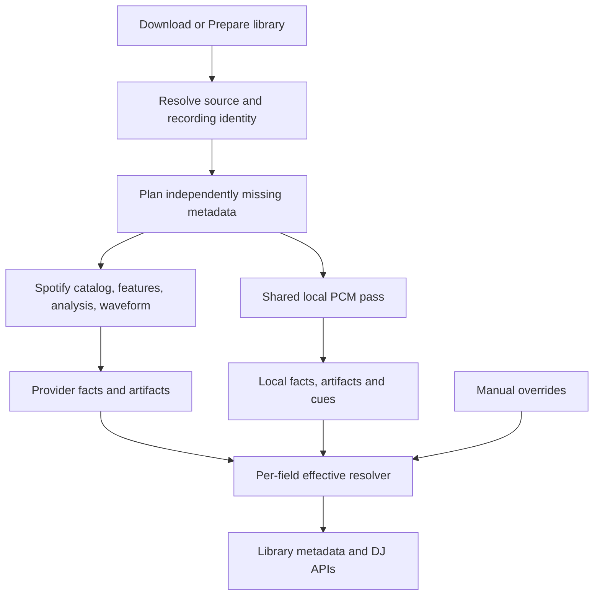

# Spotify metadata, waveforms, and local fallback implementation plan

**Status:** Proposed implementation; this document does not enable the features.

**Created:** 2026-10-04

**Objective:** Persist all available track-related Spotify information, expose its provenance, and supply local replacements for each audio-derived field when the provider cannot supply a usable value. Keep local DJ preparation working independently of Spotify.

**Research baseline:** [Verified waveform research](archive/research/SPOTIFY_WAVEFORM_RESEARCH.md), [BPM/key import](SPOTIFY_BPM_KEY_IMPORT.md), and [Web Player validation](SPOTIFY_WEBPLAYER_VALIDATION.md).

## 1. Required behavior and scope

1. Downloads capture catalog metadata and available audio features before completion and reconcile them into durable library storage after final file identity is known.
2. Existing tracks reuse a current Spotify recording link, or search using the existing title/artist/duration matcher. Strong download/manual identities retain precedence over automatic matches.
3. Fetch catalog, scalar audio features, detailed audio analysis, and three-band waveforms independently. A 404 or missing field in one response must not disable the other capabilities.
4. Persist every returned domain field from these supported resources, including fields that do not yet have a library column. Store typed projections for searching and bounded sanitized snapshots for additional fields.
5. Resolve audio metadata per field: locked manual value, then usable Spotify observation, then a qualified local replacement. Never replace a good Spotify key just because Spotify lacks time signature or waveform data.
6. Retain both local and Spotify observations. Effective values are a derived view; they must not destroy the alternative measurements.
7. Continue local energy, standards-based loudness, structure, and automatic DJ cue generation when those outputs are missing or stale. Complete Spotify BPM/key does not make DJ preparation complete.
8. Operate offline using current-source local measurements and any permitted retained provider observations. No credentials, no match, missing fields, provider failures, and cooldowns all have explicit fallback behavior.
9. Do not infer provider-specific facts such as Spotify IDs, popularity, follower counts, copyrights, or playlist membership from audio. File tags can supply local descriptive metadata; otherwise expose unknown or a dated cached provider fact.
10. Preserve manual locks, user cues, cue deletion suppressions, cue mode preferences, account isolation, and source-fingerprint checks.

“All available” means all returned metadata for the linked recordings and their related albums/artists, plus playlists/library items already requested by the user. It does not mean crawling Spotify's catalog, automatically harvesting unrelated account history, or inventing undocumented endpoints. New resources need their own verified adapter and field inventory.

## 2. What is verified, implemented, and still proposed

| Capability | Evidence | Current production support | Work required |
| --- | --- | --- | --- |
| Cookie-to-WebPlayer bearer token | Existing connected-session implementation and live probes | Yes | Reuse ownership, cancellation and renewal |
| Scalar `audio_features` | Successful live requests | BPM/key used; mode, loudness, meter and duration retained in reference observations | Persist/expose all returned feature fields and local alternatives |
| Detailed `audio_analysis` | Better Off Alone returned 200; another recording returned 404 | Adapter exists but normalizes to scalars | Preserve full validated detailed artifacts; independent failure handling |
| `THREEBAND_WAVEFORMS`, extension 237 | Two live recordings returned HTTP and entity status 200 | Research only | Protobuf adapter, storage, refresh, renderer |
| Catalog tracks/albums/artists/playlists | Existing catalog adapters | Transient models and limited metadata caches | ID-keyed full snapshots and relations |
| Local tempo/key/mode/energy/loudness/structure/cues | Existing shared PCM analysis | Yes | Preserve independent facts and schedule by missing capabilities |
| Local amplitude waveform | Existing decoder-backed waveform endpoint | Yes, separately cached | Bind cache to source; integrate generation with preparation |
| Local three-band waveform | Feasible DSP addition, not implemented | No | Frequency-band accumulator and versioned normalization |
| Local meter, detailed segmentation, perceptual scores | Requires additional estimators and validation | Incomplete or absent | Explicit implementation and qualification phases |

Two successful waveform tracks establish feasibility with the existing authentication method, not catalog-wide availability. Detailed-analysis availability is recording-specific in the observed evidence. Public schemas enumerate possible fields; they do not prove that our private route returns every field for every account.

## 3. Metadata inventory and fallback contract

Every entry must have independent presence, validity, freshness, source, endpoint/algorithm, units, and confidence where meaningful. Numeric zero and `false` are valid values, not missing-data sentinels.

### 3.1 Audio scalars

The [Spotify feature schema](https://developer.spotify.com/documentation/web-api/reference/get-audio-features) includes the following possible audio values. Confirm actual private-response presence with sanitized fixtures before advertising availability.

| Field | Store from Spotify | Local replacement | Required semantic distinction |
| --- | --- | --- | --- |
| Tempo/BPM | Fractional tempo; confidence only if supplied | Existing onset/tempo estimator | No fabricated provider confidence; scalar BPM alone does not establish sync phase |
| Key | Pitch class; `-1` becomes unknown | Existing chroma/key estimator | Store tonic separately from display notation |
| Mode | Major/minor; preserve mode confidence if supplied | Local key estimator's mode | Select compatible key/mode as a pair; do not combine unrelated estimates |
| Duration | Catalog milliseconds and analysis seconds with original units | Container/decoded frame duration | Playback and cue limits always use actual file duration |
| Loudness | Provider track-level dB value with metric identifier | Local loudness measurement and envelope | Spotify loudness and local BS.1770 integrated LUFS are separate metrics |
| Time signature | Beats per bar and confidence if supplied | New meter estimator | Integer 4 does not prove a denominator of 4; a default four-beat grid is not measured meter |
| Energy | Provider 0–1 score if returned | New qualified local energy score; keep existing 1–10 DJ energy | Never silently rescale 1–10 into a Spotify-equivalent score |
| Danceability | Provider score if returned | New rhythm/groove estimator or qualified local model | Local estimate, not reproduction of Spotify's proprietary scoring |
| Acousticness | Provider score if returned | Qualified acoustic/electronic classifier | Separate model/version/confidence |
| Instrumentalness | Provider score if returned | Qualified vocal-presence/instrumental classifier | Existing legacy boolean is not equivalent to a probability |
| Liveness | Provider score if returned | Qualified live-performance classifier | Do not identify live performances from title words alone |
| Speechiness | Provider score if returned | Qualified speech/music classifier | Speech proportion and provider speechiness are distinct definitions |
| Valence | Provider score if returned | Qualified mood/valence model | Subjective estimate; abstention is expected |

Store `analysis_url`, IDs, resource types, and URLs as metadata, not audio measurements. Capture any additional returned scalar under a namespaced field registry. Known field units/ranges are versioned; unknown fields remain discoverable in the stored snapshot until a reviewed mapping exists.

### 3.2 Detailed audio analysis

The [detailed-analysis schema](https://developer.spotify.com/documentation/web-api/reference/get-audio-analysis) describes interval arrays and analysis context. Preserve the complete returned domain object, including `meta`, `track`, bars, beats, tatums, sections and segments. Do not restrict storage to today's reduced Go wire model.

| Data | Required provider retention | Local replacement |
| --- | --- | --- |
| Analysis context | Returned analyzer version, processing/sample/channel information and other track/meta fields | Local analyzer versions, decoder/sample/channel/frame facts under local names |
| Beats | Start, duration, confidence | Extend local timing output to explicit qualified beat intervals |
| Bars/downbeats | Start, duration, confidence | Meter and downbeat inference; unknown when evidence is insufficient |
| Tatums | Start, duration, confidence | Qualified subdivision estimator; do not mechanically halve all beat intervals |
| Sections | Full returned section objects, including any tempo/key/meter/loudness values | Existing energy structure boundaries plus additional section estimators |
| Segments | Start/duration/confidence, loudness start/max/end/peak time, pitches, timbre, and other returned fields | Novelty segmentation, local loudness envelope, chroma and versioned spectral/timbre features |
| Confidence | Only actual provider confidence fields | Independently qualified local confidence |

Spotify sections are not guaranteed intro/drop/chorus labels. Local structure labels remain distinct. Local chroma can represent pitch-class strength, but local timbre vectors must not be presented as the same learned basis as Spotify's 12-component timbre representation.

An unavailable detailed array triggers fallback only for the affected capability. A failed detailed request must not erase a successful feature result or waveform.

### 3.3 Waveforms

Persist three explicitly named representations:

| Representation | Origin | Payload |
| --- | --- | --- |
| `spotify_three_band` | Extension 237 | Source sample rate, window milliseconds, low/mid/high int32 arrays |
| `local_three_band_estimate` | New local DSP | Three local band envelopes, units/normalization and algorithm version |
| `local_amplitude` | Existing local decoder | Normalized amplitude peaks, window/sample resolution |

Never store an amplitude-only array in a field advertised as three-band data. Preserve provider samples as returned; renderer normalization is a separate versioned transformation. Store local timing and provider timing separately and reject display alignment when the duration discrepancy exceeds the verified matching/alignment policy.

### 3.4 Catalog and related entities

Persist full returned objects and relations from the existing adapters, including available fields from the [track schema](https://developer.spotify.com/documentation/web-api/reference/get-track). Examples are an inventory, not a guarantee of private endpoint coverage:

| Resource | Fields and relations to retain | Offline/local behavior |
| --- | --- | --- |
| Track | ID/URI, title, ordered artist credits, album link, duration, explicit flag, external IDs such as ISRC when returned, URLs, disc/track numbers, popularity, markets/playability/restrictions, relinking, preview reference | Names/credits/numbers/duration/embedded identifiers from tags or current local catalog; provider-only facts unknown or cached |
| Album | ID/URI, title/type, artists, release date and precision, artwork, label, copyrights, genres/popularity if returned, total tracks and ordered track links | File tags/artwork can supply local descriptions; no invented provider label/rights/popularity |
| Artist | ID/URI, name, artwork, genres, followers/popularity when returned, related releases/top tracks where already fetched | Local artist description and tags; provider identity and social metrics stay provider-only |
| Playlist | ID/URI, name/description, owner, artwork, visibility, followers when returned, snapshot/version, ordered items, duplicate positions, added-at and item type/unavailable markers | Preserve last snapshot and distinguish local playlists; no invented Spotify ownership or membership |
| Saved-library relation | Account-scoped saved entity identity and timestamp when returned | Existing cached membership, labeled stale; no audio-derived membership |
| Other returned fields | Sanitized namespaced domain fields, original nesting and presence | Explicitly `provider_only` until a reviewed local counterpart exists |

For returned unavailable/local/podcast items, preserve positional placeholders and type information instead of silently shifting playlist order. Account-scoped data must not leak across account switches.

## 4. Proposed architecture



Introduce a capability registry instead of growing one success/failure flag:

```text
CapabilityDefinition:
  key, fieldGroup, semanticMetric, units, valueType
  spotifyResources, localEstimator, dependencies
  schemaVersion, estimatorVersion, validationPolicy
  requiredForPreparation, fallbackPolicy
```

Example keys: `tempo_bpm`, `key_mode`, `time_signature`, `provider_loudness_db`, `integrated_lufs`, `spotify_energy_score`, `local_energy_level`, `three_band_waveform`, `beat_intervals`, `dj_cue_candidates`.

The resolver may offer a common user-facing concept with alternatives, but it cannot pretend that differently defined metrics are interchangeable. For example, “Loudness” can contain Spotify dB and local LUFS, while playback normalization specifically consumes qualified local loudness.

## 5. Database design

### 5.1 Separate facts from effective projections

Keep `songs` as the canonical library entity and `track_external_identities` as the current-source recording link. Add additive migrations for these proposed tables:

| Table | Suggested key | Purpose |
| --- | --- | --- |
| `spotify_entity_snapshots` | Entity type, Spotify ID, resource, context key | Full sanitized catalog snapshot and retrieval metadata |
| `spotify_entity_relations` | Parent ID, relation kind, snapshot, position, context | Ordered artists, album tracks, playlist items and other returned relations |
| `spotify_audio_observations` | Track ID, resource, context | Provider scalar values and field presence independent of local results |
| `spotify_audio_artifacts` | Track ID, artifact kind, context, schema version | Detailed JSON and three-band protobuf/normalized samples |
| `track_metadata_observations` | Song ID, fingerprint, field key, source, algorithm | Local measurements and provider-to-source bindings; optional typed scalar indexes |
| `track_metadata_capability_status` | Song ID, fingerprint, capability, provider context | Pending/running/available/unavailable/failure/cooldown and retry state |
| `track_metadata_overrides` | Song ID, field key, source scope | Manual overrides for newly exposed fields; reuse current BPM/key overrides |

Use stable provider IDs for entity storage. Existing name-keyed album/artist caches remain compatibility presentation caches, not authoritative identity tables.

Each observation includes:

```text
value/value_json, metric, units, provider/source, endpoint
schema_version, adapter_revision or algorithm_version
retrieved_at or measured_at, expires_at, payload_hash
spotify_track_id, account_context/market when relevant
source_fingerprint for local facts and applied provider bindings
confidence (nullable), validation_state, availability_reason
```

A provider snapshot is keyed to a Spotify entity, not a local filename. Applying its audio facts to a song requires a live recording link bound to that song's fingerprint. Account-independent metadata may be deduplicated after its visibility/context semantics are verified. Default new private resources to account-scoped storage and request fencing.

### 5.2 Storage format and complete retention

1. Keep typed nullable scalars for frequently sorted fields. Preserve original units/precision in provider snapshots.
2. Store detailed arrays as compressed validated JSON and waveforms as compact protobuf or packed integer data with a decoded model version.
3. Persist all returned domain fields, including additional nested fields, in a sanitized bounded payload. Do not store HTTP envelopes, cookies, tokens, request headers or arbitrary diagnostic bodies. Explicitly sensitive-looking fields are redacted before persistence.
4. Additional fields are retained in a bounded `additional_metadata` section and reported by field path. Promote them into typed capabilities only after reviewing semantics and local feasibility.
5. Keep a last-good snapshot and separate last-attempt status. A failure never replaces a valid artifact with an empty blob.
6. Retain current state, not unlimited fetch history. Provider cache lifetime and durable imported recording facts have separate lifecycles. Account retirement invalidates private/session caches; downloaded facts follow the existing durable import policy.
7. Write related projections, artifact identities, and capability completion transactionally. Partial persistence must be resumable.

Initial configurable guardrails: scalar normalized JSON 64 KiB; catalog snapshot page 2 MiB; detailed JSON 8 MiB; waveform response 8 MiB; 20,000 intervals per timing array; 40,000 segments; 12 elements for known pitch/timbre vectors; 1,000,000 samples per band. Check compressed and decoded limits separately. Long-form content exceeding a limit gets an explicit status and local fallback, never silent truncation. Qualify limits against real short and long recordings before shipping.

### 5.3 Compatibility migration

- Backfill existing scalar reference observations into provider observations, retaining endpoint/expiry/provenance. Missing newly introduced fields remain null.
- Backfill trustworthy current local fields/artifacts without claiming that overwritten measurements can be recovered. Re-measure when independent local facts are absent.
- Keep `TrackAnalysis` as the existing BPM/key/status projection while the independent observation model becomes authoritative. `ApplySpotifyScalars` remains a compatibility writer until the new resolver is wired through all consumers.
- Migrate waveform cache entries only when their fingerprint can be verified. Otherwise leave them as legacy cache entries to regenerate; a song ID alone does not prove current bytes.
- Do not invalidate every local artifact for a provider schema change. Artifact versions and capability versions invalidate their own outputs.
- Migration tests must start from the existing production schema and preserve overrides, cues, download evidence, external links and existing analysis.

## 6. Spotify adapters and independent refresh

### 6.1 Features

Extend `backend/internal/spotify/analysis/models.go`, `client.go`, `normalize.go` and `validate.go` to preserve all returned feature fields. A successful response containing only an additional usable scalar is still worth retaining; remove the global requirement that every useful response must contain BPM or key.

Use pointer/presence types for every optional field. Score ranges, duration conversion, key/mode validity, and confidence ranges are checked field by field. An invalid optional field should not discard valid siblings unless the envelope/identity is invalid. Record rejected field paths with stable reason codes.

Keep the automatic feature path explicit. A detailed-analysis 404 does not silently substitute features inside the transport; the coordinator plans independent requests and combines their observations.

### 6.2 Detailed analysis

Add a full detailed payload model and artifact return type. Preserve all returned track/meta fields and complete section/segment objects, not merely their common interval subset. Validate IDs, finite values, temporal ordering and bounds, nullable confidence, known vector shapes, and maximum counts. Retain unknown domain fields through the bounded snapshot mechanism.

Use detailed scalars as an additional observation. Prefer `audio_features` for existing BPM/key display policy, then a usable detailed scalar if feature data is missing; retain disagreements rather than averaging them. A confidence field from detailed analysis must not be attached to a different feature observation.

### 6.3 Three-band waveform adapter

Implement a dedicated fixed-origin adapter under `backend/internal/spotify/waveform/` or `analysis/waveform.go`. Reuse the connected session token owner and shared outbound request policy.

```http
POST https://spclient.wg.spotify.com/extended-metadata/v0/extended-metadata
Content-Type: application/json
Accept: application/protobuf
```

```json
{"entityRequest":[{"entityUri":"spotify:track:<validated-id>","query":[{"extensionKind":237,"etag":""}]}]}
```

Decode the outer response, extension kind, per-entity status, identity, protobuf Any type, then waveform fields. HTTP 200 alone is insufficient: entity 404/451/errors and missing payload are separate failures. Require expected type URL, plausible positive sample rate/window, equal nonempty band counts, bounded arithmetic, and duration compatibility. Sample numeric interpretation and renderer scaling must be verified from the pinned source/fixtures before range normalization is shipped.

Handle protobuf unknown fields compatibly without assuming the current bundle hash is permanent. Pin the inspected contract revision as provenance. Ignore unknown wire fields in decoding while retaining only bounded, validated domain artifact bytes; do not dynamically execute provider code.

Start with one recording per request. Add batching/ETag revalidation only after the observed contract is verified in fixtures and a bounded live sample. A provider 304 requires a matching cached artifact; otherwise refetch without the ETag.

### 6.4 Catalog persistence

Add snapshot capture at existing catalog normalization boundaries. Do not reconstruct “complete” Spotify objects solely from reduced presentation structs. Normalize typed fields and preserve sanitized additional domain fields in the same transaction.

Fetch related album/artist entities once per context and freshness interval; deduplicate shared artists/albums across a playlist. Persist pagination checkpoints and playlist snapshot IDs. Resume safely without duplicating items or mixing two snapshots. Missing fields in a sparse search result must not erase fields from a richer current detail resource.

### 6.5 Failure, freshness and request policy

| Condition | Coordinator behavior |
| --- | --- |
| No session / disconnected | Use local and retained eligible data; no upstream requests |
| No accepted recording match | Use local audio metadata; retain search rejection reason |
| One field absent/null/invalid | Try its next eligible observation/local estimator |
| Detailed 404 | Mark detailed resource unavailable for that recording/context; continue features and waveform |
| Waveform entity unavailable | Local three-band, then amplitude fallback; keep good scalars |
| 401 | Existing one-renewal flow; repeated denial retires that session through its owner |
| 403 | Resource/context unavailable; local fallback; do not misclassify as missing authentication |
| 429 | Honor Retry-After through shared cooldown; stop affected background requests and continue local work |
| Timeout/network/5xx | Preserve last-good, use local, schedule bounded retry |
| Invalid envelope/wrong entity | Reject provider response without linking it to local bytes |
| File or account changes during request | Discard stale application result; never commit to the new source/account |

Use existing single-flight and concurrency gates. Start background provider transactions with concurrency 2, bounded by the existing account gate, and reserve capacity for interactive requests. Proposed budgets: 20 seconds per request and 45 seconds total provider work per track; cancellation and cooldown take precedence. Do not serialize four full timeout windows before local work can begin.

Initial retry policy: success freshness varies by resource; immutable recording analysis 30 days locally unless provider cache headers/context require shorter; dynamic catalog metrics 24 hours; 404 per recording/resource 24 hours; temporary failures exponential 1/5/30 minute delays with jitter; 429 uses the supplied delay. These are application defaults to qualify, not provider guarantees. Manual refresh may bypass a negative cache, never a live rate-limit cooldown.

## 7. Local replacement scanner

### 7.1 Extend the existing engine

Use the shared `analysis.DecoderRegistry` and source resolver in the durable analysis job. Do not add a second unmanaged scanner or place DSP inside file-tag extraction. Stream the audio once per source revision, feeding only required accumulators plus preparation outputs that are missing/stale.

```text
source resolution -> capability plan -> shared PCM stream
  -> onset/tempo/phase and meter
  -> chroma/key/mode
  -> loudness and energy envelopes
  -> amplitude and three-band waveform
  -> structure/segment features
  -> optional qualified classification models
  -> versioned observations/artifacts -> effective resolution -> cues
```

Spotify can prevent redundant scalar estimations, but not PCM processing required for DJ preparation. Onsets or local tempo hypotheses may still be needed to measure phase or meter even when effective BPM comes from Spotify. Reuse current artifacts rather than decoding again merely to refresh a provider field.

### 7.2 Existing replacements

- Tempo, key and major/minor mode: retain the current qualified estimators and confidence rules.
- Duration: use decoded frame counts and sample rate; verify container timing. Use actual file duration for cue bounds and waveform alignment.
- Loudness: keep existing BS.1770 integrated LUFS and true peak; add short-window/local segment envelope outputs where required. Expose metric names instead of substituting LUFS into a field called Spotify dB.
- DJ energy/structure/cues: keep the current algorithms and user-selected cue mode. Spotify energy scores and arrays are optional inputs to future suggestions, not permission to skip existing preparation.
- Amplitude waveform: move or reuse peak accumulation within the shared preparation pass and persist a current-source artifact.

### 7.3 New local three-band waveform

Implement a streaming band-energy accumulator with documented filter/STFT boundaries. Proposed starting bands: below 250 Hz, 250–4,000 Hz, above 4,000 Hz up to Nyquist; qualify these choices with the renderer and audio corpus. Compute 20 ms envelope samples, deterministic resampling, and bounded overview levels.

Specify whether values are RMS, peak or spectral power, how channels are combined, how silence/clipping are represented, and how display normalization works. Persist the algorithm and band definition. Do not label these bands as an exact reconstruction of Spotify's undisclosed analysis.

If this estimator is unavailable, use the existing amplitude waveform and return `representation=local_amplitude`. Never return a fabricated flat waveform for unavailable/corrupt audio.

### 7.4 Meter and detailed timing

Add a confidence-bearing meter/downbeat estimator using accent periodicity and candidate beat groupings. Evaluate at least 3-, 4-, 5- and 7-beat groupings and compound-meter ambiguity. Support changing meter/tempo through intervals where justified. Abstain on silence, irregular rhythm and weak evidence.

Meter needs a ground-truth corpus; fixed 4/4 assumptions in grid construction do not count as a fallback measurement. Expose beats-per-bar and any separately measured denominator/grouping, with confidence and intervals. Enable sync/downbeat alignment only through the existing qualified timing contract; provider interval presence alone does not authorize it.

Add local segment boundaries from spectral/onset novelty, local pitch-class vectors and a separately named spectral/timbre representation. Preserve local and provider timing arrays independently; no local output may occupy a `spotify_*` artifact kind.

### 7.5 Perceptual-score replacements

These are required work items for broad audio-field fallback, not capabilities already supplied by the current engine:

| Estimator | Proposed inputs | Qualification |
| --- | --- | --- |
| Energy score | Loudness, dynamics, onset density, spectral distribution | Held-out agreement and stability tests; separate from existing DJ energy level |
| Danceability | Beat regularity, rhythmic clarity, accent/groove features | Human/corpus labels; tempo alone is insufficient |
| Speechiness/instrumentalness | Speech/music and vocal activity models | Language/style diversity and sung-vocal vs speech distinctions |
| Acousticness | Acoustic/electronic timbral classifier | Instrument/style diversity; no title/genre shortcuts |
| Liveness | Audience/room/performance cues and classifier | Studio/live examples and abstention on ambiguous production |
| Valence | Qualified affect model | Subjective-label agreement and low-confidence abstention |

Run models locally, with pinned versions and documented model distribution/requirements. Select implementation dependencies after a focused benchmark of CPU, memory, model size and supported deployment platforms; do not promise a model package before that evaluation.

Provider scores and local estimates share a user-facing concept only with an explicit `local_estimate` source and semantic/model identifier. They need not numerically reproduce Spotify. Do not train on harvested Spotify responses as an automatic step; qualification uses an appropriate independently labeled corpus and user-authorized comparison fixtures.

If a qualified estimator cannot be shipped, report `local_estimator_unavailable` or `low_confidence`; leave the fallback coverage checklist incomplete. Never use random values, constant averages, genre lookups or an LLM-generated number to satisfy coverage.

## 8. Per-field selection and preparation state

### 8.1 Selection rules

For equivalent audio fields, resolve:

```text
current locked manual value
  > valid eligible Spotify feature value
  > valid eligible Spotify detailed value
  > qualified current local measurement/estimate
  > unknown
```

Presence of a provider zero score, key 0, mode 0 or explicit false must survive this selection. Provider confidences can be null. Couple key/mode and related vector/timing dependencies so incompatible pieces do not form a misleading result.

Provider facts with an expired freshness window are preserved. During temporary failure, immutable same-recording analysis may remain effective as `stale=true` under an explicit last-good policy; dynamic popularity/playability does not become “current” merely because it is cached. Account retirement and source mismatch always invalidate application eligibility. Offer local current alternatives independently.

For semantic alternatives such as loudness, energy and timbre, return both named metrics. Do not apply numeric precedence across different units/definitions. Local playback normalization and actual file timing are authoritative for their operational purposes.

### 8.2 Capability state and repair

Each capability has independent provider-attempt and local-attempt state. Use `pending`, `running`, `available`, `not_returned`, `unavailable`, `low_confidence`, `unsupported`, `failed`, `cooldown`, and `canceled` as appropriate, with stable reason codes.

Define preparation requirements by enabled product behavior. Example: BPM/key, local energy/loudness/structure, an available waveform representation, and cue candidates when the cue preference requires them. An optional provider-only popularity field cannot keep “Prepare library” permanently pending.

The missing-selection query must include missing/stale required capabilities, not merely absent scalar rows. The runner validates payload/source identity after SQL's coarse selection. A current required artifact missing from an otherwise complete scalar row is repair work. A known unsupported estimator is settled until its capability version changes; transient failure is retryable at `retry_at`, not on every scan.

Lease work by song/fingerprint/preparation generation. Heartbeat long tasks, release claims on cancellation, and publish capability completion only after its facts/artifact transaction succeeds. Overlapping jobs must not decode the same source twice.

## 9. Download and existing-library integration

### 9.1 Downloads

1. Retain full catalog details from the already resolved recording and related entities.
2. Fetch features, analysis and waveform within the independent request budget; metadata failure does not fail audio download.
3. Store durable provider evidence under the Spotify ID while download is in progress. Large artifacts are referenced by ID/hash, not duplicated in queue JSON.
4. Continue existing BPM/key file tags. Additional tag writing is a separate format-specific mapping: mode is represented through key; original catalog dates/credits can use standard tags. Do not write waveform arrays into tags or map Spotify loudness to ReplayGain.
5. Bind facts to final SHA-256/size/mtime after conversion/tagging. Reconcile them during library scanning as with existing Spotify download evidence.
6. Queue local preparation for required artifacts/cues. Queue cleanup must not delete imported facts or their live references.

### 9.2 Existing tracks

Reuse `spotify_match.go` and its release ranking. Preserve recording ID, match strategy, selected candidate, duration difference and link origin in provenance. Retain version checks and manual/download identity rules. Apply request completion only if source fingerprint and account generation still match.

Only unmatched tracks search again when their negative-match state expires or metadata changes. Already linked recordings must not incur a new search on every capability refresh. Downloaded songs should be linked from durable evidence before invoking title search.

## 10. APIs and user interface

Extend `services/trackAnalysisContracts.ts` and the existing analysis routes additively. Proposed response:

```json
{
  "fields": {
    "tempo_bpm": {
      "value": 136.955,
      "units": "bpm",
      "source": "spotify",
      "endpoint": "audio_features",
      "confidence": null,
      "stale": false,
      "fallbackReason": null
    },
    "time_signature": {
      "value": 4,
      "units": "beats_per_bar",
      "source": "local_measured",
      "algorithm": "meter-v1",
      "confidence": 0.88,
      "stale": false,
      "fallbackReason": "spotify_field_missing"
    }
  },
  "artifactAvailability": {
    "waveform": "spotify_three_band",
    "detailedAnalysis": "available",
    "djCues": "available"
  }
}
```

This is an illustrative future contract, not data produced by the current meter engine.

Provide bounded artifact retrieval endpoints for waveform, detailed analysis and local alternatives. Keep arrays out of library list rows and use availability summaries for sorting/badges. Waveform consumers request resolution/range explicitly. Extend the current `/api/dj/waveform/{id}` without breaking amplitude-only consumers; explicit representation negotiation or a new versioned route is preferable to silently changing `peaks`.

Track details show effective values, local/provider alternatives, units, freshness and source. Show “Local estimate” for learned/proxy fields and “Unknown” when no qualified value exists. Expose provider-specific facts in a Spotify metadata section. Do not make a user decipher internal endpoint names to use the library.

Add capability filters for missing analysis and optional metadata refresh, preserving existing **Prepare library** semantics and cue settings. Spotify refresh can improve display metadata without rewriting user hot cues or invalidating usable local playback preparation.

## 11. Logging and diagnostics

Continue `scan.log` beside `viib.log`. Record one resource attempt and one per-field resolution decision where relevant, plus an aggregate per track/job. Examples:

```text
spotify_resource song_id="..." resource="three_band_waveform" http_status=200 entity_status=200 samples_per_band=10745 window_ms=20
metadata_field song_id="..." field="time_signature" source="local_measured" reason="spotify_field_missing" confidence=0.88
metadata_field song_id="..." field="popularity" source="unknown" reason="provider_only_unavailable"
local_artifacts song_id="..." energy=true loudness=true structure=true waveform=true cue_candidates=true auto_cue_mode="fill-empty"
```

Log `not_returned`, `invalid_field`, `no_match`, HTTP/field-specific 404, entity denial, rate limiting and retry delay separately. Count Spotify/local/unknown/stale decisions by capability. Summaries must distinguish successful scalar retrieval from full preparation completion. Never log credentials, raw provider bodies, arbitrary errors containing headers, or private account data unrelated to the operation.

## 12. Implementation phases and reviewable deliverables

| Phase | Deliverables | Exit criteria |
| --- | --- | --- |
| 1: Contract inventory | Sanitized real response field inventories; capability registry; semantic/fallback matrix | Every returned field is classified; verified vs optional fields explicit |
| 2: Durable storage | Additive schemas, repositories, catalog relations, bounded snapshots, migration/backfill | Existing database upgrades without loss; unknown domain fields retained safely |
| 3: Provider adapters | Complete feature model, detailed artifact persistence, extension 237 adapter | Independent resource statuses; mixed 200/404 fixtures and live sample pass |
| 4: Per-field resolver | Source-separated observations, precedence, compatibility projections | Partial responses preserve good siblings; manual locks and source/account fencing pass |
| 5: Core local fallback | Shared preparation planning, waveform accumulation, energy/loudness/structure/cues repair | Offline core preparation succeeds; one PCM decode per missing source revision |
| 6: Expanded DSP | Three-band waveform, meter/downbeats/subdivisions, segments/chroma/local timbre | Corpus-qualified output and explicit abstention; no implicit 4/4 claims |
| 7: Perceptual estimators | Local score/classification models and calibration | Per-field quality/platform/performance criteria met or coverage explicitly incomplete |
| 8: Product integration | Metadata detail/list summaries, artifact APIs, waveform renderer, logs | Existing API clients remain valid; small payloads and clear sources |
| 9: Library rollout | Missing-capability backfill, resumable jobs, bounded refresh/retention | Previously scanned library repairs without repeat decoding or provider request storms |

Phases 1–5 provide immediate useful metadata capture and fallback using existing DSP. The full request is not complete until phases 6–7 address remaining audio-derived replacements or document demonstrated technical limits. Provider-only fields use cache/tags/unknown behavior rather than impossible audio reconstruction.

## 13. Repository edit map

| Area | Existing files/modules | Proposed changes |
| --- | --- | --- |
| Spotify wire/normalization | `backend/internal/spotify/analysis/{models,client,normalize,validate}.go` | Full nullable features and detailed artifact return types |
| Authentication | `backend/internal/spotify/auth/`, `backend/internal/api/spotify_session.go` | Reuse existing owners; no new credential flow |
| Refresh/cache | `backend/internal/spotify/refresh/`, `backend/internal/api/spotify_analysis.go` | Independent resource capabilities and last-good state |
| Feature application/matching | `backend/internal/api/spotify_features.go`, `spotify_match.go`, `backend/internal/db/spotify_scalars.go` | Metadata bundle planner and per-field compatibility projection |
| Catalog | `backend/internal/spotify/catalog/` | Snapshot capture and field-complete entity projections |
| Provider persistence | `backend/internal/db/external_track_analysis_{schema,repository}.go` | Separate scalar/catalog/artifact repositories and migrations |
| Local runner | `backend/internal/analysis/track/{runner,track,scan_log}.go` | Capability scheduling, independent local facts, shared-pass accumulators |
| Local DSP | `backend/internal/analysis/{tempo,key,beatgrid,features}/`, `waveform.go` | Reuse core; add meter, multiband, segmentation and qualified models |
| Durable selection/jobs | `backend/internal/db/track_analysis_selection.go`, `backend/internal/api/v2_jobs_analysis.go` | Missing capabilities, retry eligibility, progress and leases |
| File scanning/downloads | `backend/internal/scanner/`, `backend/internal/spotify/downloader.go`, `backend/internal/api/download_manager.go` | Durable provider facts bound to final source; queue local preparation |
| Waveform serving | `backend/internal/api/dj_waveform.go`, local cache repository | Representation-aware artifact retrieval and fingerprint validity |
| Frontend | `services/trackAnalysisContracts.ts`, `services/api.ts`, `lib/clientWaveform.ts`, DJ waveform components | Provenance/units, artifact availability and three-band rendering |

Proposed new module/table names are design choices. Confirm actual ownership during implementation instead of creating parallel repositories that duplicate existing functionality.

## 14. Verification plan

### Parser and provider tests

- Every nullable scalar, zero/false handling, range/finite validation, units and missing vs invalid states.
- Successful scalar-only, additional-score-only and detailed-only responses; mismatched entity ID rejection.
- Detailed arrays round-trip without losing section/segment fields or metadata. Malformed optional siblings do not erase unrelated valid facts.
- Waveform protobuf fixtures: known Any type, unknown fields, truncated wire values, unequal arrays, extreme count/window/rate, nested entity errors under HTTP 200, and ETag 304 with/without cache.
- Features 200 + analysis 404 + waveform 200; waveform failure + valid key; one score missing + all other fields retained.
- 401 renewal, 403, 404, 429/shared cooldown, cancellation, timeout, account-switch fencing and no credential leakage.

### Database and migration tests

- Existing real schema fixture upgrade and rollback-on-error.
- Provider/local coexistence, typed projections plus additional metadata, idempotent relation writes and duplicate playlist positions.
- Last-good retention, resource-specific freshness, source/identity rebinding and no account mixing.
- Queue cleanup preserves imported evidence; failed/incomplete persistence remains repairable.
- Legacy waveform cache cannot claim a new fingerprint without verification.

### Local and orchestration tests

- Complete Spotify scalars still yield missing energy/loudness/structure/waveform/cues.
- No credentials and total Spotify failure still run all enabled local capabilities.
- Missing meter/key/waveform individually triggers only relevant estimators; already current artifacts are reused.
- Manual BPM/key/new-field locks, manual hot cues and deletion suppressions survive backfill.
- Same-fingerprint retained Spotify facts survive local artifact repair when refresh fails.
- Silence/corrupt audio/unsupported codec/short files/variable rhythm result in explicit unknown/failure, not fabricated values.
- A resumed or overlapping job does not duplicate decode or publish stale results.
- Measured meter tests cover non-four-beat material; uncertain meter never becomes confident 4/4.
- Qualified perceptual models use held-out labels, uncertainty tests and deterministic versioned outputs.

### Performance and live qualification

Measure one-track and 105-track preparation with fresh provider caches, warm caches and offline mode. Record decode count, wall time, peak RSS, provider requests, database/artifact sizes and UI payload size. Set thresholds from the current local preparation baseline; do not accept unbounded memory for waveforms/models or one request per field when one resource supplies many fields.

Use the two verified recordings for bounded live regression: waveform succeeds independently of detailed 404, and Better Off Alone returns detailed intervals. Do not log or commit credentials/live raw account payloads. Live tests remain opt-in and do not replace deterministic offline fixtures.

## 15. Acceptance checklist

- [ ] All returned metadata from supported track-related resources is durably captured, typed or discoverable in sanitized snapshots.
- [ ] Mode, loudness, meter and duration are exposed with original units and provenance.
- [ ] Returned score fields are retained without claiming unverified endpoint coverage.
- [ ] Detailed timing, section, segment, pitch and timbre information survives persistence.
- [ ] Spotify three-band waveforms are retrievable, cached, validated and displayable.
- [ ] Every audio-derived field has an implemented qualified local replacement or an explicit documented unsupported/low-confidence state; coverage gaps are visible.
- [ ] Provider-only catalog facts use cached/tagged/unknown behavior and are never fabricated by local audio analysis.
- [ ] Spotify-first per-field precedence and manual locks work without destroying local measurements.
- [ ] Energy, loudness, structure and DJ cue preparation still run or reuse current local artifacts.
- [ ] Source changes, account switches, partial responses, provider 404s and cooldowns are handled independently.
- [ ] Missing-capability scans repair existing tracks and settle unsupported fields without endless rescans.
- [ ] Migration, parser, orchestration, API compatibility, UI and performance checks pass.

## 16. Decisions to qualify during implementation

1. Actual private-route coverage for each optional score/catalog field; public schema presence is not enough.
2. Waveform sample scaling, bandwidth boundaries and renderer color interpretation from provider evidence.
3. Model package/runtime choices and deployment support for local perceptual estimators.
4. Field-specific freshness, duration-alignment tolerance and score confidence thresholds on the target corpus.
5. Whether current-source local beat phase plus provider BPM can qualify sync under existing timing rules; until separately validated, preserve current restrictions.
6. Long-form audio limits and whether very large artifacts need chunked storage beyond the initial caps.

These are engineering qualification steps, not reasons to delay the independently verified storage, waveform, and core local-fallback phases.
