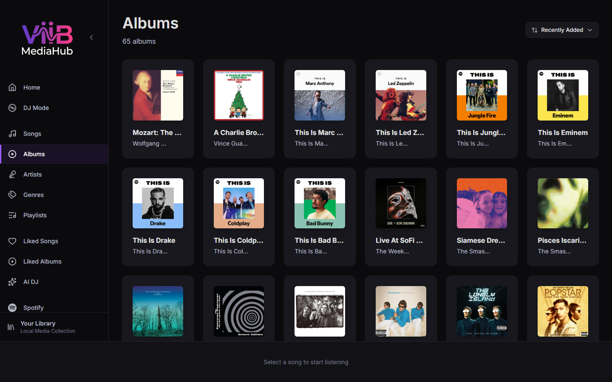

# Albums

The Albums page groups the canonical ViiB song catalog by album. Albums can therefore contain local filesystem tracks or synchronized Plex music tracks without requiring separate Plex album screens.

---

## Layout

Albums are displayed in a responsive grid. Each card shows available artwork, album title, artist, and track information.

Artwork can come from ViiB's local cache or, for Plex tracks, through ViiB's authenticated backend cover proxy. Plex credentials are not embedded in browser artwork URLs.

---

## Album Detail

Opening an album shows its catalog tracks with the normal ViiB actions:

- Play Album
- Shuffle
- queue controls
- per-track context menus
- like/unlike controls
- navigation to artists

Local and Plex tracks use the same interactions. If a Plex source is offline, album metadata can remain visible from the cached ViiB catalog even though remote playback is temporarily unavailable.

---

## Album identity

Album grouping uses ViiB catalog metadata, including album title and album-artist identity where available. Plex synchronization maps PMS album and album-artist metadata into these existing fields rather than creating a separate Plex album model.

---

## Metadata enrichment and edits

ViiB can enrich catalog metadata through configured metadata/AI services. Metadata changes in the ViiB database are local ViiB state.

For Plex-backed tracks, ViiB does **not** write album metadata changes back to Plex. A later authoritative Plex synchronization can refresh synchronized metadata from PMS.

---

## Album likes

Album likes are stored by ViiB. They are not pushed to Plex or Spotify. Liked albums appear in [Liked Songs & Albums](liked.md).
