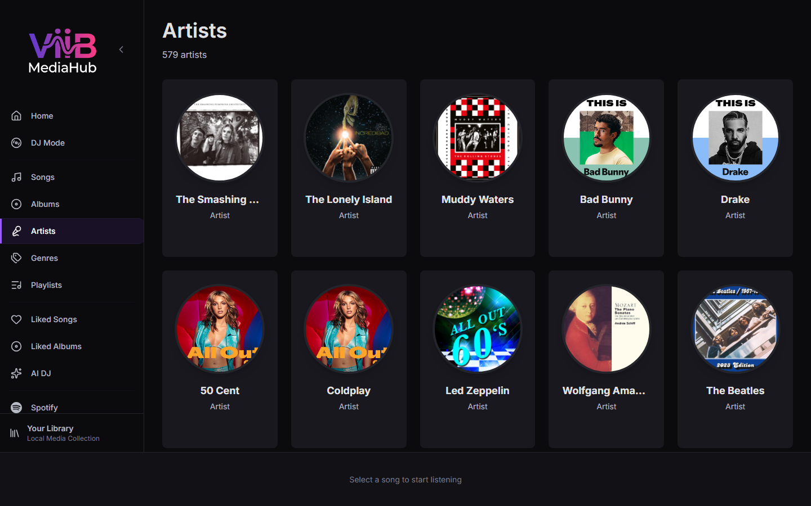

# Artists

The Artists page lists every distinct artist in your library with browsable discography pages.

---

## Layout

Artists are displayed in a responsive card grid, each showing:
- Artist image or generated color gradient
- Artist name
- Number of tracks

---

## Artist Detail

Clicking an artist card opens the **Artist Detail** page, which shows:

- Artist header image and name
- Total tracks and albums count
- **Albums** section: all albums by this artist with cover art
- **All Tracks** section: every track by this artist
- Play All / Shuffle controls

### Navigating from Artist Detail

- Click an album to open [Album Detail](albums.md)
- Click a track to play it immediately

---

## Metadata

If the configured AI provider or Last.FM integration is enabled, artist metadata (images, biography hints) can be enriched during background processing. See [Settings → Library Intelligence](settings.md#library-intelligence).
