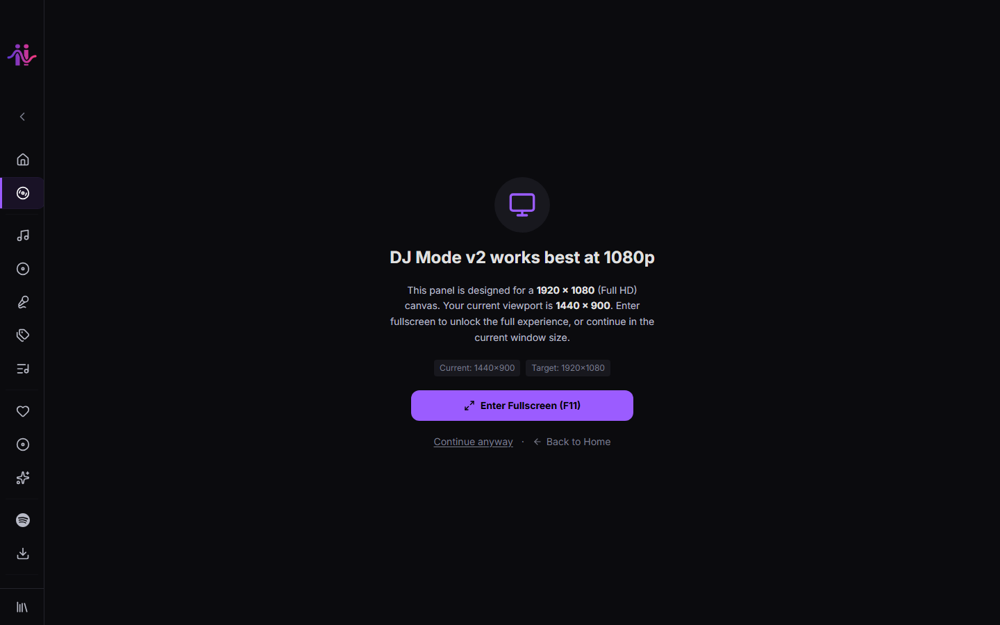

# DJ Mode



DJ Mode is a full two-deck DJ interface built into ViiB MediaHub. It is inspired by professional DJ software and provides hardware-grade tools for live mixing.

> DJ Mode requires a minimum window width to display correctly. A warning is shown if the window is too narrow. On mobile, DJ Mode is not supported.

---

## Layout

```
┌─────────────────────────────────────────────────────────────────────┐
│  TOP BAR: Tabs · Record button · Track info · Layout selector       │
├─────────────────────────────────────────────────────────────────────┤
│  DUAL WAVEFORM: Overview waveform + zoomed main waveform            │
│  (WebGL-accelerated, frequency-colored)                             │
├──────────────────┬──────────────────────────────┬───────────────────┤
│  DECK A          │       MIXER STRIP             │  DECK B           │
│  Jog Wheel       │  Ch A fader  Crossfader  Ch B │  Jog Wheel        │
│  Transport       │  EQ: Hi/Mid/Low               │  Transport        │
│  Loop section    │  Master knob                  │  Loop section     │
│  Hot Cues        │  VU meters                    │  Hot Cues         │
│  Beat Jump       │  Headphone mix                │  Beat Jump        │
│  FX section      │                               │  FX section       │
│  Nudge buttons   │                               │  Nudge buttons    │
│  Tempo slider    │                               │  Tempo slider     │
├──────────────────┴──────────────────────────────┴───────────────────┤
│  LIBRARY BROWSER: Search + track list with BPM/key info             │
└─────────────────────────────────────────────────────────────────────┘
```

---

## Decks

Each deck (A and B) is independent and provides:

### Jog Wheel
- Simulates a vinyl platter.
- **Click + drag**: scratch (vinyl simulation).
- **Rim drag**: nudge pitch up/down.
- Rotating animation during playback.

### Transport Controls
- **Play/Pause** — toggle playback.
- **Cue** — sets or jumps to the cue point.
- **Sync** — synchronize this deck's BPM to the other deck.

### Tempo Slider
- Adjusts playback speed (pitch/BPM).
- Range configurable (±8%, ±16%, ±50%).
- BPM badge shows the current BPM after tempo adjustment.

### Loop Section
- Set a loop in/out point.
- Loop length presets (1, 2, 4, 8 bars).
- Loop active indicator.

### Hot Cue Pads
- 8 hot cue buttons per deck.
- Click to set a cue at the current position (when empty).
- Click to jump to cue (when set).
- Right-click to delete a cue.
- Color-coded by cue index.

### Beat Jump
- Jump forward or backward by a set number of beats (1, 2, 4, 8, 16, 32).

### FX Section
- Three FX slots per deck.
- Available effects vary by configuration.
- Each slot has a wet/dry knob and on/off toggle.

### Nudge Buttons
- Fine-grained pitch nudge forward/backward for manual beat alignment.

### Deck Status Bar
- Current time position, remaining time, loop status.

### Horizontal VU Meter
- Shows the signal level of the deck's audio output.

---

## Mixer Strip

The central mixer strip controls the blend between the two decks.

### Channel Strips (A and B)
- **Volume fader** — individual channel level.
- **3-band EQ**: High, Mid, Low — cut/boost per channel.

### Crossfader
- Horizontal slider blending Deck A (left) and Deck B (right).

### Master Knob
- Controls the master output volume.

### VU Meter (Stereo)
- Dual stereo VU meters for visual level monitoring.

### Headphone Mix
- Split-cue mix knob: blend between the cued deck and the master output in your headphones.
- Cue buttons to select which deck is cued to headphones.

---

## Waveforms

### Dual Waveform Display
- Top strip: overview waveform showing the entire track.
- Bottom strip: zoomed waveform centered on the current position.
- Frequency-colored bars (bass = red, mids = green, highs = blue).
- Beat grid markers.
- Loop region highlighted.
- Hot cue markers.
- WebGL-accelerated rendering for smooth 60fps display.

### View Modes
Switch between waveform views using the top bar:
- **Timeline** — standard waveform view
- **Scope** — oscilloscope/Lissajous stereo display
- **Racks** — channel strip racks layout

---

## Sampler Pads

- 16 sampler pads loaded with short audio clips.
- Click a pad to trigger a one-shot sample.
- Pads can be loaded from your library.
- Volume and pitch controls per pad.

---

## Beat Grid Edit

Fine-tune the detected beat grid when auto-detection is off:
- Set the downbeat manually.
- Adjust BPM with fine controls.
- Save the corrected beat grid to the database.

---

## MIDI Mapping

DJ Mode supports MIDI controller input.

1. Click **MIDI** in the top bar to open the MIDI mapping panel.
2. Enable MIDI in the panel.
3. Click any control (fader, knob, button) and move the corresponding control on your MIDI device to assign it.
4. Mappings are saved and restored across sessions.

Supported MIDI message types: CC (continuous controller), Note On, Pitch Bend.

---

## Audio Setup

Click **Audio Setup** in the top bar to configure:
- **Main Output** — the primary audio device (speakers / PA system)
- **Headphone Output** — a secondary output for cueing in headphones

Separate device routing uses the Web Audio API's `setSinkId`. Devices appear after granting audio permission.

---

## Recording

Click **Record** in the top bar to start recording the master mix output to a file. Click again to stop and save.

---

## Keyboard Shortcuts (DJ Mode)

| Key | Action |
|---|---|
| Space | Play/Pause active deck |
| Shift + Space | Play/Pause the other deck |
| See [full shortcut list](keyboard-shortcuts.md) | — |

---

## Library Browser

The bottom library browser lets you search and load tracks without leaving DJ Mode:
- Search field for quick filtering
- Track list with BPM, key, and duration columns
- Double-click a track to load it onto the focused deck
- Drag a track onto a deck waveform to load it

---

## Requirements

- A modern browser or WebView2 runtime (included in the desktop app).
- For multi-device audio routing: a system with multiple audio output devices or a virtual audio cable.
- For MIDI: a class-compliant USB MIDI controller (no drivers needed on Windows/macOS).
