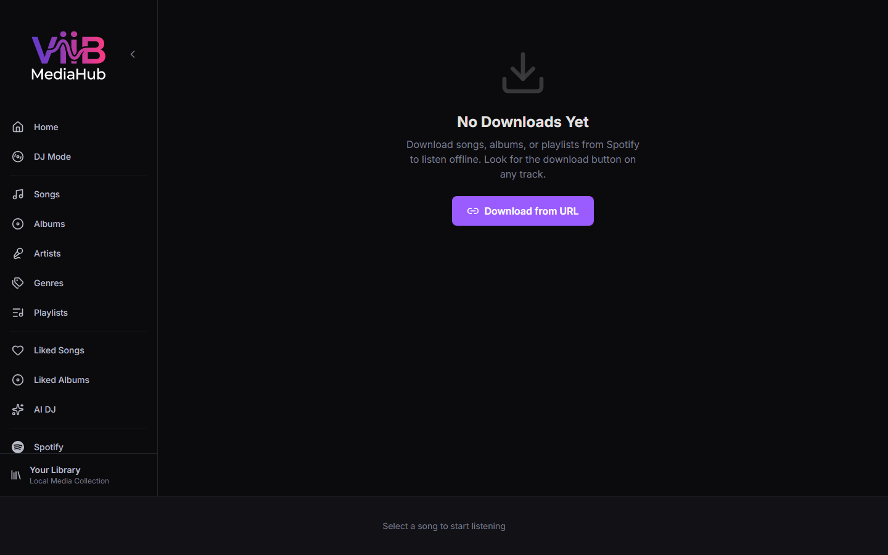

# Downloads

The Downloads page manages the Spotify download queue and shows real-time progress for each download.

---

## Accessing Downloads

Click **Downloads** in the sidebar.

---

## How Downloads Work

When you queue a Spotify track, album, or playlist for download:

1. The backend places an entry in the download queue (stored in SQLite).
2. `librespot-go` streams and saves the audio to the configured download folder.
3. Files are initially saved in **OGG Vorbis** format. Optional automatic conversion can then produce a 320 kbps MP3 and remove the Ogg file only after conversion succeeds.
4. The [Downloads](downloads.md) page shows live progress via SSE (Server-Sent Events).
5. A later library scan—manual or triggered by the configured quick-scan threshold—indexes the new files.

---

## Download Statuses

| Status | Meaning |
|---|---|
| Queued | Waiting for a download worker slot |
| Downloading | Actively downloading; progress bar shown |
| Converting | Ogg download is being converted to MP3 |
| Completed | File saved successfully |
| Failed | Download encountered an error |
| Auth Required | Your Spotify session expired; re-authentication needed |

---

## Filters

Use the filter bar to view a subset of downloads:

| Filter | Shows |
|---|---|
| All | Every download entry |
| Active | Queued + Downloading + Converting |
| Completed | Successfully downloaded |
| Failed | Errored downloads |

---

## Actions

| Action | Description |
|---|---|
| Retry | Requeue a failed download |
| Clear Completed | Remove all completed entries from the list |
| Clear All | Remove all entries (does not delete downloaded files) |

---

## Direct URL Download

Click **Direct Download** (link icon) to enter a Spotify track URL and queue it directly without browsing the Spotify page.

---

## Auth Expiry

If your Spotify session expires mid-queue, downloads stop and the page shows an **Auth Required** banner. Click the banner to navigate to the [Spotify](spotify.md) page and re-authenticate.

---

## Configuration

The download destination, concurrent downloads, automatic post-download scans, and Ogg-to-MP3 conversion settings are in [Settings → Integrations & Spotify → Downloads & Conversion](settings.md#integrations--spotify). Automatic post-download scans are threshold-controlled; they are not unconditional.
