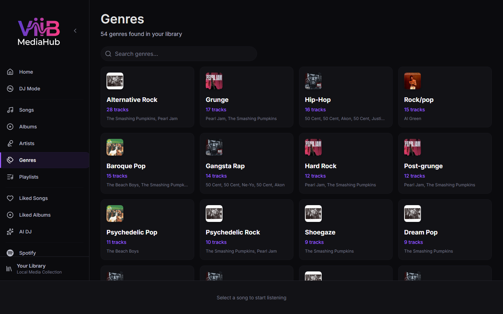

# Genres

The Genres page organizes the canonical ViiB catalog by genre metadata. Local filesystem tracks and synchronized Plex music tracks can appear together in the same genre views.

---

## Layout

Genres are shown as a card grid with the genre name and catalog track count. Opening a genre displays matching tracks with normal ViiB playback, queue, playlist, and context-menu actions.

---

## Genre metadata sources

Genre values can enter the ViiB catalog through several paths:

1. **Local file metadata** — tags extracted from scanned local audio files.
2. **Plex metadata** — genre tags returned by PMS and mapped during a successful Plex library synchronization.
3. **ViiB enrichment** — configured AI/metadata services can populate or improve genre metadata stored in ViiB.

The Genres page consumes the resulting ViiB catalog metadata rather than querying Plex independently.

---

## Plex behavior

Plex genre metadata is cached with the synchronized track catalog. A temporary PMS outage therefore does not erase existing genre groupings. A later successful authoritative Plex synchronization can update genre values when PMS metadata changes.

ViiB-side genre enrichment is not silently written back to Plex.

---

## Genre Enrichment

Configure and run enrichment from [Settings → Library Intelligence](settings.md#library-intelligence).

Enrichment changes ViiB catalog metadata used by Genre browsing, Smart Mixes, AI DJ, and statistics. It does not modify local source-file tags or PMS metadata unless a future explicitly supported source-writeback feature is introduced.
