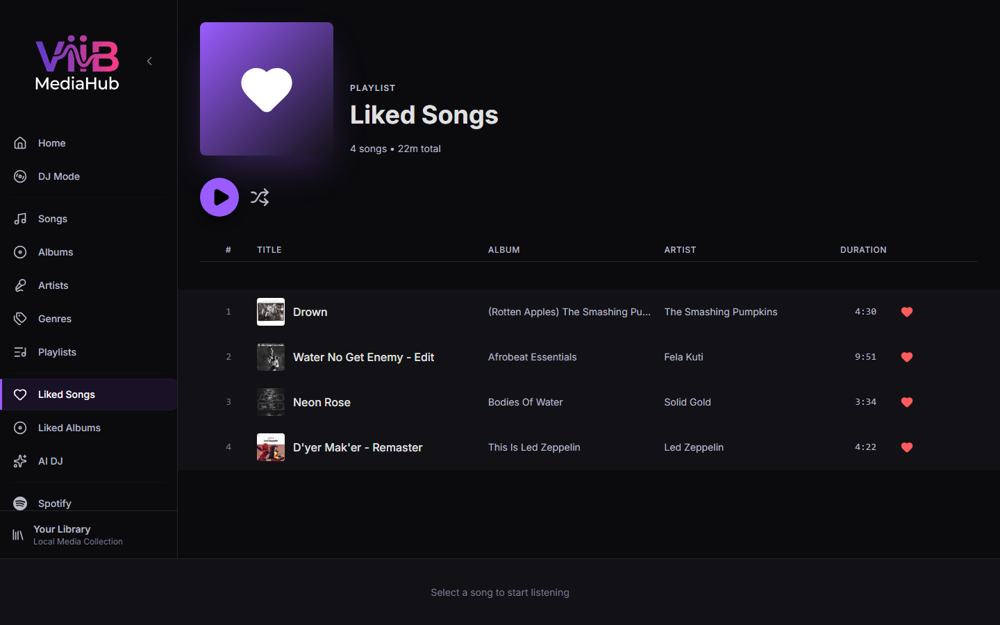
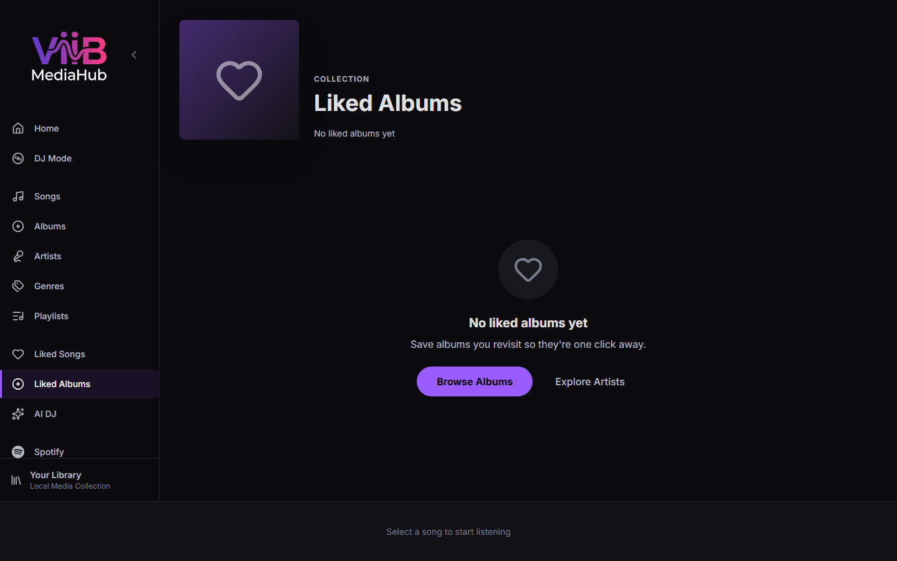

# Liked Songs & Albums

ViiB MediaHub lets you like individual tracks and whole albums for quick access later.

---

## Liked Songs

### Accessing Liked Songs

Click **Liked Songs** in the sidebar.

### Features

- All tracks you have liked, sorted by when they were liked (most recent first)
- **Play All** and **Shuffle All** controls
- Like/unlike toggle on each row
- Context menu per track (same as [Songs](songs.md))

### Liking a Track

Click the **heart icon** ( ♡ ) on any track row anywhere in the app. The heart fills to indicate the track is liked. Click again to unlike.

---

## Liked Albums

### Accessing Liked Albums

Click **Liked Albums** in the sidebar.

### Features

- All albums you have liked, displayed as a card grid
- Click an album card to open [Album Detail](albums.md)
- Unlike an album by clicking the filled heart on the card

### Liking an Album

Click the **heart icon** on an album card in the [Albums](albums.md) grid, or on the album detail header.

---

## Persistence

Likes are stored in the SQLite database (`songs.liked` and `album_metadata.liked` columns) and survive app restarts. They are not synced to Spotify or any external service.
