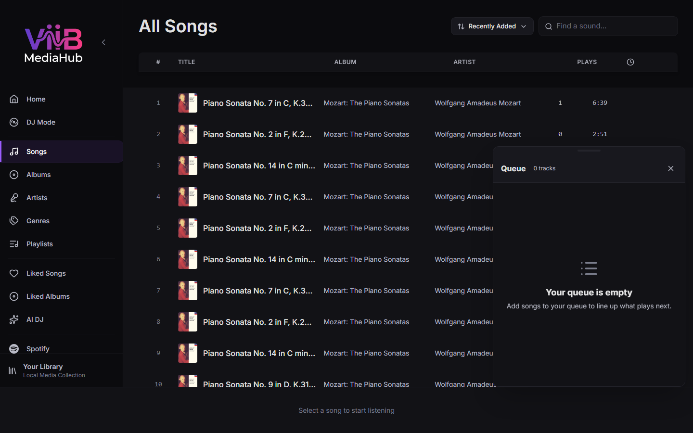
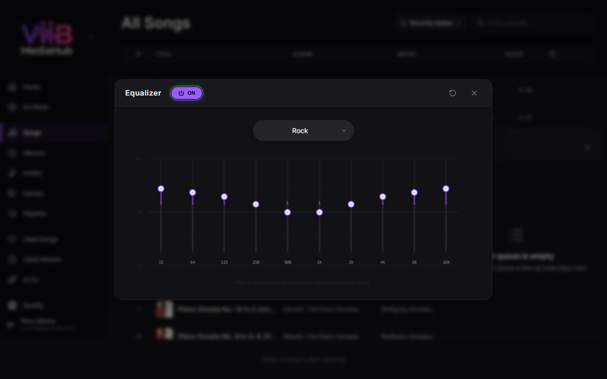

# Player





The Player bar is persistent at the bottom of ViiB and is the playback surface for normal catalog tracks regardless of whether they originate from a local file or a synchronized Plex music library. Spotify streaming uses the same visible player controls but a separate Spotify streaming route.

---

## Player Bar

The player shows artwork, title, artist/album, previous/play-next controls, progress, volume, queue, EQ, shuffle/repeat, and Now Playing access. Secondary controls collapse on narrow layouts.

### Core controls

| Control | Description |
|---|---|
| Previous | Previous queued track, or restart the current track when appropriate |
| Play/Pause | Toggle playback |
| Next | Skip to the next queued track |
| Shuffle | Toggle shuffled queue behavior |
| Repeat | Cycle Off → Repeat All → Repeat One |

---

## Skinny player

Use the skinny-player control in the desktop player bar to reduce ViiB to an unobtrusive strip with album art, track information, transport controls, seek progress, and volume. In the native desktop app, the window resizes to this compact layout and can be pinned with the Always on Top control. Leaving skinny mode restores the previous window size and releases the pin.

---

## Seeking and media URLs

The frontend uses stable ViiB-controlled playback URLs.

For local and Plex catalog tracks:

```text
/api/audio/{songId}
```

For a local track, the Go backend serves the configured filesystem media. For a Plex track, the same route resolves the stored PMS media-part identity, attaches Plex authentication on the backend, and streams the remote audio to the player.

Plex playback supports HTTP byte-range forwarding for normal seeking. The proxy preserves relevant `206 Partial Content`, `Content-Range`, `Content-Length`, `Accept-Ranges`, and content-type headers. Valid `416 Range Not Satisfiable` responses are also preserved so the player receives correct range semantics.

Plex access tokens are never placed in the browser-visible audio URL.

---

## Artwork

The current track's album artwork is shown in the player and Now Playing views. Local artwork is served from ViiB's local artwork path/cache. Authenticated Plex artwork is proxied through the existing backend cover route so the browser does not need a Plex token.

---

## Queue

The queue is source-transparent. Local and Plex tracks can be mixed in the same queue and use the same operations:

- Play Next
- Add to Queue
- drag/reorder
- remove from queue
- jump to current
- clear queue

If PMS becomes unavailable while a Plex item is queued, the item remains in the queue/catalog and playback reports source unavailability rather than deleting the track.

---

## Equalizer and visualizer

The player uses the Web Audio stack for EQ/visualization where supported by the active browser/WebView.

The equalizer provides 10 frequency bands from 32 Hz through 16 kHz, per-band gain, presets, enable/bypass, and reset-to-flat behavior.

Visualizer availability depends on the active mode and platform. Configure audio/visualizer behavior in [Settings](settings.md#audio).

---

## Now Playing

Open Now Playing from the artwork/expand control. The expanded view uses the same source-transparent song object and playback URL as the player bar and includes large artwork, metadata, playback controls, seek, visualizer, and like controls.

There is no Plex-specific Now Playing screen.

---

## Spotify streaming

Spotify remains a separate remote streaming integration. Spotify streamed tracks use the Spotify streaming backend path rather than becoming normal Plex/local catalog media. Player controls such as play/pause, seek, queue, and volume remain consistent where supported.

---

## Sleep Timer

Use the sleep-timer control to stop playback after a selected duration or supported completion condition. Optional fade behavior is applied through the normal player state and therefore does not depend on whether the current ViiB catalog track is local or Plex-hosted.

---

## Media Session / OS Integration

ViiB registers current playback metadata with the browser/WebView media-session integration where available. Track title, artist, artwork, and transport controls can therefore appear in OS media surfaces and compatible headset controls.
