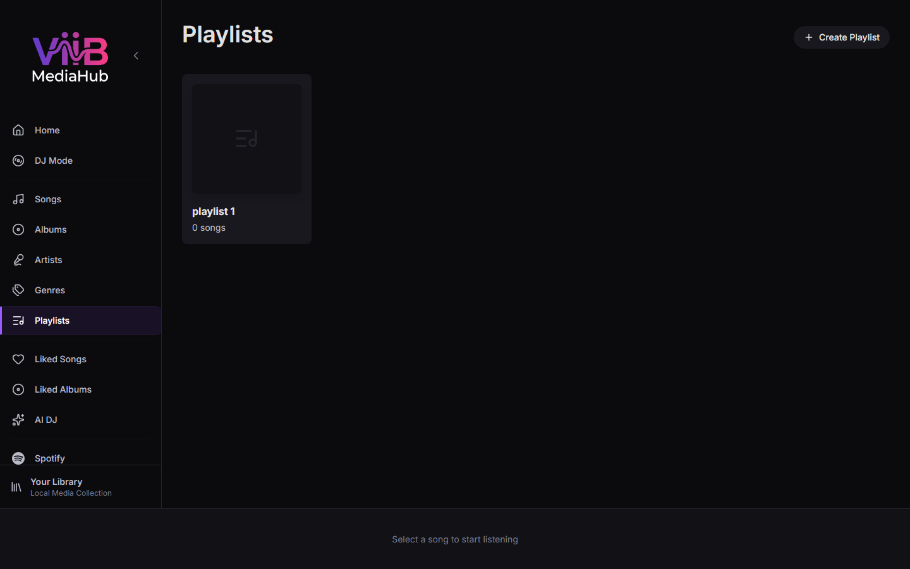

# Playlists

ViiB playlists are application-level playlists built from ViiB song IDs. They can therefore contain local filesystem tracks and synchronized Plex music tracks in the same playlist.

---

## Creating a Playlist

1. Click **Create Playlist**.
2. Enter a name.
3. Add tracks from Songs, Albums, Search, Smart Mixes, or other supported catalog views.

---

## Playlist Detail

Playlist Detail provides the normal ViiB controls:

- Play / Shuffle
- drag-to-reorder
- remove individual playlist entries
- rename playlist
- per-track context actions

A playlist entry references ViiB catalog identity, not a filesystem path. This is what allows a Plex track to participate naturally without ViiB having access to PMS storage paths.

---

## Plex behavior

Adding a Plex track to a ViiB playlist does not create or edit a Plex playlist. The playlist exists only in ViiB.

If PMS is temporarily offline, the playlist entry remains because the synchronized Plex song remains in the ViiB catalog. Playback can report source unavailability until the Plex server returns.

If a later **successful authoritative Plex synchronization** confirms that a track no longer exists in the selected Plex library, ViiB can remove the stale catalog row; Library Operations repair can remove playlist references whose song IDs no longer exist.

---

## Deleting a Playlist

Deleting a ViiB playlist removes the playlist definition only. It does not delete local audio files and does not delete or modify Plex-hosted media.

---

## See Also

- [Songs](songs.md)
- [Liked Songs & Albums](liked.md)
- [Smart Playlists / AI DJ](smart-playlists.md)
- [Plex Music](plex-music.md)
