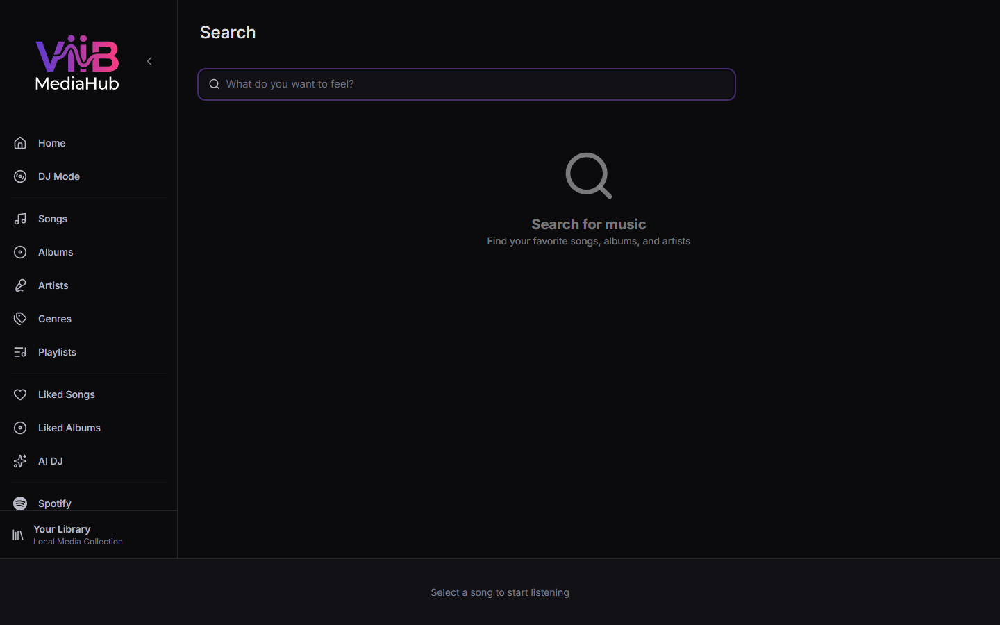

# Search

The Search page lets you find tracks, albums, artists, and playlists across your local library using a real-time filtered search.

---

## Accessing Search

- Click **Search** in the sidebar.
- Type a query in the [Home](home.md) page search bar and press **Enter** — the Search page opens with that query pre-filled.

---

## Features

| Feature | Description |
|---|---|
| Real-time results | Results update as you type (debounced for performance) |
| Category tabs | Filter results by All, Tracks, Albums, Artists, Playlists |
| Virtualized list | Large result sets render without lag |
| Play directly | Click a result to play immediately |
| Context menu | Right-click any result for queue/playlist actions |
| Persistent state | Your last query and selected tab are remembered when you navigate away and return |

---

## Result Categories

### All
Shows the top results from all categories combined.

### Tracks
Matches on track title, artist name, and album name.

### Albums
Matches on album name and artist name. Clicking an album navigates to [Album Detail](albums.md).

### Artists
Matches on artist name. Clicking an artist navigates to [Artist Detail](artists.md).

### Playlists
Matches on playlist name. Clicking a playlist navigates to the [Playlist Detail](playlists.md) page.

---

## Search Tips

- Search is case-insensitive and matches partial strings.
- If you know the exact album or artist, type enough to narrow down quickly and use the **Albums** or **Artists** tab.
- The search searches your **local library only** — for Spotify catalog search, use the [Spotify](spotify.md) page.
