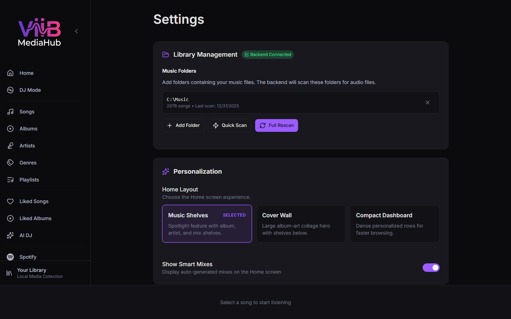

# Settings

The Settings page provides full configuration for all aspects of ViiB MediaHub.

---

## Sections

| Section | Purpose |
|---|---|
| [Backend Status](#backend-status) | View connection to the Go backend |
| [Library](#library) | Scan folders, trigger scans, reset library |
| [Personalization](#personalization) | Home layout and Smart Mix visibility |
| [Audio](#audio) | Crossfade, gapless, normalization, EQ, visualizer |
| [Audio Output Devices](#audio-output-devices) | Main and headphone output routing |
| [Spotify](#spotify) | OAuth credentials, download location, concurrency |
| [Library Intelligence](#library-intelligence) | AI provider, Last.FM, genre/mood enrichment |
| [Activity Log](#activity-log) | In-app debug log viewer |

---

## Backend Status

Shows whether the React frontend is successfully connected to the Go HTTP backend. A green indicator means the API is reachable. A red indicator means the backend is not running (start it with `scripts/dev-wails.ps1` during development).

---

## Library

### Scan Folders

Lists all music directories ViiB MediaHub monitors. Each folder has:
- **Path** — directory path
- **Remove** button — stop watching this folder

To add a folder click **Add Folder** and use the folder browser dialog.

### Scan Now

Triggers an immediate incremental scan of all configured folders. Progress is streamed via SSE and shown in the sidebar and Downloads page.

### Reset Library

**Destructive action.** Removes all songs, albums, and play history from the database, then re-scans. Use this to recover from a corrupted library state or if you have renamed all your files.

---

## Personalization

Controls how the [Home](home.md) page is presented.

| Setting | Description |
|---|---|
| Home Layout | Choose **Music Shelves**, **Cover Wall**, or **Compact Dashboard** |
| Show Smart Mixes | Show or hide auto-generated Smart Mix sections on Home |

Home layout choices persist across reloads.

---

## Audio

| Setting | Description |
|---|---|
| Crossfade | Duration (0–12 s) of the fade between tracks |
| Gapless Playback | Pre-load next track to eliminate silence between songs |
| Volume Normalization | Adjust playback level so all tracks sound similar |
| Visualizer Mode | **Off**, **Waveform**, **Spectrum**, **Milkdrop** |
| Equalizer | Toggle the 10-band EQ panel |

---

## Audio Output Devices

Configures separate audio devices for DJ use:

- **Main Output** — speakers or PA system
- **Headphone / Cue Output** — DJ headphones for previewing tracks without the audience hearing

Device routing uses the Web Audio API's `setSinkId`. Devices are listed after the browser grants audio permission.

---

## Spotify

| Setting | Description |
|---|---|
| Client ID | Your Spotify Developer app Client ID |
| Client Secret | Your Spotify Developer app Client Secret |
| Download Location | Folder where downloaded OGG files are saved |
| Concurrent Downloads | How many simultaneous downloads are allowed (1–10, default 3) |

> Refer to [Spotify Integration](spotify.md) for how to create a Developer app.

---

## Library Intelligence

### AI Provider

Select and configure the LLM backend used for:
- Genre enrichment
- Mood / energy / tempo analysis
- Smart playlist generation
- AI DJ set building

| Provider | Notes |
|---|---|
| Google Gemini | Requires Gemini API key |
| OpenAI | Requires OpenAI API key |
| Anthropic | Requires Anthropic API key |
| Ollama | Local model; set the model name and endpoint URL |
| X.AI (Grok) | Requires X.AI API key |

Enter the API key (or endpoint for Ollama) and click **Save**.

### Last.FM Integration

| Setting | Description |
|---|---|
| API Key | From your Last.FM developer account |
| Shared Secret | From your Last.FM developer account |
| Test Connection | Verifies the key is valid |
| Scrobbling | Enable scrobbling with your Last.FM username and password |

Last.FM provides community-sourced genre and tag metadata for tracks, artists, and albums.

### Genre Enrichment

Runs the configured AI provider over your library to fill in missing or empty genre tags.

- Click **Run Genre Enrichment** to start.
- Progress is shown in the Activity Log.
- Genres are written back to the `songs.genre` column in SQLite (not embedded back into the audio file).

### Unified Enrichment

Runs full metadata enrichment: genres, mood, energy, tempo, BPM, and release year.

- Click **Run Unified Enrichment** to start.
- This is slower than genre-only enrichment but produces richer data for AI DJ.

---

## Activity Log

A scrollable live log of backend events:
- Library scan progress
- Enrichment status
- Download events
- API errors

Click **Clear** to remove old entries. The log is in-memory only and does not persist after restart.
