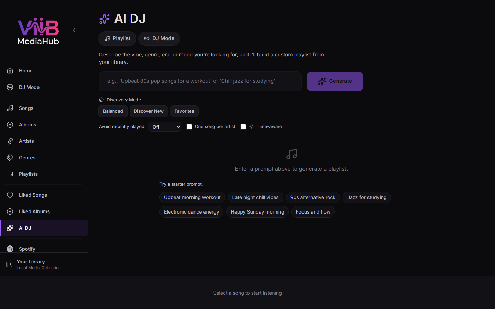

# Smart Playlists / AI DJ



Smart Playlists and AI DJ operate on ViiB's canonical music catalog. After a Plex music library has synchronized successfully, Plex tracks can participate alongside local filesystem tracks in the same generated playlists and DJ sets.

Spotify's remote catalog is not implicitly searched by this feature; Spotify remains a separate integration.

---

## Playlist Mode

Playlist Mode builds a one-shot ViiB playlist from a natural-language request. When the Semantic Retrieval Index is ready, ViiB retrieves matching tracks, albums, and artists by meaning before applying listening-history, source, year, artist, and diversity rules. When the index is unavailable, the established metadata/history matching path remains available.

Examples:

```text
90s alternative rock
chill evening vibes
upbeat morning run
jazz standards for dinner
```

Generation can use semantic document context, artist/album/genre metadata, enriched mood/energy/tempo information, and listening history. Listening behaviour stays a ranking signal; it is not added to embedding text.

Generated results use normal ViiB song IDs, so a result can contain both local and Plex-backed catalog tracks without a Plex-specific playback path in the UI.

---

## Semantic retrieval

Configure the separate **Semantic Retrieval Index** in **Settings → Library Intelligence**. It is independent of the chat/LLM provider and does not modify source-media metadata.

- **Ollama** can build embeddings locally. ViiB never downloads a model automatically.
- **OpenAI** uses the embeddings API only after showing and receiving confirmation for the one-time catalog estimate.
- ViiB indexes deterministic track, album, and artist descriptions in SQLite. File paths, internal song IDs, listening history, and embedding vectors are not sent to the cloud provider or returned to the UI.
- Indexing runs in the background. The Smart Playlists page displays whether semantic matching is ready, indexing, or using the standard fallback, and links to Index Settings when action is needed.

After a semantic result is generated, **Semantic retrieval details** can be expanded for count-only troubleshooting information such as candidate and track/album/artist-match counts. It is collapsed by default and never exposes document text or vectors.

Semantic matching is selected automatically when the chosen source has a searchable index. Explicit artist exclusions, source selection, hard year constraints, instrumental-only requests, recent-play avoidance, and one-per-artist selection are still enforced locally.

---

## DJ Mode

DJ Mode compiles a set plan with semantic intent for every phase, then retrieves bounded candidate pools for those phases before applying persona/selection bias, duration targets, transition/flow constraints, and energy progression.

The resulting set is still built from the ViiB catalog and handed to the normal player/queue. ViiB does not send the full library or local genre taxonomy to the LLM. If a semantic index is unavailable or cannot fill every planned phase with distinct songs, DJ Mode deterministically uses the legacy full-catalog fallback instead.

---

## Smart Mixes

Home-page Smart Mixes are derived from catalog metadata and listening behavior. Because Plex synchronization writes normalized metadata into the same catalog, Plex tracks can appear in mixes such as favorites, rediscovery, recent/fresh, or genre-based mixes where they satisfy the mix rules.

See [Home](home.md).

---

## Source availability

A temporarily offline Plex server does not cause AI/Smart Mix generation to erase cached Plex catalog entries. Those tracks can remain discoverable as catalog candidates, but playback will require PMS to be reachable and authenticated at the time the track is played.

A later successful authoritative Plex synchronization reconciles additions, updates, and confirmed removals.

---

## Metadata enrichment

For best results, configure the desired AI/metadata provider in [Settings → Library Intelligence](settings.md#library-intelligence).

ViiB-side enrichment may add or improve genre, mood, energy, tempo, BPM, and year metadata used by Smart Mixes/AI DJ.

For Plex-backed tracks, ViiB enrichment is local ViiB state. ViiB does not silently write enriched metadata back to Plex; a later Plex synchronization can refresh fields that are sourced from PMS.
