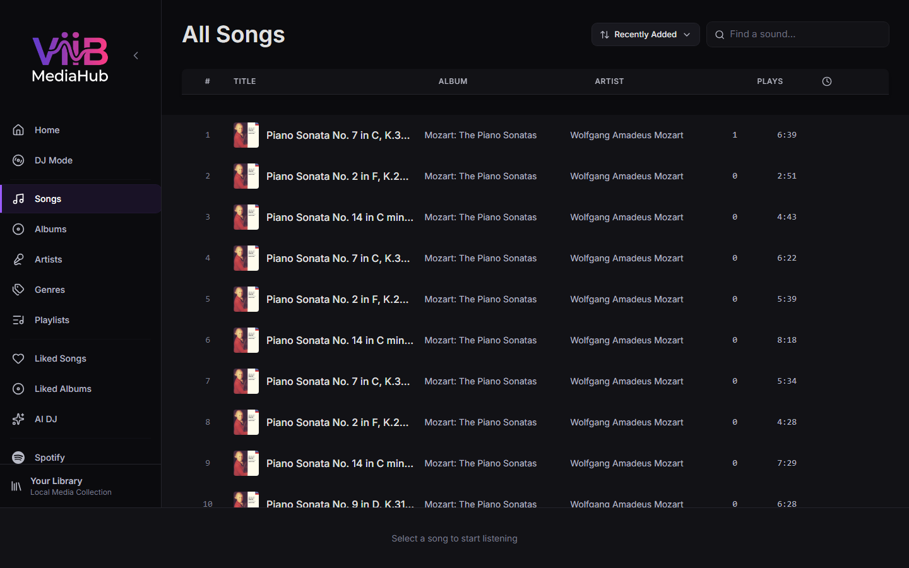

# Songs

The Songs page shows the canonical ViiB track catalog. It is source-transparent: local filesystem tracks and successfully synchronized Plex music tracks appear in the same list and use the same queue, playlist, like, history, and playback interactions.

---

## Features

| Feature | Description |
|---|---|
| Virtualized list | Keeps large libraries responsive without rendering every row at once |
| Sort options | Title, artist, album, duration, play activity, and recently added options where exposed by the UI |
| Filter bar | Filters visible catalog tracks |
| Play All / Shuffle All | Build playback from the current visible/sorted set |
| Context menu | Play, Play Next, Add to Queue, playlist, like, album, and artist actions |
| Like button | Stores the like in ViiB regardless of source |
| Artwork | Local artwork or backend-proxied Plex artwork with fallback handling |

---

## Music sources

### Local tracks

Local songs are created by scanning configured folders. Their ViiB catalog rows retain filesystem identity so local playback and local-library diagnostics can operate normally.

### Plex tracks

Plex tracks are imported by synchronizing the selected PMS music library. ViiB stores normalized song metadata plus Plex source identity separately, including the PMS machine/library/track/media identifiers required for future synchronization and playback.

The UI does not need a Plex-specific Song type. Plex tracks use normal ViiB song IDs and the existing `/api/audio/{songId}` and `/api/cover/{songId}` routes.

A temporarily offline Plex server does not remove already synchronized songs from the catalog. Playback can fail with a source-unavailable or reconnect/authentication state until PMS becomes reachable again.

---

## Context Menu Actions

Right-click a catalog track to use the normal supported actions, including:

- **Play**
- **Play Next**
- **Add to Queue**
- **Add to Playlist**
- **Like / Unlike**
- **Go to Album**
- **Go to Artist**

These actions are ViiB operations. They do not rename, move, delete, or rewrite a Plex source file.

---

## Recently Added

For local media, the added date comes from ViiB's scan/catalog ingestion. For Plex media, ViiB maps the available PMS `addedAt` metadata during synchronization. This allows source-transparent recently-added sorting without filesystem access to the Plex host.

---

## Empty library

If the ViiB catalog is empty, configure at least one music source:

- add a local folder in [Settings](settings.md), or
- connect and synchronize Plex in [Library Operations](library-operations.md).
