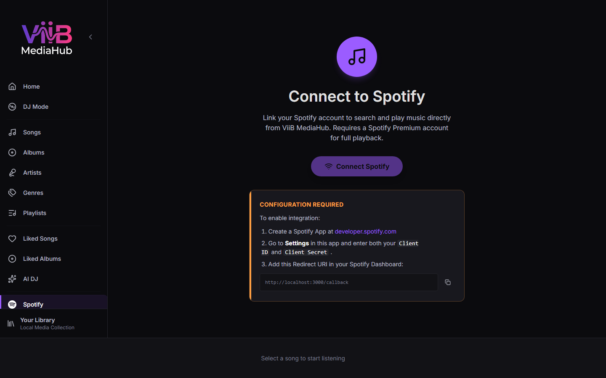

# Spotify Integration

The Spotify page connects ViiB MediaHub to your Spotify account so you can browse, stream (optional), and download tracks to your local library.

---

## Prerequisites

Before you can use Spotify features, you must register a Spotify Developer app and enter your credentials in [Settings → Integrations & Spotify](settings.md#integrations--spotify).

| Setting | Where to find it |
|---|---|
| Client ID | [Spotify Developer Dashboard](https://developer.spotify.com/dashboard) |
| Client Secret | Same dashboard |
| Redirect URI | Set to `http://127.0.0.1:34115/callback` in the dashboard |

The URI must match exactly. Do **not** register `http://wails.localhost/callback`: that is ViiB's internal desktop-WebView origin, not the local server that receives Spotify's OAuth callback.

---

## Logging In

1. Navigate to the **Spotify** page.
2. Click **Connect with Spotify**.
3. A browser window opens for Spotify's OAuth PKCE flow.
4. After authorization, the renderer receives the session and keeps active access/refresh tokens in memory. The Go backend stores the encrypted Spotify session when available so a valid session can be restored on the next launch.

> Tokens are intentionally **not persisted to renderer localStorage**. The backend owns encrypted session persistence; if the stored session is missing or expired, sign in again from the Spotify page.

---

## Tabs

### Search

Search the Spotify catalog for tracks, albums, artists, and playlists. Results support:
- Infinite scroll (load more button)
- Category filter: **Tracks**, **Albums**, **Artists**, **Playlists**
- Play from Spotify (requires streaming setup)
- Download to local library

### Saved Albums

Browse your Spotify-saved (liked) albums. Clicking an album opens **Spotify Album Detail** showing the track listing with individual download buttons.

### Playlists

Browse your Spotify playlists. Clicking a playlist opens **Spotify Playlist Detail**.

### Recently Played

Your 50 most recently played Spotify tracks. Useful for finding something you heard on mobile and want to download.

---

## Downloading Tracks

To download tracks to your local library:

1. Right-click a track or album and choose **Download**, or click the download icon.
2. The item is added to the [Downloads](downloads.md) queue.
3. Files are saved to the **Spotify Download Location** configured in **Settings → Integrations & Spotify → Downloads & Conversion**.
4. Downloaded files begin in **OGG Vorbis** format; if automatic conversion is enabled, the completed file may be a 320 kbps MP3 instead.
5. If **Quick Scan After Downloads** is enabled in **Settings → Integrations & Spotify → Downloads & Conversion**, the configured number of completed downloads triggers a quick scan. Set the threshold to 0 to disable automatic post-download scans.

> Downloading requires `librespot-go` to be installed and configured. See [Settings → Integrations & Spotify](settings.md#integrations--spotify).

---

## Queue and Play Actions

| Action | Description |
|---|---|
| Play | Stream the track from Spotify (requires librespot streaming) |
| Play Next | Insert the track at the front of the current queue |
| Add to Queue | Append the track to the current queue |
| Download | Queue the track for download to local library |

---

## Session Restoration

On startup the app asks the Go backend for the stored Spotify session. A valid access token is restored into renderer memory; expired sessions are refreshed when possible, otherwise the Spotify page asks you to authenticate again.

---

## Logging Out

Click **Log Out** at the top of the Spotify page to clear the session and tokens.
