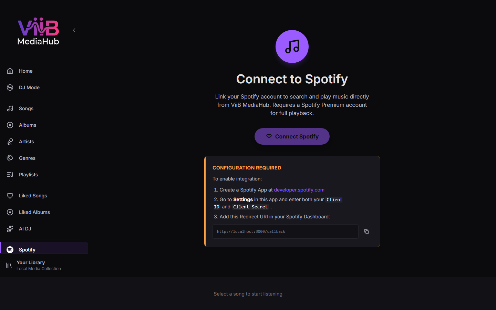

# Spotify Integration

The Spotify page connects ViiB to your Spotify account for browsing, streaming, and downloads. Spotify browsing is separate from the local/Plex catalog; downloaded media becomes part of that catalog after scanning.

## Prerequisites

Run the Go backend and install **Chrome**, **Microsoft Edge**, or **Chromium** on the same device. Safari is not supported for sign-in. Normal sign-in requires no Spotify Developer app, client ID/secret, redirect-URI setup, or pasted cookie.

## Signing in and managing your session

1. Open **Spotify**, or **Settings → Integrations & Spotify → Spotify account**.
2. Click **Sign in with Spotify**.
3. Enter your credentials on Spotify's own page in the browser window that opens. ViiB connects automatically when sign-in finishes and validates the captured session.
4. Use **Cancel sign-in** to stop a pending attempt. In Settings, **Switch Spotify account** starts a new sign-in and **Disconnect** retires the current session; the Spotify page also has **Disconnect**.

The backend stores your session encrypted on this device and restores it on startup. Cookies and bearer tokens are not exposed by public session/status responses or persisted to renderer localStorage. Requests renew authentication when possible; if the session expires or requires authentication, sign in again. Disconnect stops account-owned work and clears the connected session.

Legacy OAuth remains a compatibility path for installations that have not selected cookie authentication. It is not the normal sign-in procedure.

## Browsing

| Tab | Behavior |
|---|---|
| Search | Search tracks, albums, artists, and playlists; load more results, open detail views, play, queue, or download |
| Saved Albums | Browse saved albums and open track listings with download actions |
| Playlists | Browse your playlists and open their contents |
| Recently Played | Request recent listening data when available to the session; complete play-event history parity is not yet verified |

Artist results open profiles with top tracks and albums. Saved-library pages support pagination, loading/error state, and retry. Account/profile fields and Recently Played can be unavailable or rate limited; an incomplete response does not establish full account-history support. The [parity audit](SPOTIFY_COOKIE_AUTH_PARITY_AUDIT.md) tracks remaining gaps and the [validation log](SPOTIFY_WEBPLAYER_VALIDATION.md) records dated evidence.

## Streaming and queue actions

Use **Play**, **Play Next**, or **Add to Queue** on supported track results. Streaming runs through ViiB's backend and its bundled Spotify integration with configurable quality; no separate librespot executable installation is required. A connected session and an available recording are required.

## Downloading tracks

1. Choose **Download** from a track/album action or the download icon.
2. Follow progress in [Downloads](downloads.md).
3. Files are saved to the download location in **Settings → Integrations & Spotify → Downloads & Conversion**.
4. Downloads start as Ogg Vorbis. Optional automatic conversion produces a 320 kbps MP3.
5. **Quick Scan After Downloads** triggers a local scan after the configured number of completed downloads. A threshold of 0 disables it. Ensure the destination is included in your local music folders when scanning it into the library.

Available Spotify BPM/key values are written to download tags and durable source-bound evidence. Manual locks retain precedence, and unavailable provider data does not fail the audio download. **Prepare library** can enrich existing linked/matched recordings while local analysis supplies energy, loudness, beatgrid, structure, and cues. See [BPM/key import](SPOTIFY_BPM_KEY_IMPORT.md) and [Library Operations](library-operations.md#track-analysis).

Three-band Spotify waveform integration and expanded metadata persistence are still [proposed](SPOTIFY_METADATA_AND_LOCAL_FALLBACK_IMPLEMENTATION_PLAN.md). Spotify scalar BPM alone does not establish beat phase or authorize deck sync.

## Troubleshooting

- **Sign-in does not open:** check the backend connection and installed Chrome/Edge/Chromium prerequisite.
- **Session expired:** reconnect from Spotify or Settings.
- **Rate limited:** respect the displayed retry delay, then retry the failed operation.
- **Missing history/profile fields:** consult the parity audit; saved-library access does not prove every account field is available.
- **After backup restore:** sign in again. New backups exclude Spotify session and OAuth credentials.
