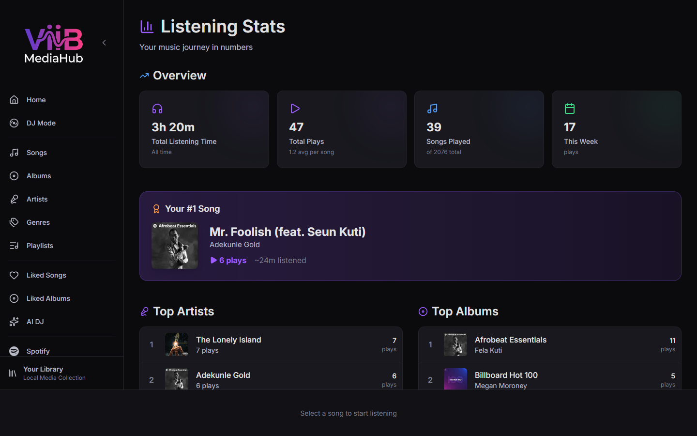

# Stats

The Stats page shows listening statistics derived from ViiB's play history. Playback of normal ViiB catalog tracks contributes to the same history regardless of whether a song originated from a local filesystem scan or a synchronized Plex music library.

---

## Overview

Typical summary metrics include listening time, play counts, recent-period activity, and top catalog entities.

Because history is keyed to ViiB catalog identity, Plex tracks do not need a separate statistics pipeline.

---

## Top Artists, Albums, and Genres

Top charts aggregate play-history data against the current ViiB catalog metadata.

- Local and Plex-backed tracks can contribute to the same artist/album rankings.
- Genre-based statistics depend on populated genre metadata.
- ViiB-side metadata enrichment can improve genre-based reporting.

See [Settings → Library Intelligence](settings.md#library-intelligence).

---

## Recently Played and activity views

Recently Played and calendar/heatmap-style activity views are generated from ViiB's persisted play events. A Plex outage does not retroactively remove historical play events.

If a Plex track remains in the cached catalog while PMS is offline, its historical metadata can still be displayed even though new playback cannot start until the source is reachable again.

---

## Data ownership

ViiB statistics are local application data stored in SQLite. The Stats feature does not synchronize ViiB play history to Plex or Spotify as part of this catalog/history model.

Plex synchronization changes source/catalog metadata; it does not rewrite past ViiB listening history merely because PMS metadata changed.
